# 문서 템플릿 레퍼런스

각 문서 유형별 기본 템플릿이다. `{프로젝트명}`, `{YYYY-MM-DD}`, `{작성자}` 등의 플레이스홀더는 생성 시 실제 값으로 치환한다.

---

## 목차

1. [00-스케줄](#00-스케줄)
2. [01-프로젝트 계획서](#01-프로젝트-계획서)
3. [02-ERD 문서](#02-erd-문서)
4. [03-아키텍처 정의서](#03-아키텍처-정의서)
5. [04-API 정의서](#04-api-정의서)
6. [05-화면 흐름 시퀀스 다이어그램](#05-화면-흐름-시퀀스-다이어그램)
7. [06-화면 기능 정의서](#06-화면-기능-정의서)
8. [07-요구사항 정의서](#07-요구사항-정의서)
9. [08-Git 규칙 정의서](#08-git-규칙-정의서)
10. [09-스토리보드](#09-스토리보드)
11. [10-테스트 전략서](#10-테스트-전략서)
12. [11-코드 리뷰 규칙](#11-코드-리뷰-규칙)
13. [12-테스트 보고서](#12-테스트-보고서)
14. [13-배포 가이드](#13-배포-가이드)
15. [14-사용자 매뉴얼](#14-사용자-매뉴얼)
16. [15-운영 매뉴얼](#15-운영-매뉴얼)

---

## 00-스케줄

```markdown
---
문서명: {프로젝트명} 프로젝트 스케줄
버전: v1.0
작성일: {YYYY-MM-DD}
최종수정일: {YYYY-MM-DD}
작성자: {작성자}
상태: 초안
---

# {프로젝트명} 프로젝트 스케줄

## 1. 프로젝트 개요

| 항목 | 내용 |
|------|------|
| 프로젝트명 | {프로젝트명} |
| 시작일 | {YYYY-MM-DD} |
| 종료일 | {YYYY-MM-DD} |
| 총 기간 | {N}주 |

## 2. 마일스톤

| 마일스톤 | 목표일 | 산출물 | 상태 |
|----------|--------|--------|------|
| M1. 기획 완료 | {YYYY-MM-DD} | 요구사항 정의서, 화면 설계서 | 대기 |
| M2. 설계 완료 | {YYYY-MM-DD} | ERD, API 정의서, 아키텍처 정의서 | 대기 |
| M3. 개발 완료 | {YYYY-MM-DD} | 소스코드, 테스트 결과 | 대기 |
| M4. QA 완료 | {YYYY-MM-DD} | 테스트 리포트 | 대기 |
| M5. 배포 | {YYYY-MM-DD} | 배포 완료 보고서 | 대기 |

## 3. 주차별 상세 일정

```mermaid
gantt
    title {프로젝트명} 프로젝트 일정
    dateFormat  YYYY-MM-DD
    section 기획
        요구사항 분석       :a1, {시작일}, 1w
        화면 설계           :a2, after a1, 1w
    section 설계
        DB 설계             :b1, after a2, 1w
        API 설계            :b2, after a2, 1w
        아키텍처 설계       :b3, after a2, 1w
    section 개발
        백엔드 개발         :c1, after b1, 3w
        프론트엔드 개발     :c2, after b2, 3w
    section QA
        통합 테스트         :d1, after c1, 1w
        버그 수정           :d2, after d1, 1w
    section 배포
        배포 준비           :e1, after d2, 3d
        운영 배포           :e2, after e1, 2d
```

## 4. 담당자별 업무 배분

| 담당자 | 역할 | 주요 업무 |
|--------|------|-----------|
| {이름} | {역할} | {업무 내용} |

## 변경 이력

| 버전 | 날짜 | 작성자 | 변경 내용 |
|------|------|--------|-----------|
| v1.0 | {YYYY-MM-DD} | {작성자} | 최초 작성 |
```

---

## 01-프로젝트 계획서

```markdown
---
문서명: {프로젝트명} 프로젝트 계획서
버전: v1.0
작성일: {YYYY-MM-DD}
최종수정일: {YYYY-MM-DD}
작성자: {작성자}
상태: 초안
---

# {프로젝트명} 프로젝트 계획서

## 1. 프로젝트 개요

### 1.1 배경 및 목적
- **배경**: {프로젝트 추진 배경}
- **목적**: {프로젝트가 해결하고자 하는 문제}

### 1.2 프로젝트 범위

| 구분 | 내용 |
|------|------|
| 포함 범위 (In-Scope) | {포함되는 기능/모듈} |
| 제외 범위 (Out-of-Scope) | {제외되는 기능/모듈} |

## 2. 목표 및 성공 기준

| 목표 | 측정 지표 | 목표치 |
|------|-----------|--------|
| {목표 1} | {KPI} | {수치} |
| {목표 2} | {KPI} | {수치} |

## 3. 팀 구성

| 역할 | 담당자 | 책임 |
|------|--------|------|
| PM | {이름} | 프로젝트 관리, 일정 조율 |
| 백엔드 개발 | {이름} | API, DB 설계 및 구현 |
| 프론트엔드 개발 | {이름} | UI/UX 구현 |
| QA | {이름} | 테스트 계획 및 실행 |
| 디자이너 | {이름} | UI/UX 디자인 |

## 4. 기술 스택

| 영역 | 기술 | 버전 |
|------|------|------|
| Frontend | React | 19.x |
| Mobile | Flutter / Dart | 3.41.x / 3.11.x |
| Backend | Spring Boot | 4.0.x |
| Backend (Alt) | Python / FastAPI | 3.14.x / 0.115.x |
| Database | PostgreSQL | 18.x |
| Cache | Redis | 8.x |
| Build | Vite | 8.x |
| Infra | AWS (ECS, RDS, ElastiCache) | - |
| CI/CD | GitHub Actions | - |
| Container | Docker | 29.x |
| IaC | Terraform | 1.14.x |

## 5. 주요 일정

> 상세 일정은 [00-스케줄](../00-스케줄/) 참조

| 단계 | 기간 | 산출물 |
|------|------|--------|
| 기획 | {기간} | 요구사항 정의서 |
| 설계 | {기간} | ERD, API 정의서 |
| 개발 | {기간} | 소스코드 |
| QA | {기간} | 테스트 리포트 |
| 배포 | {기간} | 운영 시스템 |

## 6. 리스크 관리

| 리스크 | 영향도 | 발생확률 | 대응 방안 |
|--------|--------|----------|-----------|
| {리스크 1} | 높음/중간/낮음 | 높음/중간/낮음 | {대응 방안} |

## 7. 커뮤니케이션 계획

| 회의 유형 | 주기 | 참여자 | 목적 |
|-----------|------|--------|------|
| 데일리 스크럼 | 매일 | 전체 | 진행 상황 공유 |
| 스프린트 리뷰 | 격주 | 전체 + 이해관계자 | 결과물 데모 |
| 회고 | 격주 | 전체 | 개선점 도출 |

## 변경 이력

| 버전 | 날짜 | 작성자 | 변경 내용 |
|------|------|--------|-----------|
| v1.0 | {YYYY-MM-DD} | {작성자} | 최초 작성 |
```

---

## 02-ERD 문서

```markdown
---
문서명: {프로젝트명} ERD 문서
버전: v1.0
작성일: {YYYY-MM-DD}
최종수정일: {YYYY-MM-DD}
작성자: {작성자}
상태: 초안
---

# {프로젝트명} ERD (Entity-Relationship Diagram)

## 1. 개요

본 문서는 {프로젝트명} 프로젝트의 데이터베이스 구조를 정의한다.

### 1.1 데이터베이스 정보

| 항목 | 내용 |
|------|------|
| DBMS | {MySQL/PostgreSQL/등} |
| 버전 | {버전} |
| 문자셋 | UTF-8 |
| Collation | utf8mb4_unicode_ci |

## 2. ERD 다이어그램

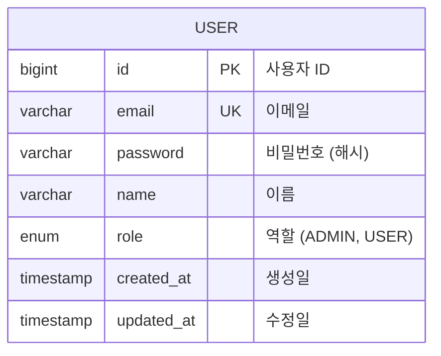

## 3. 테이블 상세 명세

### 3.1 USER (사용자)

| 컬럼명 | 타입 | 제약조건 | 기본값 | 설명 |
|--------|------|----------|--------|------|
| id | BIGINT | PK, AUTO_INCREMENT | - | 사용자 ID |
| email | VARCHAR(255) | UNIQUE, NOT NULL | - | 이메일 |
| password | VARCHAR(255) | NOT NULL | - | 비밀번호 (해시) |
| name | VARCHAR(100) | NOT NULL | - | 이름 |
| role | ENUM | NOT NULL | 'USER' | 역할 |
| created_at | TIMESTAMP | NOT NULL | CURRENT_TIMESTAMP | 생성일 |
| updated_at | TIMESTAMP | NOT NULL | CURRENT_TIMESTAMP | 수정일 |

**인덱스**:
- `idx_user_email` (email) - 로그인 조회

## 4. 관계 정의

| 부모 테이블 | 자식 테이블 | 관계 | FK 컬럼 | 설명 |
|------------|------------|------|---------|------|
| {부모} | {자식} | 1:N | {FK명} | {설명} |

## 5. 데이터 마이그레이션 노트

- 초기 데이터 시딩 요구사항이 있으면 여기에 기술

## 변경 이력

| 버전 | 날짜 | 작성자 | 변경 내용 |
|------|------|--------|-----------|
| v1.0 | {YYYY-MM-DD} | {작성자} | 최초 작성 |
```

---

## 03-아키텍처 정의서

```markdown
---
문서명: {프로젝트명} 아키텍처 정의서
버전: v1.0
작성일: {YYYY-MM-DD}
최종수정일: {YYYY-MM-DD}
작성자: {작성자}
상태: 초안
---

# {프로젝트명} 아키텍처 정의서

## 1. 시스템 개요

{프로젝트명}의 전체 시스템 아키텍처를 정의한다.

## 2. 시스템 아키텍처

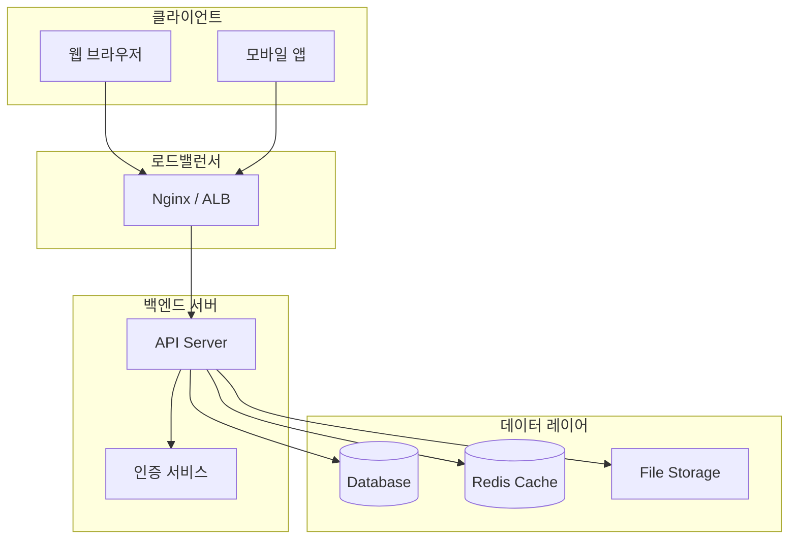

## 3. 기술 스택 상세

### 3.1 Frontend

| 항목 | 기술 | 선정 사유 |
|------|------|-----------|
| Framework | React 19.x | {사유} |
| 상태 관리 | {Redux/Zustand/등} | {사유} |
| 스타일링 | {Tailwind/등} | {사유} |
| 빌드 도구 | Vite 8.x | {사유} |

### 3.2 Mobile

| 항목 | 기술 | 선정 사유 |
|------|------|-----------|
| Framework | Flutter 3.41 | 크로스플랫폼 |
| 언어 | Dart 3.11 | Null Safety |
| 상태 관리 | Riverpod | 선언적 상태 관리 |

### 3.3 Backend (Java)

| 항목 | 기술 | 선정 사유 |
|------|------|-----------|
| Framework | Spring Boot 4.0.x | {사유} |
| ORM | {JPA/Prisma/등} | {사유} |
| 인증 | {JWT/OAuth2/등} | {사유} |

### 3.4 Backend (Python) — 선택

| 항목 | 기술 | 선정 사유 |
|------|------|-----------|
| Language | Python 3.14.x | 범용성, 풍부한 생태계 |
| Framework | FastAPI 0.115.x | 비동기, 자동 문서화(Swagger) |
| ORM | SQLAlchemy 2.x | 유연한 쿼리 빌더 |
| Task Queue | Celery 5.x | 비동기 작업 처리 |

### 3.5 Infrastructure

| 항목 | 기술 | 선정 사유 |
|------|------|-----------|
| 클라우드 | {AWS/GCP/등} | {사유} |
| 컨테이너 | Docker 29.x | {사유} |
| CI/CD | {GitHub Actions/등} | {사유} |
| IaC | Terraform 1.14.x | {사유} |
| 모니터링 | {Grafana/등} | {사유} |

## 4. 디렉토리 구조

```
project-root/
├── frontend/
│   └── src/
├── mobile/
│   └── lib/
├── backend/
│   └── src/
├── docs/
├── infra/
└── scripts/
```

## 5. 보안 아키텍처

| 항목 | 방법 | 비고 |
|------|------|------|
| 인증 | {JWT/세션} | {상세} |
| 인가 | {RBAC/ABAC} | {상세} |
| 암호화 | {bcrypt/argon2} | {상세} |
| HTTPS | TLS 1.3 | 필수 |

## 6. 성능 목표

| 지표 | 목표치 | 측정 방법 |
|------|--------|-----------|
| 응답 시간 (P95) | < 200ms | APM |
| 동시 접속자 | {N}명 | 부하 테스트 |
| 가용성 | 99.9% | 모니터링 |

## 변경 이력

| 버전 | 날짜 | 작성자 | 변경 내용 |
|------|------|--------|-----------|
| v1.0 | {YYYY-MM-DD} | {작성자} | 최초 작성 |
```

---

## 04-API 정의서

```markdown
---
문서명: {프로젝트명} API 정의서
버전: v1.0
작성일: {YYYY-MM-DD}
최종수정일: {YYYY-MM-DD}
작성자: {작성자}
상태: 초안
---

# {프로젝트명} API 정의서

## 1. API 개요

| 항목 | 내용 |
|------|------|
| Base URL | `https://api.{도메인}/v1` |
| 인증 방식 | Bearer Token (JWT) |
| Content-Type | application/json |
| 문자 인코딩 | UTF-8 |

## 2. 공통 사항

### 2.1 공통 응답 포맷

**성공 응답**:
```json
{
  "success": true,
  "data": { },
  "message": "요청이 성공적으로 처리되었습니다."
}
```

**에러 응답**:
```json
{
  "success": false,
  "error": {
    "code": "ERROR_CODE",
    "message": "에러 메시지"
  }
}
```

### 2.2 공통 에러 코드

| 코드 | HTTP Status | 설명 |
|------|-------------|------|
| UNAUTHORIZED | 401 | 인증 실패 |
| FORBIDDEN | 403 | 권한 없음 |
| NOT_FOUND | 404 | 리소스 없음 |
| VALIDATION_ERROR | 422 | 입력값 검증 실패 |
| INTERNAL_ERROR | 500 | 서버 내부 오류 |

### 2.3 페이지네이션

```json
{
  "data": [],
  "pagination": {
    "page": 1,
    "size": 20,
    "totalElements": 100,
    "totalPages": 5
  }
}
```

## 3. API 엔드포인트

### 3.1 인증 (Auth)

#### POST /auth/login - 로그인

| 항목 | 내용 |
|------|------|
| Method | POST |
| URL | /auth/login |
| 인증 | 불필요 |

**Request Body**:
| 필드 | 타입 | 필수 | 설명 |
|------|------|------|------|
| email | string | Y | 이메일 |
| password | string | Y | 비밀번호 |

**Response (200)**:
| 필드 | 타입 | 설명 |
|------|------|------|
| accessToken | string | 액세스 토큰 |
| refreshToken | string | 리프레시 토큰 |
| expiresIn | number | 만료 시간 (초) |

---

> 아래에 각 도메인별 API를 추가하세요.

### 3.2 {도메인명}

#### {METHOD} {URL} - {설명}

| 항목 | 내용 |
|------|------|
| Method | {GET/POST/PUT/DELETE} |
| URL | {엔드포인트} |
| 인증 | 필요/불필요 |

## 4. API 흐름도

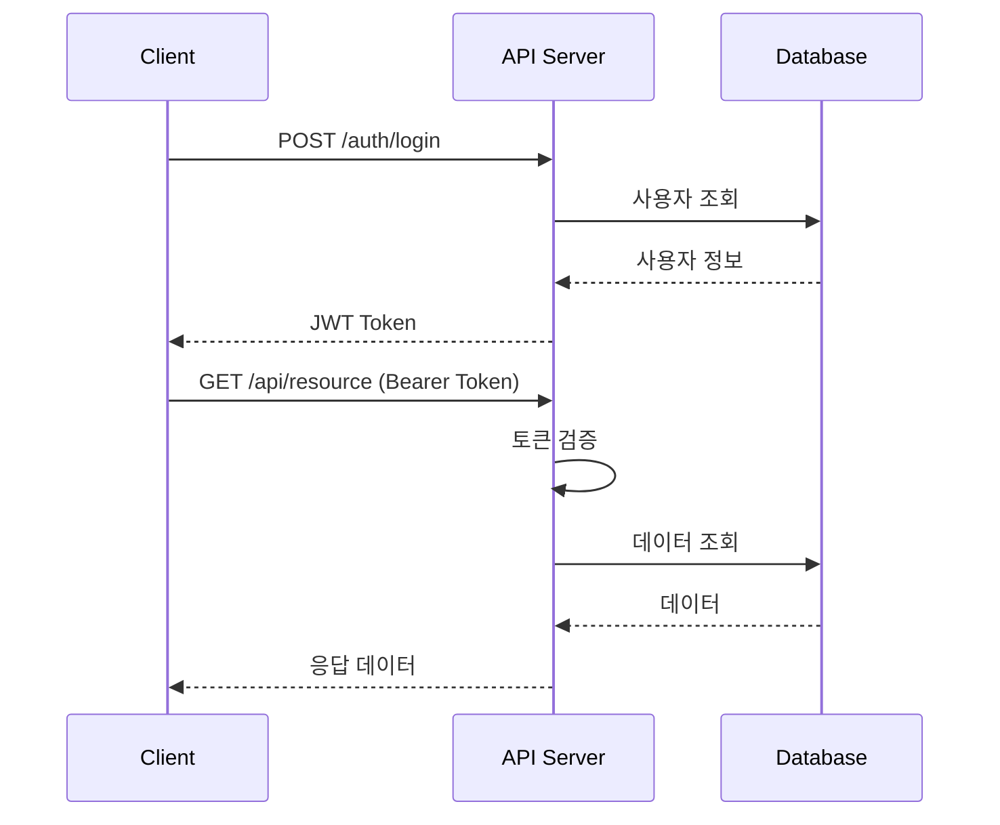

## 변경 이력

| 버전 | 날짜 | 작성자 | 변경 내용 |
|------|------|--------|-----------|
| v1.0 | {YYYY-MM-DD} | {작성자} | 최초 작성 |
```

---

## 05-화면 흐름 시퀀스 다이어그램

```markdown
---
문서명: {프로젝트명} 화면 흐름 시퀀스 다이어그램
버전: v1.0
작성일: {YYYY-MM-DD}
최종수정일: {YYYY-MM-DD}
작성자: {작성자}
상태: 초안
---

# {프로젝트명} 화면 흐름 시퀀스 다이어그램

## 1. 전체 화면 흐름도

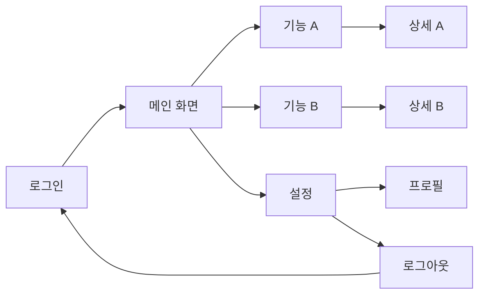

## 2. 주요 시퀀스 다이어그램

### 2.1 로그인 흐름

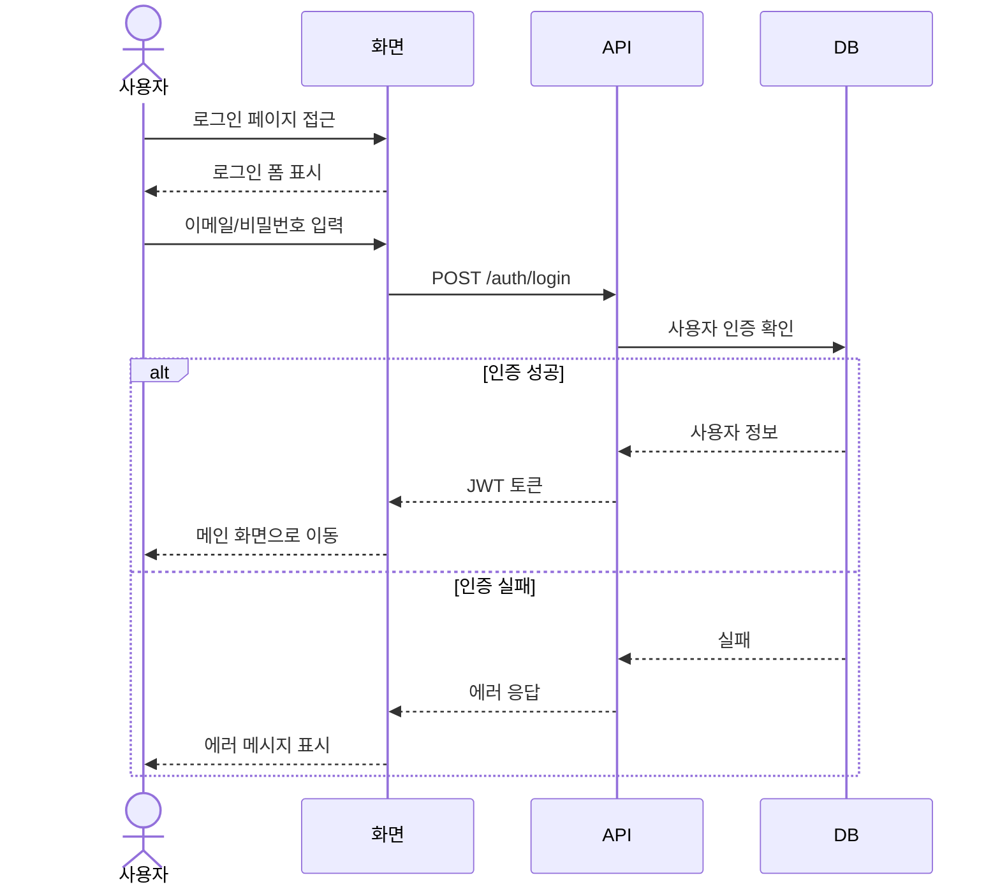

### 2.2 {기능명} 흐름

> 각 주요 기능별 시퀀스 다이어그램을 추가하세요.

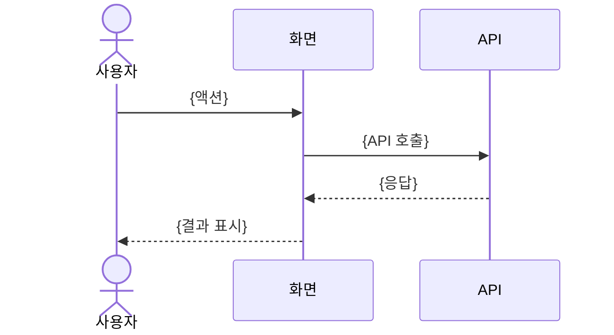

## 3. 화면 전환 매트릭스

| From \ To | 로그인 | 메인 | 기능A | 기능B | 설정 |
|-----------|--------|------|-------|-------|------|
| 로그인 | - | O | - | - | - |
| 메인 | - | - | O | O | O |
| 기능A | - | O | - | - | - |
| 기능B | - | O | - | - | - |
| 설정 | O | O | - | - | - |

## 변경 이력

| 버전 | 날짜 | 작성자 | 변경 내용 |
|------|------|--------|-----------|
| v1.0 | {YYYY-MM-DD} | {작성자} | 최초 작성 |
```

---

## 06-화면 기능 정의서

```markdown
---
문서명: {프로젝트명} 화면 기능 정의서
버전: v1.0
작성일: {YYYY-MM-DD}
최종수정일: {YYYY-MM-DD}
작성자: {작성자}
상태: 초안
---

# {프로젝트명} 화면 기능 정의서

## 1. 화면 목록

| 화면 ID | 화면명 | URL | 인증 | 권한 | 비고 |
|---------|--------|-----|------|------|------|
| SCR-001 | 로그인 | /login | 불필요 | ALL | - |
| SCR-002 | 메인 대시보드 | /dashboard | 필요 | USER | - |
| SCR-003 | {화면명} | {URL} | {Y/N} | {권한} | - |

## 2. 화면 상세 정의

### SCR-001: 로그인

| 항목 | 내용 |
|------|------|
| 화면 ID | SCR-001 |
| 화면명 | 로그인 |
| URL | /login |
| 설명 | 사용자 인증을 위한 로그인 화면 |

#### UI 요소

| 요소 ID | 유형 | 레이블 | 필수 | 유효성 검사 | 비고 |
|---------|------|--------|------|-------------|------|
| inp-email | Input | 이메일 | Y | 이메일 형식 | placeholder: "이메일을 입력하세요" |
| inp-password | Input | 비밀번호 | Y | 최소 8자 | type: password |
| btn-login | Button | 로그인 | - | - | Primary |
| btn-signup | Link | 회원가입 | - | - | /signup으로 이동 |

#### 기능 정의

| 기능 ID | 기능명 | 트리거 | 동작 | API |
|---------|--------|--------|------|-----|
| FN-001-01 | 로그인 | btn-login 클릭 | 이메일/비밀번호 검증 후 API 호출 | POST /auth/login |
| FN-001-02 | 유효성 검사 | 입력 시 | 실시간 입력값 검증 | - |

#### 상태 처리

| 상태 | 표시 내용 | 조건 |
|------|-----------|------|
| 로딩 | 스피너 표시 | API 호출 중 |
| 성공 | 메인 화면 이동 | 로그인 성공 |
| 실패 | 에러 메시지 | 인증 실패 |

---

### SCR-002: {화면명}

> 위 양식을 복사하여 각 화면별로 작성하세요.

## 변경 이력

| 버전 | 날짜 | 작성자 | 변경 내용 |
|------|------|--------|-----------|
| v1.0 | {YYYY-MM-DD} | {작성자} | 최초 작성 |
```

---

## 07-요구사항 정의서

```markdown
---
문서명: {프로젝트명} 요구사항 정의서
버전: v1.0
작성일: {YYYY-MM-DD}
최종수정일: {YYYY-MM-DD}
작성자: {작성자}
상태: 초안
---

# {프로젝트명} 요구사항 정의서

## 1. 기능 요구사항

### 1.1 요구사항 요약

| ID | 분류 | 요구사항명 | 우선순위 | 상태 |
|----|------|-----------|----------|------|
| FR-001 | 인증 | 이메일 로그인 | 필수 | 정의됨 |
| FR-002 | 인증 | 소셜 로그인 | 선택 | 정의됨 |
| FR-003 | {분류} | {요구사항명} | 필수/선택 | 정의됨 |

### 1.2 요구사항 상세

#### FR-001: 이메일 로그인

| 항목 | 내용 |
|------|------|
| ID | FR-001 |
| 분류 | 인증 |
| 우선순위 | 필수 |
| 설명 | 사용자는 이메일과 비밀번호로 로그인할 수 있다 |

**상세 조건**:
- [ ] 이메일 형식 유효성 검사
- [ ] 비밀번호 최소 8자, 영문+숫자+특수문자 포함
- [ ] 로그인 실패 시 에러 메시지 표시
- [ ] 5회 연속 실패 시 계정 잠금 (30분)

**관련 화면**: SCR-001 (로그인)
**관련 API**: POST /auth/login

---

#### FR-002: {요구사항명}

> 위 양식을 복사하여 각 요구사항별로 작성하세요.

## 2. 비기능 요구사항

| ID | 분류 | 요구사항 | 목표치 | 우선순위 |
|----|------|----------|--------|----------|
| NFR-001 | 성능 | API 응답 시간 | P95 < 200ms | 필수 |
| NFR-002 | 가용성 | 시스템 가동률 | 99.9% | 필수 |
| NFR-003 | 보안 | 데이터 암호화 | AES-256 | 필수 |
| NFR-004 | 확장성 | 동시 접속자 | {N}명 | 필수 |

## 3. 요구사항 추적 매트릭스

| 요구사항 ID | 설계 문서 | 화면 ID | API | 테스트 케이스 |
|------------|-----------|---------|-----|--------------|
| FR-001 | 03-아키텍처 | SCR-001 | POST /auth/login | TC-001 |

## 변경 이력

| 버전 | 날짜 | 작성자 | 변경 내용 |
|------|------|--------|-----------|
| v1.0 | {YYYY-MM-DD} | {작성자} | 최초 작성 |
```

---

## 08-Git 규칙 정의서

```markdown
---
문서명: {프로젝트명} Git 규칙 정의서
버전: v1.0
작성일: {YYYY-MM-DD}
최종수정일: {YYYY-MM-DD}
작성자: {작성자}
상태: 초안
---

# {프로젝트명} Git 규칙 정의서

## 1. 브랜치 전략

```mermaid
gitgraph
    commit id: "init"
    branch develop
    commit id: "dev setup"
    branch feature/login
    commit id: "login UI"
    commit id: "login API"
    checkout develop
    merge feature/login id: "merge login"
    branch release/1.0
    commit id: "version bump"
    checkout main
    merge release/1.0 id: "v1.0" tag: "v1.0.0"
    checkout develop
    merge release/1.0 id: "sync release"
```

### 1.1 브랜치 종류

| 브랜치 | 용도 | 네이밍 규칙 | 생성 기준 | 병합 대상 |
|--------|------|-------------|-----------|-----------|
| main | 운영 배포 | main | - | - |
| develop | 개발 통합 | develop | - | main |
| feature | 기능 개발 | feature/{이슈번호}-{설명} | develop | develop |
| bugfix | 버그 수정 | bugfix/{이슈번호}-{설명} | develop | develop |
| hotfix | 긴급 수정 | hotfix/{이슈번호}-{설명} | main | main, develop |
| release | 배포 준비 | release/{버전} | develop | main, develop |

## 2. 커밋 컨벤션

### 2.1 커밋 메시지 형식

```
<type>(<scope>): <subject>

<body>

<footer>
```

### 2.2 Type 목록

| Type | 설명 | 예시 |
|------|------|------|
| feat | 새로운 기능 | feat(auth): 소셜 로그인 추가 |
| fix | 버그 수정 | fix(cart): 수량 계산 오류 수정 |
| docs | 문서 수정 | docs: API 정의서 업데이트 |
| style | 코드 스타일 | style: 들여쓰기 수정 |
| refactor | 리팩토링 | refactor(user): 서비스 로직 분리 |
| test | 테스트 | test(auth): 로그인 테스트 추가 |
| chore | 빌드/설정 | chore: ESLint 설정 추가 |

## 3. PR (Pull Request) 규칙

### 3.1 PR 템플릿

```
## 변경 사항
-

## 변경 사유
-

## 테스트 결과
- [ ] 단위 테스트 통과
- [ ] 기능 테스트 완료

## 스크린샷 (UI 변경 시)

## 관련 이슈
- #{이슈번호}
```

### 3.2 PR 규칙

- [ ] 최소 1명 이상의 리뷰어 승인 필요
- [ ] CI 빌드 통과 필수
- [ ] 충돌 해결 후 병합
- [ ] Squash Merge 사용 (feature → develop)

## 4. .gitignore 기본 설정

```
node_modules/
.env
.env.local
dist/
build/
*.log
.DS_Store
.idea/
.vscode/
```

## 변경 이력

| 버전 | 날짜 | 작성자 | 변경 내용 |
|------|------|--------|-----------|
| v1.0 | {YYYY-MM-DD} | {작성자} | 최초 작성 |
```

---

## 09-스토리보드

```markdown
---
문서명: {프로젝트명} 스토리보드
버전: v1.0
작성일: {YYYY-MM-DD}
최종수정일: {YYYY-MM-DD}
작성자: {작성자}
상태: 초안
---

# {프로젝트명} 스토리보드

## 1. 사용자 시나리오 개요

| 시나리오 ID | 시나리오명 | 대상 사용자 | 주요 화면 |
|------------|-----------|------------|-----------|
| US-001 | 회원가입 및 로그인 | 신규 사용자 | 회원가입, 로그인 |
| US-002 | {시나리오명} | {대상} | {화면 목록} |

## 2. 스토리보드 상세

### US-001: 회원가입 및 로그인

#### Step 1: 랜딩 페이지

```
┌─────────────────────────────────┐
│          {프로젝트명}            │
│                                 │
│     ┌───────────────────┐      │
│     │   로그인하기       │      │
│     └───────────────────┘      │
│     ┌───────────────────┐      │
│     │   회원가입하기     │      │
│     └───────────────────┘      │
│                                 │
└─────────────────────────────────┘
```

**동작**:
- "로그인하기" 클릭 → 로그인 화면 이동
- "회원가입하기" 클릭 → 회원가입 화면 이동

#### Step 2: 로그인

```
┌─────────────────────────────────┐
│  ← 뒤로    로그인               │
│                                 │
│  이메일                         │
│  ┌───────────────────────┐     │
│  │                       │     │
│  └───────────────────────┘     │
│  비밀번호                       │
│  ┌───────────────────────┐     │
│  │                       │     │
│  └───────────────────────┘     │
│                                 │
│  ┌───────────────────────┐     │
│  │      로그인            │     │
│  └───────────────────────┘     │
│                                 │
│  비밀번호를 잊으셨나요?          │
└─────────────────────────────────┘
```

**동작**:
- 이메일/비밀번호 입력 후 "로그인" 클릭 → 메인 화면 이동
- 인증 실패 → 에러 메시지 표시

---

### US-002: {시나리오명}

> 위 양식을 복사하여 각 시나리오별로 작성하세요.

## 3. 화면 전환 흐름

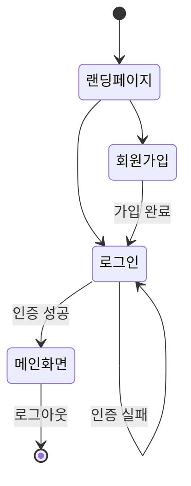

## 변경 이력

| 버전 | 날짜 | 작성자 | 변경 내용 |
|------|------|--------|-----------|
| v1.0 | {YYYY-MM-DD} | {작성자} | 최초 작성 |
```

---

## 10-테스트 전략서

```markdown
---
문서명: {프로젝트명} 테스트 전략서
버전: v1.0
작성일: {YYYY-MM-DD}
최종수정일: {YYYY-MM-DD}
작성자: {작성자}
상태: 초안
---

# {프로젝트명} 테스트 전략서

## 1. 테스트 개요

| 항목 | 내용 |
|------|------|
| 프로젝트명 | {프로젝트명} |
| 테스트 기간 | {시작일} ~ {종료일} |
| 테스트 환경 | {환경 정보} |
| 테스트 도구 | {도구 목록} |

## 2. 테스트 범위

### 2.1 테스트 대상

| 구분 | 대상 | 우선순위 |
|------|------|----------|
| 포함 | {기능/모듈 목록} | 필수 |
| 제외 | {제외 항목} | - |

### 2.2 테스트 유형

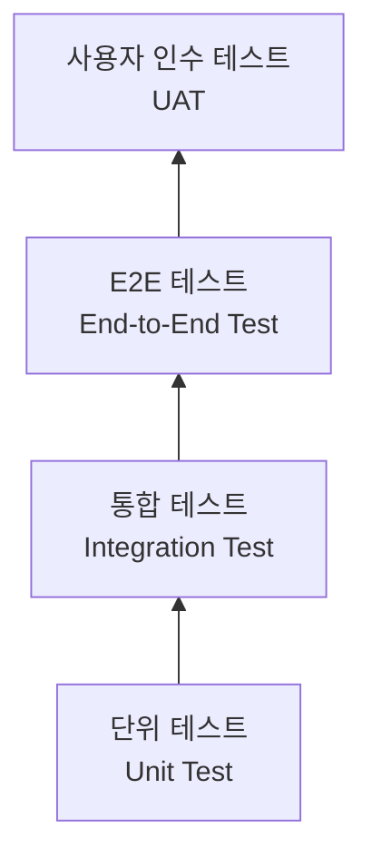

| 유형 | 범위 | 도구 | 커버리지 목표 |
|------|------|------|--------------|
| 단위 테스트 | 함수/메서드 | {Jest/JUnit/등} | 80% 이상 |
| 모바일 단위 테스트 | Flutter 위젯/함수 | Flutter Test | 80% 이상 |
| 통합 테스트 | API 엔드포인트 | {Supertest/등} | 주요 API 100% |
| E2E 테스트 | 사용자 시나리오 | {Cypress/Playwright/등} | 핵심 시나리오 100% |
| 모바일 E2E 테스트 | 모바일 사용자 시나리오 | Flutter Integration Test | 핵심 시나리오 100% |
| 성능 테스트 | 부하/스트레스 | {k6/JMeter/등} | SLA 충족 |

## 3. 테스트 케이스

### 3.1 테스트 케이스 목록

| TC ID | 기능 | 테스트 시나리오 | 사전 조건 | 기대 결과 | 우선순위 |
|-------|------|----------------|-----------|-----------|----------|
| TC-001 | 로그인 | 정상 로그인 | 가입된 계정 존재 | 메인 화면 이동, 토큰 발급 | 높음 |
| TC-002 | 로그인 | 잘못된 비밀번호 | 가입된 계정 존재 | 에러 메시지 표시 | 높음 |
| TC-003 | {기능} | {시나리오} | {조건} | {결과} | {우선순위} |

## 4. 테스트 환경

| 환경 | 용도 | URL | DB |
|------|------|-----|-----|
| Local | 개발자 테스트 | localhost | 로컬 DB |
| Dev | 통합 테스트 | dev.{도메인} | 개발 DB |
| Staging | QA/UAT | staging.{도메인} | 스테이징 DB |
| Production | 운영 | {도메인} | 운영 DB |

## 5. 결함 관리

### 5.1 결함 심각도

| 등급 | 설명 | 대응 시간 |
|------|------|-----------|
| Critical | 서비스 불가, 데이터 손실 | 즉시 |
| Major | 주요 기능 장애 | 24시간 내 |
| Minor | 부분 기능 이상 | 다음 스프린트 |
| Trivial | UI/UX 개선 | 백로그 |

## 6. 자동화 전략

- [ ] CI 파이프라인에 단위 테스트 통합
- [ ] PR 머지 전 통합 테스트 자동 실행
- [ ] 야간 E2E 테스트 자동 실행
- [ ] 테스트 커버리지 리포트 자동 생성

## 변경 이력

| 버전 | 날짜 | 작성자 | 변경 내용 |
|------|------|--------|-----------|
| v1.0 | {YYYY-MM-DD} | {작성자} | 최초 작성 |
```

---

## 11-코드 리뷰 규칙

```markdown
---
문서명: {프로젝트명} 코드 리뷰 규칙
버전: v1.0
작성일: {YYYY-MM-DD}
최종수정일: {YYYY-MM-DD}
작성자: {작성자}
상태: 초안
---

# {프로젝트명} 코드 리뷰 규칙

## 1. 코드 리뷰 목적

- 코드 품질 향상 및 버그 사전 방지
- 지식 공유 및 팀 역량 강화
- 코딩 표준 준수 확인

## 2. 리뷰 프로세스

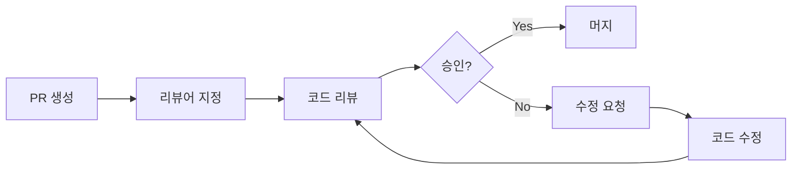

### 2.1 프로세스 규칙

| 항목 | 규칙 |
|------|------|
| 리뷰어 수 | 최소 1명 (핵심 변경은 2명) |
| 리뷰 응답 시간 | PR 생성 후 24시간 이내 |
| PR 크기 | 400줄 이하 권장 (초과 시 분할) |
| 셀프 리뷰 | PR 생성 전 필수 |

## 3. 리뷰 체크리스트

### 3.1 기능

- [ ] 요구사항을 올바르게 구현했는가?
- [ ] 엣지 케이스를 처리했는가?
- [ ] 에러 핸들링이 적절한가?

### 3.2 코드 품질

- [ ] 네이밍이 명확하고 일관적인가?
- [ ] 불필요한 복잡도가 없는가?
- [ ] 중복 코드가 없는가?
- [ ] 단일 책임 원칙을 따르는가?

### 3.3 보안

- [ ] SQL Injection 취약점이 없는가?
- [ ] XSS 취약점이 없는가?
- [ ] 민감 정보가 하드코딩되지 않았는가?
- [ ] 적절한 인증/인가 처리가 되었는가?

### 3.4 성능

- [ ] N+1 쿼리 문제가 없는가?
- [ ] 불필요한 API 호출이 없는가?
- [ ] 적절한 인덱싱이 되어 있는가?

### 3.5 테스트

- [ ] 새로운 기능에 대한 테스트가 있는가?
- [ ] 테스트가 의미 있는 케이스를 검증하는가?
- [ ] 기존 테스트가 깨지지 않았는가?

## 4. 리뷰 코멘트 가이드

| 접두사 | 의미 | 예시 |
|--------|------|------|
| [MUST] | 반드시 수정 필요 | [MUST] SQL Injection 취약점이 있습니다 |
| [SHOULD] | 강력 권장 | [SHOULD] 이 로직은 별도 함수로 분리하면 좋겠습니다 |
| [NICE] | 개선 제안 | [NICE] 변수명을 좀 더 명확하게 바꾸면 좋겠습니다 |
| [Q] | 질문 | [Q] 이 부분의 의도가 궁금합니다 |

## 5. 코딩 표준

| 항목 | 규칙 |
|------|------|
| 들여쓰기 | 스페이스 2칸 (또는 프로젝트 설정) |
| 줄 길이 | 최대 120자 |
| 파일 길이 | 최대 300줄 권장 |
| 함수 길이 | 최대 30줄 권장 |

## 변경 이력

| 버전 | 날짜 | 작성자 | 변경 내용 |
|------|------|--------|-----------|
| v1.0 | {YYYY-MM-DD} | {작성자} | 최초 작성 |
```

---

## 12-테스트 보고서

```markdown
---
문서명: {프로젝트명} 테스트 보고서
버전: v1.0
작성일: {YYYY-MM-DD}
최종수정일: {YYYY-MM-DD}
작성자: {작성자}
상태: 초안
---

# {프로젝트명} 테스트 보고서

## 1. 개요

| 항목 | 내용 |
|------|------|
| 프로젝트명 | {프로젝트명} |
| 테스트 기간 | {YYYY-MM-DD} ~ {YYYY-MM-DD} |
| 테스트 환경 | {Staging / QA / Production} |
| 테스트 도구 | {Jest, Cypress, JMeter 등} |
| 작성자 | {작성자} |

## 2. 테스트 범위

### 2.1 대상 기능

| 기능 ID | 기능명 | 우선순위 | 테스트 여부 |
|---------|--------|----------|------------|
| FR-001 | {기능명} | 상 | ✅ |
| FR-002 | {기능명} | 중 | ✅ |
| FR-003 | {기능명} | 하 | ⬜ (제외 사유: {사유}) |

### 2.2 제외 항목

| 항목 | 제외 사유 |
|------|----------|
| {기능/모듈} | {사유} |

## 3. 테스트 결과 요약

### 3.1 전체 현황

| 구분 | 계획 | 실행 | 성공 | 실패 | 블로커 | 성공률 |
|------|------|------|------|------|--------|--------|
| 단위 테스트 | {N} | {N} | {N} | {N} | {N} | {N}% |
| 통합 테스트 | {N} | {N} | {N} | {N} | {N} | {N}% |
| E2E 테스트 | {N} | {N} | {N} | {N} | {N} | {N}% |
| 성능 테스트 | {N} | {N} | {N} | {N} | {N} | {N}% |
| **합계** | **{N}** | **{N}** | **{N}** | **{N}** | **{N}** | **{N}%** |

### 3.2 코드 커버리지

| 모듈 | Line | Branch | Function | 목표 | 달성 여부 |
|------|------|--------|----------|------|----------|
| {모듈A} | {N}% | {N}% | {N}% | 80% | ✅/❌ |
| {모듈B} | {N}% | {N}% | {N}% | 80% | ✅/❌ |
| **전체** | **{N}%** | **{N}%** | **{N}%** | **80%** | |

## 4. 결함 현황

### 4.1 결함 요약

| 심각도 | 발견 | 수정 완료 | 미해결 | 보류 |
|--------|------|----------|--------|------|
| Critical | {N} | {N} | {N} | {N} |
| Major | {N} | {N} | {N} | {N} |
| Minor | {N} | {N} | {N} | {N} |
| Trivial | {N} | {N} | {N} | {N} |

### 4.2 주요 결함 상세

| 결함 ID | 심각도 | 제목 | 재현 경로 | 상태 | 담당자 |
|---------|--------|------|----------|------|--------|
| BUG-001 | Critical | {결함 제목} | {재현 단계 요약} | 수정 완료 | {담당자} |
| BUG-002 | Major | {결함 제목} | {재현 단계 요약} | 미해결 | {담당자} |

### 4.3 결함 추이

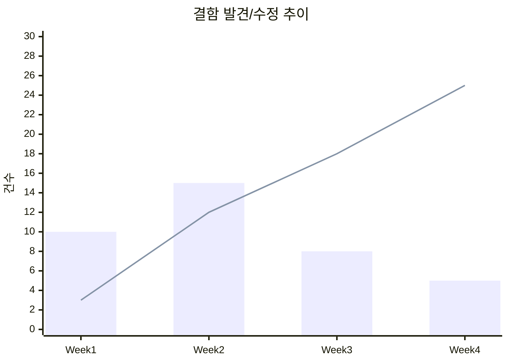

## 5. 성능 테스트 결과

| 시나리오 | 동시 사용자 | 평균 응답시간 | P95 | P99 | TPS | 목표 충족 |
|---------|------------|-------------|-----|-----|-----|----------|
| {시나리오1} | {N} | {N}ms | {N}ms | {N}ms | {N} | ✅/❌ |
| {시나리오2} | {N} | {N}ms | {N}ms | {N}ms | {N} | ✅/❌ |

## 6. 테스트 환경

| 항목 | 상세 |
|------|------|
| OS | {Ubuntu 22.04 / Windows Server 등} |
| Runtime | {Node.js 20 / JDK 17 등} |
| DB | {PostgreSQL 15 / MySQL 8 등} |
| 브라우저 | {Chrome 120, Firefox 121, Safari 17} |
| 디바이스 | {Desktop, Mobile(iOS/Android)} |

## 7. 리스크 및 권고사항

### 7.1 잔존 리스크

| 리스크 | 영향도 | 발생 가능성 | 대응 방안 |
|--------|--------|------------|----------|
| {리스크1} | 상 | 중 | {대응 방안} |

### 7.2 권고사항

1. {권고사항 1}
2. {권고사항 2}

## 8. 결론 및 릴리스 판정

| 항목 | 기준 | 결과 | 판정 |
|------|------|------|------|
| 테스트 성공률 | ≥ 95% | {N}% | ✅/❌ |
| Critical 결함 | 0건 | {N}건 | ✅/❌ |
| Major 결함 미해결 | 0건 | {N}건 | ✅/❌ |
| 코드 커버리지 | ≥ 80% | {N}% | ✅/❌ |
| 성능 목표 달성 | 100% | {N}% | ✅/❌ |

**릴리스 판정**: ✅ 승인 / ❌ 조건부 승인 / ❌ 보류

**판정 사유**: {판정에 대한 상세 사유}

## 변경 이력

| 버전 | 날짜 | 작성자 | 변경 내용 |
|------|------|--------|-----------|
| v1.0 | {YYYY-MM-DD} | {작성자} | 최초 작성 |
```

---

## 13-배포 가이드

```markdown
---
문서명: {프로젝트명} 배포 가이드
버전: v1.0
작성일: {YYYY-MM-DD}
최종수정일: {YYYY-MM-DD}
작성자: {작성자}
상태: 초안
---

# {프로젝트명} 배포 가이드

## 1. 배포 환경 정보

| 환경 | 서버 | URL | 비고 |
|------|------|-----|------|
| Development | {서버 정보} | dev.{도메인} | 자동 배포 |
| Staging | {서버 정보} | staging.{도메인} | 수동 승인 |
| Production | {서버 정보} | {도메인} | 수동 승인 |

## 2. 배포 파이프라인

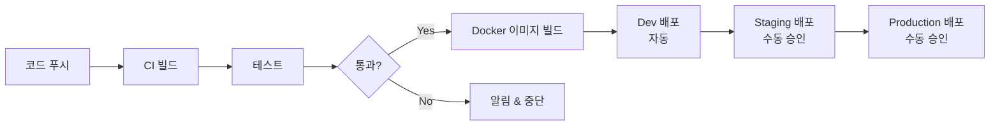

## 3. 사전 준비사항

### 3.1 필수 도구

| 도구 | 버전 | 용도 |
|------|------|------|
| Docker | 29.x | 컨테이너 빌드 |
| kubectl | 1.32+ | K8s 클러스터 관리 |
| Terraform | 1.14.x | 인프라 프로비저닝 |
| {도구} | {버전} | {용도} |

### 3.2 환경 변수

| 변수명 | 설명 | 예시 | 필수 |
|--------|------|------|------|
| DATABASE_URL | DB 연결 문자열 | postgresql://... | Y |
| JWT_SECRET | JWT 비밀키 | {랜덤 문자열} | Y |
| {변수명} | {설명} | {예시} | Y/N |

## 4. 배포 절차

### 4.1 일반 배포

1. `release/{버전}` 브랜치 생성
2. 버전 번호 업데이트
3. CHANGELOG 작성
4. PR 생성 → 리뷰 → 머지
5. 태그 생성: `git tag v{버전}`
6. CI/CD 파이프라인 자동 실행
7. Staging 환경 검증
8. Production 배포 승인

### 4.2 긴급 배포 (Hotfix)

1. `main`에서 `hotfix/{이슈번호}` 브랜치 생성
2. 수정 사항 커밋
3. PR 생성 → 긴급 리뷰
4. `main`과 `develop`에 동시 머지
5. 즉시 배포

## 5. 롤백 전략

| 단계 | 명령어 / 절차 | 비고 |
|------|--------------|------|
| 1. 문제 확인 | 모니터링 대시보드 확인 | {URL} |
| 2. 롤백 결정 | PM/TL 승인 | 긴급 시 개발자 판단 |
| 3. 이전 버전 배포 | `kubectl rollout undo deployment/{서비스}` | 또는 이전 Docker 이미지 지정 |
| 4. 검증 | 핵심 기능 동작 확인 | 헬스체크 + 스모크 테스트 |
| 5. 사후 조치 | 장애 보고서 작성 | RCA (Root Cause Analysis) |

## 6. 배포 체크리스트

### 배포 전
- [ ] 모든 테스트 통과 확인
- [ ] Staging 환경 검증 완료
- [ ] DB 마이그레이션 스크립트 확인
- [ ] 환경 변수 설정 확인
- [ ] 배포 일정 공유 (팀/이해관계자)

### 배포 후
- [ ] 헬스체크 통과 확인
- [ ] 핵심 기능 스모크 테스트
- [ ] 모니터링 대시보드 이상 없음
- [ ] 에러 로그 확인
- [ ] 배포 완료 공유

## 7. 모니터링

| 항목 | 도구 | 임계치 | 알림 채널 |
|------|------|--------|-----------|
| 서버 상태 | {도구} | CPU > 80%, MEM > 85% | {Slack/이메일} |
| 에러율 | {도구} | > 1% | {Slack/이메일} |
| 응답 시간 | {도구} | P95 > 500ms | {Slack/이메일} |

## 변경 이력

| 버전 | 날짜 | 작성자 | 변경 내용 |
|------|------|--------|-----------|
| v1.0 | {YYYY-MM-DD} | {작성자} | 최초 작성 |
```

---

## 14-사용자 매뉴얼

```markdown
---
문서명: {프로젝트명} 사용자 매뉴얼
버전: v1.0
작성일: {YYYY-MM-DD}
최종수정일: {YYYY-MM-DD}
작성자: {작성자}
상태: 초안
---

# {프로젝트명} 사용자 매뉴얼

## 1. 소개

### 1.1 문서 목적

이 매뉴얼은 {프로젝트명}의 최종 사용자를 위한 기능 사용법을 안내한다.

### 1.2 대상 독자

| 대상 | 설명 |
|------|------|
| 일반 사용자 | {시스템의 주요 기능을 사용하는 최종 사용자} |
| 관리자 | {시스템 설정 및 사용자 관리를 담당하는 관리자} |

### 1.3 시스템 요구사항

| 항목 | 최소 사양 | 권장 사양 |
|------|----------|----------|
| 브라우저 | Chrome 90+, Firefox 88+, Safari 14+ | 최신 버전 |
| 해상도 | 1280 x 720 | 1920 x 1080 |
| 네트워크 | 1Mbps | 10Mbps |
| 모바일 | iOS 15+ / Android 12+ | 최신 버전 |

## 2. 시작하기

### 2.1 회원가입 / 계정 생성

1. {URL}에 접속한다
2. "회원가입" 버튼을 클릭한다
3. 필수 정보를 입력한다
4. 이메일 인증을 완료한다

### 2.2 로그인

| 로그인 방식 | 설명 |
|------------|------|
| 이메일/비밀번호 | {기본 로그인 방식} |
| SSO | {OAuth2.0 / SAML 기반 SSO} |
| 2FA | {OTP / 이메일 인증} |

### 2.3 초기 설정

1. 프로필 정보 입력
2. 알림 설정
3. 언어/테마 설정

## 3. 주요 기능

### 3.1 {기능 1: 대시보드}

**설명**: {기능에 대한 간략한 설명}

**사용 방법**:
1. {단계 1}
2. {단계 2}
3. {단계 3}

**화면 구성**:

| 영역 | 설명 |
|------|------|
| {영역 A} | {설명} |
| {영역 B} | {설명} |

> **팁**: {유용한 사용 팁}

### 3.2 {기능 2: 데이터 관리}

**설명**: {기능에 대한 간략한 설명}

**사용 방법**:
1. {단계 1}
2. {단계 2}
3. {단계 3}

### 3.3 {기능 3: 보고서/리포트}

**설명**: {기능에 대한 간략한 설명}

**사용 방법**:
1. {단계 1}
2. {단계 2}
3. {단계 3}

## 4. 역할별 기능 가이드

### 4.1 일반 사용자

| 기능 | 접근 경로 | 설명 |
|------|----------|------|
| {기능 A} | {메뉴 > 하위메뉴} | {설명} |
| {기능 B} | {메뉴 > 하위메뉴} | {설명} |

### 4.2 관리자

| 기능 | 접근 경로 | 설명 |
|------|----------|------|
| 사용자 관리 | {관리 > 사용자} | {사용자 추가/수정/삭제/권한 관리} |
| 시스템 설정 | {관리 > 설정} | {시스템 전반 설정 관리} |

## 5. 자주 묻는 질문 (FAQ)

### Q1. {질문 1}

**A**: {답변 1}

### Q2. {질문 2}

**A**: {답변 2}

### Q3. {질문 3}

**A**: {답변 3}

## 6. 문제 해결

| 증상 | 원인 | 해결 방법 |
|------|------|----------|
| {증상 1} | {원인} | {해결 방법} |
| {증상 2} | {원인} | {해결 방법} |
| {증상 3} | {원인} | {해결 방법} |

## 7. 단축키 / 편의 기능

| 단축키 | 기능 | 비고 |
|--------|------|------|
| {Ctrl+S} | {저장} | |
| {Ctrl+Z} | {실행 취소} | |
| {Ctrl+F} | {검색} | |

## 8. 용어 사전

| 용어 | 설명 |
|------|------|
| {용어 1} | {설명} |
| {용어 2} | {설명} |
| {용어 3} | {설명} |

## 9. 지원 및 문의

| 채널 | 연락처 | 운영 시간 |
|------|--------|----------|
| 이메일 | {support@example.com} | 평일 09:00~18:00 |
| 전화 | {02-1234-5678} | 평일 09:00~18:00 |
| 채팅 | {시스템 내 채팅 지원} | 24시간 |
| FAQ | {URL} | 상시 |

## 변경 이력

| 버전 | 날짜 | 작성자 | 변경 내용 |
|------|------|--------|-----------|
| v1.0 | {YYYY-MM-DD} | {작성자} | 최초 작성 |
```

---

## 15-운영 매뉴얼

```markdown
---
문서명: {프로젝트명} 운영 매뉴얼
버전: v1.0
작성일: {YYYY-MM-DD}
최종수정일: {YYYY-MM-DD}
작성자: {작성자}
상태: 초안
---

# {프로젝트명} 운영 매뉴얼

## 1. 개요

### 1.1 문서 목적

이 매뉴얼은 {프로젝트명} 시스템의 운영/유지보수 담당자를 위한 운영 절차와 장애 대응 가이드를 제공한다.

### 1.2 대상 독자

| 대상 | 역할 |
|------|------|
| 시스템 운영자 | 서버/인프라 관리, 모니터링, 장애 대응 |
| DBA | 데이터베이스 관리, 백업/복구, 성능 튜닝 |
| 보안 담당자 | 보안 패치, 접근 제어, 감사 로그 관리 |

### 1.3 시스템 구성 요약

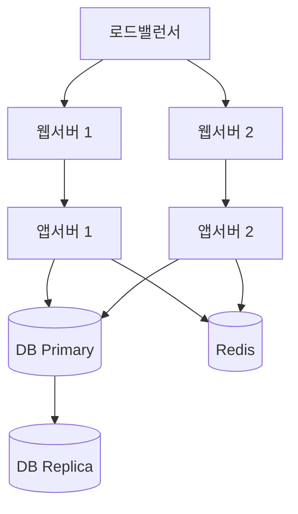

## 2. 인프라 구성

### 2.1 서버 목록

| 구분 | 호스트명 | IP | OS | 스펙 | 용도 |
|------|---------|----|----|------|------|
| 웹서버 | {host-web-01} | {10.0.1.10} | {Ubuntu 22.04} | {4C/8G} | Nginx 리버스 프록시 |
| 앱서버 | {host-app-01} | {10.0.2.10} | {Ubuntu 22.04} | {8C/16G} | 애플리케이션 서버 |
| DB서버 | {host-db-01} | {10.0.3.10} | {Ubuntu 22.04} | {16C/64G} | PostgreSQL Primary |
| 캐시서버 | {host-cache-01} | {10.0.4.10} | {Ubuntu 22.04} | {4C/16G} | Redis |

### 2.2 네트워크 구성

| 구간 | 대역 | 방화벽 규칙 | 비고 |
|------|------|------------|------|
| 외부 → LB | {Public} | 80, 443 | SSL 종단 |
| LB → 웹서버 | {10.0.1.0/24} | 8080 | 내부 통신 |
| 웹서버 → 앱서버 | {10.0.2.0/24} | {3000} | API 포트 |
| 앱서버 → DB | {10.0.3.0/24} | {5432} | DB 포트 |

### 2.3 외부 연동 서비스

| 서비스 | 용도 | 엔드포인트 | 담당 |
|--------|------|-----------|------|
| {AWS S3} | 파일 저장 | {s3.amazonaws.com} | {담당자} |
| {SendGrid} | 이메일 발송 | {api.sendgrid.com} | {담당자} |
| {Sentry} | 에러 추적 | {sentry.io} | {담당자} |

## 3. 일상 운영

### 3.1 일일 점검 체크리스트

| 시간 | 점검 항목 | 확인 방법 | 정상 기준 |
|------|----------|----------|----------|
| 09:00 | 서비스 가용성 | 헬스체크 API 호출 | HTTP 200 |
| 09:00 | 서버 리소스 | 모니터링 대시보드 | CPU < 70%, MEM < 80% |
| 09:00 | 에러 로그 | 로그 수집 시스템 | Critical 0건 |
| 09:00 | DB 상태 | `pg_stat_activity` 확인 | Active 커넥션 < 80% |
| 18:00 | 일일 백업 완료 | 백업 로그 확인 | 성공 |

### 3.2 주간 점검

| 점검 항목 | 확인 방법 | 비고 |
|----------|----------|------|
| 디스크 사용량 추이 | 모니터링 대시보드 | 80% 이상 시 확장 검토 |
| 슬로우 쿼리 분석 | `pg_stat_statements` | 상위 10개 쿼리 튜닝 검토 |
| 보안 패치 확인 | CVE 알림 / OS 업데이트 | Critical 패치 즉시 적용 |
| SSL 인증서 만료일 | `openssl s_client` | 30일 이내 갱신 |

### 3.3 월간 점검

| 점검 항목 | 확인 방법 | 비고 |
|----------|----------|------|
| 백업 복구 테스트 | 복구 리허설 실행 | RTO/RPO 달성 여부 확인 |
| 용량 계획 검토 | 사용량 추이 분석 | 3개월 후 예측 |
| 접근 권한 리뷰 | IAM / DB 권한 감사 | 불필요 계정 제거 |
| 의존성 업데이트 | `npm audit` / `pip audit` | 취약점 해결 |

## 4. 백업 및 복구

### 4.1 백업 정책

| 대상 | 방식 | 주기 | 보관 기간 | 저장 위치 |
|------|------|------|----------|----------|
| DB 전체 | `pg_dump` Full Backup | 매일 02:00 | 30일 | {S3/NAS} |
| DB 증분 | WAL 아카이빙 | 실시간 | 7일 | {S3/NAS} |
| 파일 스토리지 | rsync / S3 sync | 매일 03:00 | 30일 | {S3/NAS} |
| 설정 파일 | Git 버전 관리 | 변경 시 | 영구 | Git Repository |

### 4.2 복구 절차

**RTO (목표 복구 시간)**: {4시간}
**RPO (목표 복구 시점)**: {1시간}

1. 장애 범위 확인
2. 복구 대상 및 시점 결정
3. 백업 데이터 무결성 확인
4. 복구 실행
   ```bash
   # DB 복구 예시
   pg_restore -h {host} -d {dbname} -U {user} {backup_file}
   ```
5. 데이터 정합성 검증
6. 서비스 재개 및 모니터링

## 5. 장애 대응

### 5.1 장애 등급

| 등급 | 정의 | 응답 시간 | 해결 목표 | 에스컬레이션 |
|------|------|----------|----------|-------------|
| P1 (Critical) | 서비스 전면 중단 | 15분 | 1시간 | 즉시 → PM/CTO |
| P2 (Major) | 핵심 기능 장애 | 30분 | 4시간 | 1시간 후 → PM |
| P3 (Minor) | 부분 기능 장애 | 2시간 | 24시간 | 4시간 후 → TL |
| P4 (Low) | 사소한 이슈 | 24시간 | 1주 | 정기 회의 시 |

### 5.2 장애 대응 프로세스

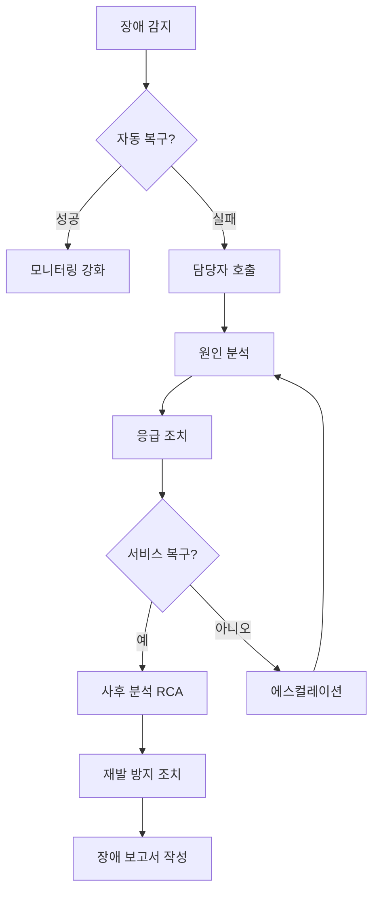

### 5.3 주요 장애 시나리오

| 시나리오 | 증상 | 즉시 조치 | 근본 원인 대응 |
|---------|------|----------|--------------|
| DB 커넥션 풀 고갈 | 504 Gateway Timeout | 앱서버 재시작 | 커넥션 풀 설정 튜닝, 슬로우 쿼리 해결 |
| 디스크 풀 | 서비스 중단 / 로그 기록 실패 | 불필요 로그 삭제, 디스크 확장 | 로그 로테이션 설정, 용량 모니터링 강화 |
| 메모리 누수 | OOM Kill / 점진적 성능 저하 | 프로세스 재시작 | 메모리 프로파일링, 코드 수정 |
| SSL 인증서 만료 | HTTPS 접속 불가 | 인증서 갱신 | 자동 갱신 스크립트(certbot) |
| 외부 API 장애 | 연동 기능 오류 | Circuit Breaker 활성화 | Fallback 로직 검토 |

### 5.4 비상 연락망

| 역할 | 담당자 | 연락처 | 백업 담당 |
|------|--------|--------|----------|
| 1차 대응 | {담당자} | {010-xxxx-xxxx} | {백업 담당자} |
| 인프라 | {담당자} | {010-xxxx-xxxx} | {백업 담당자} |
| DBA | {담당자} | {010-xxxx-xxxx} | {백업 담당자} |
| PM | {담당자} | {010-xxxx-xxxx} | {백업 담당자} |

## 6. 모니터링

### 6.1 모니터링 도구

| 도구 | 용도 | 접속 URL | 비고 |
|------|------|---------|------|
| {Grafana} | 메트릭 대시보드 | {URL} | CPU, Memory, Disk, Network |
| {Prometheus} | 메트릭 수집 | {URL} | 앱 서버 메트릭 |
| {ELK Stack} | 로그 수집/분석 | {URL} | 애플리케이션 로그 |
| {Sentry} | 에러 추적 | {URL} | 실시간 에러 알림 |

### 6.2 알림 규칙

| 알림 | 조건 | 심각도 | 알림 채널 | 대응 방법 |
|------|------|--------|----------|----------|
| CPU 과부하 | > 80% (5분 지속) | Warning | {Slack} | 프로세스 확인, 스케일 아웃 검토 |
| 메모리 부족 | > 90% | Critical | {Slack + 전화} | 캐시 클리어, 서비스 재시작 |
| 디스크 사용량 | > 85% | Warning | {Slack} | 로그 정리, 디스크 확장 |
| 에러율 상승 | > 5% (5분) | Critical | {Slack + 전화} | 로그 분석, 롤백 검토 |
| 응답 시간 | P95 > 3초 | Warning | {Slack} | 슬로우 쿼리 확인 |

## 7. 보안 운영

### 7.1 접근 제어

| 대상 | 접근 방식 | 인증 방법 | 비고 |
|------|----------|----------|------|
| 서버 SSH | Bastion Host 경유 | SSH Key | 비밀번호 인증 비활성화 |
| DB 접속 | 앱서버에서만 허용 | ID/PW + IP 제한 | 직접 접속 금지 |
| 관리자 페이지 | VPN + IP 화이트리스트 | SSO + 2FA | |

### 7.2 보안 점검

| 항목 | 주기 | 방법 | 담당 |
|------|------|------|------|
| 취약점 스캔 | 월 1회 | {OWASP ZAP / Nessus} | 보안팀 |
| 패치 적용 | Critical: 즉시, 기타: 월 1회 | OS/미들웨어 업데이트 | 인프라팀 |
| 접근 로그 감사 | 주 1회 | 로그 분석 | 보안팀 |
| 계정 리뷰 | 분기 1회 | IAM/DB 계정 점검 | 보안팀 |

## 8. 성능 관리

### 8.1 성능 기준

| 지표 | 목표 | 현재 | 측정 방법 |
|------|------|------|----------|
| 가용률 | 99.9% (월 43분 이내 다운타임) | {N}% | 모니터링 시스템 |
| 응답 시간 (P95) | < 500ms | {N}ms | APM 도구 |
| 동시 접속자 | {N}명 | {N}명 | 부하 테스트 |
| TPS | {N} | {N} | 부하 테스트 |

### 8.2 스케일링 전략

| 구분 | 트리거 조건 | 조치 | 자동/수동 |
|------|------------|------|----------|
| Scale Out | CPU > 70% (10분) | 앱서버 인스턴스 추가 | {자동 / 수동} |
| Scale Up | 메모리 부족 | 인스턴스 스펙 업그레이드 | 수동 |
| DB Read Replica | 읽기 부하 증가 | Replica 추가 | 수동 |

## 9. 로그 관리

### 9.1 로그 분류

| 로그 유형 | 경로 | 로테이션 | 보관 기간 |
|----------|------|---------|----------|
| 앱 로그 | {/var/log/app/} | 일간 | 30일 |
| 접근 로그 | {/var/log/nginx/access.log} | 일간 | 90일 |
| 에러 로그 | {/var/log/nginx/error.log} | 일간 | 90일 |
| DB 로그 | {/var/log/postgresql/} | 주간 | 30일 |
| 감사 로그 | {/var/log/audit/} | 월간 | 1년 |

### 9.2 로그 레벨 가이드

| 레벨 | 용도 | 운영 환경 설정 |
|------|------|--------------|
| ERROR | 즉시 대응 필요한 오류 | 항상 활성화 |
| WARN | 잠재적 문제 | 항상 활성화 |
| INFO | 주요 이벤트 기록 | 항상 활성화 |
| DEBUG | 상세 디버깅 정보 | 장애 시에만 임시 활성화 |

## 10. 변경 관리

### 10.1 변경 유형

| 유형 | 정의 | 승인 프로세스 | 비고 |
|------|------|-------------|------|
| 표준 변경 | 사전 승인된 반복 작업 | 자동 승인 | 배포, 정기 패치 |
| 일반 변경 | 계획된 변경 작업 | CAB 검토 | 인프라 변경, 신규 기능 |
| 긴급 변경 | 장애 대응 긴급 조치 | 사후 승인 | 장애 시 즉시 시행 |

### 10.2 변경 절차

1. 변경 요청서 작성
2. 영향 범위 분석
3. 승인 (CAB/PM)
4. 변경 실행 (점검 시간 활용)
5. 검증 및 롤백 준비
6. 변경 완료 보고

## 변경 이력

| 버전 | 날짜 | 작성자 | 변경 내용 |
|------|------|--------|-----------|
| v1.0 | {YYYY-MM-DD} | {작성자} | 최초 작성 |
```
