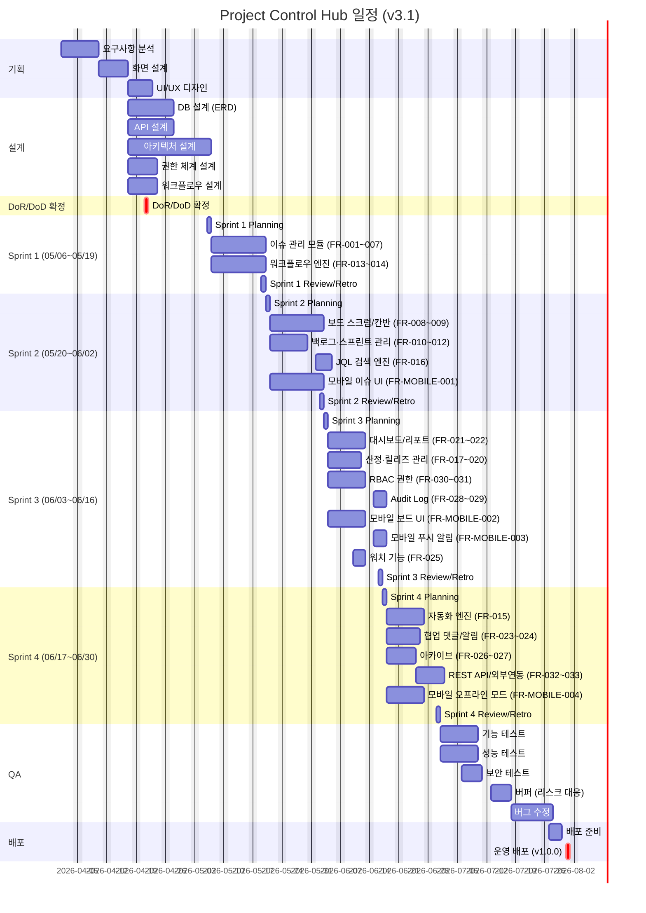

# Project Control Hub 프로젝트 스케줄

## 1. 프로젝트 개요

| 항목 | 내용 |
|------|------|
| 프로젝트명 | Project Control Hub |
| 시작일 | 2026-04-01 |
| 종료일 | 2026-07-31 |
| 총 기간 | 18주 |
| 개발 방법론 | 애자일 스크럼 (2주 스프린트 × 4회) |
| 릴리즈 목표 | v1.0.0 (2026-07-31) |

---

## 2. 마일스톤

| 마일스톤 | 목표일 | 산출물 | 상태 |
|----------|--------|--------|------|
| M1. 기획 완료 | 2026-04-14 | 요구사항 정의서, 화면 설계서, UI/UX 디자인 시안 | 대기 |
| M1.1. DoR/DoD 확정 | 2026-04-21 | DoR 체크리스트, DoD 체크리스트, 스프린트 운영 가이드 | 대기 |
| M2. 설계 완료 | 2026-05-05 | ERD, API 정의서, 아키텍처 정의서, 권한 체계 설계서, 워크플로우 설계서 | 대기 |
| M3. Sprint 1 완료 | 2026-05-19 | 이슈 CRUD 모듈, 워크플로우 엔진, 단위 테스트 결과 | 대기 |
| M4. Sprint 2 완료 | 2026-06-02 | 보드(스크럼/칸반), 스프린트 관리, JQL 검색 엔진 | 대기 |
| M5. Sprint 3 완료 | 2026-06-16 | 대시보드/리포트, RBAC 권한, Audit Log, 산정, 릴리즈 관리 | 대기 |
| M6. Sprint 4 완료 (개발 완료) | 2026-06-30 | 자동화, 협업, REST API/외부 연동, 소스코드 전체 | 대기 |
| M7. QA 완료 | 2026-07-21 | 기능/성능/보안 테스트 리포트 | 대기 |
| M8. 배포 (릴리즈 v1.0.0) | 2026-07-31 | 배포 완료 보고서, 릴리즈 노트 v1.0.0 | 대기 |

---

## 3. 스프린트 단위 일정

개발 8주(05/06~06/30)를 2주 스프린트 4회로 분할합니다.

> FR 코드는 [07-요구사항정의서](../07-요구사항정의서/07-요구사항정의서_v2.2.md) 순번 체계(FR-001~033, FR-MOBILE-001~004) 기준입니다.

| 스프린트 | 기간 | Sprint Goal | 포함 FR |
|---------|------|-------------|---------|
| Sprint 1 | 2026-05-06 ~ 2026-05-19 | 이슈 CRUD + 워크플로우 기본 | FR-001~007, FR-013~014 |
| Sprint 2 | 2026-05-20 ~ 2026-06-02 | 보드 + 스프린트 관리 + JQL + 모바일 이슈 조회/생성 UI | FR-008~012, FR-016, FR-MOBILE-001 |
| Sprint 3 | 2026-06-03 ~ 2026-06-16 | 대시보드/리포트 + 산정 + 권한(RBAC) + Audit + 릴리즈 관리 + 워치 + 모바일 보드/알림 | FR-017~022, FR-025, FR-028~031, FR-MOBILE-002~003 |
| Sprint 4 | 2026-06-17 ~ 2026-06-30 | 자동화 + 협업(댓글·알림) + 아카이브 + REST API/외부연동 + 모바일 오프라인 | FR-015, FR-023~024, FR-026~027, FR-032~033, FR-MOBILE-004 |

### FR 코드 매핑 요약

> 상세 요구사항은 [07-요구사항정의서](../07-요구사항정의서/07-요구사항정의서_v2.2.md) 참조

| FR 코드 | 기능 | 우선순위 | 스프린트 |
|---------|------|----------|---------|
| FR-001 | 이슈 CRUD | 필수 | Sprint 1 |
| FR-002 | 이슈 타입별 생성 (Epic/Story/Task/Bug/Sub-task) | 필수 | Sprint 1 |
| FR-003 | 이슈 상태 관리 (6단계 워크플로우) | 필수 | Sprint 1 |
| FR-004 | 우선순위 설정 (5단계) | 필수 | Sprint 1 |
| FR-005 | 담당자 지정 | 필수 | Sprint 1 |
| FR-006 | 레이블 & 컴포넌트 분류 | 선택 | Sprint 1 |
| FR-007 | 이슈 간 링크 (Blocks/Duplicates/Relates to) | 필수 | Sprint 1 |
| FR-013 | 표준 워크플로우 6단계 | 필수 | Sprint 1 |
| FR-014 | 전환 규칙 (조건부 상태 전환) | 필수 | Sprint 1 |
| FR-008 | 스크럼 보드 | 필수 | Sprint 2 |
| FR-009 | 칸반 보드 + WIP 제한 | 필수 | Sprint 2 |
| FR-010 | 백로그 관리 | 필수 | Sprint 2 |
| FR-011 | 스프린트 생성/시작/완료 | 필수 | Sprint 2 |
| FR-012 | 로드맵 (Epic 타임라인) | 선택 | Sprint 2 |
| FR-016 | JQL 검색 엔진 | 필수 | Sprint 2 |
| FR-MOBILE-001 | 모바일 이슈 조회/생성 | 필수 | Sprint 2 |
| FR-017 | 스토리 포인트 (피보나치) | 필수 | Sprint 3 |
| FR-018 | Planning Poker 지원 | 선택 | Sprint 3 |
| FR-019 | Fix Version 관리 | 필수 | Sprint 3 |
| FR-020 | 릴리즈 노트 자동 생성 | 선택 | Sprint 3 |
| FR-021 | 역할별 가젯 구성 (대시보드) | 필수 | Sprint 3 |
| FR-022 | 번다운/속도/CFD 차트 | 필수 | Sprint 3 |
| FR-028 | Audit Log (필드 변경 이력) | 필수 | Sprint 3 |
| FR-029 | Audit Log CSV/JSON 내보내기 | 선택 | Sprint 3 |
| FR-030 | RBAC 5단계 역할 | 필수 | Sprint 3 |
| FR-031 | 이슈 보안 레벨 (Public/Internal/Confidential) | 선택 | Sprint 3 |
| FR-MOBILE-002 | 모바일 보드 확인 (터치 기반 상태 변경) | 필수 | Sprint 3 |
| FR-MOBILE-003 | 모바일 푸시 알림 수신 (FCM/APNs) | 선택 | Sprint 3 |
| FR-015 | 자동화 (Trigger→Condition→Action) | 선택 | Sprint 4 |
| FR-023 | 댓글 & @멘션 | 필수 | Sprint 4 |
| FR-024 | 이메일/Slack 알림 | 선택 | Sprint 4 |
| FR-025 | 워치(Watch) 기능 | 선택 | Sprint 3 |
| FR-026 | 이슈/프로젝트 아카이브 | 선택 | Sprint 4 |
| FR-027 | 자동 아카이브 규칙 | 선택 | Sprint 4 |
| FR-032 | REST API (Issue CRUD, Search, Transition) | 필수 | Sprint 4 |
| FR-033 | GitHub/GitLab 커밋/PR 연결 | 선택 | Sprint 4 |
| FR-MOBILE-004 | 오프라인 모드 (로컬 캐싱, 동기화) | 선택 | Sprint 4 |

---

## 4. 주차별 상세 일정 (Gantt 차트)



> **Daily Scrum**: 각 스프린트 기간 중 매일 15분 고정 진행 (Gantt 내 별도 표기 생략, 매일 수행)

---

## 5. 담당자별 업무 배분

### 5.1 역할 정의

| 담당자 | 역할 | 주요 업무 |
|--------|------|-----------|
| PM | 프로젝트 관리 | 일정 관리, 이해관계자 소통, 스프린트 운영, 마일스톤 추적 |
| 디자이너 | UI/UX 설계 | 화면 설계서, UI/UX 디자인 시안, 컴포넌트 가이드 |
| 백엔드 개발자 | API/서버 개발 | REST API, 워크플로우 엔진, DB 설계, 자동화 엔진, RBAC |
| 프론트엔드 개발자 | UI 개발 | 보드, 대시보드, 이슈 관리 화면, JQL UI, 릴리즈 관리 UI |
| Flutter 모바일 개발자 | 모바일 앱 개발 | Flutter iOS/Android 앱, 모바일 이슈 조회/생성, 보드 UI, 푸시 알림, 오프라인 모드 |
| QA 엔지니어 | 품질 보증 | 테스트 계획/실행, 기능·성능·보안 테스트, 결함 관리 |

### 5.2 스프린트별 담당자 배정

| 담당자 | 기획/설계 (04/01~05/05) | Sprint 1 (05/06~05/19) | Sprint 2 (05/20~06/02) | Sprint 3 (06/03~06/16) | Sprint 4 (06/17~06/30) | QA/배포 (07/01~07/31) |
|--------|------------------------|------------------------|------------------------|------------------------|------------------------|----------------------|
| PM | 요구사항 분석, DoR/DoD 확정, 스프린트 계획 수립 | Sprint Planning 진행, 일정 모니터링 | Sprint Planning 진행, 이해관계자 보고 | Sprint Planning 진행, 리스크 관리 | Sprint Planning 진행, 릴리즈 계획 | 배포 승인, 릴리즈 노트 작성 |
| 디자이너 | 화면 설계서, UI/UX 디자인 시안, 디자인 시스템 구축 | 이슈 관리 화면 디자인 확정 지원 | 보드·스프린트 화면 디자인 지원 | 대시보드·리포트 화면 디자인 지원 | 릴리즈 관리·자동화 화면 디자인 지원 | UI 검수 지원 |
| 백엔드 개발자 | ERD 설계, API 설계, 아키텍처 설계, 권한·워크플로우 설계 | 이슈 CRUD API (FR-001~007), 워크플로우 엔진 (FR-013~014) | 스프린트 관리 API (FR-010~011), JQL 검색 엔진 (FR-016) | RBAC 권한 API (FR-030~031), Audit Log (FR-028~029), 릴리즈 API (FR-019~020), Watchers API (FR-025) | 자동화 엔진 (FR-015), REST API/외부연동 (FR-032~033) | 버그 수정, 성능 최적화 |
| 프론트엔드 개발자 | 화면 설계 검토, 컴포넌트 구조 설계 | 이슈 관리 화면 (FR-001~007), 워크플로우 UI (FR-013~014) | 스크럼/칸반 보드 UI (FR-008~009), 백로그/스프린트 UI (FR-010~012) | 대시보드/리포트 UI (FR-021~022), 권한 설정 UI (FR-030~031), 산정 UI (FR-017~018), 워치 UI (FR-025) | 자동화 규칙 UI (FR-015), 협업 UI (FR-023~024), 아카이브 UI (FR-026~027) | 버그 수정, UI 개선 |
| Flutter 모바일 개발자 | 모바일 화면 설계 검토, Flutter 프로젝트 환경 설정 | - | 모바일 이슈 조회/생성 UI (FR-MOBILE-001) | 모바일 보드 UI (FR-MOBILE-002), 푸시 알림 (FR-MOBILE-003) | 오프라인 모드, 동기화 (FR-MOBILE-004) | 모바일 앱 버그 수정, iOS/Android 배포 준비 |
| QA 엔지니어 | 테스트 계획서 작성, 테스트 시나리오 준비 | Sprint 1 기능 테스트 참여 | Sprint 2 기능 테스트 참여 | Sprint 3 기능 테스트 참여 | Sprint 4 기능 테스트 참여 | 기능/성능/보안 테스트 전체 수행, 버그 등록 |

---

## 6. 버퍼 일정 및 리스크 대응

### 6.1 버퍼 일정 구조

| 구간 | 기간 | 목적 |
|------|------|------|
| QA 기능 테스트 | 2026-07-01 ~ 07-12 (2주) | 기능 전체 검증 |
| 버퍼 (리스크 대응) | 2026-07-13 ~ 07-17 (5영업일, 1주) | 미해결 이슈 처리, 일정 지연 흡수 |
| 버그 수정 | 2026-07-18 ~ 07-25 (1.5주) | QA 발견 결함 수정 |
| 배포 준비 | 2026-07-27 ~ 07-30 (3일) | 배포 환경 점검, 릴리즈 노트 작성 |
| 운영 배포 | 2026-07-31 (1일) | 릴리즈 v1.0.0 |

> **버퍼 산정 근거**: 18주 프로젝트 기준 권장 버퍼는 전체 기간의 5~10%입니다. 1주(5영업일)는 전체 18주의 약 5.6%로 적정 수준이며, 기존 3일(v2.0)에서 확대하여 Sprint 4 이후 통합 리스크를 흡수합니다.

### 6.2 리스크 대응 방침

| 리스크 | 발생 확률 | 영향도 | 대응 방안 |
|--------|----------|--------|-----------|
| 핵심 기능 구현 지연 | 중 | 상 | 스프린트 내 우선순위 재조정, 버퍼 1주 활용 |
| 요구사항 변경 | 중 | 중 | 변경 요청은 다음 스프린트 백로그로 이관 |
| 외부 연동 이슈 | 중 | 중 | Sprint 4에 별도 기간 확보, Mock API 우선 개발 |
| 인력 이탈 | 저 | 상 | 문서화 철저, 백업 담당자 사전 지정 |
| 성능 테스트 미달 | 저 | 중 | 버퍼 기간 내 성능 튜닝 수행 |

> **전체 일정 여유**: QA~배포 구간에 버퍼 1주(5영업일)가 내장되어 있으며, 스프린트별 마지막 날 Sprint Review/Retro를 통해 다음 스프린트 리스크를 선제적으로 식별합니다.

---

## 7. 크리티컬 패스 (Critical Path)

크리티컬 패스는 지연 시 전체 프로젝트 종료일에 직접 영향을 주는 태스크 연쇄입니다.

### 7.1 크리티컬 패스 흐름

```
ERD 설계 (04/15~04/21)
    ↓ [선행 필수 - 모든 백엔드 개발의 기반]
API 설계 + 아키텍처 설계 (04/15~05/05)
    ↓ [선행 필수 - 워크플로우 엔진 기반]
워크플로우 엔진 (Sprint 1: 05/07~05/16) — FR-013~014
    ↓ [워크플로우 없이 보드 구현 불가]
보드 (스크럼/칸반) (Sprint 2: 05/21~05/30) — FR-008~009
    ↓ [보드 없이 스프린트 관리 구현 불가]
스프린트 관리 (Sprint 2: 05/21~05/28) — FR-010~011
    ↓ [스프린트 관리 없이 대시보드/리포트 의미 없음]
대시보드/리포트 (Sprint 3: 06/04~06/11) — FR-021~022
    ↓
QA 기능 테스트 (07/01~07/12)
    ↓
버퍼 (07/13~07/17)
    ↓
버그 수정 (07/18~07/25)
    ↓
운영 배포 v1.0.0 (07/31)
```

### 7.2 크리티컬 패스 상세

| 순번 | 태스크 | 기간 | 의존 관계 | 비고 |
|------|--------|------|-----------|------|
| 1 | ERD 설계 | 04/15~04/21 | 없음 (시작점) | 모든 백엔드 개발 선행 필수 |
| 2 | API 설계 | 04/15~04/21 | ERD 설계와 병행 | 백엔드/프론트 계약 정의 |
| 3 | 아키텍처 설계 | 04/15~05/05 | ERD 설계 완료 후 | 기술 스택·배포 구조 확정 |
| 4 | 워크플로우 엔진 (FR-013~014) | Sprint 1 | 설계 완료 | 보드·스프린트 관리 선행 필수 |
| 5 | 보드 (스크럼/칸반) (FR-008~009) | Sprint 2 | 워크플로우 엔진 완료 | 스프린트 관리 선행 필수 |
| 6 | 스프린트 관리 (FR-010~011) | Sprint 2 | 보드 완료 | 대시보드/리포트 선행 필수 |
| 7 | 대시보드/리포트 (FR-021~022) | Sprint 3 | 스프린트 관리 완료 | QA 대상 핵심 기능 |
| 8 | 기능 테스트 (QA) | 07/01~07/12 | 개발 전체 완료 | — |
| 9 | 버그 수정 | 07/18~07/25 | QA 완료 | 버퍼 1주 선행 |
| 10 | 운영 배포 v1.0.0 | 07/31 | 버그 수정 완료 | 종료점 |

### 7.3 비크리티컬 경로 (병렬 진행 가능)

- **UI/UX 디자인** (04/08~04/14): 요구사항 분석과 병행, 크리티컬 패스에 여유 존재
- **권한 체계 설계** (04/15~04/21): ERD 설계와 병행 가능
- **RBAC 권한 / Audit Log** (Sprint 3, FR-028~031): 워크플로우 엔진과 독립적으로 개발 가능
- **자동화 엔진 / 협업** (Sprint 4, FR-015, FR-023~027): 릴리즈 관리와 병렬 개발 가능
- **성능 테스트 / 보안 테스트**: 기능 테스트와 병행 수행 가능

---

## 8. 스프린트 이벤트 상세

### 8.1 이벤트 정의

| 이벤트 | 시점 | 소요 시간 | 참석자 | 목적 |
|--------|------|-----------|--------|------|
| Sprint Planning | 스프린트 1일차 오전 | 2~4시간 | 전원 | 목표 설정, 백로그 선택, SP 산정 |
| Daily Scrum | 매일 고정 시간 | 15분 이내 | 개발팀 | 진행 상황 공유, 블로커 식별 |
| Sprint Review | 스프린트 마지막 날 오후 | 1~2시간 | 전원 + 이해관계자 | 완성 기능 데모, 피드백 수렴 |
| Retrospective | 스프린트 마지막 날 말 | 1시간 | 팀 전체 | Keep / Problem / Try 도출 |

### 8.2 스프린트별 이벤트 일정

| 스프린트 | Planning | Daily Scrum | Review/Retro |
|---------|----------|-------------|--------------|
| Sprint 1 | 2026-05-06 오전 | 05/07~05/18 매일 | 2026-05-19 오후 |
| Sprint 2 | 2026-05-20 오전 | 05/21~06/01 매일 | 2026-06-02 오후 |
| Sprint 3 | 2026-06-03 오전 | 06/04~06/15 매일 | 2026-06-16 오후 |
| Sprint 4 | 2026-06-17 오전 | 06/18~06/29 매일 | 2026-06-30 오후 |

---

## 9. 릴리즈 계획

### 9.1 릴리즈 v1.0.0

| 항목 | 내용 |
|------|------|
| 릴리즈 버전 | v1.0.0 |
| 배포 예정일 | 2026-07-31 |
| 포함 기능 | FR-001~033 전체 + FR-MOBILE-001~004 (이슈 관리, 보드, 스프린트, JQL, 대시보드, RBAC, Audit Log, 릴리즈 관리, 자동화, 협업, REST API/외부 연동, Flutter 모바일 앱) |
| 버전 명명 규칙 | MAJOR.MINOR.PATCH (v1.0.0 = 최초 정식 릴리즈) |
| 릴리즈 산출물 | 배포 완료 보고서, 릴리즈 노트, 테스트 리포트 |

### 9.2 릴리즈 구조

```
Release v1.0.0  (2026-07-31 배포)
 ├── [Sprint 1] 이슈 CRUD, 워크플로우 엔진                              (FR-001~007, FR-013~014)
 ├── [Sprint 2] 보드, 스프린트 관리, JQL, 모바일 이슈 UI               (FR-008~012, FR-016, FR-MOBILE-001)
 ├── [Sprint 3] 대시보드/리포트, 산정, 릴리즈 관리, RBAC, Audit Log, 워치, 모바일 보드/알림  (FR-017~022, FR-025, FR-028~031, FR-MOBILE-002~003)
 └── [Sprint 4] 자동화, 협업(댓글·알림), 아카이브, REST API/외부연동, 모바일 오프라인  (FR-015, FR-023~024, FR-026~027, FR-032~033, FR-MOBILE-004)
```

---

## 변경 이력

| 버전 | 날짜 | 작성자 | 변경 내용 |
|------|------|--------|-----------|
| v1.0 | 2026-03-21 | 팀 | 최초 작성 |
| v2.0 | 2026-03-21 | 팀 | 스프린트 단위 일정 재구성 (2주 스프린트 4회), Gantt 15개 태스크 분할, 디자이너 추가, 버퍼 일정 (3일) 추가, 크리티컬 패스 식별 섹션 신설, 마일스톤 보강 (M1.1 DoR/DoD 확정, 릴리즈 v1.0.0 마일스톤), 릴리즈 계획 섹션 추가, 스프린트 이벤트 상세 추가 |
| v2.1 | 2026-03-21 | 팀 | Flutter 모바일 앱 v1.0.0 포함: 스프린트 테이블 FR 코드 체계 모듈 접두사 방식으로 통일 (FR-MOBILE-001~004 추가), Gantt에 모바일 태스크 4개 추가 (Sprint 2~4), 담당자 역할에 Flutter 모바일 개발자 추가, 릴리즈 구조 모바일 포함으로 업데이트 |
| v3.0 | 2026-03-22 | Agent | FR 코드 체계 통일(순번 체계 FR-001~033, FR-MOBILE-001~004, 07-요구사항정의서 기준), Sprint 부하 재분배(Sprint 3에 산정·릴리즈 관리 이동), 버퍼 3일→1주(5영업일) 확대, Gantt 차트 FR 코드 반영 업데이트 |
| v3.1 | 2026-04-09 | 팀 | 문서검수 Phase 6 권고: Sprint 4 부하 완화 — FR-025(워치)를 Sprint 3로 이동, Sprint 4 협업 범위를 FR-023~024로 명시, Gantt·릴리즈 구조·담당자 표 동기화, 07-요구사항정의서 v2.2 링크 |
