# Jira 프로젝트 관리 시스템 ERD (Entity-Relationship Diagram)

## 1. 개요

본 문서는 Jira 프로젝트 관리 시스템의 데이터베이스 구조를 정의한다.
v2.0에서는 N:M 중간 테이블 추가, 누락 엔티티 12개 추가, 전체 테이블 명세 및 인덱스 완성, 프로젝트별 RBAC 지원이 반영되었다.
v3.0에서는 Planning Poker 세션/투표, Screen Scheme/Field, Security Level Permission 테이블이 추가되었다.

### 1.1 데이터베이스 정보

| 항목 | 내용 |
|------|------|
| DBMS | PostgreSQL |
| 버전 | 18 |
| 문자셋 | UTF-8 |
| Collation | ko_KR.UTF-8 |

---

## 2. ERD 다이어그램

```mermaid
erDiagram
    PROJECT {
        bigint id PK "프로젝트 ID"
        varchar key UK "프로젝트 키 (예: PROJ)"
        varchar name "프로젝트명"
        text description "설명"
        enum board_type "보드 타입 (SCRUM, KANBAN)"
        bigint lead_id FK "프로젝트 리더 ID"
        boolean archived "아카이브 여부"
        timestamp created_at "생성일"
        timestamp updated_at "수정일"
    }

    USER_ACCOUNT {
        bigint id PK "사용자 ID"
        varchar email UK "이메일"
        varchar password "비밀번호 (해시)"
        varchar name "이름"
        timestamp created_at "생성일"
        timestamp updated_at "수정일"
    }

    PROJECT_MEMBER {
        bigint id PK "멤버십 ID"
        bigint project_id FK "프로젝트 ID"
        bigint user_id FK "사용자 ID"
        enum role "역할 (ADMIN, DEVELOPER, QA, REPORTER, VIEWER)"
        timestamp joined_at "합류일"
    }

    ISSUE {
        bigint id PK "이슈 ID"
        varchar issue_key UK "이슈 키 (예: PROJ-142)"
        bigint project_id FK "프로젝트 ID"
        enum issue_type "타입 (EPIC, STORY, TASK, BUG, SUBTASK)"
        varchar summary "제목"
        text description "설명"
        enum status "상태 (BACKLOG, SELECTED, IN_PROGRESS, CODE_REVIEW, QA, DONE)"
        enum priority "우선순위 (HIGHEST, HIGH, MEDIUM, LOW, LOWEST)"
        int story_points "스토리 포인트"
        bigint assignee_id FK "담당자 ID"
        bigint reporter_id FK "보고자 ID"
        bigint parent_id FK "상위 이슈 ID (Epic/Story)"
        bigint sprint_id FK "스프린트 ID"
        enum security_level "보안 레벨 (PUBLIC, INTERNAL, CONFIDENTIAL)"
        timestamp created_at "생성일"
        timestamp updated_at "수정일"
    }

    SPRINT {
        bigint id PK "스프린트 ID"
        bigint project_id FK "프로젝트 ID"
        varchar name "스프린트명"
        enum status "상태 (PLANNING, ACTIVE, COMPLETED)"
        date start_date "시작일"
        date end_date "종료일"
        int goal_points "목표 포인트"
        timestamp created_at "생성일"
    }

    RELEASE_VERSION {
        bigint id PK "버전 ID"
        bigint project_id FK "프로젝트 ID"
        varchar name "버전명 (예: v1.0.0)"
        text description "설명"
        date release_date "배포 예정일"
        enum status "상태 (UNRELEASED, RELEASED)"
        timestamp created_at "생성일"
    }

    WORKFLOW_TRANSITION {
        bigint id PK "전환 ID"
        bigint issue_id FK "이슈 ID"
        enum from_status "이전 상태"
        enum to_status "이후 상태"
        bigint changed_by FK "변경자 ID"
        text condition_note "전환 조건"
        timestamp transitioned_at "전환 시각"
    }

    COMMENT {
        bigint id PK "댓글 ID"
        bigint issue_id FK "이슈 ID"
        bigint author_id FK "작성자 ID"
        text body "댓글 내용"
        timestamp created_at "생성일"
        timestamp updated_at "수정일"
    }

    ISSUE_LINK {
        bigint id PK "링크 ID"
        bigint source_issue_id FK "출발 이슈 ID"
        bigint target_issue_id FK "도착 이슈 ID"
        enum link_type "관계 (BLOCKS, DUPLICATES, RELATES_TO)"
    }

    AUDIT_LOG {
        bigint id PK "로그 ID"
        bigint issue_id FK "이슈 ID"
        bigint changed_by FK "변경자 ID"
        varchar field_name "변경 필드"
        text old_value "이전 값"
        text new_value "새 값"
        timestamp changed_at "변경 시각"
    }

    LABEL {
        bigint id PK "레이블 ID"
        varchar name UK "레이블명"
    }

    COMPONENT {
        bigint id PK "컴포넌트 ID"
        bigint project_id FK "프로젝트 ID"
        varchar name "컴포넌트명"
        bigint lead_id FK "담당자 ID"
    }

    ATTACHMENT {
        bigint id PK "첨부파일 ID"
        bigint issue_id FK "이슈 ID"
        bigint uploader_id FK "업로더 ID"
        varchar file_name "파일명"
        varchar file_path "파일 경로"
        bigint file_size "파일 크기 (bytes)"
        varchar mime_type "MIME 타입"
        timestamp created_at "생성일"
    }

    ISSUE_LABEL {
        bigint issue_id FK "이슈 ID"
        bigint label_id FK "레이블 ID"
    }

    ISSUE_COMPONENT {
        bigint issue_id FK "이슈 ID"
        bigint component_id FK "컴포넌트 ID"
    }

    ISSUE_FIX_VERSION {
        bigint issue_id FK "이슈 ID"
        bigint version_id FK "버전 ID"
    }

    ISSUE_WATCHER {
        bigint issue_id FK "이슈 ID"
        bigint user_id FK "사용자 ID"
    }

    WIP_LIMIT {
        bigint id PK "WIP 제한 ID"
        bigint project_id FK "프로젝트 ID"
        enum status "대상 상태"
        int max_issues "최대 이슈 수"
    }

    DASHBOARD {
        bigint id PK "대시보드 ID"
        bigint owner_id FK "소유자 ID"
        varchar name "대시보드명"
        boolean is_shared "공유 여부"
        timestamp created_at "생성일"
    }

    DASHBOARD_GADGET {
        bigint id PK "가젯 ID"
        bigint dashboard_id FK "대시보드 ID"
        varchar gadget_type "가젯 타입"
        int position "위치 순서"
        text config_json "설정 JSON"
        timestamp created_at "생성일"
    }

    AUTOMATION_RULE {
        bigint id PK "규칙 ID"
        bigint project_id FK "프로젝트 ID"
        varchar name "규칙명"
        boolean enabled "활성화 여부"
        timestamp created_at "생성일"
    }

    AUTOMATION_TRIGGER {
        bigint id PK "트리거 ID"
        bigint rule_id FK "규칙 ID"
        varchar trigger_type "트리거 타입"
        text trigger_config "트리거 설정"
    }

    AUTOMATION_CONDITION {
        bigint id PK "조건 ID"
        bigint rule_id FK "규칙 ID"
        varchar condition_type "조건 타입"
        text condition_config "조건 설정"
    }

    AUTOMATION_ACTION {
        bigint id PK "액션 ID"
        bigint rule_id FK "규칙 ID"
        varchar action_type "액션 타입"
        text action_config "액션 설정"
        int execution_order "실행 순서"
    }

    NOTIFICATION_SUBSCRIPTION {
        bigint id PK "구독 ID"
        bigint user_id FK "사용자 ID"
        bigint project_id FK "프로젝트 ID"
        varchar event_type "이벤트 타입"
        varchar channel "알림 채널"
    }

    ARCHIVE_POLICY {
        bigint id PK "정책 ID"
        bigint project_id FK "프로젝트 ID"
        varchar condition_type "조건 타입"
        int threshold_days "기준 일수"
        boolean enabled "활성화 여부"
        timestamp created_at "생성일"
    }

    PLANNING_POKER_SESSION {
        bigint id PK "세션 ID"
        bigint sprint_id FK "스프린트 ID"
        bigint issue_id FK "이슈 ID"
        enum status "상태 (WAITING, VOTING, REVEALED, COMPLETED)"
        bigint moderator_id FK "진행자 ID"
        timestamp created_at "생성일"
    }

    PLANNING_POKER_VOTE {
        bigint id PK "투표 ID"
        bigint session_id FK "세션 ID"
        bigint user_id FK "사용자 ID"
        varchar card_value "카드 값 (1,2,3,5,8,13,?)"
        int round "투표 라운드"
        timestamp voted_at "투표 시각"
    }

    SCREEN_SCHEME {
        bigint id PK "스크린 스킴 ID"
        bigint project_id FK "프로젝트 ID"
        varchar name "스킴명"
        enum screen_type "화면 타입 (CREATE, EDIT, TRANSITION)"
    }

    SCREEN_FIELD {
        bigint id PK "필드 ID"
        bigint scheme_id FK "스크린 스킴 ID"
        varchar field_name "필드명"
        boolean required "필수 여부"
        int display_order "표시 순서"
    }

    SECURITY_LEVEL_PERMISSION {
        bigint id PK "권한 ID"
        enum security_level "보안 레벨 (PUBLIC, INTERNAL, CONFIDENTIAL)"
        enum allowed_role "허용 역할 (ADMIN, DEVELOPER, QA, REPORTER, VIEWER)"
    }

    %% 1:N 관계
    PROJECT ||--o{ ISSUE : "포함"
    PROJECT ||--o{ SPRINT : "운영"
    PROJECT ||--o{ RELEASE_VERSION : "관리"
    PROJECT ||--o{ COMPONENT : "구성"
    PROJECT ||--o{ PROJECT_MEMBER : "멤버십"
    PROJECT ||--o{ WIP_LIMIT : "WIP 설정"
    PROJECT ||--o{ AUTOMATION_RULE : "자동화"
    PROJECT ||--o{ ARCHIVE_POLICY : "아카이브 정책"
    PROJECT ||--o{ SCREEN_SCHEME : "화면 스킴"
    USER_ACCOUNT ||--o{ PROJECT_MEMBER : "소속"
    USER_ACCOUNT ||--o{ ISSUE : "담당"
    USER_ACCOUNT ||--o{ COMMENT : "작성"
    USER_ACCOUNT ||--o{ DASHBOARD : "소유"
    USER_ACCOUNT ||--o{ NOTIFICATION_SUBSCRIPTION : "구독"
    ISSUE ||--o{ COMMENT : "포함"
    ISSUE ||--o{ WORKFLOW_TRANSITION : "전환 이력"
    ISSUE ||--o{ AUDIT_LOG : "변경 이력"
    ISSUE ||--o{ ISSUE_LINK : "연결"
    ISSUE ||--o{ ATTACHMENT : "첨부"
    ISSUE }o--o| ISSUE : "상위 이슈 (자기참조)"
    ISSUE ||--o{ PLANNING_POKER_SESSION : "포커 세션"
    SPRINT ||--o{ ISSUE : "포함"
    SPRINT ||--o{ PLANNING_POKER_SESSION : "포커 세션"
    DASHBOARD ||--o{ DASHBOARD_GADGET : "구성"
    AUTOMATION_RULE ||--o{ AUTOMATION_TRIGGER : "트리거"
    AUTOMATION_RULE ||--o{ AUTOMATION_CONDITION : "조건"
    AUTOMATION_RULE ||--o{ AUTOMATION_ACTION : "액션"
    PLANNING_POKER_SESSION ||--o{ PLANNING_POKER_VOTE : "투표"
    SCREEN_SCHEME ||--o{ SCREEN_FIELD : "필드 구성"

    %% N:M 관계 (중간 테이블)
    ISSUE ||--o{ ISSUE_LABEL : "레이블 할당"
    LABEL ||--o{ ISSUE_LABEL : "이슈 연결"
    ISSUE ||--o{ ISSUE_COMPONENT : "컴포넌트 할당"
    COMPONENT ||--o{ ISSUE_COMPONENT : "이슈 연결"
    ISSUE ||--o{ ISSUE_FIX_VERSION : "버전 할당"
    RELEASE_VERSION ||--o{ ISSUE_FIX_VERSION : "이슈 연결"
    ISSUE ||--o{ ISSUE_WATCHER : "워치"
    USER_ACCOUNT ||--o{ ISSUE_WATCHER : "워치 구독"
    USER_ACCOUNT ||--o{ PLANNING_POKER_VOTE : "투표 참여"
```



---

## 3. 테이블 상세 명세

### 3.1 PROJECT (프로젝트)

| 컬럼명 | 타입 | 제약조건 | 기본값 | 설명 |
|--------|------|----------|--------|------|
| id | BIGINT | PK, AUTO_INCREMENT | - | 프로젝트 ID |
| key | VARCHAR(10) | UNIQUE, NOT NULL | - | 프로젝트 키 (예: PROJ) |
| name | VARCHAR(200) | NOT NULL | - | 프로젝트명 |
| description | TEXT | - | NULL | 설명 |
| board_type | ENUM('SCRUM','KANBAN') | NOT NULL | 'SCRUM' | 보드 타입 |
| lead_id | BIGINT | FK(USER_ACCOUNT), NOT NULL | - | 프로젝트 리더 |
| archived | BOOLEAN | NOT NULL | false | 아카이브 여부 |
| created_at | TIMESTAMP | NOT NULL | CURRENT_TIMESTAMP | 생성일 |
| updated_at | TIMESTAMP | NOT NULL | CURRENT_TIMESTAMP | 수정일 |

**인덱스**:
- `idx_project_lead` (lead_id) — 리더별 프로젝트 조회
- `idx_project_archived` (archived) — 아카이브 여부 필터
- `idx_project_key` (key) — 프로젝트 키 조회 (UNIQUE 인덱스 겸용)

---

### 3.2 USER_ACCOUNT (사용자)

> v2.0 변경: role 컬럼 제거. 프로젝트별 역할은 PROJECT_MEMBER 테이블에서 관리.

| 컬럼명 | 타입 | 제약조건 | 기본값 | 설명 |
|--------|------|----------|--------|------|
| id | BIGINT | PK, AUTO_INCREMENT | - | 사용자 ID |
| email | VARCHAR(320) | UNIQUE, NOT NULL | - | 이메일 주소 |
| password | VARCHAR(255) | NOT NULL | - | 비밀번호 (bcrypt 해시) |
| name | VARCHAR(100) | NOT NULL | - | 사용자 이름 |
| created_at | TIMESTAMP | NOT NULL | CURRENT_TIMESTAMP | 생성일 |
| updated_at | TIMESTAMP | NOT NULL | CURRENT_TIMESTAMP | 수정일 |

**인덱스**:
- `idx_user_email` (email) — 이메일 로그인 조회 (UNIQUE 인덱스 겸용)
- `idx_user_name` (name) — 사용자명 검색

---

### 3.3 PROJECT_MEMBER (프로젝트 멤버)

| 컬럼명 | 타입 | 제약조건 | 기본값 | 설명 |
|--------|------|----------|--------|------|
| id | BIGINT | PK, AUTO_INCREMENT | - | 멤버십 ID |
| project_id | BIGINT | FK(PROJECT), NOT NULL | - | 프로젝트 ID |
| user_id | BIGINT | FK(USER_ACCOUNT), NOT NULL | - | 사용자 ID |
| role | ENUM('ADMIN','DEVELOPER','QA','REPORTER','VIEWER') | NOT NULL | 'VIEWER' | 프로젝트 내 역할 |
| joined_at | TIMESTAMP | NOT NULL | CURRENT_TIMESTAMP | 합류일 |

**제약조건**:
- UNIQUE (project_id, user_id) — 동일 프로젝트에 동일 사용자 중복 불가

**인덱스**:
- `idx_pm_project` (project_id) — 프로젝트 멤버 목록 조회
- `idx_pm_user` (user_id) — 사용자가 속한 프로젝트 목록 조회
- `idx_pm_project_user` (project_id, user_id) — UNIQUE 복합 인덱스

---

### 3.4 ISSUE (이슈)

> v2.0 변경: fix_version_id FK 제거 (ISSUE_FIX_VERSION N:M으로 대체).

| 컬럼명 | 타입 | 제약조건 | 기본값 | 설명 |
|--------|------|----------|--------|------|
| id | BIGINT | PK, AUTO_INCREMENT | - | 이슈 ID |
| issue_key | VARCHAR(20) | UNIQUE, NOT NULL | - | 이슈 키 (예: PROJ-142) |
| project_id | BIGINT | FK(PROJECT), NOT NULL | - | 프로젝트 ID |
| issue_type | ENUM('EPIC','STORY','TASK','BUG','SUBTASK') | NOT NULL | - | 이슈 타입 |
| summary | VARCHAR(500) | NOT NULL | - | 제목 |
| description | TEXT | - | NULL | 설명 |
| status | ENUM('BACKLOG','SELECTED','IN_PROGRESS','CODE_REVIEW','QA','DONE') | NOT NULL | 'BACKLOG' | 상태 |
| priority | ENUM('HIGHEST','HIGH','MEDIUM','LOW','LOWEST') | NOT NULL | 'MEDIUM' | 우선순위 |
| story_points | INT | - | NULL | 스토리 포인트 (피보나치 수열 권장) |
| assignee_id | BIGINT | FK(USER_ACCOUNT), SET NULL | NULL | 담당자 |
| reporter_id | BIGINT | FK(USER_ACCOUNT), NOT NULL | - | 보고자 |
| parent_id | BIGINT | FK(ISSUE), SET NULL | NULL | 상위 이슈 ID (자기 참조) |
| sprint_id | BIGINT | FK(SPRINT), SET NULL | NULL | 스프린트 ID |
| security_level | ENUM('PUBLIC','INTERNAL','CONFIDENTIAL') | NOT NULL | 'PUBLIC' | 보안 레벨 |
| duedate | DATE | - | NULL | 마감일 |
| version | INT | NOT NULL | 0 | 낙관적 락 버전 (@Version) |
| resolution | VARCHAR(50) | - | NULL | 해결 상태 |
| resolution_date | TIMESTAMP | - | NULL | 해결일 |
| archived | BOOLEAN | NOT NULL | false | 아카이브 여부 |
| created_at | TIMESTAMP | NOT NULL | CURRENT_TIMESTAMP | 생성일 |
| updated_at | TIMESTAMP | NOT NULL | CURRENT_TIMESTAMP | 수정일 |

**인덱스**:
- `idx_issue_project` (project_id) — 프로젝트별 이슈 조회
- `idx_issue_assignee` (assignee_id) — 담당자별 이슈 조회
- `idx_issue_reporter` (reporter_id) — 보고자별 이슈 조회
- `idx_issue_status` (status) — 상태별 이슈 조회 (JQL 대응)
- `idx_issue_sprint` (sprint_id) — 스프린트별 이슈 조회
- `idx_issue_parent` (parent_id) — 자식 이슈 조회 (자기 참조)
- `idx_issue_type` (issue_type) — 타입별 이슈 조회 (JQL 대응)
- `idx_issue_priority` (priority) — 우선순위별 정렬
- `idx_issue_updated` (updated_at) — 최근 수정순 정렬
- `idx_issue_fts` — Full-Text Search 인덱스 (PostgreSQL GIN/tsvector, summary + description 대상)

```sql
-- PostgreSQL Full-Text Search 인덱스 예시
CREATE INDEX idx_issue_fts ON ISSUE
  USING GIN (to_tsvector('ko', coalesce(summary, '') || ' ' || coalesce(description, '')));
```

---

### 3.5 SPRINT (스프린트)

| 컬럼명 | 타입 | 제약조건 | 기본값 | 설명 |
|--------|------|----------|--------|------|
| id | BIGINT | PK, AUTO_INCREMENT | - | 스프린트 ID |
| project_id | BIGINT | FK(PROJECT), NOT NULL | - | 프로젝트 ID |
| name | VARCHAR(200) | NOT NULL | - | 스프린트명 |
| status | ENUM('PLANNING','ACTIVE','COMPLETED') | NOT NULL | 'PLANNING' | 상태 |
| start_date | DATE | - | NULL | 시작일 |
| end_date | DATE | - | NULL | 종료일 |
| goal_points | INT | - | NULL | 목표 스토리 포인트 |
| goal | TEXT | - | NULL | 스프린트 목표 |
| created_at | TIMESTAMP | NOT NULL | CURRENT_TIMESTAMP | 생성일 |

**인덱스**:
- `idx_sprint_project` (project_id) — 프로젝트별 스프린트 조회
- `idx_sprint_status` (status) — 상태별 스프린트 조회
- `idx_sprint_project_status` (project_id, status) — 활성 스프린트 조회

---

### 3.6 RELEASE_VERSION (릴리즈 버전)

| 컬럼명 | 타입 | 제약조건 | 기본값 | 설명 |
|--------|------|----------|--------|------|
| id | BIGINT | PK, AUTO_INCREMENT | - | 버전 ID |
| project_id | BIGINT | FK(PROJECT), NOT NULL | - | 프로젝트 ID |
| name | VARCHAR(100) | NOT NULL | - | 버전명 (예: v1.0.0) |
| description | TEXT | - | NULL | 설명 |
| release_date | DATE | - | NULL | 배포 예정일 |
| status | ENUM('UNRELEASED','RELEASED') | NOT NULL | 'UNRELEASED' | 릴리즈 상태 |
| created_at | TIMESTAMP | NOT NULL | CURRENT_TIMESTAMP | 생성일 |

**인덱스**:
- `idx_rv_project` (project_id) — 프로젝트별 버전 조회
- `idx_rv_status` (status) — 상태별 버전 조회
- `idx_rv_release_date` (release_date) — 배포 일정 조회

---

### 3.7 WORKFLOW_TRANSITION (워크플로우 전환 이력)

| 컬럼명 | 타입 | 제약조건 | 기본값 | 설명 |
|--------|------|----------|--------|------|
| id | BIGINT | PK, AUTO_INCREMENT | - | 전환 ID |
| issue_id | BIGINT | FK(ISSUE), NOT NULL | - | 이슈 ID |
| from_status | ENUM('BACKLOG','SELECTED','IN_PROGRESS','CODE_REVIEW','QA','DONE') | - | NULL | 이전 상태 |
| to_status | ENUM('BACKLOG','SELECTED','IN_PROGRESS','CODE_REVIEW','QA','DONE') | NOT NULL | - | 이후 상태 |
| changed_by | BIGINT | FK(USER_ACCOUNT), NOT NULL | - | 변경자 ID |
| condition_note | TEXT | - | NULL | 전환 조건 메모 |
| transitioned_at | TIMESTAMP | NOT NULL | CURRENT_TIMESTAMP | 전환 시각 |

**인덱스**:
- `idx_wt_issue` (issue_id) — 이슈별 전환 이력 조회
- `idx_wt_changed_by` (changed_by) — 변경자별 조회
- `idx_wt_issue_time` (issue_id, transitioned_at) — 이슈 전환 이력 시간순 조회 (복합)
- `idx_wt_transitioned_at` (transitioned_at) — 날짜 범위 조회 (파티셔닝 기준)

---

### 3.8 COMMENT (댓글)

| 컬럼명 | 타입 | 제약조건 | 기본값 | 설명 |
|--------|------|----------|--------|------|
| id | BIGINT | PK, AUTO_INCREMENT | - | 댓글 ID |
| issue_id | BIGINT | FK(ISSUE), NOT NULL | - | 이슈 ID |
| author_id | BIGINT | FK(USER_ACCOUNT), NOT NULL | - | 작성자 ID |
| body | TEXT | NOT NULL | - | 댓글 내용 |
| created_at | TIMESTAMP | NOT NULL | CURRENT_TIMESTAMP | 생성일 |
| updated_at | TIMESTAMP | NOT NULL | CURRENT_TIMESTAMP | 수정일 |

**인덱스**:
- `idx_comment_issue` (issue_id) — 이슈별 댓글 조회
- `idx_comment_author` (author_id) — 작성자별 댓글 조회
- `idx_comment_issue_time` (issue_id, created_at) — 이슈 댓글 시간순 조회 (복합)

---

### 3.9 ISSUE_LINK (이슈 연결)

| 컬럼명 | 타입 | 제약조건 | 기본값 | 설명 |
|--------|------|----------|--------|------|
| id | BIGINT | PK, AUTO_INCREMENT | - | 링크 ID |
| source_issue_id | BIGINT | FK(ISSUE), NOT NULL | - | 출발 이슈 ID |
| target_issue_id | BIGINT | FK(ISSUE), NOT NULL | - | 도착 이슈 ID |
| link_type | ENUM('BLOCKS','DUPLICATES','RELATES_TO') | NOT NULL | - | 관계 타입 |

**인덱스**:
- `idx_il_source` (source_issue_id) — 출발 이슈 기준 조회
- `idx_il_target` (target_issue_id) — 도착 이슈 기준 조회
- `idx_il_source_target` (source_issue_id, target_issue_id) — 중복 링크 방지 복합 인덱스

---

### 3.10 AUDIT_LOG (변경 이력)

| 컬럼명 | 타입 | 제약조건 | 기본값 | 설명 |
|--------|------|----------|--------|------|
| id | BIGINT | PK, AUTO_INCREMENT | - | 로그 ID |
| issue_id | BIGINT | FK(ISSUE), NOT NULL | - | 이슈 ID |
| changed_by | BIGINT | FK(USER_ACCOUNT), NOT NULL | - | 변경자 ID |
| field_name | VARCHAR(100) | NOT NULL | - | 변경된 필드명 |
| old_value | TEXT | - | NULL | 이전 값 |
| new_value | TEXT | - | NULL | 새 값 |
| changed_at | TIMESTAMP | NOT NULL | CURRENT_TIMESTAMP | 변경 시각 |

**인덱스**:
- `idx_al_issue` (issue_id) — 이슈별 변경 이력 조회
- `idx_al_changed_by` (changed_by) — 변경자별 이력 조회
- `idx_al_issue_time` (issue_id, changed_at) — 이슈 변경 이력 시간순 조회 (복합)
- `idx_al_changed_at` (changed_at) — 날짜 범위 조회 (파티셔닝 기준)

---

### 3.11 LABEL (레이블)

| 컬럼명 | 타입 | 제약조건 | 기본값 | 설명 |
|--------|------|----------|--------|------|
| id | BIGINT | PK, AUTO_INCREMENT | - | 레이블 ID |
| name | VARCHAR(100) | UNIQUE, NOT NULL | - | 레이블명 |

**인덱스**:
- `idx_label_name` (name) — 레이블명 조회 (UNIQUE 인덱스 겸용)

---

### 3.12 COMPONENT (컴포넌트)

| 컬럼명 | 타입 | 제약조건 | 기본값 | 설명 |
|--------|------|----------|--------|------|
| id | BIGINT | PK, AUTO_INCREMENT | - | 컴포넌트 ID |
| project_id | BIGINT | FK(PROJECT), NOT NULL | - | 프로젝트 ID |
| name | VARCHAR(200) | NOT NULL | - | 컴포넌트명 |
| lead_id | BIGINT | FK(USER_ACCOUNT), SET NULL | NULL | 담당자 ID |

**인덱스**:
- `idx_component_project` (project_id) — 프로젝트별 컴포넌트 조회
- `idx_component_lead` (lead_id) — 담당자별 컴포넌트 조회

---

### 3.13 ATTACHMENT (첨부파일)

| 컬럼명 | 타입 | 제약조건 | 기본값 | 설명 |
|--------|------|----------|--------|------|
| id | BIGINT | PK, AUTO_INCREMENT | - | 첨부파일 ID |
| issue_id | BIGINT | FK(ISSUE), NOT NULL | - | 이슈 ID |
| uploader_id | BIGINT | FK(USER_ACCOUNT), NOT NULL | - | 업로더 ID |
| file_name | VARCHAR(500) | NOT NULL | - | 원본 파일명 |
| file_path | VARCHAR(1000) | NOT NULL | - | 스토리지 경로 |
| file_size | BIGINT | NOT NULL | - | 파일 크기 (bytes) |
| mime_type | VARCHAR(200) | NOT NULL | - | MIME 타입 (예: image/png) |
| created_at | TIMESTAMP | NOT NULL | CURRENT_TIMESTAMP | 업로드 시각 |

**인덱스**:
- `idx_attachment_issue` (issue_id) — 이슈별 첨부파일 조회
- `idx_attachment_uploader` (uploader_id) — 업로더별 파일 조회

---

### 3.14 ISSUE_LABEL (이슈-레이블 N:M)

| 컬럼명 | 타입 | 제약조건 | 기본값 | 설명 |
|--------|------|----------|--------|------|
| issue_id | BIGINT | FK(ISSUE), NOT NULL | - | 이슈 ID |
| label_id | BIGINT | FK(LABEL), NOT NULL | - | 레이블 ID |

**제약조건**:
- PRIMARY KEY (issue_id, label_id)

**인덱스**:
- `idx_il_issue` (issue_id) — 이슈별 레이블 조회
- `idx_il_label` (label_id) — 레이블별 이슈 조회

---

### 3.15 ISSUE_COMPONENT (이슈-컴포넌트 N:M)

| 컬럼명 | 타입 | 제약조건 | 기본값 | 설명 |
|--------|------|----------|--------|------|
| issue_id | BIGINT | FK(ISSUE), NOT NULL | - | 이슈 ID |
| component_id | BIGINT | FK(COMPONENT), NOT NULL | - | 컴포넌트 ID |

**제약조건**:
- PRIMARY KEY (issue_id, component_id)

**인덱스**:
- `idx_ic_issue` (issue_id) — 이슈별 컴포넌트 조회
- `idx_ic_component` (component_id) — 컴포넌트별 이슈 조회

---

### 3.16 ISSUE_FIX_VERSION (이슈-릴리즈 버전 N:M)

> v2.0 변경: ISSUE.fix_version_id(단일 FK) 를 본 테이블로 대체하여 다대다 관계 지원.

| 컬럼명 | 타입 | 제약조건 | 기본값 | 설명 |
|--------|------|----------|--------|------|
| issue_id | BIGINT | FK(ISSUE), NOT NULL | - | 이슈 ID |
| version_id | BIGINT | FK(RELEASE_VERSION), NOT NULL | - | 버전 ID |

**제약조건**:
- PRIMARY KEY (issue_id, version_id)

**인덱스**:
- `idx_ifv_issue` (issue_id) — 이슈별 버전 조회
- `idx_ifv_version` (version_id) — 버전별 이슈 조회

---

### 3.17 ISSUE_WATCHER (이슈 워치)

| 컬럼명 | 타입 | 제약조건 | 기본값 | 설명 |
|--------|------|----------|--------|------|
| issue_id | BIGINT | FK(ISSUE), NOT NULL | - | 이슈 ID |
| user_id | BIGINT | FK(USER_ACCOUNT), NOT NULL | - | 사용자 ID |

**제약조건**:
- PRIMARY KEY (issue_id, user_id)

**인덱스**:
- `idx_iw_issue` (issue_id) — 이슈별 워처 조회
- `idx_iw_user` (user_id) — 사용자별 워치 이슈 조회

---

### 3.18 WIP_LIMIT (칸반 WIP 제한)

| 컬럼명 | 타입 | 제약조건 | 기본값 | 설명 |
|--------|------|----------|--------|------|
| id | BIGINT | PK, AUTO_INCREMENT | - | WIP 제한 ID |
| project_id | BIGINT | FK(PROJECT), NOT NULL | - | 프로젝트 ID |
| status | ENUM('BACKLOG','SELECTED','IN_PROGRESS','CODE_REVIEW','QA','DONE') | NOT NULL | - | 대상 상태 컬럼 |
| max_issues | INT | NOT NULL | - | 최대 이슈 수 (0이면 무제한) |

**제약조건**:
- UNIQUE (project_id, status) — 프로젝트+상태 조합 중복 불가

**인덱스**:
- `idx_wip_project` (project_id) — 프로젝트별 WIP 설정 조회
- `idx_wip_project_status` (project_id, status) — UNIQUE 복합 인덱스

---

### 3.19 DASHBOARD (대시보드)

| 컬럼명 | 타입 | 제약조건 | 기본값 | 설명 |
|--------|------|----------|--------|------|
| id | BIGINT | PK, AUTO_INCREMENT | - | 대시보드 ID |
| owner_id | BIGINT | FK(USER_ACCOUNT), NOT NULL | - | 소유자 ID |
| name | VARCHAR(200) | NOT NULL | - | 대시보드명 |
| is_shared | BOOLEAN | NOT NULL | false | 공유 여부 |
| created_at | TIMESTAMP | NOT NULL | CURRENT_TIMESTAMP | 생성일 |

**인덱스**:
- `idx_dashboard_owner` (owner_id) — 소유자별 대시보드 조회
- `idx_dashboard_shared` (is_shared) — 공유 대시보드 목록 조회

---

### 3.20 DASHBOARD_GADGET (대시보드 가젯)

| 컬럼명 | 타입 | 제약조건 | 기본값 | 설명 |
|--------|------|----------|--------|------|
| id | BIGINT | PK, AUTO_INCREMENT | - | 가젯 ID |
| dashboard_id | BIGINT | FK(DASHBOARD), NOT NULL | - | 대시보드 ID |
| gadget_type | VARCHAR(100) | NOT NULL | - | 가젯 타입 (예: BURNDOWN, VELOCITY, FILTER) |
| position | INT | NOT NULL | 0 | 표시 위치 순서 |
| config_json | TEXT | - | NULL | 가젯 설정 JSON |
| created_at | TIMESTAMP | NOT NULL | CURRENT_TIMESTAMP | 생성일 |

**인덱스**:
- `idx_gadget_dashboard` (dashboard_id) — 대시보드별 가젯 조회
- `idx_gadget_dashboard_pos` (dashboard_id, position) — 위치 순서 정렬

---

### 3.21 AUTOMATION_RULE (자동화 규칙)

| 컬럼명 | 타입 | 제약조건 | 기본값 | 설명 |
|--------|------|----------|--------|------|
| id | BIGINT | PK, AUTO_INCREMENT | - | 규칙 ID |
| project_id | BIGINT | FK(PROJECT), NOT NULL | - | 프로젝트 ID |
| name | VARCHAR(200) | NOT NULL | - | 규칙명 |
| enabled | BOOLEAN | NOT NULL | true | 활성화 여부 |
| created_at | TIMESTAMP | NOT NULL | CURRENT_TIMESTAMP | 생성일 |

**인덱스**:
- `idx_ar_project` (project_id) — 프로젝트별 자동화 규칙 조회
- `idx_ar_enabled` (enabled) — 활성 규칙 필터

---

### 3.22 AUTOMATION_TRIGGER (자동화 트리거)

| 컬럼명 | 타입 | 제약조건 | 기본값 | 설명 |
|--------|------|----------|--------|------|
| id | BIGINT | PK, AUTO_INCREMENT | - | 트리거 ID |
| rule_id | BIGINT | FK(AUTOMATION_RULE), NOT NULL | - | 규칙 ID |
| trigger_type | VARCHAR(100) | NOT NULL | - | 트리거 타입 (예: ISSUE_CREATED, STATUS_CHANGED) |
| trigger_config | TEXT | - | NULL | 트리거 설정 JSON |

**인덱스**:
- `idx_at_rule` (rule_id) — 규칙별 트리거 조회

---

### 3.23 AUTOMATION_CONDITION (자동화 조건)

| 컬럼명 | 타입 | 제약조건 | 기본값 | 설명 |
|--------|------|----------|--------|------|
| id | BIGINT | PK, AUTO_INCREMENT | - | 조건 ID |
| rule_id | BIGINT | FK(AUTOMATION_RULE), NOT NULL | - | 규칙 ID |
| condition_type | VARCHAR(100) | NOT NULL | - | 조건 타입 (예: ISSUE_TYPE_IS, PRIORITY_IS) |
| condition_config | TEXT | - | NULL | 조건 설정 JSON |

**인덱스**:
- `idx_ac_rule` (rule_id) — 규칙별 조건 조회

---

### 3.24 AUTOMATION_ACTION (자동화 액션)

| 컬럼명 | 타입 | 제약조건 | 기본값 | 설명 |
|--------|------|----------|--------|------|
| id | BIGINT | PK, AUTO_INCREMENT | - | 액션 ID |
| rule_id | BIGINT | FK(AUTOMATION_RULE), NOT NULL | - | 규칙 ID |
| action_type | VARCHAR(100) | NOT NULL | - | 액션 타입 (예: ASSIGN_USER, TRANSITION_STATUS, SEND_NOTIFICATION) |
| action_config | TEXT | - | NULL | 액션 설정 JSON |
| execution_order | INT | NOT NULL | 0 | 실행 순서 |

**인덱스**:
- `idx_aa_rule` (rule_id) — 규칙별 액션 조회
- `idx_aa_rule_order` (rule_id, execution_order) — 실행 순서 정렬

---

### 3.25 NOTIFICATION_SUBSCRIPTION (알림 구독)

| 컬럼명 | 타입 | 제약조건 | 기본값 | 설명 |
|--------|------|----------|--------|------|
| id | BIGINT | PK, AUTO_INCREMENT | - | 구독 ID |
| user_id | BIGINT | FK(USER_ACCOUNT), NOT NULL | - | 사용자 ID |
| project_id | BIGINT | FK(PROJECT) | NULL | 프로젝트 ID (NULL이면 전역 구독) |
| event_type | VARCHAR(100) | NOT NULL | - | 이벤트 타입 (예: ISSUE_CREATED, COMMENT_ADDED, STATUS_CHANGED) |
| channel | VARCHAR(50) | NOT NULL | 'EMAIL' | 알림 채널 (EMAIL, SLACK, IN_APP) |

**인덱스**:
- `idx_ns_user` (user_id) — 사용자별 구독 조회
- `idx_ns_project` (project_id) — 프로젝트별 구독 조회
- `idx_ns_user_event` (user_id, event_type) — 사용자+이벤트 조합 조회

---

### 3.26 ARCHIVE_POLICY (아카이브 정책)

| 컬럼명 | 타입 | 제약조건 | 기본값 | 설명 |
|--------|------|----------|--------|------|
| id | BIGINT | PK, AUTO_INCREMENT | - | 정책 ID |
| project_id | BIGINT | FK(PROJECT), NOT NULL | - | 프로젝트 ID |
| condition_type | VARCHAR(100) | NOT NULL | - | 조건 타입 (예: NO_UPDATE, STATUS_DONE) |
| threshold_days | INT | NOT NULL | 180 | 기준 일수 (예: 180일 이상 미수정) |
| enabled | BOOLEAN | NOT NULL | true | 활성화 여부 |
| created_at | TIMESTAMP | NOT NULL | CURRENT_TIMESTAMP | 생성일 |

**인덱스**:
- `idx_ap_project` (project_id) — 프로젝트별 아카이브 정책 조회
- `idx_ap_enabled` (enabled) — 활성 정책 필터

---

### 3.27 PLANNING_POKER_SESSION (플래닝 포커 세션)

> v3.0 신규 추가. 스프린트 계획 회의 시 팀원이 스토리 포인트를 합의하기 위한 포커 세션 관리 테이블.

| 컬럼명 | 타입 | 제약조건 | 기본값 | 설명 |
|--------|------|----------|--------|------|
| id | BIGINT | PK, AUTO_INCREMENT | - | 세션 ID |
| sprint_id | BIGINT | FK(SPRINT), NOT NULL | - | 스프린트 ID |
| issue_id | BIGINT | FK(ISSUE), NOT NULL | - | 대상 이슈 ID |
| status | ENUM('WAITING','VOTING','REVEALED','COMPLETED') | NOT NULL | 'WAITING' | 세션 상태 |
| moderator_id | BIGINT | FK(USER_ACCOUNT), NOT NULL | - | 진행자(Moderator) ID |
| created_at | TIMESTAMP | NOT NULL | CURRENT_TIMESTAMP | 생성일 |

**상태 전이**:
- `WAITING` → `VOTING`: 진행자가 투표 시작
- `VOTING` → `REVEALED`: 진행자가 카드 공개
- `REVEALED` → `VOTING`: 재투표 시작 (라운드 증가)
- `REVEALED` → `COMPLETED`: 스토리 포인트 확정

**인덱스**:
- `idx_pps_sprint` (sprint_id) — 스프린트별 세션 조회
- `idx_pps_issue` (issue_id) — 이슈별 세션 조회
- `idx_pps_status` (status) — 상태별 세션 조회
- `idx_pps_moderator` (moderator_id) — 진행자별 세션 조회

---

### 3.28 PLANNING_POKER_VOTE (플래닝 포커 투표)

> v3.0 신규 추가. 포커 세션에서 각 팀원의 카드 선택 값을 기록하는 테이블.

| 컬럼명 | 타입 | 제약조건 | 기본값 | 설명 |
|--------|------|----------|--------|------|
| id | BIGINT | PK, AUTO_INCREMENT | - | 투표 ID |
| session_id | BIGINT | FK(PLANNING_POKER_SESSION), NOT NULL | - | 세션 ID |
| user_id | BIGINT | FK(USER_ACCOUNT), NOT NULL | - | 투표자 ID |
| card_value | VARCHAR(10) | NOT NULL | - | 선택 카드 값 (1,2,3,5,8,13,21,?,∞) |
| round | INT | NOT NULL | 1 | 투표 라운드 (재투표 시 증가) |
| voted_at | TIMESTAMP | NOT NULL | CURRENT_TIMESTAMP | 투표 시각 |

**제약조건**:
- UNIQUE (session_id, user_id, round) — 세션+사용자+라운드 조합 중복 불가

**인덱스**:
- `idx_ppv_session` (session_id) — 세션별 투표 조회
- `idx_ppv_session_round` (session_id, round) — 세션+라운드별 투표 조회
- `idx_ppv_user` (user_id) — 사용자별 투표 이력 조회

---

### 3.29 SCREEN_SCHEME (화면 스킴)

> v3.0 신규 추가. 프로젝트별 이슈 생성/수정/전환 화면에 표시할 필드 구성을 정의하는 테이블.

| 컬럼명 | 타입 | 제약조건 | 기본값 | 설명 |
|--------|------|----------|--------|------|
| id | BIGINT | PK, AUTO_INCREMENT | - | 스크린 스킴 ID |
| project_id | BIGINT | FK(PROJECT), NOT NULL | - | 프로젝트 ID |
| name | VARCHAR(200) | NOT NULL | - | 스킴명 |
| screen_type | ENUM('CREATE','EDIT','TRANSITION') | NOT NULL | - | 적용 화면 타입 |

**제약조건**:
- UNIQUE (project_id, screen_type) — 프로젝트당 화면 타입별 스킴 1개

**인덱스**:
- `idx_ss_project` (project_id) — 프로젝트별 스크린 스킴 조회
- `idx_ss_project_type` (project_id, screen_type) — UNIQUE 복합 인덱스

---

### 3.30 SCREEN_FIELD (화면 필드)

> v3.0 신규 추가. 스크린 스킴에 포함되는 개별 필드의 표시 설정을 정의하는 테이블.

| 컬럼명 | 타입 | 제약조건 | 기본값 | 설명 |
|--------|------|----------|--------|------|
| id | BIGINT | PK, AUTO_INCREMENT | - | 필드 ID |
| scheme_id | BIGINT | FK(SCREEN_SCHEME), NOT NULL | - | 스크린 스킴 ID |
| field_name | VARCHAR(100) | NOT NULL | - | 필드명 (예: summary, assignee, priority) |
| required | BOOLEAN | NOT NULL | false | 필수 여부 |
| display_order | INT | NOT NULL | 0 | 표시 순서 |

**인덱스**:
- `idx_sf_scheme` (scheme_id) — 스킴별 필드 조회
- `idx_sf_scheme_order` (scheme_id, display_order) — 표시 순서 정렬

---

### 3.31 SECURITY_LEVEL_PERMISSION (보안 레벨 권한)

> v3.0 신규 추가. 이슈 보안 레벨별 접근 가능한 역할을 정의하는 테이블. ISSUE.security_level과 PROJECT_MEMBER.role 조합으로 이슈 가시성을 제어한다.

| 컬럼명 | 타입 | 제약조건 | 기본값 | 설명 |
|--------|------|----------|--------|------|
| id | BIGINT | PK, AUTO_INCREMENT | - | 권한 ID |
| security_level | ENUM('PUBLIC','INTERNAL','CONFIDENTIAL') | NOT NULL | - | 보안 레벨 |
| allowed_role | ENUM('ADMIN','DEVELOPER','QA','REPORTER','VIEWER') | NOT NULL | - | 해당 보안 레벨 접근 허용 역할 |

**제약조건**:
- UNIQUE (security_level, allowed_role) — 동일 조합 중복 불가

**기본 시딩 데이터**:
| security_level | allowed_role |
|---------------|-------------|
| PUBLIC | VIEWER |
| PUBLIC | REPORTER |
| PUBLIC | QA |
| PUBLIC | DEVELOPER |
| PUBLIC | ADMIN |
| INTERNAL | QA |
| INTERNAL | DEVELOPER |
| INTERNAL | ADMIN |
| CONFIDENTIAL | DEVELOPER |
| CONFIDENTIAL | ADMIN |

**인덱스**:
- `idx_slp_level` (security_level) — 보안 레벨별 허용 역할 조회
- `idx_slp_role` (allowed_role) — 역할별 접근 가능 보안 레벨 조회

---

## 4. 관계 정의

### 4.1 1:N 관계

| 부모 테이블 | 자식 테이블 | FK 컬럼 | 삭제 정책 | 설명 |
|------------|------------|---------|-----------|------|
| PROJECT | ISSUE | project_id | RESTRICT | 프로젝트에 속한 이슈 |
| PROJECT | SPRINT | project_id | RESTRICT | 프로젝트의 스프린트 |
| PROJECT | RELEASE_VERSION | project_id | RESTRICT | 프로젝트의 릴리즈 버전 |
| PROJECT | COMPONENT | project_id | RESTRICT | 프로젝트의 컴포넌트 |
| PROJECT | PROJECT_MEMBER | project_id | CASCADE | 프로젝트 삭제 시 멤버십 삭제 |
| PROJECT | WIP_LIMIT | project_id | CASCADE | 프로젝트 삭제 시 WIP 설정 삭제 |
| PROJECT | AUTOMATION_RULE | project_id | CASCADE | 프로젝트 삭제 시 자동화 규칙 삭제 |
| PROJECT | ARCHIVE_POLICY | project_id | CASCADE | 프로젝트 삭제 시 아카이브 정책 삭제 |
| PROJECT | SCREEN_SCHEME | project_id | CASCADE | 프로젝트 삭제 시 스크린 스킴 삭제 |
| USER_ACCOUNT | PROJECT_MEMBER | user_id | CASCADE | 사용자 탈퇴 시 멤버십 삭제 |
| USER_ACCOUNT | ISSUE | assignee_id | SET NULL | 사용자 탈퇴 시 담당자 NULL |
| USER_ACCOUNT | ISSUE | reporter_id | RESTRICT | 보고자가 있는 한 사용자 삭제 불가 |
| USER_ACCOUNT | COMMENT | author_id | RESTRICT | 댓글 작성자가 있는 한 사용자 삭제 불가 |
| USER_ACCOUNT | DASHBOARD | owner_id | RESTRICT | 대시보드 소유자가 있는 한 삭제 불가 |
| USER_ACCOUNT | NOTIFICATION_SUBSCRIPTION | user_id | CASCADE | 사용자 탈퇴 시 구독 삭제 |
| ISSUE | COMMENT | issue_id | CASCADE | 이슈 삭제 시 댓글 삭제 |
| ISSUE | WORKFLOW_TRANSITION | issue_id | CASCADE | 이슈 삭제 시 전환 이력 삭제 |
| ISSUE | AUDIT_LOG | issue_id | CASCADE | 이슈 삭제 시 변경 이력 삭제 |
| ISSUE | ISSUE_LINK | source_issue_id | CASCADE | 이슈 삭제 시 연결 삭제 |
| ISSUE | ATTACHMENT | issue_id | CASCADE | 이슈 삭제 시 첨부파일 메타데이터 삭제 |
| ISSUE | ISSUE | parent_id | SET NULL | 상위 이슈 삭제 시 하위 이슈 parent_id NULL |
| ISSUE | PLANNING_POKER_SESSION | issue_id | CASCADE | 이슈 삭제 시 포커 세션 삭제 |
| SPRINT | ISSUE | sprint_id | SET NULL | 스프린트 삭제 시 이슈 sprint_id NULL |
| SPRINT | PLANNING_POKER_SESSION | sprint_id | CASCADE | 스프린트 삭제 시 포커 세션 삭제 |
| DASHBOARD | DASHBOARD_GADGET | dashboard_id | CASCADE | 대시보드 삭제 시 가젯 삭제 |
| AUTOMATION_RULE | AUTOMATION_TRIGGER | rule_id | CASCADE | 규칙 삭제 시 트리거 삭제 |
| AUTOMATION_RULE | AUTOMATION_CONDITION | rule_id | CASCADE | 규칙 삭제 시 조건 삭제 |
| AUTOMATION_RULE | AUTOMATION_ACTION | rule_id | CASCADE | 규칙 삭제 시 액션 삭제 |
| PLANNING_POKER_SESSION | PLANNING_POKER_VOTE | session_id | CASCADE | 세션 삭제 시 투표 삭제 |
| SCREEN_SCHEME | SCREEN_FIELD | scheme_id | CASCADE | 스킴 삭제 시 필드 삭제 |

### 4.2 N:M 관계 (중간 테이블)

| 테이블 A | 중간 테이블 | 테이블 B | 삭제 정책 | 설명 |
|---------|-----------|---------|-----------|------|
| ISSUE | ISSUE_LABEL | LABEL | ISSUE 삭제 시 CASCADE, LABEL 삭제 시 CASCADE | 이슈-레이블 다대다 |
| ISSUE | ISSUE_COMPONENT | COMPONENT | ISSUE 삭제 시 CASCADE, COMPONENT 삭제 시 CASCADE | 이슈-컴포넌트 다대다 |
| ISSUE | ISSUE_FIX_VERSION | RELEASE_VERSION | ISSUE 삭제 시 CASCADE, VERSION 삭제 시 CASCADE | 이슈-릴리즈 버전 다대다 |
| ISSUE | ISSUE_WATCHER | USER_ACCOUNT | ISSUE 삭제 시 CASCADE, USER 삭제 시 CASCADE | 이슈 워치 구독 다대다 |

### 4.3 자기 참조 관계

| 테이블 | FK 컬럼 | 삭제 정책 | 설명 |
|--------|---------|-----------|------|
| ISSUE | parent_id → ISSUE.id | SET NULL | Epic→Story→Sub-task 계층 구조. 상위 이슈 삭제 시 하위 이슈의 parent_id를 NULL로 설정하여 고아 이슈 방지. |

---

## 5. 인덱스 전체 요약

| 테이블 | 인덱스명 | 컬럼 | 종류 | 목적 |
|--------|---------|------|------|------|
| PROJECT | idx_project_lead | lead_id | BTREE | 리더별 프로젝트 조회 |
| PROJECT | idx_project_archived | archived | BTREE | 아카이브 필터 |
| USER_ACCOUNT | idx_user_email | email | UNIQUE BTREE | 로그인 조회 |
| USER_ACCOUNT | idx_user_name | name | BTREE | 이름 검색 |
| PROJECT_MEMBER | idx_pm_project | project_id | BTREE | 프로젝트 멤버 목록 |
| PROJECT_MEMBER | idx_pm_user | user_id | BTREE | 사용자 소속 프로젝트 |
| PROJECT_MEMBER | idx_pm_project_user | (project_id, user_id) | UNIQUE BTREE | 중복 방지 |
| ISSUE | idx_issue_project | project_id | BTREE | 프로젝트별 이슈 |
| ISSUE | idx_issue_assignee | assignee_id | BTREE | 담당자별 이슈 |
| ISSUE | idx_issue_reporter | reporter_id | BTREE | 보고자별 이슈 |
| ISSUE | idx_issue_status | status | BTREE | JQL 상태 필터 |
| ISSUE | idx_issue_sprint | sprint_id | BTREE | 스프린트별 이슈 |
| ISSUE | idx_issue_parent | parent_id | BTREE | 자식 이슈 조회 |
| ISSUE | idx_issue_type | issue_type | BTREE | JQL 타입 필터 |
| ISSUE | idx_issue_priority | priority | BTREE | 우선순위 정렬 |
| ISSUE | idx_issue_updated | updated_at | BTREE | 최근 수정순 정렬 |
| ISSUE | idx_issue_fts | (summary, description) | GIN tsvector | Full-Text Search |
| SPRINT | idx_sprint_project | project_id | BTREE | 프로젝트별 스프린트 |
| SPRINT | idx_sprint_status | status | BTREE | 상태별 스프린트 |
| SPRINT | idx_sprint_project_status | (project_id, status) | BTREE | 활성 스프린트 |
| RELEASE_VERSION | idx_rv_project | project_id | BTREE | 프로젝트별 버전 |
| RELEASE_VERSION | idx_rv_status | status | BTREE | 상태별 버전 |
| RELEASE_VERSION | idx_rv_release_date | release_date | BTREE | 배포 일정 |
| WORKFLOW_TRANSITION | idx_wt_issue | issue_id | BTREE | 이슈별 전환 이력 |
| WORKFLOW_TRANSITION | idx_wt_changed_by | changed_by | BTREE | 변경자별 조회 |
| WORKFLOW_TRANSITION | idx_wt_issue_time | (issue_id, transitioned_at) | BTREE | 이슈 전환 시간순 |
| WORKFLOW_TRANSITION | idx_wt_transitioned_at | transitioned_at | BTREE | 파티셔닝/날짜 범위 |
| COMMENT | idx_comment_issue | issue_id | BTREE | 이슈별 댓글 |
| COMMENT | idx_comment_author | author_id | BTREE | 작성자별 댓글 |
| COMMENT | idx_comment_issue_time | (issue_id, created_at) | BTREE | 댓글 시간순 |
| AUDIT_LOG | idx_al_issue | issue_id | BTREE | 이슈별 변경 이력 |
| AUDIT_LOG | idx_al_changed_by | changed_by | BTREE | 변경자별 이력 |
| AUDIT_LOG | idx_al_issue_time | (issue_id, changed_at) | BTREE | 이슈 변경 시간순 |
| AUDIT_LOG | idx_al_changed_at | changed_at | BTREE | 파티셔닝/날짜 범위 |
| ISSUE_LABEL | idx_il_issue | issue_id | BTREE | 이슈별 레이블 |
| ISSUE_LABEL | idx_il_label | label_id | BTREE | 레이블별 이슈 |
| ISSUE_COMPONENT | idx_ic_issue | issue_id | BTREE | 이슈별 컴포넌트 |
| ISSUE_COMPONENT | idx_ic_component | component_id | BTREE | 컴포넌트별 이슈 |
| ISSUE_FIX_VERSION | idx_ifv_issue | issue_id | BTREE | 이슈별 버전 |
| ISSUE_FIX_VERSION | idx_ifv_version | version_id | BTREE | 버전별 이슈 |
| ISSUE_WATCHER | idx_iw_issue | issue_id | BTREE | 이슈별 워처 |
| ISSUE_WATCHER | idx_iw_user | user_id | BTREE | 사용자별 워치 이슈 |
| WIP_LIMIT | idx_wip_project | project_id | BTREE | 프로젝트별 WIP 설정 |
| WIP_LIMIT | idx_wip_project_status | (project_id, status) | UNIQUE BTREE | 중복 방지 |
| DASHBOARD | idx_dashboard_owner | owner_id | BTREE | 소유자별 대시보드 |
| DASHBOARD | idx_dashboard_shared | is_shared | BTREE | 공유 대시보드 목록 |
| DASHBOARD_GADGET | idx_gadget_dashboard | dashboard_id | BTREE | 대시보드별 가젯 |
| DASHBOARD_GADGET | idx_gadget_dashboard_pos | (dashboard_id, position) | BTREE | 가젯 위치 정렬 |
| AUTOMATION_RULE | idx_ar_project | project_id | BTREE | 프로젝트별 자동화 규칙 |
| AUTOMATION_RULE | idx_ar_enabled | enabled | BTREE | 활성 규칙 필터 |
| AUTOMATION_TRIGGER | idx_at_rule | rule_id | BTREE | 규칙별 트리거 |
| AUTOMATION_CONDITION | idx_ac_rule | rule_id | BTREE | 규칙별 조건 |
| AUTOMATION_ACTION | idx_aa_rule | rule_id | BTREE | 규칙별 액션 |
| AUTOMATION_ACTION | idx_aa_rule_order | (rule_id, execution_order) | BTREE | 실행 순서 정렬 |
| NOTIFICATION_SUBSCRIPTION | idx_ns_user | user_id | BTREE | 사용자별 구독 |
| NOTIFICATION_SUBSCRIPTION | idx_ns_project | project_id | BTREE | 프로젝트별 구독 |
| NOTIFICATION_SUBSCRIPTION | idx_ns_user_event | (user_id, event_type) | BTREE | 사용자+이벤트 조회 |
| ARCHIVE_POLICY | idx_ap_project | project_id | BTREE | 프로젝트별 정책 |
| ARCHIVE_POLICY | idx_ap_enabled | enabled | BTREE | 활성 정책 필터 |
| PLANNING_POKER_SESSION | idx_pps_sprint | sprint_id | BTREE | 스프린트별 세션 조회 |
| PLANNING_POKER_SESSION | idx_pps_issue | issue_id | BTREE | 이슈별 세션 조회 |
| PLANNING_POKER_SESSION | idx_pps_status | status | BTREE | 상태별 세션 조회 |
| PLANNING_POKER_SESSION | idx_pps_moderator | moderator_id | BTREE | 진행자별 세션 조회 |
| PLANNING_POKER_VOTE | idx_ppv_session | session_id | BTREE | 세션별 투표 조회 |
| PLANNING_POKER_VOTE | idx_ppv_session_round | (session_id, round) | BTREE | 세션+라운드별 투표 |
| PLANNING_POKER_VOTE | idx_ppv_user | user_id | BTREE | 사용자별 투표 이력 |
| SCREEN_SCHEME | idx_ss_project | project_id | BTREE | 프로젝트별 스크린 스킴 |
| SCREEN_SCHEME | idx_ss_project_type | (project_id, screen_type) | UNIQUE BTREE | 중복 방지 |
| SCREEN_FIELD | idx_sf_scheme | scheme_id | BTREE | 스킴별 필드 조회 |
| SCREEN_FIELD | idx_sf_scheme_order | (scheme_id, display_order) | BTREE | 표시 순서 정렬 |
| SECURITY_LEVEL_PERMISSION | idx_slp_level | security_level | BTREE | 보안 레벨별 허용 역할 조회 |
| SECURITY_LEVEL_PERMISSION | idx_slp_role | allowed_role | BTREE | 역할별 접근 가능 보안 레벨 조회 |

---

## 6. 데이터 마이그레이션 노트

### 6.1 초기 시딩 데이터

#### 6.1.1 기본 역할 (PROJECT_MEMBER.role)

| role | 설명 | 주요 권한 |
|------|------|-----------|
| ADMIN | 프로젝트 관리자 | 프로젝트 설정, 멤버 관리, 모든 이슈 수정 |
| DEVELOPER | 개발자 | 이슈 생성/수정/전환, 댓글 작성 |
| QA | QA 엔지니어 | 이슈 생성/수정, 상태 QA→Done 전환 |
| REPORTER | 보고자 | 이슈 생성, 댓글 작성 |
| VIEWER | 뷰어 | 읽기 전용 |

#### 6.1.2 표준 워크플로우 상태 (6단계)

| 순서 | 상태 | 설명 |
|------|------|------|
| 1 | BACKLOG | 작업 후보 목록 |
| 2 | SELECTED | 스프린트 배정 완료 |
| 3 | IN_PROGRESS | 개발 진행 중 |
| 4 | CODE_REVIEW | PR 생성 후 리뷰 중 |
| 5 | QA | 기능 테스트 진행 중 |
| 6 | DONE | 배포 가능 상태 |

#### 6.1.3 기본 우선순위 시딩

| 순서 | priority | 설명 |
|------|----------|------|
| 1 | HIGHEST | 긴급, 즉시 처리 필요 |
| 2 | HIGH | 높은 중요도 |
| 3 | MEDIUM | 일반 우선순위 (기본값) |
| 4 | LOW | 낮은 우선순위 |
| 5 | LOWEST | 시간 여유 시 처리 |

#### 6.1.4 기본 이슈 타입 시딩

| 레벨 | issue_type | 설명 |
|------|-----------|------|
| 1 | EPIC | 큰 기능 단위 (2주 이상) |
| 2 | STORY | 사용자 기능 단위 |
| 2 | TASK | 기술적 작업 단위 |
| 2 | BUG | 결함 처리 |
| 3 | SUBTASK | 세부 병렬 작업 |

### 6.2 파티셔닝 전략

대용량 로그성 테이블에 대해 날짜 기반 파티셔닝을 적용하여 쿼리 성능을 유지한다.

#### AUDIT_LOG — 월별 범위 파티셔닝

```sql
-- PostgreSQL 선언적 파티셔닝 예시
CREATE TABLE audit_log (
    id BIGSERIAL,
    issue_id BIGINT NOT NULL,
    changed_by BIGINT NOT NULL,
    field_name VARCHAR(100) NOT NULL,
    old_value TEXT,
    new_value TEXT,
    changed_at TIMESTAMP NOT NULL DEFAULT CURRENT_TIMESTAMP
) PARTITION BY RANGE (changed_at);

CREATE TABLE audit_log_2026_01 PARTITION OF audit_log
    FOR VALUES FROM ('2026-01-01') TO ('2026-02-01');

CREATE TABLE audit_log_2026_02 PARTITION OF audit_log
    FOR VALUES FROM ('2026-02-01') TO ('2026-03-01');

-- 매월 자동 파티션 생성 권장 (pg_partman 활용)
```

#### WORKFLOW_TRANSITION — 월별 범위 파티셔닝

```sql
CREATE TABLE workflow_transition (
    id BIGSERIAL,
    issue_id BIGINT NOT NULL,
    from_status VARCHAR(20),
    to_status VARCHAR(20) NOT NULL,
    changed_by BIGINT NOT NULL,
    condition_note TEXT,
    transitioned_at TIMESTAMP NOT NULL DEFAULT CURRENT_TIMESTAMP
) PARTITION BY RANGE (transitioned_at);
```

**파티셔닝 운영 기준**:
- 보존 기간: 2년 (24개 파티션 유지)
- 2년 초과 파티션은 콜드 스토리지(오브젝트 스토리지)로 이관 후 삭제
- pg_partman 확장을 통한 자동 파티션 생성/삭제 관리 권장

### 6.3 Soft Delete 정책

물리 삭제 대신 논리 삭제를 사용하여 데이터 복구 가능성을 보장한다.

| 테이블 | Soft Delete 방식 | 비고 |
|--------|-----------------|------|
| PROJECT | archived = true | 아카이브로 대체. 완전 삭제는 관리자 전용. |
| ISSUE | deleted_at TIMESTAMP (추후 컬럼 추가 가능) | 현재 v2.0에서는 ARCHIVE_POLICY로 관리 |
| USER_ACCOUNT | 비활성화 컬럼 추가 권장 (is_active BOOLEAN) | 탈퇴 처리 시 CASCADE 대신 비활성화 우선 검토 |
| COMMENT | 내용을 "(삭제된 댓글)"로 업데이트 후 body 보존 | AUDIT_LOG에 원본 기록 |

**Soft Delete 공통 패턴**:
```sql
-- 이슈 소프트 삭제 예시 (추후 적용)
ALTER TABLE issue ADD COLUMN deleted_at TIMESTAMP DEFAULT NULL;
CREATE INDEX idx_issue_deleted ON issue (deleted_at) WHERE deleted_at IS NULL;

-- 조회 시 항상 deleted_at IS NULL 조건 추가
SELECT * FROM issue WHERE project_id = $1 AND deleted_at IS NULL;
```

### 6.4 v1.0 → v2.0 마이그레이션 스크립트 요점

```sql
-- 1. ISSUE 테이블에서 fix_version_id 컬럼 분리
INSERT INTO issue_fix_version (issue_id, version_id)
SELECT id, fix_version_id FROM issue WHERE fix_version_id IS NOT NULL;

ALTER TABLE issue DROP COLUMN fix_version_id;

-- 2. USER_ACCOUNT 테이블에서 role 컬럼 제거
--    (PROJECT_MEMBER에 기존 role 값을 기반으로 데이터 삽입 후 삭제)
ALTER TABLE user_account DROP COLUMN role;

-- 3. 신규 테이블 생성 (PROJECT_MEMBER, ATTACHMENT, ISSUE_WATCHER 등)
-- 각 테이블 CREATE TABLE 문 순차 실행
```

### 6.5 v2.0 → v3.0 마이그레이션 스크립트 요점

```sql
-- 1. PLANNING_POKER_SESSION 테이블 생성
CREATE TABLE planning_poker_session (
    id BIGSERIAL PRIMARY KEY,
    sprint_id BIGINT NOT NULL REFERENCES sprint(id) ON DELETE CASCADE,
    issue_id BIGINT NOT NULL REFERENCES issue(id) ON DELETE CASCADE,
    status VARCHAR(20) NOT NULL DEFAULT 'WAITING'
        CHECK (status IN ('WAITING','VOTING','REVEALED','COMPLETED')),
    moderator_id BIGINT NOT NULL REFERENCES user_account(id),
    created_at TIMESTAMP NOT NULL DEFAULT CURRENT_TIMESTAMP
);

-- 2. PLANNING_POKER_VOTE 테이블 생성
CREATE TABLE planning_poker_vote (
    id BIGSERIAL PRIMARY KEY,
    session_id BIGINT NOT NULL REFERENCES planning_poker_session(id) ON DELETE CASCADE,
    user_id BIGINT NOT NULL REFERENCES user_account(id),
    card_value VARCHAR(10) NOT NULL,
    round INT NOT NULL DEFAULT 1,
    voted_at TIMESTAMP NOT NULL DEFAULT CURRENT_TIMESTAMP,
    UNIQUE (session_id, user_id, round)
);

-- 3. SCREEN_SCHEME 테이블 생성
CREATE TABLE screen_scheme (
    id BIGSERIAL PRIMARY KEY,
    project_id BIGINT NOT NULL REFERENCES project(id) ON DELETE CASCADE,
    name VARCHAR(200) NOT NULL,
    screen_type VARCHAR(20) NOT NULL
        CHECK (screen_type IN ('CREATE','EDIT','TRANSITION')),
    UNIQUE (project_id, screen_type)
);

-- 4. SCREEN_FIELD 테이블 생성
CREATE TABLE screen_field (
    id BIGSERIAL PRIMARY KEY,
    scheme_id BIGINT NOT NULL REFERENCES screen_scheme(id) ON DELETE CASCADE,
    field_name VARCHAR(100) NOT NULL,
    required BOOLEAN NOT NULL DEFAULT false,
    display_order INT NOT NULL DEFAULT 0
);

-- 5. SECURITY_LEVEL_PERMISSION 테이블 생성
CREATE TABLE security_level_permission (
    id BIGSERIAL PRIMARY KEY,
    security_level VARCHAR(20) NOT NULL
        CHECK (security_level IN ('PUBLIC','INTERNAL','CONFIDENTIAL')),
    allowed_role VARCHAR(20) NOT NULL
        CHECK (allowed_role IN ('ADMIN','DEVELOPER','QA','REPORTER','VIEWER')),
    UNIQUE (security_level, allowed_role)
);

-- 6. SECURITY_LEVEL_PERMISSION 기본 데이터 삽입
INSERT INTO security_level_permission (security_level, allowed_role) VALUES
    ('PUBLIC', 'VIEWER'), ('PUBLIC', 'REPORTER'), ('PUBLIC', 'QA'),
    ('PUBLIC', 'DEVELOPER'), ('PUBLIC', 'ADMIN'),
    ('INTERNAL', 'QA'), ('INTERNAL', 'DEVELOPER'), ('INTERNAL', 'ADMIN'),
    ('CONFIDENTIAL', 'DEVELOPER'), ('CONFIDENTIAL', 'ADMIN');
```

---

## 7. v2.0 주요 변경 사항 요약

| 구분 | 내용 |
|------|------|
| 테이블 추가 | PROJECT_MEMBER, ATTACHMENT, ISSUE_LABEL, ISSUE_COMPONENT, ISSUE_FIX_VERSION, ISSUE_WATCHER, WIP_LIMIT, DASHBOARD, DASHBOARD_GADGET, AUTOMATION_RULE, AUTOMATION_TRIGGER, AUTOMATION_CONDITION, AUTOMATION_ACTION, NOTIFICATION_SUBSCRIPTION, ARCHIVE_POLICY (15개 추가) |
| 테이블 수정 | ISSUE — fix_version_id FK 제거 (N:M으로 대체) |
| 테이블 수정 | USER_ACCOUNT — role 컬럼 제거 (PROJECT_MEMBER로 이전) |
| 관계 변경 | ISSUE ↔ RELEASE_VERSION: 1:N → N:M (ISSUE_FIX_VERSION 중간 테이블) |
| 관계 추가 | ISSUE ↔ LABEL: N:M (ISSUE_LABEL), ISSUE ↔ COMPONENT: N:M (ISSUE_COMPONENT) |
| 인덱스 | 전체 26개 테이블에 대한 인덱스 완성. FTS 인덱스(GIN/tsvector) 추가. |
| 삭제 정책 | 모든 FK에 CASCADE / SET NULL / RESTRICT 명시 |
| 자기 참조 | ISSUE.parent_id 자기 참조 관계 및 SET NULL 정책 명시 |
| RBAC | 전역 role 제거 → PROJECT_MEMBER를 통한 프로젝트별 역할 관리 |
| 파티셔닝 | AUDIT_LOG, WORKFLOW_TRANSITION 월별 범위 파티셔닝 전략 수립 |
| Soft Delete | 테이블별 논리 삭제 정책 정의 |

## 8. v3.0 주요 변경 사항 요약

| 구분 | 내용 |
|------|------|
| 테이블 추가 | PLANNING_POKER_SESSION, PLANNING_POKER_VOTE, SCREEN_SCHEME, SCREEN_FIELD, SECURITY_LEVEL_PERMISSION (5개 추가) |
| 관계 추가 | SPRINT 1:N PLANNING_POKER_SESSION, ISSUE 1:N PLANNING_POKER_SESSION, SESSION 1:N PLANNING_POKER_VOTE |
| 관계 추가 | PROJECT 1:N SCREEN_SCHEME, SCREEN_SCHEME 1:N SCREEN_FIELD |
| 인덱스 | 신규 5개 테이블 인덱스 추가 (총 11개 인덱스) |
| 보안 | SECURITY_LEVEL_PERMISSION으로 보안 레벨별 역할 접근 제어 명시화 |
| 마이그레이션 | v2.0 → v3.0 DDL 스크립트 및 기본 데이터 시딩 추가 |

---

## 변경 이력

| 버전 | 날짜 | 작성자 | 변경 내용 |
|------|------|--------|-----------|
| v1.0 | 2026-03-21 | 팀 | 최초 작성 |
| v2.0 | 2026-03-21 | 팀 | N:M 테이블 추가, 누락 엔티티 12개 추가, 전체 테이블 명세/인덱스 완성, 프로젝트별 RBAC 지원 |
| v3.0 | 2026-03-21 | 팀 | Planning Poker, Screen Scheme, Security Level Permission 테이블 추가 |
