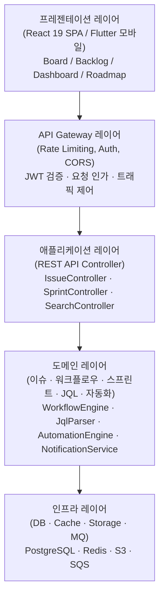
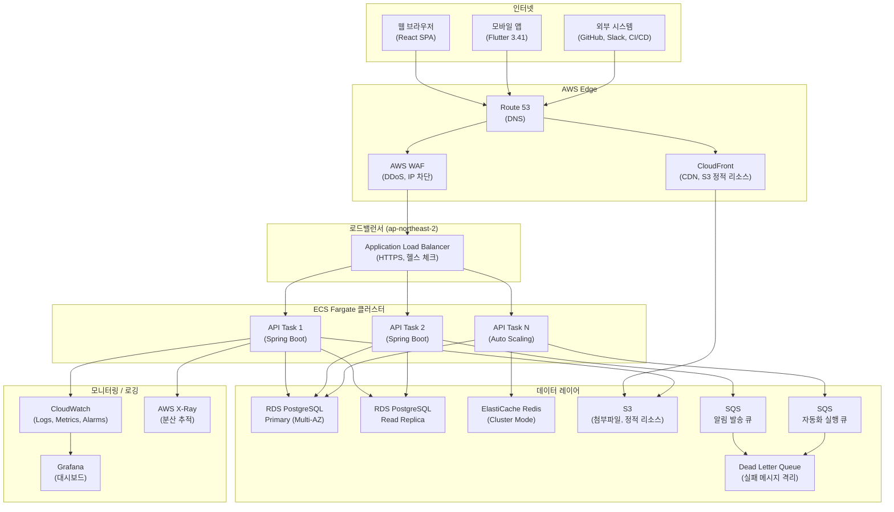
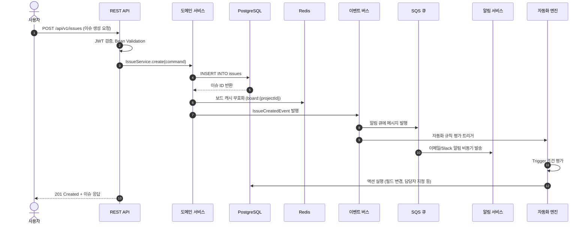
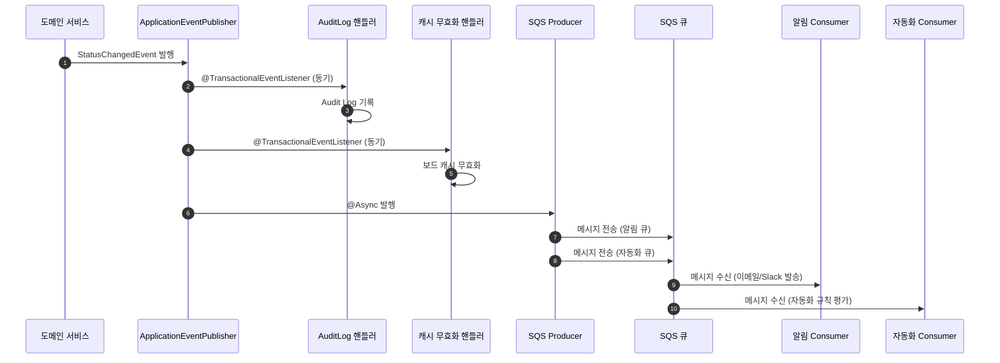
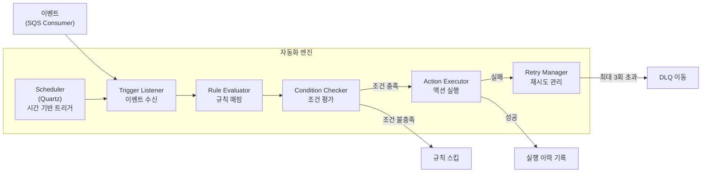
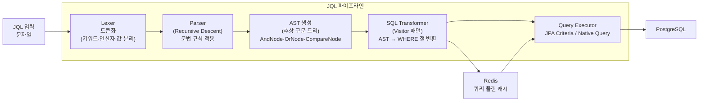
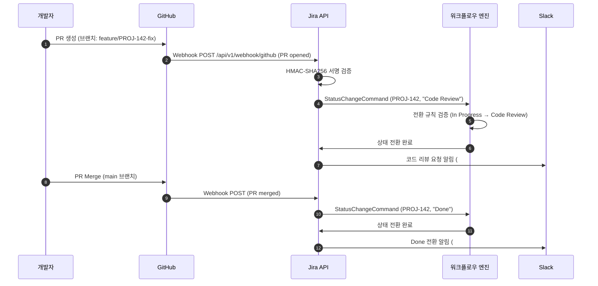
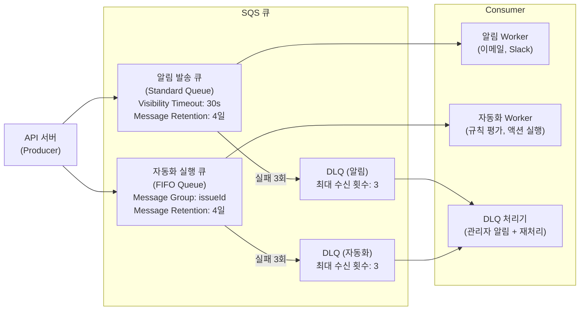
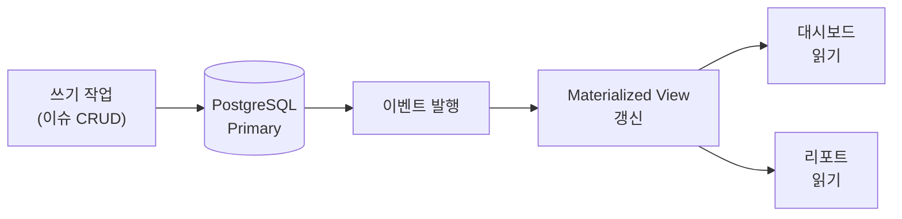

# Jira 프로젝트 관리 시스템 아키텍처 정의서

## 목차

1. [시스템 개요](#1-시스템-개요)
2. [시스템 아키텍처 다중 뷰](#2-시스템-아키텍처-다중-뷰)
3. [기술 스택 상세](#3-기술-스택-상세)
4. [디렉토리 구조](#4-디렉토리-구조)
5. [보안 아키텍처](#5-보안-아키텍처)
6. [이벤트 기반 아키텍처](#6-이벤트-기반-아키텍처)
7. [자동화 엔진 상세](#7-자동화-엔진-상세)
8. [JQL 파서 아키텍처](#8-jql-파서-아키텍처)
9. [캐싱 전략](#9-캐싱-전략)
10. [외부 연동 아키텍처](#10-외부-연동-아키텍처)
11. [확장성 및 장애 대응](#11-확장성-및-장애-대응)
12. [메시지 큐 및 비동기 처리](#12-메시지-큐-및-비동기-처리)
13. [데이터 백업 및 복구](#13-데이터-백업-및-복구)
14. [성능 목표](#14-성능-목표)
15. [변경 이력](#변경-이력)

---

## 1. 시스템 개요

Jira 프로젝트 관리 시스템의 전체 시스템 아키텍처를 정의한다. 이슈 트래킹, 워크플로우 엔진, 스프린트 관리, 대시보드, REST API를 포함하는 통합 협업 플랫폼이다.

기능 정의서(v3.0) 기준으로 정의된 핵심 기능 영역인 이슈 관리, 프로젝트 관리, 워크플로우, JQL 검색, 알림, 외부 연동, 자동화, 권한 구조를 모두 지원하는 아키텍처를 구성한다.

---

## 2. 시스템 아키텍처 다중 뷰

### 2.1 논리 아키텍처 (Layered)

시스템을 관심사 분리(Separation of Concerns) 원칙에 따라 5개 레이어로 구분한다.



| 레이어 | 역할 | 주요 구성 요소 |
|--------|------|---------------|
| 프레젠테이션 | UI 렌더링, 사용자 인터랙션 | React 19, Zustand, Recharts, Tailwind CSS |
| API Gateway | 인증/인가 게이트, Rate Limiting | JWT 검증, Spring Security Filter, ALB |
| 애플리케이션 | HTTP 요청 처리, 입력 검증, 응답 직렬화 | Spring MVC Controller, Bean Validation |
| 도메인 | 비즈니스 규칙 및 핵심 로직 | WorkflowEngine, JqlParser, AutomationEngine |
| 인프라 | 데이터 영속성, 캐시, 파일, 메시지 | PostgreSQL, Redis, S3, SQS |

### 2.2 물리 배포 아키텍처 (AWS)



| AWS 서비스 | 용도 | 구성 |
|-----------|------|------|
| ECS Fargate | Spring Boot API 서버 컨테이너 실행 | Auto Scaling (CPU 70%, MEM 80%) |
| RDS PostgreSQL | 이슈/프로젝트/사용자 데이터 영속성 | Multi-AZ, Read Replica 1개 |
| ElastiCache Redis | 세션, 캐시, WIP 카운트 | Cluster Mode, 3노드 |
| S3 | 첨부파일, 정적 리소스 | 버저닝 활성화 |
| ALB | HTTP/HTTPS 로드밸런싱 | 헬스 체크 /actuator/health |
| SQS | 알림 발송 / 자동화 실행 큐 | 표준 큐 + DLQ |
| CloudWatch | 로그 수집 및 알람 | 로그 그룹: /jira-app/api |
| Grafana | APM 대시보드 | CloudWatch 데이터소스 연결 |
| AWS WAF | DDoS, 악성 요청 차단 | OWASP 룰셋 적용 |
| Route 53 | DNS 관리 | 헬스 체크 기반 페일오버 |

### 2.3 데이터 흐름 아키텍처

이슈 생성부터 알림 발송까지의 전체 데이터 흐름을 정의한다.



---

## 3. 기술 스택 상세

### 3.1 Frontend

| 항목 | 기술 | 선정 사유 |
|------|------|-----------|
| Framework | React 19.2 | 컴포넌트 기반 UI, 대규모 SPA 적합 |
| 상태 관리 | Zustand | 경량, 보드/이슈 상태 관리에 적합 |
| 스타일링 | Tailwind CSS | 유틸리티 기반 빠른 UI 개발 |
| 빌드 도구 | Vite 8.x | 빠른 HMR, 빌드 성능 |
| 차트 | Recharts | 번다운/속도 차트, 대시보드 가젯 |

### 3.2 Mobile

| 항목 | 기술 | 선정 사유 |
|------|------|-----------|
| Framework | Flutter 3.41 | 크로스플랫폼, 단일 코드베이스 iOS/Android |
| 언어 | Dart 3.11 | Null Safety, 패턴 매칭 |
| 상태 관리 | Riverpod | 선언적 상태 관리 |
| HTTP | Dio | REST API 클라이언트 |

### 3.3 Backend

| 항목 | 기술 | 선정 사유 |
|------|------|-----------|
| Framework | Spring Boot 4.0.x | 엔터프라이즈 안정성, 풍부한 생태계 |
| ORM | JPA/Hibernate | 객체-관계 매핑, 쿼리 최적화 |
| 인증 | JWT + Spring Security | 토큰 기반 인증, RBAC 5단계 역할 지원 |
| 검색 | JQL Parser (Custom) | Jira Query Language 지원 |
| 메시징 | Spring Events + SQS | 워크플로우 이벤트, 비동기 알림 처리 |
| 장애 대응 | Resilience4j | Circuit Breaker, Retry, Rate Limiter |
| 커넥션 풀 | HikariCP | 고성능 JDBC 커넥션 풀 |

### 3.4 Infrastructure

| 항목 | 기술 | 선정 사유 |
|------|------|-----------|
| 클라우드 | AWS (ECS, RDS, ElastiCache) | 관리형 서비스, 확장성 |
| 컨테이너 | Docker 29.x + ECS Fargate | 서버리스 컨테이너, 운영 부담 감소 |
| CI/CD | GitHub Actions | 코드와 파이프라인 통합 관리 |
| 모니터링 | Grafana + CloudWatch | 대시보드 가시성, 로그 통합 |
| IaC | Terraform 1.14.x | 인프라 코드 관리, 재현 가능한 환경 |
| Database | PostgreSQL 18 | 안정성, JSONB, 고성능 쿼리 |
| Cache | Redis 8.6 | 고성능 인메모리 캐시, Cluster Mode |

---

## 4. 디렉토리 구조

```
project-root/
├── frontend/               # React 19 웹
│   └── src/
│       ├── components/     # 공통 컴포넌트 (Board, IssueCard 등)
│       ├── pages/          # 페이지 (Dashboard, Backlog, Board 등)
│       ├── stores/         # 상태 관리 (Zustand)
│       └── api/            # API 클라이언트
├── mobile/                 # Flutter 모바일
│   └── lib/
│       ├── features/       # 기능별 모듈 (이슈, 보드, 대시보드 등)
│       ├── shared/         # 공통 위젯 및 유틸리티
│       ├── providers/      # Riverpod 상태 관리
│       └── api/            # Dio 기반 REST API 클라이언트
├── backend/                # Spring Boot 4
│   └── src/main/java/
│       ├── controller/     # REST API 컨트롤러
│       ├── service/        # 비즈니스 로직 (워크플로우, JQL 등)
│       ├── domain/         # 엔티티 (Issue, Sprint, Project 등)
│       ├── repository/     # JPA 리포지토리
│       ├── event/          # 이벤트 정의 및 핸들러
│       ├── automation/     # 자동화 엔진 (RuleEvaluator, ActionExecutor 등)
│       ├── jql/            # JQL 파서 (Lexer, Parser, AST, Transformer)
│       └── config/         # 설정 (Security, Redis, SQS 등)
├── docs/                   # 프로젝트 문서
├── infra/                  # IaC (Terraform)
└── scripts/                # 유틸리티 스크립트
```

---

## 5. 보안 아키텍처

### 5.1 인증 및 인가

| 항목 | 방법 | 비고 |
|------|------|------|
| 인증 | JWT (Bearer Token) | Access Token + Refresh Token |
| 인가 | RBAC (5단계) | Admin/Developer/QA/Reporter/Viewer |
| 이슈 보안 | Security Level | Public/Internal/Confidential |
| 암호화 | bcrypt (rounds=12) | 비밀번호 해싱 |
| 통신 | HTTPS (TLS 1.3) | 필수, HTTP 리디렉션 |
| Audit | Audit Log | 모든 필드 변경, 상태 전환, 권한 변경 추적 |

### 5.2 JWT 토큰 구조

| 토큰 종류 | 유효 기간 | 저장 위치 | 용도 |
|-----------|-----------|-----------|------|
| Access Token | 15분 (900초) | 메모리 (JS 변수) | API 요청 인가 |
| Refresh Token | 1시간 (3600초) | HttpOnly Cookie | Access Token 갱신 |

```
JWT Payload 구조
{
  "sub": "user-uuid",
  "email": "user@company.com",
  "role": "DEVELOPER",
  "projectRoles": { "PROJ-A": "ADMIN", "PROJ-B": "VIEWER" },
  "iat": 1711000000,
  "exp": 1711000900
}
```

### 5.3 Rate Limiting (토큰별 차등)

| 대상 | 제한 | 기준 |
|------|------|------|
| 일반 API (인증 사용자) | 1,000 req/min | 사용자 ID 기준 |
| JQL 검색 API | 100 req/min | 사용자 ID 기준 |
| 외부 API Key (시스템 연동) | 5,000 req/min | API Key 기준 |
| 비인증 요청 | 30 req/min | IP 기준 |

### 5.4 API Key 관리 (외부 시스템용)

- 외부 시스템(GitHub, CI/CD 등) 연동 전용 API Key 발급
- SHA-256 해시 저장, 평문 노출 최초 1회
- 만료일 설정 가능 (최대 1년), 퍼미션 범위 지정 (read / write / admin)
- 키 회전(Rotation) 지원: 신규 발급 후 기존 키 7일 유예 기간

### 5.5 OWASP Top 10 대응 전략

| 취약점 | 대응 방법 |
|--------|-----------|
| A01 접근 제어 실패 | RBAC + 이슈 보안 레벨, 소유권 검증 |
| A02 암호화 실패 | TLS 1.3 강제, bcrypt 비밀번호 해싱 |
| A03 인젝션 (SQL) | JPA Prepared Statement, 파라미터 바인딩 |
| A04 안전하지 않은 설계 | 도메인 레이어 분리, 최소 권한 원칙 |
| A05 보안 설정 오류 | Spring Security 기본 차단, WAF 룰셋 |
| A06 취약한 컴포넌트 | Dependabot 자동 취약점 스캔, SBOM 관리 |
| A07 인증 실패 | JWT 단기 만료, Refresh Token 회전 |
| A08 소프트웨어 무결성 | GitHub Actions OIDC, 이미지 서명 |
| A09 로깅/모니터링 부족 | CloudWatch Logs, Audit Log 전수 기록 |
| A10 SSRF | 외부 URL 허용 목록(Allowlist) 검증 |

### 5.6 입력 검증 및 XSS 방지

- **Bean Validation**: `@NotBlank`, `@Size`, `@Pattern` 애너테이션으로 컨트롤러 계층 검증
- **Content Security Policy**: `default-src 'self'` 헤더 설정, 인라인 스크립트 차단
- **XSS 필터**: 입력 값 HTML 이스케이프 (Jsoup 라이브러리 활용)
- **CORS 정책**: 허용 Origin 명시적 설정 (`ALLOWED_ORIGINS` 환경 변수), `*` 와일드카드 금지

---

## 6. 이벤트 기반 아키텍처

### 6.1 이벤트 타입 정의

| 이벤트 | 발행 시점 | 주요 구독자 |
|--------|-----------|------------|
| `IssueCreated` | 이슈 생성 완료 | 자동화 엔진, 알림 서비스, Audit Log |
| `IssueUpdated` | 이슈 필드 수정 | 자동화 엔진, Audit Log, 캐시 무효화 |
| `StatusChanged` | 워크플로우 상태 전환 | 자동화 엔진, 알림 서비스, 보드 캐시 무효화 |
| `IssueDeleted` | 이슈 삭제 | Audit Log, 캐시 무효화, 관계 이슈 정리 |
| `CommentAdded` | 댓글 등록 | 알림 서비스 (@멘션 처리), Audit Log |
| `CommentUpdated` | 댓글 수정 | Audit Log |
| `CommentDeleted` | 댓글 삭제 | Audit Log (원본 보존) |
| `AssigneeChanged` | 담당자 변경 | 알림 서비스, 자동화 엔진 |
| `PriorityChanged` | 우선순위 변경 | 자동화 엔진, 알림 서비스 |
| `SprintStarted` | 스프린트 시작 | 자동화 엔진, 번다운 차트 초기화 |
| `SprintCompleted` | 스프린트 완료 | 속도 차트 집계, 미완료 이슈 백로그 이동 |
| `IssueLinked` | 이슈 관계 연결 | Audit Log, 의존성 그래프 갱신 |
| `WipLimitExceeded` | WIP 상한 초과 감지 | 알림 서비스 (경고 발송) |
| `AutomationTriggered` | 자동화 규칙 실행 | 자동화 엔진 내부 처리 |
| `ExternalWebhookReceived` | GitHub/CI 웹훅 수신 | 자동화 엔진, 이슈 상태 연동 |

### 6.2 발행/구독 패턴

```
[동기 이벤트] Spring ApplicationEventPublisher
  - 트랜잭션 내 즉시 처리 필요 항목: Audit Log, 캐시 무효화
  - @EventListener (동기), @TransactionalEventListener (커밋 후)

[비동기 이벤트] SQS 메시지 큐
  - 트랜잭션 외부 비동기 처리: 이메일 알림, Slack 알림, 자동화 실행
  - @Async + SQS Producer → SQS Consumer (별도 스레드)
```

### 6.3 이벤트 순서 보장 전략

| 전략 | 적용 대상 | 방법 |
|------|-----------|------|
| 트랜잭션 내 순서 | Audit Log | 동기 @TransactionalEventListener, 트랜잭션 커밋 후 처리 |
| 메시지 순서 | SQS FIFO 큐 | 이슈 ID를 MessageGroupId로 사용 |
| 중복 방지 | SQS | MessageDeduplicationId = 이벤트 UUID |
| 낙관적 락 | 동시 수정 충돌 | JPA @Version 필드로 충돌 감지 및 재시도 |

### 6.4 이벤트 발행-구독 흐름



---

## 7. 자동화 엔진 상세

### 7.1 내부 구조

자동화 엔진은 Trigger → Condition → Action 파이프라인으로 동작한다.



### 7.2 Trigger 타입

| 트리거 타입 | 설명 | 이벤트 소스 |
|------------|------|------------|
| `ISSUE_CREATED` | 이슈 생성 시 | IssueCreatedEvent |
| `STATUS_CHANGED` | 상태 전환 시 (특정 상태 지정 가능) | StatusChangedEvent |
| `ASSIGNEE_CHANGED` | 담당자 변경 시 | AssigneeChangedEvent |
| `PRIORITY_CHANGED` | 우선순위 변경 시 | PriorityChangedEvent |
| `COMMENT_ADDED` | 댓글 등록 시 | CommentAddedEvent |
| `SPRINT_STARTED` | 스프린트 시작 시 | SprintStartedEvent |
| `SPRINT_COMPLETED` | 스프린트 완료 시 | SprintCompletedEvent |
| `SCHEDULED` | 특정 시간/주기 (Cron 표현식) | Quartz Scheduler |
| `WIP_EXCEEDED` | WIP 제한 초과 시 | WipLimitExceededEvent |
| `EXTERNAL_WEBHOOK` | GitHub/CI 웹훅 수신 시 | ExternalWebhookReceived |

### 7.3 Condition 타입

| 조건 타입 | 예시 |
|-----------|------|
| `ISSUE_TYPE` | issuetype = "Bug" |
| `STATUS` | status IN ("Code Review", "QA") |
| `ASSIGNEE` | assignee = currentUser() |
| `PRIORITY` | priority >= "High" |
| `LABEL` | label = "urgent" |
| `PROJECT` | project = "PROJ-A" |
| `CUSTOM_FIELD` | customField["SP"] >= 8 |
| `JQL_EXPRESSION` | 임의의 JQL 표현식 |

### 7.4 Action 타입

| 액션 타입 | 설명 |
|-----------|------|
| `SEND_SLACK` | 지정 Slack 채널에 메시지 전송 |
| `SEND_EMAIL` | 지정 이메일 주소로 알림 발송 |
| `UPDATE_FIELD` | 이슈 필드 값 변경 (우선순위, 레이블 등) |
| `ASSIGN_USER` | 담당자 지정 (라운드로빈, 특정 사용자) |
| `ADD_COMMENT` | 이슈에 자동 댓글 추가 |
| `TRANSITION_STATUS` | 이슈 상태 전환 |
| `CREATE_SUBTASK` | 서브태스크 자동 생성 |
| `ADD_LABEL` | 레이블 추가 |
| `SET_FIX_VERSION` | Fix Version 지정 |
| `CALL_WEBHOOK` | 외부 시스템 웹훅 호출 |

### 7.5 재시도 전략

| 항목 | 설정 |
|------|------|
| 최대 재시도 횟수 | 3회 |
| 재시도 방식 | 지수 백오프 (Exponential Backoff) |
| 초기 대기 시간 | 1초 |
| 배수 | 2배 (1s → 2s → 4s) |
| 최대 대기 시간 | 30초 |
| 최종 실패 처리 | Dead Letter Queue 이동 + 관리자 알림 |

---

## 8. JQL 파서 아키텍처

### 8.1 파이프라인 구조

JQL 입력을 SQL 쿼리로 변환하는 5단계 파이프라인을 정의한다.



### 8.2 지원 연산자 및 함수

**비교 연산자**

| 연산자 | 설명 | 예시 |
|--------|------|------|
| `=` | 동일 | `status = "In Progress"` |
| `!=` | 불일치 | `assignee != currentUser()` |
| `>`, `>=`, `<`, `<=` | 수치/날짜 범위 | `created >= -7d` |
| `IN` | 목록 포함 | `status IN ("QA", "Done")` |
| `NOT IN` | 목록 미포함 | `priority NOT IN ("Low", "Lowest")` |
| `~` | 텍스트 포함 (LIKE) | `summary ~ "로그인"` |
| `!~` | 텍스트 미포함 | `summary !~ "삭제"` |
| `IS EMPTY` | 값 없음 | `assignee IS EMPTY` |
| `IS NOT EMPTY` | 값 있음 | `fixVersion IS NOT EMPTY` |
| `WAS` | 이력 기반 조회 | `status WAS "In Progress"` |

**내장 함수**

| 함수 | 설명 |
|------|------|
| `currentUser()` | 현재 로그인 사용자 |
| `membersOf("group")` | 특정 그룹의 멤버 |
| `startOfWeek()` | 이번 주 시작 일시 |
| `endOfWeek()` | 이번 주 종료 일시 |
| `startOfMonth()` | 이번 달 시작 일시 |
| `endOfMonth()` | 이번 달 종료 일시 |
| `startOfYear()` | 올해 시작 일시 |
| `now()` | 현재 일시 |
| `releasedVersions("proj")` | 릴리즈된 버전 목록 |
| `unreleasedVersions("proj")` | 미릴리즈 버전 목록 |

### 8.3 쿼리 플랜 캐싱

| 항목 | 설정 |
|------|------|
| 캐시 저장소 | Redis |
| 캐시 키 | `jql:plan:{SHA256(jql_string)}` |
| TTL | 10분 |
| 무효화 조건 | 이슈 생성/수정/삭제 시 관련 프로젝트 캐시 무효화 |
| 캐시 대상 | 파싱된 AST + 변환된 SQL 템플릿 (바인딩 파라미터 제외) |

---

## 9. 캐싱 전략

### 9.1 캐시 대상 및 정책

| 캐시 대상 | 키 패턴 | TTL | 무효화 전략 |
|-----------|---------|-----|------------|
| 보드 상태 (컬럼별 이슈 목록) | `board:{projectId}:{sprintId}` | 5분 | 이슈 상태 변경, 이슈 생성/삭제 시 즉시 삭제 |
| 사용자 세션 | `session:{userId}` | 30분 | 로그아웃, 권한 변경 시 즉시 삭제 |
| JQL 검색 결과 | `jql:result:{SHA256(jql+params)}` | 2분 | 관련 이슈 변경 이벤트 수신 시 삭제 |
| JQL 쿼리 플랜 | `jql:plan:{SHA256(jql)}` | 10분 | 스키마 변경 시 전체 삭제 |
| WIP 카운트 | `wip:{boardId}:{columnStatus}` | 실시간 | 이슈 상태 전환 시 즉시 갱신 |
| 대시보드 가젯 데이터 | `gadget:{gadgetId}:{userId}` | 5분 | 수동 새로고침, 스프린트 이벤트 시 삭제 |
| 사용자 프로필 | `user:{userId}:profile` | 1시간 | 프로필 수정 시 즉시 삭제 |
| 프로젝트 설정 | `project:{projectId}:config` | 1시간 | 프로젝트 설정 변경 시 즉시 삭제 |
| 권한 정보 | `auth:{userId}:{projectId}:roles` | 10분 | 권한 변경 시 즉시 삭제 |

### 9.2 캐싱 계층 구조

```
1차 캐시: 애플리케이션 로컬 캐시 (Caffeine, 1분 TTL, 최대 1,000개)
  - 동일 서버 인스턴스 내 반복 요청 최적화
  - 사용자 프로필, 프로젝트 설정 등 자주 읽히는 소형 데이터

2차 캐시: Redis ElastiCache (Cluster Mode)
  - 모든 서버 인스턴스 공유 캐시
  - 보드 상태, 세션, JQL 결과 등 공유 필요 데이터
```

### 9.3 캐시 무효화 패턴

- **이벤트 기반 무효화**: 도메인 이벤트 핸들러에서 관련 캐시 키 즉시 삭제
- **TTL 기반 만료**: 이벤트 누락 방지를 위한 최대 TTL 설정
- **일괄 무효화**: 스프린트 시작/완료 시 해당 프로젝트 전체 보드 캐시 삭제
- **패턴 삭제**: Redis `SCAN` + `DEL` 패턴 삭제 (프로젝트 단위 무효화)

---

## 10. 외부 연동 아키텍처

### 10.1 GitHub 연동

| 연동 항목 | 방법 | 처리 방식 |
|-----------|------|-----------|
| 인증 | OAuth App | Authorization Code Flow |
| 웹훅 수신 | GitHub Webhook → `/api/v1/webhook/github` | HMAC-SHA256 서명 검증 |
| PR 이벤트 | opened/merged/closed 이벤트 | 이슈 상태 자동 전환 |
| 커밋 이벤트 | push 이벤트 | Smart Commit 파싱 |
| 브랜치 연결 | 브랜치명에 이슈 키 포함 | `feature/PROJ-142-login-fix` 형식 감지 |
| CI 상태 콜백 | GitHub Actions Status API | 이슈에 빌드 상태 배지 표시 |

**Smart Commit 파싱 규칙**

```
커밋 메시지 형식: PROJ-142 #transition Done #comment 로그인 버그 수정 완료

파싱 결과:
  - 이슈 키: PROJ-142
  - 액션: #transition → 상태를 "Done"으로 전환
  - 댓글: #comment → "로그인 버그 수정 완료" 댓글 자동 추가
```

### 10.2 Slack 연동

| 연동 항목 | 방법 |
|-----------|------|
| 인증 | Slack Bot Token (OAuth 2.0) |
| 알림 발송 | Incoming Webhook URL |
| 채널 라우팅 | 프로젝트별 Slack 채널 매핑 테이블 |
| 알림 유형 | 이슈 상태 변경, WIP 초과, 스프린트 시작/완료, @멘션 |

**채널별 알림 라우팅 테이블**

| 알림 유형 | 라우팅 기준 | 예시 채널 |
|-----------|------------|----------|
| 이슈 상태 변경 | 프로젝트 ID | `#proj-a-alerts` |
| WIP 초과 경고 | 보드 ID | `#kanban-warnings` |
| 코드 리뷰 요청 | 팀 채널 | `#code-review` |
| 스프린트 이벤트 | 프로젝트 ID | `#sprint-updates` |
| 시스템 알림 | 전역 | `#jira-system` |

### 10.3 CI/CD 연동 (GitHub Actions)

GitHub PR → Jira 이슈 상태 자동 전환 시퀀스:



---

## 11. 확장성 및 장애 대응

### 11.1 수평 확장 전략

| 구성 요소 | 확장 방식 | 트리거 조건 |
|----------|-----------|------------|
| ECS Fargate (API) | Auto Scaling (수평 확장) | CPU 70% 또는 MEM 80% 초과 시 |
| ECS 최소/최대 태스크 | Min: 2, Max: 20 | 스케일아웃 쿨다운: 60초 |
| RDS PostgreSQL | Read Replica 추가 | 읽기 부하 증가 시 |
| ElastiCache Redis | Cluster Mode (샤딩) | 메모리 70% 초과 시 샤드 추가 |

### 11.2 데이터베이스 고가용성

| 항목 | 구성 |
|------|------|
| RDS 배포 | Multi-AZ (Primary + Standby 자동 페일오버) |
| Read Replica | 1개 (읽기 전용 쿼리 분산) |
| 커넥션 풀 | HikariCP (최대 20, 최소 5, 대기 타임아웃 30초) |
| 슬로우 쿼리 임계값 | 1,000ms 초과 시 CloudWatch 경보 |
| 인덱스 전략 | 이슈 키, 상태, 담당자, 프로젝트ID, 생성일 복합 인덱스 |

### 11.3 Circuit Breaker (Resilience4j)

외부 시스템 연동 실패 시 빠른 장애 격리를 위해 Circuit Breaker를 적용한다.

| 대상 서비스 | 실패율 임계값 | Open 유지 시간 | Half-Open 요청 수 |
|------------|-------------|--------------|-----------------|
| Slack API | 50% (10회 중) | 30초 | 3회 |
| GitHub API | 50% (10회 중) | 30초 | 3회 |
| 이메일 서비스 | 60% (10회 중) | 60초 | 5회 |
| 외부 웹훅 | 70% (10회 중) | 60초 | 3회 |

### 11.4 헬스 체크 및 Graceful Shutdown

**헬스 체크 엔드포인트**

| 엔드포인트 | 용도 | 확인 항목 |
|-----------|------|-----------|
| `GET /actuator/health` | ALB 헬스 체크 | DB, Redis, SQS 연결 상태 |
| `GET /actuator/health/liveness` | K8s/ECS Liveness Probe | 애플리케이션 생존 여부 |
| `GET /actuator/health/readiness` | K8s/ECS Readiness Probe | 요청 처리 준비 완료 여부 |

**Graceful Shutdown 처리**

```
1. ECS 태스크 종료 신호(SIGTERM) 수신
2. ALB에서 해당 태스크 제거 (30초 Deregistration Delay)
3. 신규 요청 수신 중단
4. 진행 중인 요청 최대 30초 대기 후 완료
5. SQS 메시지 처리 완료 후 종료
6. DB 커넥션 풀 반납
7. 프로세스 종료
```

---

## 12. 메시지 큐 및 비동기 처리

### 12.1 SQS 큐 구성



### 12.2 큐 설정 상세

| 큐 | 타입 | Visibility Timeout | 보존 기간 | DLQ 최대 수신 |
|----|------|-------------------|----------|--------------|
| 알림 발송 큐 | Standard | 30초 | 4일 | 3회 |
| 자동화 실행 큐 | FIFO | 60초 | 4일 | 3회 |
| DLQ (알림) | Standard | 30초 | 14일 | - |
| DLQ (자동화) | FIFO | 60초 | 14일 | - |

### 12.3 메시지 처리 보장

- **At-Least-Once**: SQS 기본 보장. 멱등 처리(Idempotency)를 Consumer에서 구현
- **중복 감지**: 메시지 ID를 Redis에 단기 저장(5분)하여 중복 처리 방지
- **순서 보장**: 자동화 큐는 FIFO, 이슈 ID를 MessageGroupId로 사용
- **대용량 처리**: 알림 Consumer 배치 처리 (최대 10개 메시지 일괄 수신)

---

## 13. 데이터 백업 및 복구

### 13.1 RDS 백업 정책

| 항목 | 설정 |
|------|------|
| 자동 백업 활성화 | 활성화 |
| 백업 보존 기간 | 35일 |
| 백업 윈도우 | 매일 03:00~04:00 KST (트래픽 최저 시간대) |
| Point-in-Time Recovery (PITR) | 지원 (5분 단위 복원 가능) |
| 스냅샷 내보내기 | S3로 월 1회 장기 보관 스냅샷 내보내기 |

### 13.2 S3 첨부파일 백업

| 항목 | 설정 |
|------|------|
| 버저닝 | 활성화 (모든 버킷) |
| MFA 삭제 | 활성화 (실수 삭제 방지) |
| 수명 주기 | 현재 버전: 무기한 / 이전 버전: 90일 후 Glacier 이동 |
| 크로스 리전 복제 | 활성화 (ap-northeast-1 → us-east-1) |

### 13.3 복구 목표

| 지표 | 목표 | 방법 |
|------|------|------|
| RPO (Recovery Point Objective) | < 1시간 | RDS PITR (5분 단위 복원 가능) |
| RTO (Recovery Time Objective) | < 4시간 | RDS 스냅샷 복원 + ECS 태스크 재배포 |
| 데이터 내구성 | 99.999999999% (11 nines) | RDS Multi-AZ + S3 복제 |

### 13.4 복구 시나리오

| 장애 유형 | 복구 방법 | 예상 소요 시간 |
|-----------|-----------|--------------|
| DB 인스턴스 장애 | RDS Multi-AZ 자동 페일오버 | 1~2분 |
| 데이터 논리 삭제 (실수) | PITR로 특정 시점 복원 | 30분~1시간 |
| 전체 리전 장애 | S3 크로스 리전 복제 데이터 + Terraform 재배포 | 2~4시간 |
| 첨부파일 실수 삭제 | S3 버저닝으로 이전 버전 복원 | 5분 |

---

## 14. 성능 목표

| 지표 | 목표치 | 측정 방법 |
|------|--------|-----------|
| API 응답 시간 (P95) | < 200ms | APM (Grafana) |
| JQL 검색 응답 | < 500ms | 쿼리 로그 |
| 동시 접속자 | 500명 | 부하 테스트 (k6) |
| 가용성 | 99.9% | CloudWatch |
| 보드 렌더링 | < 1초 | Lighthouse |
| SQS 알림 발송 지연 | < 5초 | CloudWatch SQS 메트릭 |
| 자동화 실행 지연 | < 10초 | Grafana 자동화 지연 대시보드 |

---

## 14. CQRS (Command Query Responsibility Segregation) 검토

### 14.1 적용 배경

대시보드 가젯(집계 쿼리)과 이슈 CRUD(트랜잭션)는 성격이 다름.
- 쓰기 모델: 이슈 생성/수정/전환 → 트랜잭션 일관성 중심
- 읽기 모델: 번다운 차트, 속도 차트, CFD, 대시보드 → 집계/분석 중심

### 14.2 적용 범위

| 영역 | 패턴 | 근거 |
|------|------|------|
| 이슈 CRUD | 단일 모델 (기존 유지) | 복잡도 낮음, CRUD 중심 |
| JQL 검색 | 읽기 최적화 | Full-Text Search + 캐싱 |
| 대시보드/리포트 | Materialized View | 집계 쿼리 성능 최적화 |
| Audit Log | Event Sourcing 유사 | 이벤트 기반 변경 이력 |

### 14.3 Materialized View 전략



Materialized View 목록:

| View | 갱신 주기 | 용도 |
|------|----------|------|
| mv_sprint_burndown | 이슈 상태 변경 시 | 번다운 차트 |
| mv_team_velocity | 스프린트 완료 시 | 속도 차트 |
| mv_cumulative_flow | 매 시간 | CFD |
| mv_cycle_time | 이슈 Done 전환 시 | 사이클 타임 |
| mv_issue_type_distribution | 이슈 생성/삭제 시 | 파이 차트 |

### 14.4 향후 확장 고려

- 읽기 트래픽 증가 시: RDS Read Replica를 읽기 전용 엔드포인트로 분리
- 실시간 분석 필요 시: Redis Sorted Set으로 실시간 리더보드
- 대규모 이벤트 스트리밍: Kafka 도입 검토 (현 SQS에서 전환)

---

## 15. API Gateway 레이어

### 15.1 구성

| 기능 | 구현 | 비고 |
|------|------|------|
| Rate Limiting | AWS WAF + Custom Header | 토큰별 차등 |
| API Key 관리 | API Gateway Usage Plan | 외부 시스템용 |
| 요청 로깅 | CloudWatch Access Log | 전체 요청 추적 |
| API 버전 라우팅 | Path-based (/v3/, /v4/) | 하위 호환 |
| CORS | ALB Response Header | 허용 도메인 화이트리스트 |
| Request Validation | JSON Schema | 공통 입력 검증 |

### 15.2 Request/Response 변환

- Request ID 주입: X-Request-Id 헤더 (UUID v4)
- 응답 압축: gzip (Content-Encoding)
- 응답 시간 헤더: X-Response-Time

**요청 헤더 예시**:
```
X-Request-Id: 550e8400-e29b-41d4-a716-446655440000
X-Response-Time: 42ms
Content-Encoding: gzip
```

**API 버전 라우팅 구성**:
```
/rest/api/3/  → API v3 서비스 (현재)
/rest/api/4/  → API v4 서비스 (신규, 하위 호환 유지)
/rest/agile/1.0/ → Agile API (별도 유지)
```

---

## 변경 이력

| 버전 | 날짜 | 작성자 | 변경 내용 |
|------|------|--------|-----------|
| v1.0 | 2026-03-21 | 팀 | 최초 작성 |
| v2.0 | 2026-03-21 | 팀 | 이벤트 아키텍처, 자동화 엔진, JQL 파서, 캐싱 전략, 외부 연동, 보안 상세, 확장성/장애 대응, 메시지 큐, 백업/복구 추가 |
| v3.0 | 2026-03-21 | 팀 | CQRS 패턴 검토, Materialized View, API Gateway 상세 추가 |
| v3.1 | 2026-03-21 | 팀 | 기술 스택 버전 업데이트 (React 19.2, Spring Boot 4.0.x, PostgreSQL 18, Redis 8.6, Vite 8.x, Docker 29.x, Terraform 1.14.x), Flutter 3.41 / Dart 3.11 Mobile 섹션 신규 추가, 디렉토리 구조에 mobile/ 추가 |
