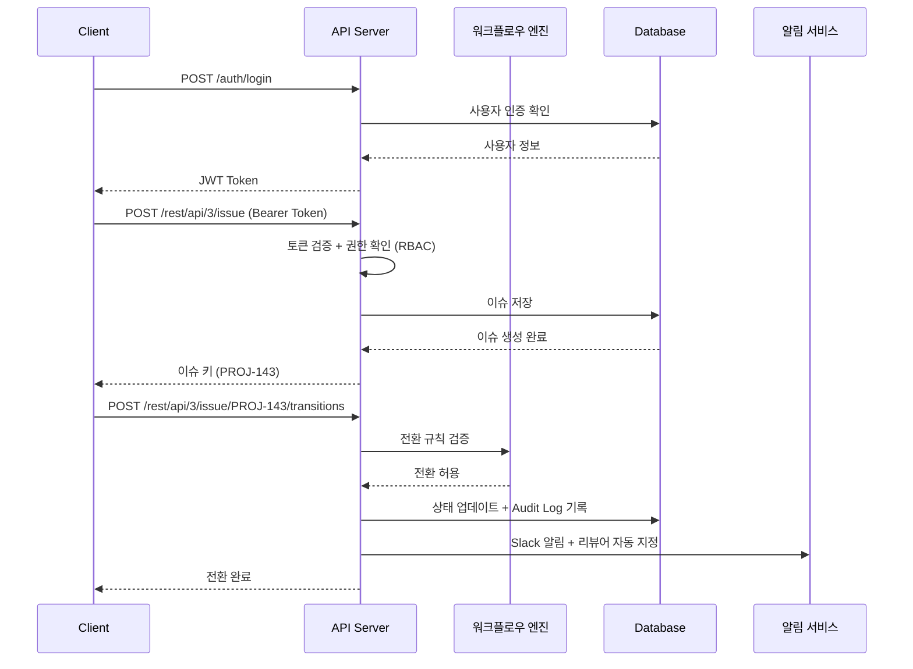
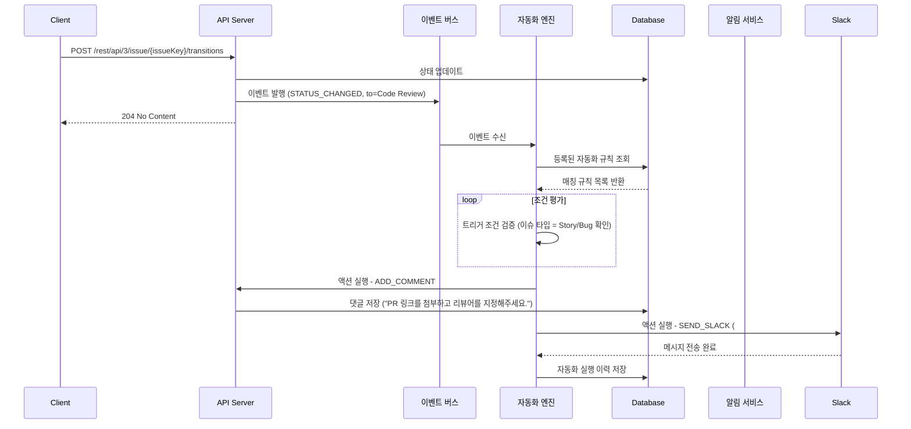
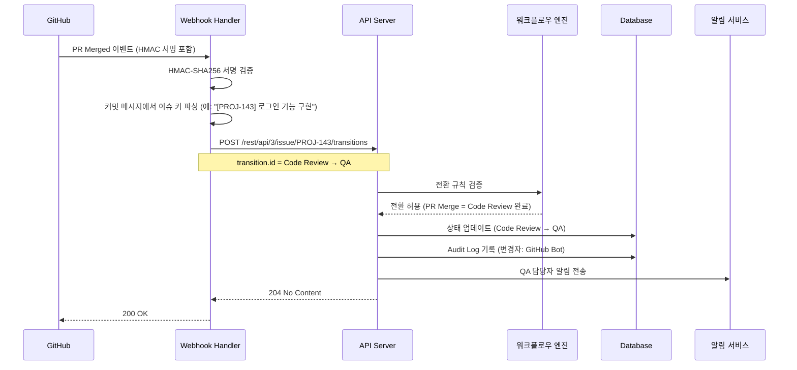

# Jira 프로젝트 관리 시스템 API 정의서

## 목차

1. [API 개요](#1-api-개요)
2. [공통 사항](#2-공통-사항)
3. [API 엔드포인트](#3-api-엔드포인트)
   - [3.1 인증 (Auth)](#31-인증-auth)
   - [3.2 이슈 (Issue)](#32-이슈-issue)
   - [3.3 검색 (Search)](#33-검색-search)
   - [3.4 상태 전환 (Transition)](#34-상태-전환-transition)
   - [3.5 스프린트 (Sprint)](#35-스프린트-sprint)
   - [3.6 버전/릴리즈 (Version)](#36-버전릴리즈-version)
   - [3.7 사용자 (User)](#37-사용자-user)
   - [3.8 프로젝트 (Project)](#38-프로젝트-project)
   - [3.9 댓글 (Comment)](#39-댓글-comment)
   - [3.10 첨부파일 (Attachment)](#310-첨부파일-attachment)
   - [3.11 워치 (Watch)](#311-워치-watch)
   - [3.12 이슈 링크 (Issue Link)](#312-이슈-링크-issue-link)
   - [3.13 보드 (Board)](#313-보드-board)
   - [3.14 레이블 & 컴포넌트](#314-레이블--컴포넌트)
   - [3.15 대시보드 (Dashboard)](#315-대시보드-dashboard)
   - [3.16 자동화 (Automation)](#316-자동화-automation)
   - [3.17 Audit Log](#317-audit-log)
   - [3.18 프로젝트 멤버 (Project Member)](#318-프로젝트-멤버-project-member)
4. [API 흐름도](#4-api-흐름도)
5. [Webhook 이벤트](#5-webhook-이벤트)
6. [변경 이력](#6-변경-이력)

---

## 1. API 개요

| 항목 | 내용 |
|------|------|
| Base URL | `https://api.jira-pm.example.com/rest/api/3` |
| Agile URL | `https://api.jira-pm.example.com/rest/agile/1.0` |
| 인증 방식 | Bearer Token (JWT) |
| Content-Type | application/json |
| 문자 인코딩 | UTF-8 |

### 1.1 API 버전 관리 전략

API 버전은 URL 경로 방식으로 관리합니다.

```
https://api.jira-pm.example.com/rest/api/3/...
https://api.jira-pm.example.com/rest/agile/1.0/...
```

**Deprecation 정책**:
- 신규 버전 출시 후 구 버전은 최소 **6개월** 지원 유지
- Deprecation 예고는 Response Header에 포함: `Deprecation: true`, `Sunset: <날짜>`
- 구 버전 종료 30일 전 이메일 및 API 응답 경고 메시지 발송
- Breaking Change는 메이저 버전 업(예: `/api/3` → `/api/4`) 시에만 허용

---

## 2. 공통 사항

### 2.1 공통 응답 포맷

**성공 응답**:
```json
{
  "success": true,
  "data": { },
  "message": "요청이 성공적으로 처리되었습니다."
}
```

**에러 응답**:
```json
{
  "success": false,
  "error": {
    "code": "ERROR_CODE",
    "message": "에러 메시지"
  }
}
```

### 2.2 공통 에러 코드

| 코드 | HTTP Status | 설명 |
|------|-------------|------|
| UNAUTHORIZED | 401 | 인증 실패 (토큰 만료/미제공) |
| FORBIDDEN | 403 | 권한 없음 (역할 기반 접근 제어) |
| NOT_FOUND | 404 | 리소스 없음 |
| VALIDATION_ERROR | 422 | 입력값 검증 실패 |
| INTERNAL_ERROR | 500 | 서버 내부 오류 |
| WORKFLOW_VIOLATION | 409 | 허용되지 않는 상태 전환 |
| WIP_LIMIT_EXCEEDED | 409 | WIP 제한 초과 |
| ISSUE_NOT_IN_SPRINT | 400 | 스프린트 미배정 이슈 |
| DUPLICATE_ISSUE_KEY | 409 | 이슈 키 중복 |
| PERMISSION_DENIED | 403 | 역할 기반 권한 부족 |
| ACCOUNT_LOCKED | 423 | 계정 잠금 (로그인 5회 연속 실패) |
| VERSION_CONFLICT | 409 | 동시 편집 충돌 (낙관적 락 위반) |

### 2.3 페이지네이션

```json
{
  "data": [],
  "pagination": {
    "page": 1,
    "size": 20,
    "totalElements": 100,
    "totalPages": 5
  }
}
```

### 2.4 Rate Limiting

| 엔드포인트 그룹 | Rate Limit | 비고 |
|----------------|-----------|------|
| 검색 (`/rest/api/3/search`) | 100 req/min | JQL 복잡도에 따라 추가 제한 가능 |
| 이슈 CRUD (`/rest/api/3/issue`) | 300 req/min | 생성/수정/삭제 합산 |
| 상태 전환 (`/transitions`) | 200 req/min | |
| 첨부파일 업로드 (`/attachments`) | 30 req/min | 파일 크기 최대 10MB |
| 인증 (`/auth/login`) | 10 req/min | IP 기준, 초과 시 ACCOUNT_LOCKED 위험 |
| Agile API (`/rest/agile/1.0`) | 200 req/min | |
| 기타 조회 API | 500 req/min | |

Rate Limit 초과 시 응답:
- HTTP Status: `429 Too Many Requests`
- Header: `Retry-After: <초>`, `X-RateLimit-Limit: <한도>`, `X-RateLimit-Remaining: <잔여>`

---

## 3. API 엔드포인트

---

### 3.1 인증 (Auth)

#### POST /auth/login - 로그인

| 항목 | 내용 |
|------|------|
| Method | POST |
| URL | /auth/login |
| 인증 | 불필요 |

**Request Body**:
| 필드 | 타입 | 필수 | 설명 |
|------|------|------|------|
| email | string | Y | 이메일 |
| password | string | Y | 비밀번호 |

**Request 예시**:
```json
{
  "email": "kim.developer@company.com",
  "password": "P@ssw0rd!"
}
```

**Response (200)**:
| 필드 | 타입 | 설명 |
|------|------|------|
| accessToken | string | 액세스 토큰 (JWT, 유효기간 15분) |
| refreshToken | string | 리프레시 토큰 (유효기간 1시간) |
| expiresIn | number | 액세스 토큰 만료 시간 (초, 900) |
| refreshExpiresIn | number | 리프레시 토큰 만료 시간 (초, 3600) |

**Response 예시**:
```json
{
  "success": true,
  "data": {
    "accessToken": "eyJhbG...",
    "refreshToken": "dGhpcy...",
    "expiresIn": 900,
    "refreshExpiresIn": 3600
  },
  "message": "로그인에 성공했습니다."
}
```

**에러**:
| 에러 코드 | HTTP Status | 설명 |
|-----------|-------------|------|
| UNAUTHORIZED | 401 | 이메일 또는 비밀번호 불일치 |
| ACCOUNT_LOCKED | 423 | 5회 연속 로그인 실패로 계정 잠금 |

---

#### POST /auth/refresh - 토큰 갱신

| 항목 | 내용 |
|------|------|
| Method | POST |
| URL | /auth/refresh |
| 인증 | 불필요 (refreshToken 사용) |

**Request Body**:
| 필드 | 타입 | 필수 | 설명 |
|------|------|------|------|
| refreshToken | string | Y | 리프레시 토큰 |

**Response (200)**:
```json
{
  "success": true,
  "data": {
    "accessToken": "eyJhbGciOiJIUzI1NiIsInR5cCI6IkpXVCJ9...",
    "expiresIn": 900
  }
}
```

---

#### POST /auth/logout - 로그아웃

| 항목 | 내용 |
|------|------|
| Method | POST |
| URL | /auth/logout |
| 인증 | 필요 |

**Response (204)**: No Content

---

### 3.2 이슈 (Issue)

#### POST /rest/api/3/issue - 이슈 생성

| 항목 | 내용 |
|------|------|
| Method | POST |
| URL | /rest/api/3/issue |
| 인증 | 필요 (DEVELOPER 이상) |

**Request Body**:
| 필드 | 타입 | 필수 | 설명 |
|------|------|------|------|
| project.key | string | Y | 프로젝트 키 (예: PROJ) |
| summary | string | Y | 이슈 제목 ([모듈] 기능 요약 형식) |
| issuetype.name | string | Y | 이슈 타입 (Epic/Story/Task/Bug/Sub-task) |
| description | string | N | 이슈 상세 설명 |
| assignee.accountId | string | N | 담당자 ID |
| reporter.accountId | string | N | 보고자 ID (미입력 시 요청자 자동 지정) |
| priority.name | string | N | 우선순위 (Highest/High/Medium/Low/Lowest) |
| story_points | number | N | 스토리 포인트 (피보나치: 1,2,3,5,8,13) |
| fixVersions[].name | string | N | 릴리즈 버전 |
| parent.key | string | N | 상위 이슈 키 (Sub-task의 경우 필수) |
| labels | string[] | N | 레이블 목록 |
| components[].name | string[] | N | 컴포넌트 목록 |
| duedate | string | N | 마감일 (ISO 8601, 예: 2026-04-30) |
| securityLevel | string | N | 보안 레벨 (Public/Internal/Confidential) |

**Request 예시**:
```json
{
  "fields": {
    "project": { "key": "PROJ" },
    "summary": "[회원] 로그인 실패 메시지 개선",
    "issuetype": { "name": "Story" },
    "description": "현재 로그인 실패 시 표시되는 오류 메시지를 사용자 친화적으로 개선합니다.",
    "assignee": { "accountId": "user-account-id-123" },
    "priority": { "name": "High" },
    "story_points": 3,
    "fixVersions": [{ "name": "v1.0.0" }],
    "labels": ["login", "ux"],
    "components": [{ "name": "Auth Module" }]
  }
}
```

**Response (201)**:
| 필드 | 타입 | 설명 |
|------|------|------|
| id | string | 이슈 내부 ID |
| key | string | 이슈 키 (예: PROJ-143) |
| self | string | 이슈 리소스 URL |

**Response 예시**:
```json
{
  "success": true,
  "data": {
    "id": "10143",
    "key": "PROJ-143",
    "self": "https://api.jira-pm.example.com/rest/api/3/issue/PROJ-143"
  },
  "message": "이슈가 생성되었습니다."
}
```

---

#### GET /rest/api/3/issue/{issueKey} - 이슈 단건 조회

| 항목 | 내용 |
|------|------|
| Method | GET |
| URL | /rest/api/3/issue/{issueKey} |
| 인증 | 필요 (보안 레벨에 따라 역할 제한) |

**Path Parameters**:
| 파라미터 | 타입 | 필수 | 설명 |
|----------|------|------|------|
| issueKey | string | Y | 이슈 키 (예: PROJ-143) |

**Query Parameters**:
| 파라미터 | 타입 | 필수 | 설명 |
|----------|------|------|------|
| fields | string | N | 반환할 필드 목록 (콤마 구분, 미입력 시 전체) |
| expand | string | N | 확장 필드 (changelog, renderedFields, names) |

**Response (200)**:
| 필드 | 타입 | 설명 |
|------|------|------|
| id | string | 이슈 내부 ID |
| key | string | 이슈 키 |
| self | string | 이슈 리소스 URL |
| fields.summary | string | 이슈 제목 |
| fields.issuetype.name | string | 이슈 타입 |
| fields.issuetype.iconUrl | string | 이슈 타입 아이콘 URL |
| fields.status.name | string | 현재 상태 |
| fields.status.statusCategory.name | string | 상태 카테고리 (To Do/In Progress/Done) |
| fields.priority.name | string | 우선순위 |
| fields.assignee.accountId | string | 담당자 ID |
| fields.assignee.displayName | string | 담당자 이름 |
| fields.assignee.emailAddress | string | 담당자 이메일 |
| fields.reporter.accountId | string | 보고자 ID |
| fields.reporter.displayName | string | 보고자 이름 |
| fields.description | string | 이슈 설명 |
| fields.story_points | number | 스토리 포인트 |
| fields.fixVersions[] | array | 릴리즈 버전 목록 |
| fields.components[] | array | 컴포넌트 목록 |
| fields.labels[] | array | 레이블 목록 |
| fields.parent.key | string | 상위 이슈 키 (Sub-task인 경우) |
| fields.subtasks[] | array | 하위 이슈 목록 |
| fields.issuelinks[] | array | 연결된 이슈 목록 |
| fields.comment.comments[] | array | 댓글 목록 |
| fields.attachment[] | array | 첨부파일 목록 |
| fields.watchers.watchCount | number | 워치 수 |
| fields.created | string | 생성 일시 (ISO 8601) |
| fields.updated | string | 최종 수정 일시 (ISO 8601) |
| fields.duedate | string | 마감일 |
| fields.resolutiondate | string | 해결 일시 |
| fields.securityLevel.name | string | 보안 레벨 |
| changelog | object | 변경 이력 (expand=changelog 시) |

**Response 예시**:
```json
{
  "success": true,
  "data": {
    "id": "10143",
    "key": "PROJ-143",
    "self": "https://api.jira-pm.example.com/rest/api/3/issue/PROJ-143",
    "fields": {
      "summary": "[회원] 로그인 실패 메시지 개선",
      "issuetype": {
        "name": "Story",
        "iconUrl": "https://api.jira-pm.example.com/images/issuetype/story.svg"
      },
      "status": {
        "name": "In Progress",
        "statusCategory": { "name": "In Progress" }
      },
      "priority": { "name": "High" },
      "assignee": {
        "accountId": "user-account-id-123",
        "displayName": "김개발",
        "emailAddress": "kim.developer@company.com"
      },
      "reporter": {
        "accountId": "user-account-id-456",
        "displayName": "이기획",
        "emailAddress": "lee.pm@company.com"
      },
      "description": "현재 로그인 실패 시 표시되는 오류 메시지를 사용자 친화적으로 개선합니다.",
      "story_points": 3,
      "fixVersions": [{ "id": "10001", "name": "v1.0.0" }],
      "components": [{ "id": "20001", "name": "Auth Module" }],
      "labels": ["login", "ux"],
      "subtasks": [],
      "issuelinks": [],
      "comment": { "comments": [], "total": 0 },
      "attachment": [],
      "watchers": { "watchCount": 2 },
      "created": "2026-03-21T09:00:00.000+0900",
      "updated": "2026-03-21T14:30:00.000+0900",
      "duedate": "2026-04-01",
      "resolutiondate": null,
      "securityLevel": { "name": "Public" }
    }
  }
}
```

---

#### PUT /rest/api/3/issue/{issueKey} - 이슈 수정

| 항목 | 내용 |
|------|------|
| Method | PUT |
| URL | /rest/api/3/issue/{issueKey} |
| 인증 | 필요 (DEVELOPER 이상, Reporter는 본인 이슈만) |

**Path Parameters**:
| 파라미터 | 타입 | 필수 | 설명 |
|----------|------|------|------|
| issueKey | string | Y | 이슈 키 |

**Request Body** (변경할 필드만 포함):
| 필드 | 타입 | 필수 | 설명 |
|------|------|------|------|
| fields.summary | string | N | 이슈 제목 |
| fields.description | string | N | 이슈 설명 |
| fields.assignee.accountId | string | N | 담당자 ID (null 전달 시 담당자 해제) |
| fields.priority.name | string | N | 우선순위 |
| fields.story_points | number | N | 스토리 포인트 |
| fields.fixVersions | array | N | 릴리즈 버전 목록 (전체 교체) |
| fields.labels | array | N | 레이블 목록 (전체 교체) |
| fields.components | array | N | 컴포넌트 목록 (전체 교체) |
| fields.duedate | string | N | 마감일 (ISO 8601) |
| fields.securityLevel | object | N | 보안 레벨 |
| update | object | N | 필드 연산 (add/remove/set) |

**Request 예시**:
```json
{
  "fields": {
    "summary": "[회원] 로그인 실패 메시지 개선 (v2)",
    "priority": { "name": "Highest" },
    "assignee": { "accountId": "user-account-id-789" },
    "story_points": 5
  }
}
```

**Response (204)**: No Content

**에러**:
| 에러 코드 | HTTP Status | 설명 |
|-----------|-------------|------|
| VERSION_CONFLICT | 409 | 다른 사용자가 동시에 수정 중 |
| PERMISSION_DENIED | 403 | 본인 이슈가 아닌 Reporter의 수정 시도 |

---

#### DELETE /rest/api/3/issue/{issueKey} - 이슈 삭제

| 항목 | 내용 |
|------|------|
| Method | DELETE |
| URL | /rest/api/3/issue/{issueKey} |
| 인증 | 필요 (ADMIN, DEVELOPER만 가능) |

**Path Parameters**:
| 파라미터 | 타입 | 필수 | 설명 |
|----------|------|------|------|
| issueKey | string | Y | 이슈 키 |

**Query Parameters**:
| 파라미터 | 타입 | 필수 | 설명 |
|----------|------|------|------|
| deleteSubtasks | boolean | N | 하위 이슈(Sub-task) 함께 삭제 여부 (기본 false) |

**권한 조건**:
- ADMIN: 모든 이슈 삭제 가능
- DEVELOPER: 본인이 생성한 이슈만 삭제 가능
- QA, Reporter, Viewer: 삭제 불가

**Response (204)**: No Content

**에러**:
| 에러 코드 | HTTP Status | 설명 |
|-----------|-------------|------|
| PERMISSION_DENIED | 403 | 삭제 권한 없음 |
| NOT_FOUND | 404 | 이슈 없음 |

---

### 3.3 검색 (Search)

#### POST /rest/api/3/search - JQL 기반 이슈 검색

| 항목 | 내용 |
|------|------|
| Method | POST |
| URL | /rest/api/3/search |
| 인증 | 필요 |

**Request Body**:
| 필드 | 타입 | 필수 | 설명 |
|------|------|------|------|
| jql | string | Y | JQL 쿼리문 |
| startAt | number | N | 시작 오프셋 (기본 0) |
| maxResults | number | N | 최대 결과 수 (기본 50, 최대 100) |
| fields | string[] | N | 반환 필드 목록 (미입력 시 기본 필드) |
| expand | string[] | N | 확장 필드 (changelog, renderedFields) |

**Request 예시**:
```json
{
  "jql": "project = PROJ AND status = 'In Progress' AND assignee = currentUser() ORDER BY priority DESC",
  "startAt": 0,
  "maxResults": 50,
  "fields": ["summary", "status", "assignee", "priority", "story_points", "fixVersions"]
}
```

**JQL 예시**:
```sql
-- 내 담당 진행 중 이슈
project = "PROJ" AND status = "In Progress" AND assignee = currentUser() ORDER BY priority DESC

-- 특정 버전에 포함된 미완료 이슈
fixVersion = "v1.0.0" AND status != Done

-- 최근 7일 내 수정된 버그
issuetype = Bug AND updated >= -7d ORDER BY updated DESC
```

**Response (200)**:
| 필드 | 타입 | 설명 |
|------|------|------|
| startAt | number | 결과 시작 오프셋 |
| maxResults | number | 요청한 최대 결과 수 |
| total | number | 전체 검색 결과 수 |
| issues[] | array | 이슈 목록 |
| issues[].id | string | 이슈 내부 ID |
| issues[].key | string | 이슈 키 |
| issues[].fields | object | 요청한 필드 데이터 |

**Response 예시**:
```json
{
  "success": true,
  "data": {
    "startAt": 0,
    "maxResults": 50,
    "total": 8,
    "issues": [
      {
        "id": "10143",
        "key": "PROJ-143",
        "fields": {
          "summary": "[회원] 로그인 실패 메시지 개선",
          "status": { "name": "In Progress" },
          "assignee": { "displayName": "김개발" },
          "priority": { "name": "High" },
          "story_points": 3
        }
      }
    ]
  }
}
```

---

### 3.4 상태 전환 (Transition)

#### GET /rest/api/3/issue/{issueKey}/transitions - 가능한 전환 목록 조회

| 항목 | 내용 |
|------|------|
| Method | GET |
| URL | /rest/api/3/issue/{issueKey}/transitions |
| 인증 | 필요 |

**Response (200)**:
```json
{
  "success": true,
  "data": {
    "transitions": [
      { "id": "31", "name": "Code Review로 전환", "to": { "name": "Code Review" } },
      { "id": "41", "name": "완료", "to": { "name": "Done" } }
    ]
  }
}
```

---

#### POST /rest/api/3/issue/{issueKey}/transitions - 상태 전환

| 항목 | 내용 |
|------|------|
| Method | POST |
| URL | /rest/api/3/issue/{issueKey}/transitions |
| 인증 | 필요 (DEVELOPER 이상) |

**Request Body**:
| 필드 | 타입 | 필수 | 설명 |
|------|------|------|------|
| transition.id | string | Y | 전환 ID (GET transitions로 조회) |
| fields | object | N | 전환 시 추가 필드 입력 (resolution 등) |
| update.comment | array | N | 전환과 함께 댓글 추가 |

**Request 예시**:
```json
{
  "transition": { "id": "31" },
  "update": {
    "comment": [
      { "add": { "body": "PR #245 생성 완료. 리뷰 요청합니다." } }
    ]
  }
}
```

**Response (204)**: No Content

**전환 규칙**:
| 전환 경로 | 조건 |
|-----------|------|
| In Progress → Code Review | PR 생성 완료 |
| Code Review → In Progress | 리뷰어 변경 요청 |
| Code Review → QA | 리뷰어 승인 완료 |
| QA → In Progress | 테스트 실패 |
| QA → Done | DoD 체크리스트 전체 충족 |

**에러**:
| 에러 코드 | HTTP Status | 설명 |
|-----------|-------------|------|
| WORKFLOW_VIOLATION | 409 | 허용되지 않는 상태 전환 |
| WIP_LIMIT_EXCEEDED | 409 | 칸반 보드 WIP 한도 초과 |

---

### 3.5 스프린트 (Sprint)

#### POST /rest/agile/1.0/sprint - 스프린트 생성

| 항목 | 내용 |
|------|------|
| Method | POST |
| URL | /rest/agile/1.0/sprint |
| 인증 | 필요 (ADMIN, DEVELOPER) |

**Request Body**:
| 필드 | 타입 | 필수 | 설명 |
|------|------|------|------|
| name | string | Y | 스프린트 이름 (예: Sprint 1) |
| boardId | number | Y | 보드 ID |
| goal | string | N | 스프린트 목표 |
| startDate | string | N | 시작일 (ISO 8601) |
| endDate | string | N | 종료일 (ISO 8601) |

**Request 예시**:
```json
{
  "name": "Sprint 5",
  "boardId": 1,
  "goal": "회원 모듈 로그인/로그아웃 기능 완성",
  "startDate": "2026-04-01T09:00:00.000+0900",
  "endDate": "2026-04-14T18:00:00.000+0900"
}
```

**Response (201)**:
| 필드 | 타입 | 설명 |
|------|------|------|
| id | number | 스프린트 ID |
| self | string | 리소스 URL |
| name | string | 스프린트 이름 |
| state | string | 상태 (future/active/closed) |
| boardId | number | 보드 ID |
| goal | string | 스프린트 목표 |
| startDate | string | 시작일 |
| endDate | string | 종료일 |

**Response 예시**:
```json
{
  "success": true,
  "data": {
    "id": 5,
    "self": "https://api.jira-pm.example.com/rest/agile/1.0/sprint/5",
    "name": "Sprint 5",
    "state": "future",
    "boardId": 1,
    "goal": "회원 모듈 로그인/로그아웃 기능 완성",
    "startDate": "2026-04-01T09:00:00.000+0900",
    "endDate": "2026-04-14T18:00:00.000+0900"
  }
}
```

---

#### GET /rest/agile/1.0/sprint/{sprintId} - 스프린트 조회

| 항목 | 내용 |
|------|------|
| Method | GET |
| URL | /rest/agile/1.0/sprint/{sprintId} |
| 인증 | 필요 |

**Path Parameters**:
| 파라미터 | 타입 | 필수 | 설명 |
|----------|------|------|------|
| sprintId | number | Y | 스프린트 ID |

**Response (200)**: 스프린트 생성 Response와 동일한 구조

---

#### PUT /rest/agile/1.0/sprint/{sprintId} - 스프린트 수정 (시작/완료 포함)

| 항목 | 내용 |
|------|------|
| Method | PUT |
| URL | /rest/agile/1.0/sprint/{sprintId} |
| 인증 | 필요 (ADMIN, DEVELOPER) |

**Request Body**:
| 필드 | 타입 | 필수 | 설명 |
|------|------|------|------|
| name | string | N | 스프린트 이름 |
| goal | string | N | 스프린트 목표 |
| state | string | N | 상태 전환 (future→active: 시작, active→closed: 완료) |
| startDate | string | N | 시작일 |
| endDate | string | N | 종료일 |

**스프린트 상태 전환 규칙**:
| 전환 | 조건 |
|------|------|
| future → active | 같은 보드에 active 스프린트 없음 |
| active → closed | 완료 처리 (미완료 이슈는 백로그 또는 다음 스프린트로 이동 옵션) |

**Request 예시 (스프린트 시작)**:
```json
{
  "state": "active",
  "startDate": "2026-04-01T09:00:00.000+0900",
  "endDate": "2026-04-14T18:00:00.000+0900"
}
```

**Response (200)**: 수정된 스프린트 객체

---

#### POST /rest/agile/1.0/sprint/{sprintId}/issue - 스프린트에 이슈 추가

| 항목 | 내용 |
|------|------|
| Method | POST |
| URL | /rest/agile/1.0/sprint/{sprintId}/issue |
| 인증 | 필요 (ADMIN, DEVELOPER) |

**Request Body**:
| 필드 | 타입 | 필수 | 설명 |
|------|------|------|------|
| issues | string[] | Y | 추가할 이슈 키 목록 |

**Request 예시**:
```json
{
  "issues": ["PROJ-143", "PROJ-144", "PROJ-145"]
}
```

**Response (204)**: No Content

---

#### DELETE /rest/agile/1.0/sprint/{sprintId}/issue - 스프린트에서 이슈 제거

| 항목 | 내용 |
|------|------|
| Method | DELETE |
| URL | /rest/agile/1.0/sprint/{sprintId}/issue |
| 인증 | 필요 (ADMIN, DEVELOPER) |

**Request Body**:
| 필드 | 타입 | 필수 | 설명 |
|------|------|------|------|
| issues | string[] | Y | 제거할 이슈 키 목록 |

**Request 예시**:
```json
{
  "issues": ["PROJ-145"]
}
```

**Response (204)**: No Content (이슈는 백로그로 이동)

---

### 3.6 버전/릴리즈 (Version)

#### POST /rest/api/3/version - 릴리즈 버전 생성

| 항목 | 내용 |
|------|------|
| Method | POST |
| URL | /rest/api/3/version |
| 인증 | 필요 (ADMIN) |

**Request Body**:
| 필드 | 타입 | 필수 | 설명 |
|------|------|------|------|
| name | string | Y | 버전명 (예: v1.0.0) |
| projectId | number | Y | 프로젝트 내부 ID |
| description | string | N | 버전 설명 |
| startDate | string | N | 버전 시작일 (ISO 8601) |
| releaseDate | string | N | 릴리즈 예정일 (ISO 8601) |
| released | boolean | N | 릴리즈 완료 여부 (기본 false) |
| archived | boolean | N | 아카이브 여부 (기본 false) |

**Request 예시**:
```json
{
  "name": "v1.0.0",
  "projectId": 10000,
  "description": "초기 릴리즈 - 회원 관리 및 기본 예약 기능",
  "startDate": "2026-03-01",
  "releaseDate": "2026-04-01",
  "released": false
}
```

**Response (201)**:
| 필드 | 타입 | 설명 |
|------|------|------|
| id | string | 버전 ID |
| name | string | 버전명 |
| description | string | 버전 설명 |
| projectId | number | 프로젝트 ID |
| startDate | string | 시작일 |
| releaseDate | string | 릴리즈 예정일 |
| released | boolean | 릴리즈 완료 여부 |
| archived | boolean | 아카이브 여부 |
| self | string | 리소스 URL |

**Response 예시**:
```json
{
  "success": true,
  "data": {
    "id": "10001",
    "name": "v1.0.0",
    "description": "초기 릴리즈 - 회원 관리 및 기본 예약 기능",
    "projectId": 10000,
    "startDate": "2026-03-01",
    "releaseDate": "2026-04-01",
    "released": false,
    "archived": false,
    "self": "https://api.jira-pm.example.com/rest/api/3/version/10001"
  }
}
```

---

#### GET /rest/api/3/project/{projectKey}/version - 버전 목록 조회

| 항목 | 내용 |
|------|------|
| Method | GET |
| URL | /rest/api/3/project/{projectKey}/version |
| 인증 | 필요 |

**Query Parameters**:
| 파라미터 | 타입 | 필수 | 설명 |
|----------|------|------|------|
| startAt | number | N | 시작 오프셋 (기본 0) |
| maxResults | number | N | 최대 결과 수 (기본 50) |
| released | boolean | N | 릴리즈 완료 여부 필터 |
| archived | boolean | N | 아카이브 여부 필터 (기본 false) |
| orderBy | string | N | 정렬 기준 (releaseDate, name 등) |

**Response (200)**:
```json
{
  "success": true,
  "data": {
    "startAt": 0,
    "maxResults": 50,
    "total": 3,
    "isLast": true,
    "values": [
      {
        "id": "10001",
        "name": "v1.0.0",
        "released": false,
        "releaseDate": "2026-04-01",
        "issuesStatusForFixVersion": {
          "unmapped": 0,
          "toDo": 2,
          "inProgress": 3,
          "done": 5
        }
      }
    ]
  }
}
```

---

#### GET /rest/api/3/version/{versionId} - 버전 조회

| 항목 | 내용 |
|------|------|
| Method | GET |
| URL | /rest/api/3/version/{versionId} |
| 인증 | 필요 |

**Response (200)**: 버전 생성 Response와 동일한 구조 + `issuesStatusForFixVersion` 포함

---

#### PUT /rest/api/3/version/{versionId} - 버전 수정 (Released 상태 전환 포함)

| 항목 | 내용 |
|------|------|
| Method | PUT |
| URL | /rest/api/3/version/{versionId} |
| 인증 | 필요 (ADMIN) |

**Request Body**:
| 필드 | 타입 | 필수 | 설명 |
|------|------|------|------|
| name | string | N | 버전명 |
| description | string | N | 버전 설명 |
| releaseDate | string | N | 릴리즈 예정일 |
| released | boolean | N | true로 변경 시 릴리즈 완료 처리 |
| archived | boolean | N | 아카이브 여부 |
| moveUnfixedIssuesTo | string | N | 미완료 이슈를 이동할 버전 ID |

**Request 예시 (릴리즈 완료 처리)**:
```json
{
  "released": true,
  "releaseDate": "2026-04-01",
  "moveUnfixedIssuesTo": "10002"
}
```

**Response (200)**: 수정된 버전 객체

---

#### GET /rest/api/3/version/{versionId}/releasenotes - 릴리즈 노트

| 항목 | 내용 |
|------|------|
| Method | GET |
| URL | /rest/api/3/version/{versionId}/releasenotes |
| 인증 | 필요 |

**Response (200)**:
```json
{
  "success": true,
  "data": {
    "versionId": "10001",
    "versionName": "v1.0.0",
    "releaseDate": "2026-04-01",
    "issuesByType": {
      "Story": [
        { "key": "PROJ-23", "summary": "[회원] 로그인 기능 구현" },
        { "key": "PROJ-24", "summary": "[예약] 진료 예약 캘린더 API 구현" }
      ],
      "Bug": [
        { "key": "PROJ-31", "summary": "[결제] 예약 완료 후 이메일 미발송 수정" }
      ],
      "Task": [
        { "key": "PROJ-35", "summary": "운영 DB 인덱스 최적화" }
      ]
    }
  }
}
```

---

### 3.7 사용자 (User)

#### GET /rest/api/3/user - 사용자 정보 조회

| 항목 | 내용 |
|------|------|
| Method | GET |
| URL | /rest/api/3/user |
| 인증 | 필요 |

**Query Parameters**:
| 파라미터 | 타입 | 필수 | 설명 |
|----------|------|------|------|
| accountId | string | N | 특정 사용자 ID (미입력 시 본인) |
| expand | string | N | 확장 필드 (groups, applicationRoles) |

**Response (200)**:
| 필드 | 타입 | 설명 |
|------|------|------|
| accountId | string | 사용자 고유 ID |
| displayName | string | 표시 이름 |
| emailAddress | string | 이메일 주소 |
| avatarUrls | object | 아바타 이미지 URL 목록 |
| active | boolean | 활성 계정 여부 |
| timeZone | string | 시간대 |
| locale | string | 로케일 (예: ko_KR) |
| groups | object | 소속 그룹 (expand=groups 시) |
| applicationRoles | object | 애플리케이션 역할 (expand=applicationRoles 시) |

**Response 예시**:
```json
{
  "success": true,
  "data": {
    "accountId": "user-account-id-123",
    "displayName": "김개발",
    "emailAddress": "kim.developer@company.com",
    "avatarUrls": {
      "48x48": "https://api.jira-pm.example.com/avatar/48/user-account-id-123",
      "24x24": "https://api.jira-pm.example.com/avatar/24/user-account-id-123"
    },
    "active": true,
    "timeZone": "Asia/Seoul",
    "locale": "ko_KR"
  }
}
```

---

#### GET /rest/api/3/user/search - 사용자 검색

| 항목 | 내용 |
|------|------|
| Method | GET |
| URL | /rest/api/3/user/search |
| 인증 | 필요 |

**Query Parameters**:
| 파라미터 | 타입 | 필수 | 설명 |
|----------|------|------|------|
| query | string | Y | 검색어 (이름 또는 이메일) |
| startAt | number | N | 시작 오프셋 |
| maxResults | number | N | 최대 결과 수 (기본 50) |

**Response (200)**: 사용자 목록 배열

---

### 3.8 프로젝트 (Project)

#### POST /rest/api/3/project - 프로젝트 생성

| 항목 | 내용 |
|------|------|
| Method | POST |
| URL | /rest/api/3/project |
| 인증 | 필요 (ADMIN) |

**Request Body**:
| 필드 | 타입 | 필수 | 설명 |
|------|------|------|------|
| key | string | Y | 프로젝트 키 (대문자, 최대 10자, 예: PROJ) |
| name | string | Y | 프로젝트 이름 |
| description | string | N | 프로젝트 설명 |
| leadAccountId | string | Y | 프로젝트 리더 계정 ID |
| projectTypeKey | string | Y | 프로젝트 타입 (software/service_desk/business) |
| projectTemplateKey | string | N | 프로젝트 템플릿 키 (scrum/kanban) |
| url | string | N | 프로젝트 연관 URL |
| avatarId | number | N | 프로젝트 아이콘 ID |

**Request 예시**:
```json
{
  "key": "PROJ",
  "name": "병원 예약 시스템",
  "description": "온라인 진료 예약 및 관리 시스템",
  "leadAccountId": "user-account-id-admin",
  "projectTypeKey": "software",
  "projectTemplateKey": "scrum"
}
```

**Response (201)**:
| 필드 | 타입 | 설명 |
|------|------|------|
| id | string | 프로젝트 내부 ID |
| key | string | 프로젝트 키 |
| name | string | 프로젝트 이름 |
| self | string | 리소스 URL |

**Response 예시**:
```json
{
  "success": true,
  "data": {
    "id": "10000",
    "key": "PROJ",
    "name": "병원 예약 시스템",
    "self": "https://api.jira-pm.example.com/rest/api/3/project/PROJ"
  }
}
```

**에러**:
| 에러 코드 | HTTP Status | 설명 |
|-----------|-------------|------|
| DUPLICATE_ISSUE_KEY | 409 | 이미 사용 중인 프로젝트 키 |

---

#### GET /rest/api/3/project/{projectKey} - 프로젝트 조회

| 항목 | 내용 |
|------|------|
| Method | GET |
| URL | /rest/api/3/project/{projectKey} |
| 인증 | 필요 |

**Response (200)**:
| 필드 | 타입 | 설명 |
|------|------|------|
| id | string | 프로젝트 내부 ID |
| key | string | 프로젝트 키 |
| name | string | 프로젝트 이름 |
| description | string | 프로젝트 설명 |
| lead | object | 프로젝트 리더 정보 |
| projectTypeKey | string | 프로젝트 타입 |
| isPrivate | boolean | 비공개 여부 |
| archived | boolean | 아카이브 여부 |
| avatarUrls | object | 아이콘 URL |
| versions[] | array | 버전 목록 |
| components[] | array | 컴포넌트 목록 |

---

#### PUT /rest/api/3/project/{projectKey} - 프로젝트 수정

| 항목 | 내용 |
|------|------|
| Method | PUT |
| URL | /rest/api/3/project/{projectKey} |
| 인증 | 필요 (ADMIN) |

**Request Body** (변경할 필드만):
| 필드 | 타입 | 필수 | 설명 |
|------|------|------|------|
| name | string | N | 프로젝트 이름 |
| description | string | N | 프로젝트 설명 |
| leadAccountId | string | N | 프로젝트 리더 |
| url | string | N | 프로젝트 URL |

**Response (200)**: 수정된 프로젝트 객체

---

#### DELETE /rest/api/3/project/{projectKey} - 프로젝트 삭제

| 항목 | 내용 |
|------|------|
| Method | DELETE |
| URL | /rest/api/3/project/{projectKey} |
| 인증 | 필요 (ADMIN) |

**주의사항**: 프로젝트 삭제 시 포함된 모든 이슈, 스프린트, 버전이 함께 삭제됩니다. 복구 불가.

**Response (204)**: No Content

---

#### POST /rest/api/3/project/{projectKey}/archive - 프로젝트 아카이브

| 항목 | 내용 |
|------|------|
| Method | POST |
| URL | /rest/api/3/project/{projectKey}/archive |
| 인증 | 필요 (ADMIN) |

**설명**: 프로젝트를 읽기 전용 아카이브 상태로 전환합니다. 이슈 조회는 가능하나 생성/수정/삭제 불가.

**Response (204)**: No Content

**복원**: `POST /rest/api/3/project/{projectKey}/restore` 로 활성 상태 복원 가능

---

### 3.9 댓글 (Comment)

#### POST /rest/api/3/issue/{issueKey}/comment - 댓글 생성

| 항목 | 내용 |
|------|------|
| Method | POST |
| URL | /rest/api/3/issue/{issueKey}/comment |
| 인증 | 필요 (REPORTER 이상) |

**Request Body**:
| 필드 | 타입 | 필수 | 설명 |
|------|------|------|------|
| body | string | Y | 댓글 내용 (마크다운 지원) |
| visibility | object | N | 공개 범위 설정 |
| visibility.type | string | N | 공개 범위 타입 (role/group) |
| visibility.value | string | N | 역할명 또는 그룹명 |

**@멘션 사용법**:
```
댓글 본문에 @[사용자 표시명] 형식으로 입력 시 해당 사용자에게 알림 전송.
예: "@[김개발] PR 리뷰 부탁드립니다. #PROJ-143 확인해주세요."
```

**Request 예시**:
```json
{
  "body": "@[이순신] 해당 이슈 확인 부탁드립니다. 재현 절차는 다음과 같습니다:\n1. 로그인 페이지 접속\n2. 잘못된 비밀번호 입력\n3. 오류 메시지 확인",
  "visibility": {
    "type": "role",
    "value": "Developer"
  }
}
```

**Response (201)**:
| 필드 | 타입 | 설명 |
|------|------|------|
| id | string | 댓글 ID |
| self | string | 리소스 URL |
| author | object | 작성자 정보 |
| body | string | 댓글 내용 |
| created | string | 생성 일시 |
| updated | string | 수정 일시 |
| visibility | object | 공개 범위 |

**Response 예시**:
```json
{
  "success": true,
  "data": {
    "id": "30001",
    "self": "https://api.jira-pm.example.com/rest/api/3/issue/PROJ-143/comment/30001",
    "author": {
      "accountId": "user-account-id-123",
      "displayName": "김개발"
    },
    "body": "@[이순신] 해당 이슈 확인 부탁드립니다...",
    "created": "2026-03-21T10:00:00.000+0900",
    "updated": "2026-03-21T10:00:00.000+0900"
  }
}
```

---

#### GET /rest/api/3/issue/{issueKey}/comment - 댓글 목록 조회

| 항목 | 내용 |
|------|------|
| Method | GET |
| URL | /rest/api/3/issue/{issueKey}/comment |
| 인증 | 필요 |

**Query Parameters**:
| 파라미터 | 타입 | 필수 | 설명 |
|----------|------|------|------|
| startAt | number | N | 시작 오프셋 (기본 0) |
| maxResults | number | N | 최대 결과 수 (기본 50) |
| orderBy | string | N | 정렬 (created, -created) |

**Response (200)**:
```json
{
  "success": true,
  "data": {
    "startAt": 0,
    "maxResults": 50,
    "total": 3,
    "comments": [
      {
        "id": "30001",
        "author": { "accountId": "user-account-id-123", "displayName": "김개발" },
        "body": "PR #245 생성 완료. 리뷰 요청합니다.",
        "created": "2026-03-21T10:00:00.000+0900",
        "updated": "2026-03-21T10:00:00.000+0900"
      }
    ]
  }
}
```

---

#### PUT /rest/api/3/issue/{issueKey}/comment/{commentId} - 댓글 수정

| 항목 | 내용 |
|------|------|
| Method | PUT |
| URL | /rest/api/3/issue/{issueKey}/comment/{commentId} |
| 인증 | 필요 (작성자 본인 또는 ADMIN) |

**Request Body**:
| 필드 | 타입 | 필수 | 설명 |
|------|------|------|------|
| body | string | Y | 수정된 댓글 내용 |
| visibility | object | N | 공개 범위 |

**Response (200)**: 수정된 댓글 객체

---

#### DELETE /rest/api/3/issue/{issueKey}/comment/{commentId} - 댓글 삭제

| 항목 | 내용 |
|------|------|
| Method | DELETE |
| URL | /rest/api/3/issue/{issueKey}/comment/{commentId} |
| 인증 | 필요 (작성자 본인 또는 ADMIN) |

**Response (204)**: No Content

---

### 3.10 첨부파일 (Attachment)

#### POST /rest/api/3/issue/{issueKey}/attachments - 파일 업로드

| 항목 | 내용 |
|------|------|
| Method | POST |
| URL | /rest/api/3/issue/{issueKey}/attachments |
| 인증 | 필요 (DEVELOPER 이상) |
| Content-Type | multipart/form-data |

**Request Headers**:
```
Authorization: Bearer {token}
Content-Type: multipart/form-data
X-Atlassian-Token: no-check
```

**Request Form Data**:
| 필드 | 타입 | 필수 | 설명 |
|------|------|------|------|
| file | binary | Y | 첨부할 파일 (최대 10MB) |

**지원 파일 형식**: 이미지(png, jpg, gif, svg), 문서(pdf, docx, xlsx, pptx), 텍스트(txt, md, log), 압축(zip, tar.gz)

**Response (200)**:
```json
{
  "success": true,
  "data": [
    {
      "id": "40001",
      "self": "https://api.jira-pm.example.com/rest/api/3/attachment/40001",
      "filename": "screenshot.png",
      "author": { "accountId": "user-account-id-123", "displayName": "김개발" },
      "created": "2026-03-21T11:00:00.000+0900",
      "size": 204800,
      "mimeType": "image/png",
      "content": "https://api.jira-pm.example.com/secure/attachment/40001/screenshot.png",
      "thumbnail": "https://api.jira-pm.example.com/secure/thumbnail/40001/screenshot.png"
    }
  ]
}
```

---

#### GET /rest/api/3/attachment/{attachmentId} - 첨부파일 메타데이터 조회

| 항목 | 내용 |
|------|------|
| Method | GET |
| URL | /rest/api/3/attachment/{attachmentId} |
| 인증 | 필요 |

**Response (200)**:
| 필드 | 타입 | 설명 |
|------|------|------|
| id | string | 첨부파일 ID |
| filename | string | 파일명 |
| author | object | 업로드한 사용자 |
| created | string | 업로드 일시 |
| size | number | 파일 크기 (bytes) |
| mimeType | string | MIME 타입 |
| content | string | 파일 다운로드 URL |
| thumbnail | string | 썸네일 URL (이미지의 경우) |

---

#### DELETE /rest/api/3/attachment/{attachmentId} - 첨부파일 삭제

| 항목 | 내용 |
|------|------|
| Method | DELETE |
| URL | /rest/api/3/attachment/{attachmentId} |
| 인증 | 필요 (업로드한 본인 또는 ADMIN) |

**Response (204)**: No Content

---

### 3.11 워치 (Watch)

#### POST /rest/api/3/issue/{issueKey}/watchers - 워치 추가

| 항목 | 내용 |
|------|------|
| Method | POST |
| URL | /rest/api/3/issue/{issueKey}/watchers |
| 인증 | 필요 |

**Request Body**:
```json
"user-account-id-123"
```
(Content-Type: application/json, 단순 문자열 값으로 accountId 전달)

**Response (204)**: No Content

---

#### GET /rest/api/3/issue/{issueKey}/watchers - 워치 목록 조회

| 항목 | 내용 |
|------|------|
| Method | GET |
| URL | /rest/api/3/issue/{issueKey}/watchers |
| 인증 | 필요 |

**Response (200)**:
```json
{
  "success": true,
  "data": {
    "self": "https://api.jira-pm.example.com/rest/api/3/issue/PROJ-143/watchers",
    "isWatching": true,
    "watchCount": 3,
    "watchers": [
      {
        "accountId": "user-account-id-123",
        "displayName": "김개발",
        "active": true
      }
    ]
  }
}
```

---

#### DELETE /rest/api/3/issue/{issueKey}/watchers - 워치 제거

| 항목 | 내용 |
|------|------|
| Method | DELETE |
| URL | /rest/api/3/issue/{issueKey}/watchers |
| 인증 | 필요 |

**Query Parameters**:
| 파라미터 | 타입 | 필수 | 설명 |
|----------|------|------|------|
| accountId | string | Y | 워치 제거할 사용자 ID (본인 또는 ADMIN만 타인 제거 가능) |

**Response (204)**: No Content

---

### 3.12 이슈 링크 (Issue Link)

#### POST /rest/api/3/issueLink - 이슈 링크 생성

| 항목 | 내용 |
|------|------|
| Method | POST |
| URL | /rest/api/3/issueLink |
| 인증 | 필요 (DEVELOPER 이상) |

**Request Body**:
| 필드 | 타입 | 필수 | 설명 |
|------|------|------|------|
| type.name | string | Y | 링크 타입 (Blocks/Duplicates/Relates to/Clones) |
| inwardIssue.key | string | Y | 원본 이슈 키 |
| outwardIssue.key | string | Y | 대상 이슈 키 |
| comment | object | N | 링크 생성과 함께 댓글 추가 |

**링크 타입 설명**:
| 타입 | inward 표현 | outward 표현 |
|------|-------------|--------------|
| Blocks | is blocked by | blocks |
| Duplicates | is duplicated by | duplicates |
| Relates to | relates to | relates to |
| Clones | is cloned by | clones |

**Request 예시**:
```json
{
  "type": { "name": "Blocks" },
  "inwardIssue": { "key": "PROJ-143" },
  "outwardIssue": { "key": "PROJ-144" },
  "comment": {
    "body": "PROJ-143이 완료되어야 PROJ-144 작업을 시작할 수 있습니다."
  }
}
```

**Response (201)**: No Content (링크 ID는 이슈 조회 시 issuelinks 배열에서 확인)

---

#### DELETE /rest/api/3/issueLink/{linkId} - 이슈 링크 삭제

| 항목 | 내용 |
|------|------|
| Method | DELETE |
| URL | /rest/api/3/issueLink/{linkId} |
| 인증 | 필요 (DEVELOPER 이상) |

**Response (204)**: No Content

---

### 3.13 보드 (Board)

#### GET /rest/agile/1.0/board - 보드 목록 조회

| 항목 | 내용 |
|------|------|
| Method | GET |
| URL | /rest/agile/1.0/board |
| 인증 | 필요 |

**Query Parameters**:
| 파라미터 | 타입 | 필수 | 설명 |
|----------|------|------|------|
| startAt | number | N | 시작 오프셋 |
| maxResults | number | N | 최대 결과 수 (기본 50) |
| type | string | N | 보드 타입 필터 (scrum/kanban/simple) |
| name | string | N | 보드 이름 검색 |
| projectKeyOrId | string | N | 특정 프로젝트의 보드만 조회 |

**Response (200)**:
```json
{
  "success": true,
  "data": {
    "maxResults": 50,
    "startAt": 0,
    "total": 2,
    "isLast": true,
    "values": [
      {
        "id": 1,
        "self": "https://api.jira-pm.example.com/rest/agile/1.0/board/1",
        "name": "PROJ Scrum Board",
        "type": "scrum",
        "location": {
          "projectId": 10000,
          "projectKey": "PROJ",
          "projectName": "병원 예약 시스템"
        }
      }
    ]
  }
}
```

---

#### GET /rest/agile/1.0/board/{boardId}/issue - 보드 이슈 목록

| 항목 | 내용 |
|------|------|
| Method | GET |
| URL | /rest/agile/1.0/board/{boardId}/issue |
| 인증 | 필요 |

**Query Parameters**:
| 파라미터 | 타입 | 필수 | 설명 |
|----------|------|------|------|
| startAt | number | N | 시작 오프셋 |
| maxResults | number | N | 최대 결과 수 |
| jql | string | N | 추가 JQL 필터 |
| fields | string | N | 반환 필드 |

**Response (200)**: 검색 API와 동일한 이슈 목록 구조

---

#### GET /rest/agile/1.0/board/{boardId}/backlog - 백로그 이슈 목록

| 항목 | 내용 |
|------|------|
| Method | GET |
| URL | /rest/agile/1.0/board/{boardId}/backlog |
| 인증 | 필요 |

**Query Parameters**: 보드 이슈 목록과 동일

**설명**: 스프린트에 배정되지 않은 백로그 이슈만 반환합니다.

**Response (200)**: 검색 API와 동일한 이슈 목록 구조 (스프린트 미배정 이슈만 포함)

---

### 3.14 레이블 & 컴포넌트

#### GET /rest/api/3/label - 레이블 목록 조회

| 항목 | 내용 |
|------|------|
| Method | GET |
| URL | /rest/api/3/label |
| 인증 | 필요 |

**Query Parameters**:
| 파라미터 | 타입 | 필수 | 설명 |
|----------|------|------|------|
| startAt | number | N | 시작 오프셋 |
| maxResults | number | N | 최대 결과 수 (기본 50) |

**Response (200)**:
```json
{
  "success": true,
  "data": {
    "startAt": 0,
    "maxResults": 50,
    "total": 10,
    "isLast": true,
    "values": ["login", "ux", "api", "performance", "security"]
  }
}
```

---

#### POST /rest/api/3/component - 컴포넌트 생성

| 항목 | 내용 |
|------|------|
| Method | POST |
| URL | /rest/api/3/component |
| 인증 | 필요 (ADMIN) |

**Request Body**:
| 필드 | 타입 | 필수 | 설명 |
|------|------|------|------|
| name | string | Y | 컴포넌트 이름 |
| projectId | string | Y | 프로젝트 ID 또는 키 |
| description | string | N | 컴포넌트 설명 |
| leadAccountId | string | N | 컴포넌트 담당자 ID |
| assigneeType | string | N | 기본 담당자 지정 방식 (PROJECT_DEFAULT/COMPONENT_LEAD/PROJECT_LEAD/UNASSIGNED) |

**Request 예시**:
```json
{
  "name": "Auth Module",
  "projectId": "PROJ",
  "description": "회원 인증 및 권한 관련 모듈",
  "leadAccountId": "user-account-id-123",
  "assigneeType": "COMPONENT_LEAD"
}
```

**Response (201)**:
```json
{
  "success": true,
  "data": {
    "id": "20001",
    "name": "Auth Module",
    "description": "회원 인증 및 권한 관련 모듈",
    "lead": { "accountId": "user-account-id-123", "displayName": "김개발" },
    "assigneeType": "COMPONENT_LEAD",
    "self": "https://api.jira-pm.example.com/rest/api/3/component/20001"
  }
}
```

---

#### GET /rest/api/3/component/{componentId} - 컴포넌트 조회

| 항목 | 내용 |
|------|------|
| Method | GET |
| URL | /rest/api/3/component/{componentId} |
| 인증 | 필요 |

**Response (200)**: 컴포넌트 생성 Response와 동일한 구조

---

#### PUT /rest/api/3/component/{componentId} - 컴포넌트 수정

| 항목 | 내용 |
|------|------|
| Method | PUT |
| URL | /rest/api/3/component/{componentId} |
| 인증 | 필요 (ADMIN) |

**Request Body**: 컴포넌트 생성과 동일한 필드 (변경할 필드만 포함)

**Response (200)**: 수정된 컴포넌트 객체

---

#### DELETE /rest/api/3/component/{componentId} - 컴포넌트 삭제

| 항목 | 내용 |
|------|------|
| Method | DELETE |
| URL | /rest/api/3/component/{componentId} |
| 인증 | 필요 (ADMIN) |

**Query Parameters**:
| 파라미터 | 타입 | 필수 | 설명 |
|----------|------|------|------|
| moveIssuesTo | string | N | 이 컴포넌트에 연결된 이슈를 이동할 컴포넌트 ID |

**Response (204)**: No Content

---

### 3.15 대시보드 (Dashboard)

#### POST /rest/api/3/dashboard - 대시보드 생성

| 항목 | 내용 |
|------|------|
| Method | POST |
| URL | /rest/api/3/dashboard |
| 인증 | 필요 |

**Request Body**:
| 필드 | 타입 | 필수 | 설명 |
|------|------|------|------|
| name | string | Y | 대시보드 이름 |
| description | string | N | 대시보드 설명 |
| sharePermissions | array | N | 공유 설정 |
| sharePermissions[].type | string | N | 공유 타입 (project/group/user/global) |
| editPermissions | array | N | 편집 권한 설정 |

**Request 예시**:
```json
{
  "name": "개발팀 Sprint 현황",
  "description": "현재 스프린트 진행 상황 종합 대시보드",
  "sharePermissions": [
    { "type": "project", "project": { "id": "10000" } }
  ]
}
```

**Response (200)**:
```json
{
  "success": true,
  "data": {
    "id": "50001",
    "name": "개발팀 Sprint 현황",
    "description": "현재 스프린트 진행 상황 종합 대시보드",
    "self": "https://api.jira-pm.example.com/rest/api/3/dashboard/50001",
    "view": "https://api.jira-pm.example.com/jira/dashboards/50001",
    "owner": { "accountId": "user-account-id-123" },
    "sharePermissions": [{ "type": "project" }],
    "editPermissions": []
  }
}
```

---

#### GET /rest/api/3/dashboard - 대시보드 목록 조회

| 항목 | 내용 |
|------|------|
| Method | GET |
| URL | /rest/api/3/dashboard |
| 인증 | 필요 |

**Query Parameters**:
| 파라미터 | 타입 | 필수 | 설명 |
|----------|------|------|------|
| filter | string | N | 필터 (my/favourite/all) |
| startAt | number | N | 시작 오프셋 |
| maxResults | number | N | 최대 결과 수 |

**Response (200)**: 대시보드 목록 배열

---

#### PUT /rest/api/3/dashboard/{id} - 대시보드 수정

| 항목 | 내용 |
|------|------|
| Method | PUT |
| URL | /rest/api/3/dashboard/{id} |
| 인증 | 필요 (소유자 또는 편집 권한 보유자) |

**Request Body**: 대시보드 생성과 동일한 필드 (변경할 필드만)

**Response (200)**: 수정된 대시보드 객체

---

#### DELETE /rest/api/3/dashboard/{id} - 대시보드 삭제

| 항목 | 내용 |
|------|------|
| Method | DELETE |
| URL | /rest/api/3/dashboard/{id} |
| 인증 | 필요 (소유자 또는 ADMIN) |

**Response (204)**: No Content

---

#### POST /rest/api/3/dashboard/{id}/gadget - 가젯 추가

| 항목 | 내용 |
|------|------|
| Method | POST |
| URL | /rest/api/3/dashboard/{id}/gadget |
| 인증 | 필요 (대시보드 편집 권한) |

**Request Body**:
| 필드 | 타입 | 필수 | 설명 |
|------|------|------|------|
| moduleKey | string | Y | 가젯 모듈 키 |
| color | string | N | 가젯 색상 (blue/red/yellow/green 등) |
| position | object | N | 가젯 위치 |
| position.column | number | N | 열 위치 (0부터 시작) |
| position.row | number | N | 행 위치 (0부터 시작) |

**주요 가젯 모듈 키**:
| moduleKey | 설명 |
|-----------|------|
| `jira-dashboard-items:assigned-to-me` | 내 담당 이슈 |
| `jira-dashboard-items:sprint-burndown` | 스프린트 번다운 차트 |
| `jira-dashboard-items:velocity-chart` | 속도 차트 |
| `jira-dashboard-items:pie-chart` | 파이 차트 |
| `jira-dashboard-items:filter-results` | 필터 결과 |
| `jira-dashboard-items:created-vs-resolved` | 생성 vs 해결 차트 |

**Request 예시**:
```json
{
  "moduleKey": "jira-dashboard-items:sprint-burndown",
  "color": "blue",
  "position": { "column": 0, "row": 0 }
}
```

**Response (200)**:
```json
{
  "success": true,
  "data": {
    "id": "60001",
    "moduleKey": "jira-dashboard-items:sprint-burndown",
    "color": "blue",
    "position": { "column": 0, "row": 0 }
  }
}
```

---

#### DELETE /rest/api/3/dashboard/{id}/gadget/{gadgetId} - 가젯 제거

| 항목 | 내용 |
|------|------|
| Method | DELETE |
| URL | /rest/api/3/dashboard/{id}/gadget/{gadgetId} |
| 인증 | 필요 (대시보드 편집 권한) |

**Response (204)**: No Content

---

### 3.16 자동화 (Automation)

#### POST /rest/api/3/automation/rule - 자동화 규칙 생성

| 항목 | 내용 |
|------|------|
| Method | POST |
| URL | /rest/api/3/automation/rule |
| 인증 | 필요 (ADMIN) |

**Request Body**:
| 필드 | 타입 | 필수 | 설명 |
|------|------|------|------|
| name | string | Y | 규칙 이름 |
| description | string | N | 규칙 설명 |
| projectId | string | Y | 적용 프로젝트 ID |
| trigger | object | Y | 트리거 정의 |
| trigger.type | string | Y | 트리거 타입 |
| conditions | array | N | 조건 목록 |
| actions | array | Y | 실행 액션 목록 |
| enabled | boolean | N | 활성화 여부 (기본 true) |

**트리거 타입**:
| 타입 | 설명 |
|------|------|
| ISSUE_CREATED | 이슈 생성 시 |
| ISSUE_UPDATED | 이슈 수정 시 |
| STATUS_CHANGED | 상태 전환 시 |
| FIELD_CHANGED | 특정 필드 변경 시 |
| COMMENT_ADDED | 댓글 추가 시 |
| SPRINT_STARTED | 스프린트 시작 시 |
| SPRINT_COMPLETED | 스프린트 완료 시 |
| SCHEDULED | 스케줄 기반 (cron) |
| WEBHOOK_RECEIVED | 외부 Webhook 수신 시 |

**액션 타입**:
| 타입 | 설명 |
|------|------|
| TRANSITION_ISSUE | 이슈 상태 전환 |
| ASSIGN_ISSUE | 담당자 지정 |
| ADD_COMMENT | 댓글 추가 |
| SEND_EMAIL | 이메일 발송 |
| SEND_SLACK | Slack 메시지 전송 |
| CREATE_ISSUE | 이슈 생성 |
| UPDATE_FIELD | 필드 값 변경 |
| ADD_LABEL | 레이블 추가 |

**Request 예시 (Code Review 전환 시 Slack 알림)**:
```json
{
  "name": "Code Review 전환 시 Slack 알림",
  "description": "이슈가 Code Review 상태로 전환될 때 #code-review 채널에 알림",
  "projectId": "10000",
  "trigger": {
    "type": "STATUS_CHANGED",
    "configuration": {
      "toStatus": "Code Review"
    }
  },
  "conditions": [
    {
      "type": "ISSUE_TYPE",
      "configuration": { "issueTypes": ["Story", "Bug"] }
    }
  ],
  "actions": [
    {
      "type": "ADD_COMMENT",
      "configuration": {
        "body": "PR 링크를 첨부하고 리뷰어를 지정해주세요."
      }
    },
    {
      "type": "SEND_SLACK",
      "configuration": {
        "channel": "#code-review",
        "message": "{{issue.key}} - {{issue.summary}} 리뷰 요청"
      }
    }
  ],
  "enabled": true
}
```

**Response (201)**:
```json
{
  "success": true,
  "data": {
    "id": "70001",
    "name": "Code Review 전환 시 Slack 알림",
    "enabled": true,
    "created": "2026-03-21T09:00:00.000+0900",
    "updated": "2026-03-21T09:00:00.000+0900"
  }
}
```

---

#### GET /rest/api/3/automation/rule - 자동화 규칙 목록 조회

| 항목 | 내용 |
|------|------|
| Method | GET |
| URL | /rest/api/3/automation/rule |
| 인증 | 필요 (ADMIN) |

**Query Parameters**:
| 파라미터 | 타입 | 필수 | 설명 |
|----------|------|------|------|
| projectId | string | N | 특정 프로젝트 규칙만 조회 |
| enabled | boolean | N | 활성화 여부 필터 |
| startAt | number | N | 시작 오프셋 |
| maxResults | number | N | 최대 결과 수 |

**Response (200)**: 자동화 규칙 목록 배열

---

#### PUT /rest/api/3/automation/rule/{ruleId} - 자동화 규칙 수정

| 항목 | 내용 |
|------|------|
| Method | PUT |
| URL | /rest/api/3/automation/rule/{ruleId} |
| 인증 | 필요 (ADMIN) |

**Request Body**: 규칙 생성과 동일한 필드 (변경할 필드만)

**Response (200)**: 수정된 규칙 객체

---

#### DELETE /rest/api/3/automation/rule/{ruleId} - 자동화 규칙 삭제

| 항목 | 내용 |
|------|------|
| Method | DELETE |
| URL | /rest/api/3/automation/rule/{ruleId} |
| 인증 | 필요 (ADMIN) |

**Response (204)**: No Content

---

#### PUT /rest/api/3/automation/rule/{ruleId}/enable - 규칙 활성화/비활성화

| 항목 | 내용 |
|------|------|
| Method | PUT |
| URL | /rest/api/3/automation/rule/{ruleId}/enable |
| 인증 | 필요 (ADMIN) |

**Request Body**:
| 필드 | 타입 | 필수 | 설명 |
|------|------|------|------|
| enabled | boolean | Y | true: 활성화, false: 비활성화 |

**Request 예시**:
```json
{
  "enabled": false
}
```

**Response (200)**:
```json
{
  "success": true,
  "data": {
    "id": "70001",
    "enabled": false,
    "updated": "2026-03-21T15:00:00.000+0900"
  }
}
```

---

### 3.17 Audit Log

#### GET /rest/api/3/auditing/record - Audit Log 조회

| 항목 | 내용 |
|------|------|
| Method | GET |
| URL | /rest/api/3/auditing/record |
| 인증 | 필요 (ADMIN) |

**Query Parameters**:
| 파라미터 | 타입 | 필수 | 설명 |
|----------|------|------|------|
| offset | number | N | 시작 오프셋 (기본 0) |
| limit | number | N | 최대 결과 수 (기본 1000, 최대 1000) |
| filter | string | N | 검색어 (이슈 키, 사용자 이메일 등) |
| from | string | N | 시작 일시 (ISO 8601) |
| to | string | N | 종료 일시 (ISO 8601) |
| projectId | string | N | 특정 프로젝트 로그만 조회 |
| userAccountId | string | N | 특정 사용자 행동 로그만 조회 |
| category | string | N | 로그 카테고리 (issue/project/user/permission) |

**Response (200)**:
```json
{
  "success": true,
  "data": {
    "offset": 0,
    "limit": 1000,
    "total": 523,
    "records": [
      {
        "id": "80001",
        "created": "2026-03-21T14:32:07.000+0900",
        "summary": "이슈 필드 변경",
        "category": "issue",
        "objectItem": {
          "id": "10143",
          "name": "PROJ-143",
          "typeName": "Issue"
        },
        "authorKey": "kim.developer@company.com",
        "authorAccountId": "user-account-id-123",
        "changedValues": [
          {
            "fieldName": "담당자",
            "changedFrom": "홍길동",
            "changedTo": "이순신"
          },
          {
            "fieldName": "우선순위",
            "changedFrom": "Medium",
            "changedTo": "High"
          }
        ]
      }
    ]
  }
}
```

---

#### GET /rest/api/3/auditing/record/export - Audit Log 내보내기

| 항목 | 내용 |
|------|------|
| Method | GET |
| URL | /rest/api/3/auditing/record/export |
| 인증 | 필요 (ADMIN) |

**Query Parameters**:
| 파라미터 | 타입 | 필수 | 설명 |
|----------|------|------|------|
| format | string | Y | 내보내기 형식 (csv/json) |
| from | string | N | 시작 일시 |
| to | string | N | 종료 일시 |
| projectId | string | N | 특정 프로젝트 필터 |
| userAccountId | string | N | 특정 사용자 필터 |

**Response (200)**:
- `format=csv`: `Content-Type: text/csv; charset=UTF-8`, 파일 다운로드
- `format=json`: `Content-Type: application/json`, JSON 파일 다운로드

**CSV 형식 예시**:
```csv
ID,생성일시,카테고리,대상,변경자,변경 필드,변경 전,변경 후
80001,2026-03-21T14:32:07+0900,issue,PROJ-143,kim.developer@company.com,담당자,홍길동,이순신
```

---

### 3.18 프로젝트 멤버 (Project Member)

#### POST /rest/api/3/project/{projectKey}/member - 멤버 추가

| 항목 | 내용 |
|------|------|
| Method | POST |
| URL | /rest/api/3/project/{projectKey}/member |
| 인증 | 필요 (ADMIN) |

**Request Body**:
| 필드 | 타입 | 필수 | 설명 |
|------|------|------|------|
| accountId | string | Y | 추가할 사용자 계정 ID |
| role | string | Y | 역할 (Admin/Developer/QA/Reporter/Viewer) |

**Request 예시**:
```json
{
  "accountId": "user-account-id-789",
  "role": "Developer"
}
```

**Response (201)**:
```json
{
  "success": true,
  "data": {
    "accountId": "user-account-id-789",
    "displayName": "박QA",
    "emailAddress": "park.qa@company.com",
    "role": "Developer",
    "addedAt": "2026-03-21T09:00:00.000+0900"
  }
}
```

---

#### GET /rest/api/3/project/{projectKey}/member - 멤버 목록 조회

| 항목 | 내용 |
|------|------|
| Method | GET |
| URL | /rest/api/3/project/{projectKey}/member |
| 인증 | 필요 |

**Query Parameters**:
| 파라미터 | 타입 | 필수 | 설명 |
|----------|------|------|------|
| role | string | N | 역할 필터 |
| startAt | number | N | 시작 오프셋 |
| maxResults | number | N | 최대 결과 수 |

**Response (200)**:
```json
{
  "success": true,
  "data": {
    "startAt": 0,
    "maxResults": 50,
    "total": 5,
    "members": [
      {
        "accountId": "user-account-id-admin",
        "displayName": "관리자",
        "emailAddress": "admin@company.com",
        "role": "Admin",
        "avatarUrls": { "48x48": "https://..." }
      },
      {
        "accountId": "user-account-id-123",
        "displayName": "김개발",
        "emailAddress": "kim.developer@company.com",
        "role": "Developer",
        "avatarUrls": { "48x48": "https://..." }
      }
    ]
  }
}
```

---

#### PUT /rest/api/3/project/{projectKey}/member/{userId} - 멤버 역할 변경

| 항목 | 내용 |
|------|------|
| Method | PUT |
| URL | /rest/api/3/project/{projectKey}/member/{userId} |
| 인증 | 필요 (ADMIN) |

**Request Body**:
| 필드 | 타입 | 필수 | 설명 |
|------|------|------|------|
| role | string | Y | 변경할 역할 (Admin/Developer/QA/Reporter/Viewer) |

**Request 예시**:
```json
{
  "role": "QA"
}
```

**Response (200)**:
```json
{
  "success": true,
  "data": {
    "accountId": "user-account-id-789",
    "displayName": "박QA",
    "role": "QA",
    "updatedAt": "2026-03-21T16:00:00.000+0900"
  }
}
```

---

#### DELETE /rest/api/3/project/{projectKey}/member/{userId} - 멤버 제거

| 항목 | 내용 |
|------|------|
| Method | DELETE |
| URL | /rest/api/3/project/{projectKey}/member/{userId} |
| 인증 | 필요 (ADMIN) |

**Response (204)**: No Content

---

## 4. API 흐름도

### 4.1 인증 및 이슈 생성 흐름



### 4.2 자동화 규칙 실행 흐름



### 4.3 GitHub Webhook 연동 흐름 (외부 연동)



---

## 5. Webhook 이벤트

### 5.1 Webhook 등록

#### POST /rest/api/3/webhook - Webhook 등록

| 항목 | 내용 |
|------|------|
| Method | POST |
| URL | /rest/api/3/webhook |
| 인증 | 필요 (ADMIN) |

**Request Body**:
| 필드 | 타입 | 필수 | 설명 |
|------|------|------|------|
| url | string | Y | Webhook 수신 URL (HTTPS 필수) |
| webhooks | array | Y | 구독할 이벤트 목록 |
| webhooks[].events | string[] | Y | 이벤트 타입 목록 |
| webhooks[].jqlFilter | string | N | 이벤트 필터 JQL |

**Request 예시**:
```json
{
  "url": "https://hooks.example.com/jira-webhook",
  "webhooks": [
    {
      "events": ["jira:issue_created", "jira:issue_updated"],
      "jqlFilter": "project = PROJ"
    }
  ]
}
```

---

### 5.2 지원 이벤트 타입

| 이벤트 | 설명 |
|--------|------|
| `jira:issue_created` | 이슈 생성 |
| `jira:issue_updated` | 이슈 수정 (필드 변경, 상태 전환 포함) |
| `jira:issue_deleted` | 이슈 삭제 |
| `comment_created` | 댓글 생성 |
| `comment_updated` | 댓글 수정 |
| `comment_deleted` | 댓글 삭제 |
| `attachment_created` | 첨부파일 업로드 |
| `attachment_deleted` | 첨부파일 삭제 |
| `issuelink_created` | 이슈 링크 생성 |
| `issuelink_deleted` | 이슈 링크 삭제 |
| `sprint_created` | 스프린트 생성 |
| `sprint_started` | 스프린트 시작 |
| `sprint_closed` | 스프린트 완료 |
| `version_created` | 버전 생성 |
| `version_released` | 버전 릴리즈 완료 |
| `project_created` | 프로젝트 생성 |
| `project_updated` | 프로젝트 수정 |
| `project_archived` | 프로젝트 아카이브 |

---

### 5.3 Webhook Payload 스키마

**이슈 생성/수정 이벤트 Payload 예시**:
```json
{
  "timestamp": 1742518800000,
  "webhookEvent": "jira:issue_updated",
  "issue_event_type_name": "issue_generic",
  "user": {
    "accountId": "user-account-id-123",
    "displayName": "김개발",
    "emailAddress": "kim.developer@company.com"
  },
  "issue": {
    "id": "10143",
    "key": "PROJ-143",
    "fields": {
      "summary": "[회원] 로그인 실패 메시지 개선",
      "issuetype": { "name": "Story" },
      "status": { "name": "Code Review" },
      "assignee": { "displayName": "김개발" },
      "priority": { "name": "High" }
    }
  },
  "changelog": {
    "id": "90001",
    "items": [
      {
        "field": "status",
        "fieldtype": "jira",
        "from": "In Progress",
        "fromString": "In Progress",
        "to": "Code Review",
        "toString": "Code Review"
      }
    ]
  }
}
```

**스프린트 이벤트 Payload 예시**:
```json
{
  "timestamp": 1742518800000,
  "webhookEvent": "sprint_started",
  "sprint": {
    "id": 5,
    "name": "Sprint 5",
    "state": "active",
    "startDate": "2026-04-01T09:00:00.000+0900",
    "endDate": "2026-04-14T18:00:00.000+0900",
    "goal": "회원 모듈 로그인/로그아웃 기능 완성"
  }
}
```

---

### 5.4 Webhook 서명 검증

모든 Webhook 요청에는 HMAC-SHA256 서명이 포함됩니다.

**요청 헤더**:
```
X-Hub-Signature-256: sha256=<HMAC-SHA256 hex digest>
X-Jira-Webhook-ID: <webhook-id>
X-Jira-Event: jira:issue_updated
```

**서명 검증 로직 (Node.js 예시)**:
```javascript
const crypto = require('crypto');

function verifyWebhookSignature(payload, signature, secret) {
  const hmac = crypto.createHmac('sha256', secret);
  hmac.update(payload, 'utf8');
  const digest = 'sha256=' + hmac.digest('hex');
  return crypto.timingSafeEqual(
    Buffer.from(digest),
    Buffer.from(signature)
  );
}

// Express 미들웨어 예시
app.post('/jira-webhook', (req, res) => {
  const signature = req.headers['x-hub-signature-256'];
  const rawBody = req.rawBody; // raw body 필요

  if (!verifyWebhookSignature(rawBody, signature, process.env.WEBHOOK_SECRET)) {
    return res.status(401).json({ error: 'Invalid signature' });
  }

  // Webhook 처리 로직
  res.status(200).send('OK');
});
```

---

### 5.5 Webhook 재시도 정책

| 항목 | 내용 |
|------|------|
| 응답 타임아웃 | 10초 이내 응답 없으면 실패 처리 |
| 성공 조건 | HTTP 2xx 응답 |
| 재시도 횟수 | 최대 3회 |
| 재시도 간격 | 1분, 5분, 30분 (지수 백오프) |
| 최대 보관 기간 | 실패 이벤트 72시간 보관 후 폐기 |
| 비활성 처리 | 연속 100회 실패 시 Webhook 자동 비활성화 + 관리자 이메일 알림 |

**재시도 상태 조회**:
```
GET /rest/api/3/webhook/{webhookId}/failedWebhooks
```

---

## 6. 변경 이력

| 버전 | 날짜 | 작성자 | 변경 내용 |
|------|------|--------|-----------|
| v1.0 | 2026-03-21 | 팀 | 최초 작성 |
| v2.0 | 2026-03-21 | 팀 | 프로젝트/댓글/첨부파일/워치/이슈링크/보드/멤버 등 15개 API 그룹 추가, 전체 Request/Response 상세화, Rate Limiting, Webhook 섹션, 도메인 에러코드 추가, API 버전 관리 전략 추가, 자동화 규칙 실행 흐름 및 GitHub Webhook 연동 흐름 다이어그램 추가 |
| v3.0 | 2026-03-21 | 팀 | Bulk API, HATEOAS, Sparse Fieldsets, Planning Poker API 추가 |

---

## 7. Bulk 작업 API

### POST /rest/api/3/issue/bulk - 이슈 일괄 생성

| 항목 | 내용 |
|------|------|
| Method | POST |
| URL | /rest/api/3/issue/bulk |
| 인증 | 필요 (DEVELOPER 이상) |

**Request Body**:
| 필드 | 타입 | 필수 | 설명 |
|------|------|------|------|
| issues | array | Y | 생성할 이슈 목록 |
| issues[].fields | object | Y | 이슈 필드 (단건 생성과 동일한 구조) |

**Request 예시**:
```json
{
  "issues": [
    {
      "fields": {
        "project": { "key": "PROJ" },
        "summary": "[회원] 로그인 기능 구현",
        "issuetype": { "name": "Story" },
        "priority": { "name": "High" },
        "story_points": 5
      }
    },
    {
      "fields": {
        "project": { "key": "PROJ" },
        "summary": "[회원] 로그아웃 기능 구현",
        "issuetype": { "name": "Story" },
        "priority": { "name": "Medium" },
        "story_points": 2
      }
    }
  ]
}
```

**Response (201)**:
| 필드 | 타입 | 설명 |
|------|------|------|
| issues | array | 생성된 이슈 목록 |
| issues[].key | string | 생성된 이슈 키 |
| issues[].self | string | 이슈 리소스 URL |
| errors | array | 개별 이슈 생성 실패 오류 목록 |

**Response 예시**:
```json
{
  "success": true,
  "data": {
    "issues": [
      { "key": "PROJ-143", "self": "https://api.jira-pm.example.com/rest/api/3/issue/PROJ-143" },
      { "key": "PROJ-144", "self": "https://api.jira-pm.example.com/rest/api/3/issue/PROJ-144" }
    ],
    "errors": []
  }
}
```

**제약사항**:
- 1회 요청 최대 50개 이슈까지 생성 가능
- 개별 이슈 실패 시 해당 이슈만 `errors`에 포함되고 나머지는 정상 생성

---

### PUT /rest/api/3/issue/bulk - 이슈 일괄 수정

| 항목 | 내용 |
|------|------|
| Method | PUT |
| URL | /rest/api/3/issue/bulk |
| 인증 | 필요 (DEVELOPER 이상) |

**Request Body**:
| 필드 | 타입 | 필수 | 설명 |
|------|------|------|------|
| issueKeys | string[] | Y | 수정할 이슈 키 목록 |
| fields | object | Y | 일괄 적용할 필드 값 |

**Request 예시**:
```json
{
  "issueKeys": ["PROJ-143", "PROJ-144", "PROJ-145"],
  "fields": {
    "status": "Done",
    "assignee": { "accountId": "user-account-id-123" }
  }
}
```

**Response (200)**:
```json
{
  "success": true,
  "data": {
    "updated": ["PROJ-143", "PROJ-144", "PROJ-145"],
    "errors": []
  }
}
```

---

### POST /rest/api/3/issue/bulk/transition - 이슈 일괄 상태 전환

| 항목 | 내용 |
|------|------|
| Method | POST |
| URL | /rest/api/3/issue/bulk/transition |
| 인증 | 필요 (DEVELOPER 이상) |

**Request Body**:
| 필드 | 타입 | 필수 | 설명 |
|------|------|------|------|
| issueKeys | string[] | Y | 상태 전환할 이슈 키 목록 |
| transition.id | string | Y | 전환 ID (GET transitions로 조회) |

**Request 예시**:
```json
{
  "issueKeys": ["PROJ-143", "PROJ-144"],
  "transition": { "id": "31" }
}
```

**Response (200)**:
```json
{
  "success": true,
  "data": {
    "transitioned": ["PROJ-143", "PROJ-144"],
    "errors": []
  }
}
```

**에러**:
| 에러 코드 | HTTP Status | 설명 |
|-----------|-------------|------|
| WORKFLOW_VIOLATION | 409 | 허용되지 않는 상태 전환이 포함된 경우 |

---

### DELETE /rest/api/3/issue/bulk - 이슈 일괄 삭제

| 항목 | 내용 |
|------|------|
| Method | DELETE |
| URL | /rest/api/3/issue/bulk |
| 인증 | 필요 (ADMIN만 가능) |

**Request Body**:
| 필드 | 타입 | 필수 | 설명 |
|------|------|------|------|
| issueKeys | string[] | Y | 삭제할 이슈 키 목록 |

**Request 예시**:
```json
{
  "issueKeys": ["PROJ-143", "PROJ-144"]
}
```

**Response (200)**:
```json
{
  "success": true,
  "data": {
    "deleted": ["PROJ-143", "PROJ-144"],
    "errors": []
  }
}
```

**제약사항**:
- ADMIN 역할만 사용 가능
- 1회 요청 최대 100개까지 삭제 가능
- 삭제된 이슈는 복구 불가

---

## 8. HATEOAS 링크

모든 리소스 응답에 `_links` 필드를 포함하여 관련 리소스 탐색을 지원한다.

### 이슈 응답 _links 예시

```json
{
  "id": "10143",
  "key": "PROJ-142",
  "fields": {
    "summary": "[회원] 로그인 실패 메시지 개선",
    "status": { "name": "In Progress" }
  },
  "_links": {
    "self": "/rest/api/3/issue/PROJ-142",
    "transitions": "/rest/api/3/issue/PROJ-142/transitions",
    "comments": "/rest/api/3/issue/PROJ-142/comment",
    "attachments": "/rest/api/3/issue/PROJ-142/attachments",
    "watchers": "/rest/api/3/issue/PROJ-142/watchers"
  }
}
```

### 리소스별 _links 구성

| 리소스 | _links 포함 항목 |
|--------|----------------|
| Issue | self, transitions, comments, attachments, watchers, issuelinks |
| Sprint | self, issues, board |
| Project | self, issues, sprints, versions, components, members |
| Dashboard | self, gadgets |
| User | self, assignedIssues, watchedIssues |

### _links 공통 규칙

- 모든 링크는 상대 경로(relative path)로 제공
- Base URL: `https://api.jira-pm.example.com`
- 클라이언트는 Base URL과 결합하여 절대 URL 구성
- `_links` 필드는 응답에 항상 포함 (빈 객체 `{}` 허용하지 않음)

---

## 9. Sparse Fieldsets

모든 GET 엔드포인트에서 `fields` 및 `expand` 쿼리 파라미터를 통해 응답 크기를 최적화할 수 있다.

### 공통 Query Parameters

| 파라미터 | 타입 | 설명 | 예시 |
|----------|------|------|------|
| fields | string | 반환할 필드 목록 (쉼표 구분) | `?fields=summary,status,assignee` |
| expand | string | 확장할 관계 (쉼표 구분) | `?expand=comments,attachments` |

### 사용 예시

```
GET /rest/api/3/issue/PROJ-142?fields=summary,status,assignee,priority
GET /rest/api/3/issue/PROJ-142?fields=summary,status&expand=comments,changelog
GET /rest/api/3/search?jql=project=PROJ&fields=summary,status,story_points
```

### fields 파라미터 동작 규칙

| 조건 | 동작 |
|------|------|
| `fields` 미지정 | 기본 필드 세트 반환 (id, key, summary, status, assignee, priority) |
| `fields=*all` | 모든 필드 반환 |
| `fields=summary,status` | 지정한 필드만 반환 |
| 존재하지 않는 필드 지정 | 해당 필드 무시, 나머지 정상 반환 |

### expand 파라미터 지원 값

| 값 | 설명 |
|----|------|
| `comments` | 댓글 목록 포함 |
| `attachments` | 첨부파일 목록 포함 |
| `changelog` | 변경 이력 포함 |
| `renderedFields` | HTML 렌더링된 필드 값 포함 |
| `names` | 필드 표시명 매핑 포함 |
| `transitions` | 가능한 상태 전환 목록 포함 |

### Sparse Fieldsets 적용 응답 예시

```
GET /rest/api/3/issue/PROJ-142?fields=summary,status,assignee
```

```json
{
  "success": true,
  "data": {
    "id": "10143",
    "key": "PROJ-142",
    "fields": {
      "summary": "[회원] 로그인 실패 메시지 개선",
      "status": { "name": "In Progress" },
      "assignee": { "accountId": "user-account-id-123", "displayName": "김개발" }
    },
    "_links": {
      "self": "/rest/api/3/issue/PROJ-142"
    }
  }
}
```

---

## 10. Planning Poker API

플래닝 포커 세션을 통해 팀원이 스토리 포인트를 합의하는 기능을 지원하는 API.

### POST /rest/api/3/poker/session - 세션 생성

| 항목 | 내용 |
|------|------|
| Method | POST |
| URL | /rest/api/3/poker/session |
| 인증 | 필요 (DEVELOPER 이상) |

**Request Body**:
| 필드 | 타입 | 필수 | 설명 |
|------|------|------|------|
| sprintId | number | Y | 스프린트 ID |
| issueKey | string | Y | 포인트를 합의할 이슈 키 |

**Request 예시**:
```json
{
  "sprintId": 5,
  "issueKey": "PROJ-142"
}
```

**Response (201)**:
```json
{
  "success": true,
  "data": {
    "sessionId": "ps-001",
    "sprintId": 5,
    "issueKey": "PROJ-142",
    "status": "WAITING",
    "moderator": { "accountId": "user-account-id-123", "displayName": "김개발" },
    "createdAt": "2026-03-21T10:00:00.000+0900",
    "_links": {
      "self": "/rest/api/3/poker/session/ps-001",
      "vote": "/rest/api/3/poker/session/ps-001/vote",
      "reveal": "/rest/api/3/poker/session/ps-001/reveal",
      "complete": "/rest/api/3/poker/session/ps-001/complete"
    }
  }
}
```

---

### GET /rest/api/3/poker/session/{sessionId} - 세션 조회

| 항목 | 내용 |
|------|------|
| Method | GET |
| URL | /rest/api/3/poker/session/{sessionId} |
| 인증 | 필요 |

**Path Parameters**:
| 파라미터 | 타입 | 필수 | 설명 |
|----------|------|------|------|
| sessionId | string | Y | 포커 세션 ID |

**Response (200)**:
```json
{
  "success": true,
  "data": {
    "sessionId": "ps-001",
    "sprintId": 5,
    "issueKey": "PROJ-142",
    "status": "VOTING",
    "round": 1,
    "moderator": { "accountId": "user-account-id-123", "displayName": "김개발" },
    "votes": [
      { "accountId": "user-account-id-123", "displayName": "김개발", "voted": true, "cardValue": null },
      { "accountId": "user-account-id-456", "displayName": "이기획", "voted": false, "cardValue": null }
    ],
    "totalParticipants": 4,
    "votedCount": 1,
    "createdAt": "2026-03-21T10:00:00.000+0900"
  }
}
```

**비고**: `status`가 `REVEALED` 또는 `COMPLETED`인 경우에만 `cardValue` 공개. `VOTING` 상태에서는 null 반환.

---

### POST /rest/api/3/poker/session/{sessionId}/vote - 투표

| 항목 | 내용 |
|------|------|
| Method | POST |
| URL | /rest/api/3/poker/session/{sessionId}/vote |
| 인증 | 필요 |

**Path Parameters**:
| 파라미터 | 타입 | 필수 | 설명 |
|----------|------|------|------|
| sessionId | string | Y | 포커 세션 ID |

**Request Body**:
| 필드 | 타입 | 필수 | 설명 |
|------|------|------|------|
| cardValue | string | Y | 선택 카드 값 (1, 2, 3, 5, 8, 13, 21, ?, ∞) |

**Request 예시**:
```json
{
  "cardValue": "5"
}
```

**Response (200)**:
```json
{
  "success": true,
  "data": {
    "sessionId": "ps-001",
    "round": 1,
    "votedAt": "2026-03-21T10:05:00.000+0900"
  },
  "message": "투표가 완료되었습니다."
}
```

**에러**:
| 에러 코드 | HTTP Status | 설명 |
|-----------|-------------|------|
| VALIDATION_ERROR | 422 | 세션이 VOTING 상태가 아님 |
| VALIDATION_ERROR | 422 | 유효하지 않은 카드 값 |

---

### POST /rest/api/3/poker/session/{sessionId}/reveal - 카드 공개

| 항목 | 내용 |
|------|------|
| Method | POST |
| URL | /rest/api/3/poker/session/{sessionId}/reveal |
| 인증 | 필요 (진행자 또는 ADMIN) |

**설명**: 모든 참가자의 투표 카드를 공개한다. 세션 상태가 `VOTING` → `REVEALED`로 전환된다.

**Response (200)**:
```json
{
  "success": true,
  "data": {
    "sessionId": "ps-001",
    "status": "REVEALED",
    "round": 1,
    "votes": [
      { "accountId": "user-account-id-123", "displayName": "김개발", "cardValue": "5" },
      { "accountId": "user-account-id-456", "displayName": "이기획", "cardValue": "8" },
      { "accountId": "user-account-id-789", "displayName": "박QA", "cardValue": "5" }
    ],
    "summary": {
      "average": 6.0,
      "min": "5",
      "max": "8",
      "consensus": false
    }
  }
}
```

**비고**: `consensus: true`이면 모든 참가자가 동일한 카드를 선택한 것으로 자동 완료 처리 권장.

---

### POST /rest/api/3/poker/session/{sessionId}/complete - 세션 완료 (SP 확정)

| 항목 | 내용 |
|------|------|
| Method | POST |
| URL | /rest/api/3/poker/session/{sessionId}/complete |
| 인증 | 필요 (진행자 또는 ADMIN) |

**설명**: 스토리 포인트를 확정하고 세션을 완료 처리한다. 확정된 SP는 연결된 이슈의 `story_points` 필드에 자동 반영된다.

**Request Body**:
| 필드 | 타입 | 필수 | 설명 |
|------|------|------|------|
| finalPoints | number | Y | 확정된 스토리 포인트 |

**Request 예시**:
```json
{
  "finalPoints": 5
}
```

**Response (200)**:
```json
{
  "success": true,
  "data": {
    "sessionId": "ps-001",
    "status": "COMPLETED",
    "issueKey": "PROJ-142",
    "finalPoints": 5,
    "completedAt": "2026-03-21T10:15:00.000+0900"
  },
  "message": "스토리 포인트 5점이 PROJ-142에 반영되었습니다."
}
```

**부수 효과**:
- `ISSUE.story_points` 필드가 `finalPoints` 값으로 업데이트됨
- `AUDIT_LOG`에 SP 변경 이력 기록 (변경자: 진행자)
- 세션 참가자 전원에게 완료 알림 발송
