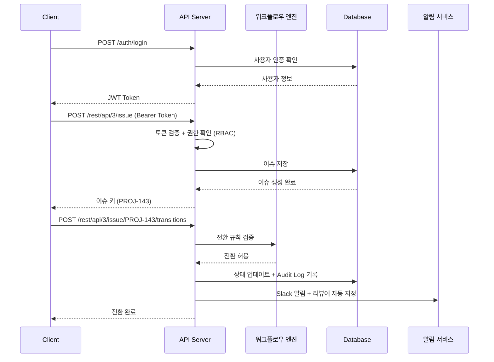
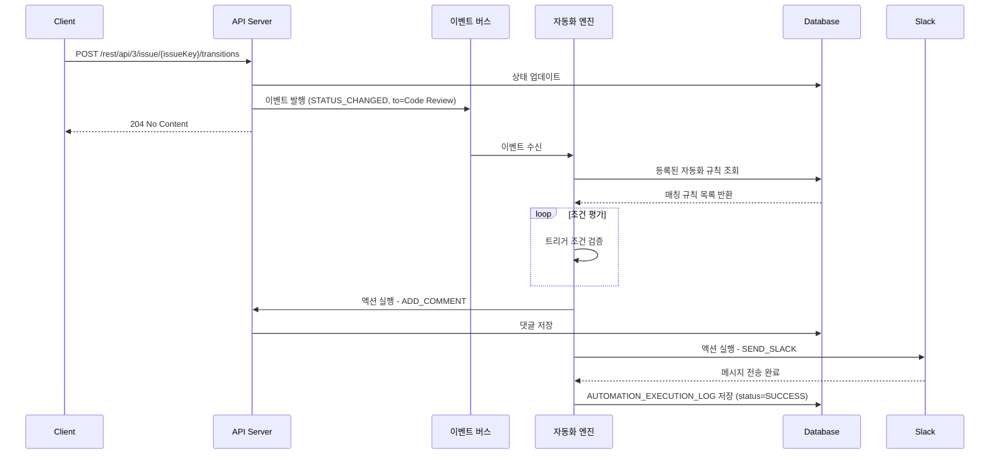
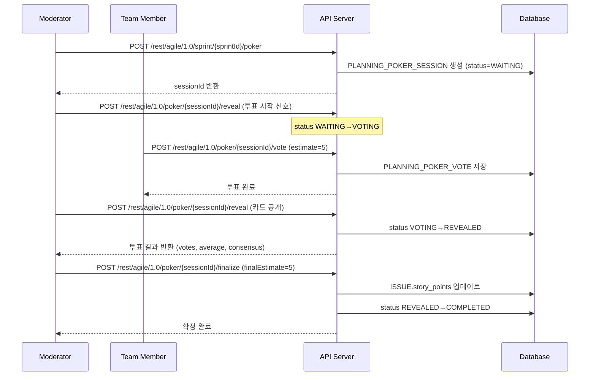
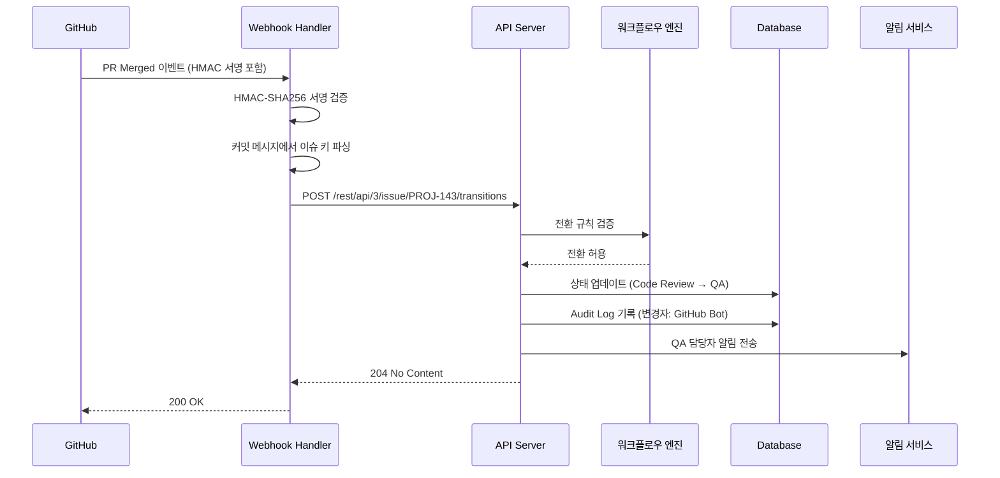

# Project Control Hub API 정의서

## 목차

1. [API 개요](#1-api-개요)
2. [공통 사항](#2-공통-사항)
3. [API 엔드포인트](#3-api-엔드포인트)
   - [3.1 인증 (Auth)](#31-인증-auth)
   - [3.2 이슈 (Issue)](#32-이슈-issue)
   - [3.3 검색 (Search)](#33-검색-search)
   - [3.4 상태 전환 (Transition)](#34-상태-전환-transition)
   - [3.5 스프린트 (Sprint)](#35-스프린트-sprint)
   - [3.6 버전/릴리즈 (Version)](#36-버전릴리즈-version)
   - [3.7 사용자 (User)](#37-사용자-user)
   - [3.8 프로젝트 (Project)](#38-프로젝트-project)
   - [3.9 댓글 (Comment)](#39-댓글-comment)
   - [3.10 첨부파일 (Attachment)](#310-첨부파일-attachment)
   - [3.11 워치 (Watch)](#311-워치-watch)
   - [3.12 이슈 링크 (Issue Link)](#312-이슈-링크-issue-link)
   - [3.13 보드 (Board)](#313-보드-board)
   - [3.14 레이블 & 컴포넌트](#314-레이블--컴포넌트)
   - [3.15 대시보드 (Dashboard)](#315-대시보드-dashboard)
   - [3.16 자동화 (Automation)](#316-자동화-automation)
   - [3.17 Audit Log](#317-audit-log)
   - [3.18 프로젝트 멤버 (Project Member)](#318-프로젝트-멤버-project-member)
   - [3.19 Planning Poker](#319-planning-poker) ← v4.0 신규
   - [3.20 WIP Limit](#320-wip-limit) ← v4.0 신규
   - [3.21 Screen Scheme](#321-screen-scheme) ← v4.0 신규
   - [3.22 Notification Subscription](#322-notification-subscription) ← v4.0 신규
   - [3.23 Archive Policy](#323-archive-policy) ← v4.0 신규
   - [3.24 Bulk Operations](#324-bulk-operations) ← v4.0 신규
4. [API 흐름도](#4-api-흐름도)
5. [Webhook 이벤트](#5-webhook-이벤트)
6. [변경 이력](#6-변경-이력)
7. [Bulk 작업 API](#7-bulk-작업-api)
8. [HATEOAS 링크](#8-hateoas-링크)
9. [Sparse Fieldsets](#9-sparse-fieldsets)
10. [Planning Poker API (v3.0 기존)](#10-planning-poker-api)

---

## 1. API 개요

| 항목 | 내용 |
|------|------|
| Base URL | `https://api.pch.example.com/rest/api/3` |
| Agile URL | `https://api.pch.example.com/rest/agile/1.0` |
| 인증 방식 | Bearer Token (JWT) |
| Content-Type | application/json |
| 문자 인코딩 | UTF-8 |

### 1.1 API 버전 관리 전략

API 버전은 URL 경로 방식으로 관리합니다.

```
https://api.pch.example.com/rest/api/3/...
https://api.pch.example.com/rest/agile/1.0/...
```

**Deprecation 정책**:
- 신규 버전 출시 후 구 버전은 최소 **6개월** 지원 유지
- Deprecation 예고는 Response Header에 포함: `Deprecation: true`, `Sunset: <날짜>`
- 구 버전 종료 30일 전 이메일 및 API 응답 경고 메시지 발송
- Breaking Change는 메이저 버전 업(예: `/api/3` → `/api/4`) 시에만 허용

---

## 2. 공통 사항

### 2.1 공통 응답 포맷

**성공 응답**:
```json
{
  "success": true,
  "data": { },
  "message": "요청이 성공적으로 처리되었습니다."
}
```

**에러 응답**:
```json
{
  "success": false,
  "error": {
    "code": "ERROR_CODE",
    "message": "에러 메시지"
  }
}
```

### 2.2 공통 에러 코드

| 코드 | HTTP Status | 설명 |
|------|-------------|------|
| UNAUTHORIZED | 401 | 인증 실패 (토큰 만료/미제공) |
| FORBIDDEN | 403 | 권한 없음 (역할 기반 접근 제어) |
| NOT_FOUND | 404 | 리소스 없음 |
| VALIDATION_ERROR | 422 | 입력값 검증 실패 |
| INTERNAL_ERROR | 500 | 서버 내부 오류 |
| WORKFLOW_VIOLATION | 409 | 허용되지 않는 상태 전환 |
| WIP_LIMIT_EXCEEDED | 409 | WIP 제한 초과 |
| ISSUE_NOT_IN_SPRINT | 400 | 스프린트 미배정 이슈 |
| DUPLICATE_ISSUE_KEY | 409 | 이슈 키 중복 |
| PERMISSION_DENIED | 403 | 역할 기반 권한 부족 |
| ACCOUNT_LOCKED | 423 | 계정 잠금 (로그인 5회 연속 실패) |
| VERSION_CONFLICT | 409 | 동시 편집 충돌 (낙관적 락 위반) |
| POKER_SESSION_NOT_FOUND | 404 | Planning Poker 세션 없음 |
| POKER_INVALID_STATE | 409 | Planning Poker 세션 상태 전환 불가 |
| INVITE_EMAIL_NOT_FOUND | 404 | 초대 대상 이메일 없음 |
| INVITE_ALREADY_MEMBER | 409 | 이미 프로젝트 멤버인 사용자 초대 시도 |

### 2.3 페이지네이션

```json
{
  "data": [],
  "pagination": {
    "page": 1,
    "size": 20,
    "totalElements": 100,
    "totalPages": 5
  }
}
```

### 2.4 Rate Limiting

| 엔드포인트 그룹 | Rate Limit | 비고 |
|----------------|-----------|------|
| 검색 (`/rest/api/3/search`) | 100 req/min | JQL 복잡도에 따라 추가 제한 가능 |
| 이슈 CRUD (`/rest/api/3/issue`) | 300 req/min | 생성/수정/삭제 합산 |
| 상태 전환 (`/transitions`) | 200 req/min | |
| 첨부파일 업로드 (`/attachments`) | 30 req/min | 파일 크기 최대 10MB |
| 인증 (`/auth/login`) | 10 req/min | IP 기준, 초과 시 ACCOUNT_LOCKED 위험 |
| Agile API (`/rest/agile/1.0`) | 200 req/min | |
| Planning Poker (`/rest/agile/1.0/poker`) | 100 req/min | |
| Bulk API (`/rest/api/3/issue/bulk`) | 30 req/min | 건수 제한 추가 (1회 최대 50건) |
| 기타 조회 API | 500 req/min | |

Rate Limit 초과 시 응답:
- HTTP Status: `429 Too Many Requests`
- Header: `Retry-After: <초>`, `X-RateLimit-Limit: <한도>`, `X-RateLimit-Remaining: <잔여>`

---

## 3. API 엔드포인트

---

### 3.1 인증 (Auth)

#### POST /auth/login - 로그인

| 항목 | 내용 |
|------|------|
| Method | POST |
| URL | /auth/login |
| 인증 | 불필요 |

**Request Body**:
| 필드 | 타입 | 필수 | 설명 |
|------|------|------|------|
| email | string | Y | 이메일 |
| password | string | Y | 비밀번호 |

**Request 예시**:
```json
{
  "email": "kim.developer@company.com",
  "password": "P@ssw0rd!"
}
```

**Response (200)**:
| 필드 | 타입 | 설명 |
|------|------|------|
| accessToken | string | 액세스 토큰 (JWT, 유효기간 15분) |
| refreshToken | string | 리프레시 토큰 (유효기간 1시간) |
| expiresIn | number | 액세스 토큰 만료 시간 (초, 900) |
| refreshExpiresIn | number | 리프레시 토큰 만료 시간 (초, 3600) |

**Response 예시**:
```json
{
  "success": true,
  "data": {
    "accessToken": "eyJhbG...",
    "refreshToken": "dGhpcy...",
    "expiresIn": 900,
    "refreshExpiresIn": 3600
  },
  "message": "로그인에 성공했습니다."
}
```

**에러**:
| 에러 코드 | HTTP Status | 설명 |
|-----------|-------------|------|
| UNAUTHORIZED | 401 | 이메일 또는 비밀번호 불일치 |
| ACCOUNT_LOCKED | 423 | 5회 연속 로그인 실패로 계정 잠금 |

---

#### POST /auth/refresh - 토큰 갱신

| 항목 | 내용 |
|------|------|
| Method | POST |
| URL | /auth/refresh |
| 인증 | 불필요 (refreshToken 사용) |

**Request Body**:
| 필드 | 타입 | 필수 | 설명 |
|------|------|------|------|
| refreshToken | string | Y | 리프레시 토큰 |

**Response (200)**:
```json
{
  "success": true,
  "data": {
    "accessToken": "eyJhbGciOiJIUzI1NiIsInR5cCI6IkpXVCJ9...",
    "expiresIn": 900
  }
}
```

---

#### POST /auth/logout - 로그아웃

| 항목 | 내용 |
|------|------|
| Method | POST |
| URL | /auth/logout |
| 인증 | 필요 |

**Response (204)**: No Content

---

### 3.2 이슈 (Issue)

#### POST /rest/api/3/issue - 이슈 생성

| 항목 | 내용 |
|------|------|
| Method | POST |
| URL | /rest/api/3/issue |
| 인증 | 필요 (DEVELOPER 이상) |

**Request Body**:
| 필드 | 타입 | 필수 | 설명 |
|------|------|------|------|
| project.key | string | Y | 프로젝트 키 (예: PROJ) |
| summary | string | Y | 이슈 제목 ([모듈] 기능 요약 형식) |
| issuetype.name | string | Y | 이슈 타입 (Epic/Story/Task/Bug/Sub-task) |
| description | string | N | 이슈 상세 설명 |
| assignee.accountId | string | N | 담당자 ID |
| reporter.accountId | string | N | 보고자 ID (미입력 시 요청자 자동 지정) |
| priority.name | string | N | 우선순위 (Highest/High/Medium/Low/Lowest) |
| story_points | number | N | 스토리 포인트 (피보나치: 1,2,3,5,8,13) |
| fixVersions[].name | string | N | 릴리즈 버전 |
| parent.key | string | N | 상위 이슈 키 (Sub-task의 경우 필수) |
| labels | string[] | N | 레이블 목록 |
| components[].name | string[] | N | 컴포넌트 목록 |
| duedate | string | N | 마감일 (ISO 8601, 예: 2026-04-30) |
| startdate | string | N | 시작일 (ISO 8601, 로드맵/타임라인용) |
| securityLevel | string | N | 보안 레벨 (Public/Internal/Confidential) |

**Request 예시**:
```json
{
  "fields": {
    "project": { "key": "PROJ" },
    "summary": "[회원] 로그인 실패 메시지 개선",
    "issuetype": { "name": "Story" },
    "description": "현재 로그인 실패 시 표시되는 오류 메시지를 사용자 친화적으로 개선합니다.",
    "assignee": { "accountId": "user-account-id-123" },
    "priority": { "name": "High" },
    "story_points": 3,
    "fixVersions": [{ "name": "v1.0.0" }],
    "labels": ["login", "ux"],
    "components": [{ "name": "Auth Module" }]
  }
}
```

**Response (201)**:
| 필드 | 타입 | 설명 |
|------|------|------|
| id | string | 이슈 내부 ID |
| key | string | 이슈 키 (예: PROJ-143) |
| self | string | 이슈 리소스 URL |

**Response 예시**:
```json
{
  "success": true,
  "data": {
    "id": "10143",
    "key": "PROJ-143",
    "self": "https://api.pch.example.com/rest/api/3/issue/PROJ-143"
  },
  "message": "이슈가 생성되었습니다."
}
```

---

#### GET /rest/api/3/issue/{issueKey} - 이슈 단건 조회

| 항목 | 내용 |
|------|------|
| Method | GET |
| URL | /rest/api/3/issue/{issueKey} |
| 인증 | 필요 (보안 레벨에 따라 역할 제한) |

**Path Parameters**:
| 파라미터 | 타입 | 필수 | 설명 |
|----------|------|------|------|
| issueKey | string | Y | 이슈 키 (예: PROJ-143) |

**Query Parameters**:
| 파라미터 | 타입 | 필수 | 설명 |
|----------|------|------|------|
| fields | string | N | 반환할 필드 목록 (콤마 구분, 미입력 시 전체) |
| expand | string | N | 확장 필드 (changelog, renderedFields, names) |

**Response (200)**:
| 필드 | 타입 | 설명 |
|------|------|------|
| id | string | 이슈 내부 ID |
| key | string | 이슈 키 |
| self | string | 이슈 리소스 URL |
| fields.summary | string | 이슈 제목 |
| fields.issuetype.name | string | 이슈 타입 |
| fields.status.name | string | 현재 상태 |
| fields.priority.name | string | 우선순위 |
| fields.assignee.accountId | string | 담당자 ID |
| fields.reporter.accountId | string | 보고자 ID |
| fields.description | string | 이슈 설명 |
| fields.story_points | number | 스토리 포인트 |
| fields.start_date | string | 시작일 (ISO 8601, 로드맵/타임라인용) |
| fields.duedate | string | 마감일 |
| fields.securityLevel.name | string | 보안 레벨 |
| changelog | object | 변경 이력 (expand=changelog 시) |

**Response 예시**:
```json
{
  "success": true,
  "data": {
    "id": "10143",
    "key": "PROJ-143",
    "self": "https://api.pch.example.com/rest/api/3/issue/PROJ-143",
    "fields": {
      "summary": "[회원] 로그인 실패 메시지 개선",
      "issuetype": { "name": "Story" },
      "status": { "name": "In Progress", "statusCategory": { "name": "In Progress" } },
      "priority": { "name": "High" },
      "assignee": { "accountId": "user-account-id-123", "displayName": "김개발" },
      "story_points": 3,
      "start_date": "2026-04-01",
      "duedate": "2026-04-14",
      "securityLevel": { "name": "Public" }
    }
  }
}
```

---

#### PUT /rest/api/3/issue/{issueKey} - 이슈 수정

| 항목 | 내용 |
|------|------|
| Method | PUT |
| URL | /rest/api/3/issue/{issueKey} |
| 인증 | 필요 (DEVELOPER 이상, Reporter는 본인 이슈만) |

**Request Body** (변경할 필드만 포함):
| 필드 | 타입 | 필수 | 설명 |
|------|------|------|------|
| fields.summary | string | N | 이슈 제목 |
| fields.description | string | N | 이슈 설명 |
| fields.assignee.accountId | string | N | 담당자 ID (null 전달 시 담당자 해제) |
| fields.priority.name | string | N | 우선순위 |
| fields.story_points | number | N | 스토리 포인트 |
| fields.start_date | string | N | 시작일 (ISO 8601) |
| fields.duedate | string | N | 마감일 (ISO 8601) |
| fields.fixVersions | array | N | 릴리즈 버전 목록 (전체 교체) |
| fields.labels | array | N | 레이블 목록 (전체 교체) |
| fields.components | array | N | 컴포넌트 목록 (전체 교체) |
| fields.securityLevel | object | N | 보안 레벨 |
| update | object | N | 필드 연산 (add/remove/set) |

**Response (204)**: No Content

**에러**:
| 에러 코드 | HTTP Status | 설명 |
|-----------|-------------|------|
| VERSION_CONFLICT | 409 | 다른 사용자가 동시에 수정 중 |
| PERMISSION_DENIED | 403 | 본인 이슈가 아닌 Reporter의 수정 시도 |

---

#### DELETE /rest/api/3/issue/{issueKey} - 이슈 삭제

| 항목 | 내용 |
|------|------|
| Method | DELETE |
| URL | /rest/api/3/issue/{issueKey} |
| 인증 | 필요 (ADMIN, DEVELOPER만 가능) |

**Query Parameters**:
| 파라미터 | 타입 | 필수 | 설명 |
|----------|------|------|------|
| deleteSubtasks | boolean | N | 하위 이슈(Sub-task) 함께 삭제 여부 (기본 false) |

**Response (204)**: No Content

---

### 3.3 검색 (Search)

#### POST /rest/api/3/search - JQL 기반 이슈 검색

| 항목 | 내용 |
|------|------|
| Method | POST |
| URL | /rest/api/3/search |
| 인증 | 필요 |

**Request Body**:
| 필드 | 타입 | 필수 | 설명 |
|------|------|------|------|
| jql | string | Y | JQL 쿼리문 |
| startAt | number | N | 시작 오프셋 (기본 0) |
| maxResults | number | N | 최대 결과 수 (기본 50, 최대 100) |
| fields | string[] | N | 반환 필드 목록 (미입력 시 기본 필드) |
| expand | string[] | N | 확장 필드 (changelog, renderedFields) |

**Request 예시**:
```json
{
  "jql": "project = PROJ AND status = 'In Progress' AND assignee = currentUser() ORDER BY priority DESC",
  "startAt": 0,
  "maxResults": 50,
  "fields": ["summary", "status", "assignee", "priority", "story_points", "fixVersions"]
}
```

**JQL 예시**:
```sql
-- 내 담당 진행 중 이슈
project = "PROJ" AND status = "In Progress" AND assignee = currentUser() ORDER BY priority DESC

-- 특정 버전에 포함된 미완료 이슈
fixVersion = "v1.0.0" AND status != Done

-- 로드맵: 특정 날짜 범위의 이슈 (start_date 활용)
project = PROJ AND start_date >= "2026-04-01" AND start_date <= "2026-04-30" ORDER BY start_date ASC
```

**Response (200)**:
```json
{
  "success": true,
  "data": {
    "startAt": 0,
    "maxResults": 50,
    "total": 8,
    "issues": [
      {
        "id": "10143",
        "key": "PROJ-143",
        "fields": {
          "summary": "[회원] 로그인 실패 메시지 개선",
          "status": { "name": "In Progress" },
          "assignee": { "displayName": "김개발" },
          "priority": { "name": "High" },
          "story_points": 3
        }
      }
    ]
  }
}
```

---

### 3.4 상태 전환 (Transition)

#### GET /rest/api/3/issue/{issueKey}/transitions - 가능한 전환 목록 조회

| 항목 | 내용 |
|------|------|
| Method | GET |
| URL | /rest/api/3/issue/{issueKey}/transitions |
| 인증 | 필요 |

**Response (200)**:
```json
{
  "success": true,
  "data": {
    "transitions": [
      { "id": "31", "name": "Code Review로 전환", "to": { "name": "Code Review" } },
      { "id": "41", "name": "완료", "to": { "name": "Done" } }
    ]
  }
}
```

---

#### POST /rest/api/3/issue/{issueKey}/transitions - 상태 전환

| 항목 | 내용 |
|------|------|
| Method | POST |
| URL | /rest/api/3/issue/{issueKey}/transitions |
| 인증 | 필요 (DEVELOPER 이상) |

**Request Body**:
| 필드 | 타입 | 필수 | 설명 |
|------|------|------|------|
| transition.id | string | Y | 전환 ID (GET transitions로 조회) |
| fields | object | N | 전환 시 추가 필드 입력 (resolution 등) |
| update.comment | array | N | 전환과 함께 댓글 추가 |

**Response (204)**: No Content

**에러**:
| 에러 코드 | HTTP Status | 설명 |
|-----------|-------------|------|
| WORKFLOW_VIOLATION | 409 | 허용되지 않는 상태 전환 |
| WIP_LIMIT_EXCEEDED | 409 | 칸반 보드 WIP 한도 초과 |

---

### 3.5 스프린트 (Sprint)

#### POST /rest/agile/1.0/sprint - 스프린트 생성

| 항목 | 내용 |
|------|------|
| Method | POST |
| URL | /rest/agile/1.0/sprint |
| 인증 | 필요 (ADMIN, DEVELOPER) |

**Request Body**:
| 필드 | 타입 | 필수 | 설명 |
|------|------|------|------|
| name | string | Y | 스프린트 이름 (예: Sprint 1) |
| boardId | number | Y | 보드 ID (BOARD.id 참조) |
| goal | string | N | 스프린트 목표 |
| startDate | string | N | 시작일 (ISO 8601) |
| endDate | string | N | 종료일 (ISO 8601) |

**Request 예시**:
```json
{
  "name": "Sprint 5",
  "boardId": 1,
  "goal": "회원 모듈 로그인/로그아웃 기능 완성",
  "startDate": "2026-04-01T09:00:00.000+0900",
  "endDate": "2026-04-14T18:00:00.000+0900"
}
```

**Response (201)**:
```json
{
  "success": true,
  "data": {
    "id": 5,
    "self": "https://api.pch.example.com/rest/agile/1.0/sprint/5",
    "name": "Sprint 5",
    "state": "future",
    "boardId": 1,
    "goal": "회원 모듈 로그인/로그아웃 기능 완성",
    "startDate": "2026-04-01T09:00:00.000+0900",
    "endDate": "2026-04-14T18:00:00.000+0900"
  }
}
```

---

#### GET /rest/agile/1.0/sprint/{sprintId} - 스프린트 조회

| 항목 | 내용 |
|------|------|
| Method | GET |
| URL | /rest/agile/1.0/sprint/{sprintId} |
| 인증 | 필요 |

**Response (200)**: 스프린트 생성 Response와 동일한 구조

---

#### PUT /rest/agile/1.0/sprint/{sprintId} - 스프린트 수정 (시작/완료 포함)

| 항목 | 내용 |
|------|------|
| Method | PUT |
| URL | /rest/agile/1.0/sprint/{sprintId} |
| 인증 | 필요 (ADMIN, DEVELOPER) |

**스프린트 상태 전환 규칙**:
| 전환 | 조건 |
|------|------|
| future → active | 같은 보드(BOARD.id)에 active 스프린트 없음 |
| active → closed | 완료 처리 (미완료 이슈는 백로그 또는 다음 스프린트로 이동 옵션) |

**Response (200)**: 수정된 스프린트 객체

---

#### POST /rest/agile/1.0/sprint/{sprintId}/issue - 스프린트에 이슈 추가

| 항목 | 내용 |
|------|------|
| Method | POST |
| URL | /rest/agile/1.0/sprint/{sprintId}/issue |
| 인증 | 필요 (ADMIN, DEVELOPER) |

**Request 예시**:
```json
{
  "issues": ["PROJ-143", "PROJ-144", "PROJ-145"]
}
```

**Response (204)**: No Content

---

#### DELETE /rest/agile/1.0/sprint/{sprintId}/issue - 스프린트에서 이슈 제거

| 항목 | 내용 |
|------|------|
| Method | DELETE |
| URL | /rest/agile/1.0/sprint/{sprintId}/issue |
| 인증 | 필요 (ADMIN, DEVELOPER) |

**Response (204)**: No Content (이슈는 백로그로 이동)

---

### 3.6 버전/릴리즈 (Version)

#### POST /rest/api/3/version - 릴리즈 버전 생성

| 항목 | 내용 |
|------|------|
| Method | POST |
| URL | /rest/api/3/version |
| 인증 | 필요 (ADMIN) |

**Request 예시**:
```json
{
  "name": "v1.0.0",
  "projectId": 10000,
  "description": "초기 릴리즈 - 회원 관리 및 기본 예약 기능",
  "startDate": "2026-03-01",
  "releaseDate": "2026-04-01",
  "released": false
}
```

**Response (201)**:
```json
{
  "success": true,
  "data": {
    "id": "10001",
    "name": "v1.0.0",
    "projectId": 10000,
    "releaseDate": "2026-04-01",
    "released": false,
    "self": "https://api.pch.example.com/rest/api/3/version/10001"
  }
}
```

---

#### GET /rest/api/3/project/{projectKey}/version - 버전 목록 조회

| 항목 | 내용 |
|------|------|
| Method | GET |
| URL | /rest/api/3/project/{projectKey}/version |
| 인증 | 필요 |

**Response (200)**: 버전 목록 배열

---

#### PUT /rest/api/3/version/{versionId} - 버전 수정

| 항목 | 내용 |
|------|------|
| Method | PUT |
| URL | /rest/api/3/version/{versionId} |
| 인증 | 필요 (ADMIN) |

**Response (200)**: 수정된 버전 객체

---

#### GET /rest/api/3/version/{versionId}/releasenotes - 릴리즈 노트

| 항목 | 내용 |
|------|------|
| Method | GET |
| URL | /rest/api/3/version/{versionId}/releasenotes |
| 인증 | 필요 |

**Response (200)**: 버전별 이슈 타입 구분 릴리즈 노트

---

### 3.7 사용자 (User)

#### GET /rest/api/3/user - 사용자 정보 조회

| 항목 | 내용 |
|------|------|
| Method | GET |
| URL | /rest/api/3/user |
| 인증 | 필요 |

**Response (200)**:
```json
{
  "success": true,
  "data": {
    "accountId": "user-account-id-123",
    "displayName": "김개발",
    "emailAddress": "kim.developer@company.com",
    "avatarUrls": {
      "48x48": "https://api.pch.example.com/avatar/48/user-account-id-123"
    },
    "active": true,
    "timeZone": "Asia/Seoul",
    "locale": "ko_KR"
  }
}
```

---

#### GET /rest/api/3/user/search - 사용자 검색

| 항목 | 내용 |
|------|------|
| Method | GET |
| URL | /rest/api/3/user/search |
| 인증 | 필요 |

**Query Parameters**:
| 파라미터 | 타입 | 필수 | 설명 |
|----------|------|------|------|
| query | string | Y | 검색어 (이름 또는 이메일) |
| startAt | number | N | 시작 오프셋 |
| maxResults | number | N | 최대 결과 수 (기본 50) |

**Response (200)**: 사용자 목록 배열

---

#### POST /rest/api/2/user/invite - 사용자 초대 (v4.0 신규)

> 관리자 초대 방식. Admin이 이메일로 사용자를 초대하면 임시 계정이 생성되고 초대 이메일이 발송된다.

| 항목 | 내용 |
|------|------|
| Method | POST |
| URL | /rest/api/2/user/invite |
| 인증 | 필요 (ADMIN) |

**Request Body**:
| 필드 | 타입 | 필수 | 설명 |
|------|------|------|------|
| email | string | Y | 초대할 사용자 이메일 |
| projectId | string | Y | 참여시킬 프로젝트 ID |
| role | string | Y | 부여할 역할 (Admin/Developer/QA/Reporter/Viewer) |
| displayName | string | N | 표시 이름 (미입력 시 이메일 앞부분 사용) |

**Request 예시**:
```json
{
  "email": "newuser@company.com",
  "projectId": "10000",
  "role": "Developer",
  "displayName": "신규개발자"
}
```

**Response (201)**:
| 필드 | 타입 | 설명 |
|------|------|------|
| accountId | string | 생성된 사용자 계정 ID |
| email | string | 초대 이메일 주소 |
| displayName | string | 표시 이름 |
| status | string | 초대 상태 (INVITED: 이메일 발송 완료) |
| invitedAt | string | 초대 일시 (ISO 8601) |

**Response 예시**:
```json
{
  "success": true,
  "data": {
    "accountId": "user-account-id-new",
    "email": "newuser@company.com",
    "displayName": "신규개발자",
    "status": "INVITED",
    "invitedAt": "2026-03-22T10:00:00.000+0900"
  },
  "message": "초대 이메일이 발송되었습니다."
}
```

**에러**:
| 에러 코드 | HTTP Status | 설명 |
|-----------|-------------|------|
| INVITE_ALREADY_MEMBER | 409 | 이미 해당 프로젝트 멤버인 사용자 |
| VALIDATION_ERROR | 422 | 이메일 형식 오류 또는 역할 값 오류 |

---

#### PUT /rest/api/2/user/{userId}/password - 비밀번호 변경 (v4.0 신규)

| 항목 | 내용 |
|------|------|
| Method | PUT |
| URL | /rest/api/2/user/{userId}/password |
| 인증 | 필요 (본인 또는 ADMIN) |

**Path Parameters**:
| 파라미터 | 타입 | 필수 | 설명 |
|----------|------|------|------|
| userId | string | Y | 사용자 계정 ID |

**Request Body**:
| 필드 | 타입 | 필수 | 설명 |
|------|------|------|------|
| oldPassword | string | Y | 현재 비밀번호 (ADMIN이 타인 변경 시 불필요) |
| newPassword | string | Y | 새 비밀번호 (최소 8자, 대/소문자/숫자/특수문자 포함) |

**Request 예시**:
```json
{
  "oldPassword": "OldP@ssw0rd!",
  "newPassword": "NewP@ssw0rd123!"
}
```

**Response (204)**: No Content

**에러**:
| 에러 코드 | HTTP Status | 설명 |
|-----------|-------------|------|
| UNAUTHORIZED | 401 | 현재 비밀번호 불일치 |
| VALIDATION_ERROR | 422 | 새 비밀번호 정책 위반 |

---

#### POST /rest/api/2/user/password/reset - 비밀번호 재설정 요청 (v4.0 신규)

| 항목 | 내용 |
|------|------|
| Method | POST |
| URL | /rest/api/2/user/password/reset |
| 인증 | 불필요 |

**Request Body**:
| 필드 | 타입 | 필수 | 설명 |
|------|------|------|------|
| email | string | Y | 비밀번호 재설정 링크를 수신할 이메일 |

**Request 예시**:
```json
{
  "email": "kim.developer@company.com"
}
```

**Response (200)**:
```json
{
  "success": true,
  "message": "비밀번호 재설정 이메일이 발송되었습니다. 이메일을 확인해주세요."
}
```

> 보안상 이유로 이메일 존재 여부와 관계없이 200 OK를 반환한다.

---

### 3.8 프로젝트 (Project)

#### POST /rest/api/3/project - 프로젝트 생성

| 항목 | 내용 |
|------|------|
| Method | POST |
| URL | /rest/api/3/project |
| 인증 | 필요 (ADMIN) |

**Request 예시**:
```json
{
  "key": "PROJ",
  "name": "병원 예약 시스템",
  "description": "온라인 진료 예약 및 관리 시스템",
  "leadAccountId": "user-account-id-admin",
  "projectTypeKey": "software",
  "projectTemplateKey": "scrum"
}
```

**Response (201)**:
```json
{
  "success": true,
  "data": {
    "id": "10000",
    "key": "PROJ",
    "name": "병원 예약 시스템",
    "self": "https://api.pch.example.com/rest/api/3/project/PROJ"
  }
}
```

---

#### GET /rest/api/3/project/{projectKey} - 프로젝트 조회

| 항목 | 내용 |
|------|------|
| Method | GET |
| URL | /rest/api/3/project/{projectKey} |
| 인증 | 필요 |

**Response (200)**: 프로젝트 상세 정보 (boards[] 배열 포함 — BOARD.id 참조)

---

#### PUT /rest/api/3/project/{projectKey} - 프로젝트 수정

| 항목 | 내용 |
|------|------|
| Method | PUT |
| URL | /rest/api/3/project/{projectKey} |
| 인증 | 필요 (ADMIN) |

**Response (200)**: 수정된 프로젝트 객체

---

#### DELETE /rest/api/3/project/{projectKey} - 프로젝트 삭제

| 항목 | 내용 |
|------|------|
| Method | DELETE |
| URL | /rest/api/3/project/{projectKey} |
| 인증 | 필요 (ADMIN) |

**Response (204)**: No Content

---

#### POST /rest/api/3/project/{projectKey}/archive - 프로젝트 아카이브

| 항목 | 내용 |
|------|------|
| Method | POST |
| URL | /rest/api/3/project/{projectKey}/archive |
| 인증 | 필요 (ADMIN) |

**Response (204)**: No Content

---

### 3.9 댓글 (Comment)

#### POST /rest/api/3/issue/{issueKey}/comment - 댓글 생성

| 항목 | 내용 |
|------|------|
| Method | POST |
| URL | /rest/api/3/issue/{issueKey}/comment |
| 인증 | 필요 (REPORTER 이상) |

**Request Body**:
| 필드 | 타입 | 필수 | 설명 |
|------|------|------|------|
| body | string | Y | 댓글 내용 (마크다운 지원) |
| visibility | object | N | 공개 범위 설정 |
| visibility.type | string | N | 공개 범위 타입 (public/role/group) — COMMENT.visibility_type 참조 |
| visibility.value | string | N | 역할명 또는 그룹명 |

**Request 예시**:
```json
{
  "body": "@[이순신] 해당 이슈 확인 부탁드립니다.",
  "visibility": {
    "type": "role",
    "value": "Developer"
  }
}
```

**Response (201)**:
```json
{
  "success": true,
  "data": {
    "id": "30001",
    "author": { "accountId": "user-account-id-123", "displayName": "김개발" },
    "body": "@[이순신] 해당 이슈 확인 부탁드립니다.",
    "visibility": { "type": "role", "value": "Developer" },
    "created": "2026-03-22T10:00:00.000+0900",
    "updated": "2026-03-22T10:00:00.000+0900"
  }
}
```

---

#### GET /rest/api/3/issue/{issueKey}/comment - 댓글 목록 조회

| 항목 | 내용 |
|------|------|
| Method | GET |
| URL | /rest/api/3/issue/{issueKey}/comment |
| 인증 | 필요 (visibility_type에 따라 필터링) |

**Response (200)**: 요청자 역할에 맞는 댓글만 반환 (PUBLIC + 본인 역할 허용 댓글)

---

#### PUT /rest/api/3/issue/{issueKey}/comment/{commentId} - 댓글 수정

| 항목 | 내용 |
|------|------|
| Method | PUT |
| URL | /rest/api/3/issue/{issueKey}/comment/{commentId} |
| 인증 | 필요 (작성자 본인 또는 ADMIN) |

**Response (200)**: 수정된 댓글 객체

---

#### DELETE /rest/api/3/issue/{issueKey}/comment/{commentId} - 댓글 삭제

| 항목 | 내용 |
|------|------|
| Method | DELETE |
| URL | /rest/api/3/issue/{issueKey}/comment/{commentId} |
| 인증 | 필요 (작성자 본인 또는 ADMIN) |

**Response (204)**: No Content

---

### 3.10 첨부파일 (Attachment)

#### POST /rest/api/3/issue/{issueKey}/attachments - 파일 업로드

| 항목 | 내용 |
|------|------|
| Method | POST |
| URL | /rest/api/3/issue/{issueKey}/attachments |
| 인증 | 필요 (DEVELOPER 이상) |
| Content-Type | multipart/form-data |

**Response (200)**: 업로드된 첨부파일 메타데이터 목록

---

#### GET /rest/api/3/attachment/{attachmentId} - 첨부파일 메타데이터 조회

| 항목 | 내용 |
|------|------|
| Method | GET |
| URL | /rest/api/3/attachment/{attachmentId} |
| 인증 | 필요 |

**Response (200)**: 첨부파일 메타데이터

---

#### DELETE /rest/api/3/attachment/{attachmentId} - 첨부파일 삭제

| 항목 | 내용 |
|------|------|
| Method | DELETE |
| URL | /rest/api/3/attachment/{attachmentId} |
| 인증 | 필요 (업로드한 본인 또는 ADMIN) |

**Response (204)**: No Content

---

### 3.11 워치 (Watch)

#### POST /rest/api/3/issue/{issueKey}/watchers - 워치 추가

| 항목 | 내용 |
|------|------|
| Method | POST |
| URL | /rest/api/3/issue/{issueKey}/watchers |
| 인증 | 필요 |

**Response (204)**: No Content

---

#### GET /rest/api/3/issue/{issueKey}/watchers - 워치 목록 조회

| 항목 | 내용 |
|------|------|
| Method | GET |
| URL | /rest/api/3/issue/{issueKey}/watchers |
| 인증 | 필요 |

**Response (200)**: 워처 목록

---

#### DELETE /rest/api/3/issue/{issueKey}/watchers - 워치 제거

| 항목 | 내용 |
|------|------|
| Method | DELETE |
| URL | /rest/api/3/issue/{issueKey}/watchers |
| 인증 | 필요 |

**Response (204)**: No Content

---

### 3.12 이슈 링크 (Issue Link)

#### POST /rest/api/3/issueLink - 이슈 링크 생성

| 항목 | 내용 |
|------|------|
| Method | POST |
| URL | /rest/api/3/issueLink |
| 인증 | 필요 (DEVELOPER 이상) |

**링크 타입 설명**:
| 타입 | inward 표현 | outward 표현 |
|------|-------------|--------------|
| Blocks | is blocked by | blocks |
| Duplicates | is duplicated by | duplicates |
| Relates to | relates to | relates to |
| Clones | is cloned by | clones |

**Request 예시**:
```json
{
  "type": { "name": "Clones" },
  "inwardIssue": { "key": "PROJ-143" },
  "outwardIssue": { "key": "PROJ-150" }
}
```

**Response (201)**: No Content

---

#### DELETE /rest/api/3/issueLink/{linkId} - 이슈 링크 삭제

| 항목 | 내용 |
|------|------|
| Method | DELETE |
| URL | /rest/api/3/issueLink/{linkId} |
| 인증 | 필요 (DEVELOPER 이상) |

**Response (204)**: No Content

---

### 3.13 보드 (Board)

> v4.0: boardId는 BOARD.id를 참조한다.

#### GET /rest/agile/1.0/board - 보드 목록 조회

| 항목 | 내용 |
|------|------|
| Method | GET |
| URL | /rest/agile/1.0/board |
| 인증 | 필요 |

**Query Parameters**:
| 파라미터 | 타입 | 필수 | 설명 |
|----------|------|------|------|
| startAt | number | N | 시작 오프셋 |
| maxResults | number | N | 최대 결과 수 (기본 50) |
| type | string | N | 보드 타입 필터 (scrum/kanban) |
| name | string | N | 보드 이름 검색 |
| projectKeyOrId | string | N | 특정 프로젝트의 보드만 조회 |

**Response (200)**:
```json
{
  "success": true,
  "data": {
    "maxResults": 50,
    "startAt": 0,
    "total": 2,
    "isLast": true,
    "values": [
      {
        "id": 1,
        "self": "https://api.pch.example.com/rest/agile/1.0/board/1",
        "name": "PROJ Scrum Board",
        "type": "scrum",
        "isDefault": true,
        "location": {
          "projectId": 10000,
          "projectKey": "PROJ",
          "projectName": "병원 예약 시스템"
        }
      }
    ]
  }
}
```

---

#### POST /rest/agile/1.0/board - 보드 생성 (v4.0 신규)

| 항목 | 내용 |
|------|------|
| Method | POST |
| URL | /rest/agile/1.0/board |
| 인증 | 필요 (ADMIN) |

**Request Body**:
| 필드 | 타입 | 필수 | 설명 |
|------|------|------|------|
| name | string | Y | 보드명 |
| type | string | Y | 보드 타입 (scrum/kanban) |
| projectId | number | Y | 프로젝트 ID |
| filterJql | string | N | 보드 이슈 필터 JQL |
| isDefault | boolean | N | 기본 보드 여부 (기본 false) |

**Request 예시**:
```json
{
  "name": "PROJ Kanban Board",
  "type": "kanban",
  "projectId": 10000,
  "filterJql": "project = PROJ AND issuetype != Epic",
  "isDefault": false
}
```

**Response (201)**:
```json
{
  "success": true,
  "data": {
    "id": 2,
    "name": "PROJ Kanban Board",
    "type": "kanban",
    "projectId": 10000,
    "isDefault": false,
    "self": "https://api.pch.example.com/rest/agile/1.0/board/2"
  }
}
```

---

#### GET /rest/agile/1.0/board/{boardId}/issue - 보드 이슈 목록

> boardId: BOARD.id 참조

| 항목 | 내용 |
|------|------|
| Method | GET |
| URL | /rest/agile/1.0/board/{boardId}/issue |
| 인증 | 필요 |

**Response (200)**: 검색 API와 동일한 이슈 목록 구조

---

#### GET /rest/agile/1.0/board/{boardId}/backlog - 백로그 이슈 목록

> boardId: BOARD.id 참조

| 항목 | 내용 |
|------|------|
| Method | GET |
| URL | /rest/agile/1.0/board/{boardId}/backlog |
| 인증 | 필요 |

**Response (200)**: 스프린트 미배정 이슈 목록

---

### 3.14 레이블 & 컴포넌트

#### GET /rest/api/3/label - 레이블 목록 조회

| 항목 | 내용 |
|------|------|
| Method | GET |
| URL | /rest/api/3/label |
| 인증 | 필요 |

**Response (200)**: 레이블 목록

---

#### POST /rest/api/3/component - 컴포넌트 생성

| 항목 | 내용 |
|------|------|
| Method | POST |
| URL | /rest/api/3/component |
| 인증 | 필요 (ADMIN) |

**Response (201)**: 생성된 컴포넌트 객체

---

#### GET /rest/api/3/component/{componentId} - 컴포넌트 조회

| 항목 | 내용 |
|------|------|
| Method | GET |
| URL | /rest/api/3/component/{componentId} |
| 인증 | 필요 |

---

#### PUT /rest/api/3/component/{componentId} - 컴포넌트 수정

| 항목 | 내용 |
|------|------|
| Method | PUT |
| URL | /rest/api/3/component/{componentId} |
| 인증 | 필요 (ADMIN) |

---

#### DELETE /rest/api/3/component/{componentId} - 컴포넌트 삭제

| 항목 | 내용 |
|------|------|
| Method | DELETE |
| URL | /rest/api/3/component/{componentId} |
| 인증 | 필요 (ADMIN) |

**Response (204)**: No Content

---

### 3.15 대시보드 (Dashboard)

#### POST /rest/api/3/dashboard - 대시보드 생성

| 항목 | 내용 |
|------|------|
| Method | POST |
| URL | /rest/api/3/dashboard |
| 인증 | 필요 |

---

#### GET /rest/api/3/dashboard - 대시보드 목록 조회

| 항목 | 내용 |
|------|------|
| Method | GET |
| URL | /rest/api/3/dashboard |
| 인증 | 필요 |

---

#### PUT /rest/api/3/dashboard/{id} - 대시보드 수정

| 항목 | 내용 |
|------|------|
| Method | PUT |
| URL | /rest/api/3/dashboard/{id} |
| 인증 | 필요 (소유자 또는 편집 권한 보유자) |

---

#### DELETE /rest/api/3/dashboard/{id} - 대시보드 삭제

| 항목 | 내용 |
|------|------|
| Method | DELETE |
| URL | /rest/api/3/dashboard/{id} |
| 인증 | 필요 (소유자 또는 ADMIN) |

**Response (204)**: No Content

---

#### POST /rest/api/3/dashboard/{id}/gadget - 가젯 추가

| 항목 | 내용 |
|------|------|
| Method | POST |
| URL | /rest/api/3/dashboard/{id}/gadget |
| 인증 | 필요 (대시보드 편집 권한) |

---

#### DELETE /rest/api/3/dashboard/{id}/gadget/{gadgetId} - 가젯 제거

| 항목 | 내용 |
|------|------|
| Method | DELETE |
| URL | /rest/api/3/dashboard/{id}/gadget/{gadgetId} |
| 인증 | 필요 (대시보드 편집 권한) |

**Response (204)**: No Content

---

### 3.16 자동화 (Automation)

#### POST /rest/api/3/automation/rule - 자동화 규칙 생성

| 항목 | 내용 |
|------|------|
| Method | POST |
| URL | /rest/api/3/automation/rule |
| 인증 | 필요 (ADMIN) |

---

#### GET /rest/api/3/automation/rule - 자동화 규칙 목록 조회

| 항목 | 내용 |
|------|------|
| Method | GET |
| URL | /rest/api/3/automation/rule |
| 인증 | 필요 (ADMIN) |

---

#### PUT /rest/api/3/automation/rule/{ruleId} - 자동화 규칙 수정

| 항목 | 내용 |
|------|------|
| Method | PUT |
| URL | /rest/api/3/automation/rule/{ruleId} |
| 인증 | 필요 (ADMIN) |

---

#### DELETE /rest/api/3/automation/rule/{ruleId} - 자동화 규칙 삭제

| 항목 | 내용 |
|------|------|
| Method | DELETE |
| URL | /rest/api/3/automation/rule/{ruleId} |
| 인증 | 필요 (ADMIN) |

**Response (204)**: No Content

---

#### PUT /rest/api/3/automation/rule/{ruleId}/enable - 규칙 활성화/비활성화

| 항목 | 내용 |
|------|------|
| Method | PUT |
| URL | /rest/api/3/automation/rule/{ruleId}/enable |
| 인증 | 필요 (ADMIN) |

---

### 3.17 Audit Log

#### GET /rest/api/3/auditing/record - Audit Log 조회

| 항목 | 내용 |
|------|------|
| Method | GET |
| URL | /rest/api/3/auditing/record |
| 인증 | 필요 (ADMIN) |

---

#### GET /rest/api/3/auditing/record/export - Audit Log 내보내기

| 항목 | 내용 |
|------|------|
| Method | GET |
| URL | /rest/api/3/auditing/record/export |
| 인증 | 필요 (ADMIN) |

---

### 3.18 프로젝트 멤버 (Project Member)

#### POST /rest/api/3/project/{projectKey}/member - 멤버 추가

| 항목 | 내용 |
|------|------|
| Method | POST |
| URL | /rest/api/3/project/{projectKey}/member |
| 인증 | 필요 (ADMIN) |

---

#### GET /rest/api/3/project/{projectKey}/member - 멤버 목록 조회

| 항목 | 내용 |
|------|------|
| Method | GET |
| URL | /rest/api/3/project/{projectKey}/member |
| 인증 | 필요 |

---

#### PUT /rest/api/3/project/{projectKey}/member/{userId} - 멤버 역할 변경

| 항목 | 내용 |
|------|------|
| Method | PUT |
| URL | /rest/api/3/project/{projectKey}/member/{userId} |
| 인증 | 필요 (ADMIN) |

---

#### DELETE /rest/api/3/project/{projectKey}/member/{userId} - 멤버 제거

| 항목 | 내용 |
|------|------|
| Method | DELETE |
| URL | /rest/api/3/project/{projectKey}/member/{userId} |
| 인증 | 필요 (ADMIN) |

**Response (204)**: No Content

---

### 3.19 Planning Poker (v4.0 신규 — Agile URL 체계)

> 스프린트 관리 화면의 모달에서 사용하는 Planning Poker API. 세션은 스프린트 단위로 생성되며 이슈별 스토리 포인트 합의를 지원한다.

#### POST /rest/agile/1.0/sprint/{sprintId}/poker - 세션 생성

| 항목 | 내용 |
|------|------|
| Method | POST |
| URL | /rest/agile/1.0/sprint/{sprintId}/poker |
| 인증 | 필요 (DEVELOPER 이상) |

**Path Parameters**:
| 파라미터 | 타입 | 필수 | 설명 |
|----------|------|------|------|
| sprintId | number | Y | 스프린트 ID |

**Request Body**:
| 필드 | 타입 | 필수 | 설명 |
|------|------|------|------|
| issueIds | string[] | Y | 포커 세션에서 합의할 이슈 키 목록 |
| timeLimit | number | N | 투표 제한 시간 (초, 기본 120) |

**Request 예시**:
```json
{
  "issueIds": ["PROJ-143", "PROJ-144", "PROJ-145"],
  "timeLimit": 120
}
```

**Response (201)**:
| 필드 | 타입 | 설명 |
|------|------|------|
| sessionId | number | 생성된 포커 세션 ID |
| sprintId | number | 스프린트 ID |
| issueIds | string[] | 세션 대상 이슈 목록 |
| status | string | 세션 상태 (WAITING) |
| timeLimit | number | 투표 제한 시간 (초) |
| createdAt | string | 생성 일시 (ISO 8601) |

**Response 예시**:
```json
{
  "success": true,
  "data": {
    "sessionId": 1001,
    "sprintId": 5,
    "issueIds": ["PROJ-143", "PROJ-144", "PROJ-145"],
    "status": "WAITING",
    "timeLimit": 120,
    "createdAt": "2026-03-22T10:00:00.000+0900"
  },
  "message": "Planning Poker 세션이 생성되었습니다."
}
```

---

#### GET /rest/agile/1.0/poker/{sessionId} - 세션 조회

| 항목 | 내용 |
|------|------|
| Method | GET |
| URL | /rest/agile/1.0/poker/{sessionId} |
| 인증 | 필요 |

**Path Parameters**:
| 파라미터 | 타입 | 필수 | 설명 |
|----------|------|------|------|
| sessionId | number | Y | 포커 세션 ID |

**Response (200)**:
| 필드 | 타입 | 설명 |
|------|------|------|
| sessionId | number | 세션 ID |
| sprintId | number | 스프린트 ID |
| currentIssueKey | string | 현재 투표 중인 이슈 키 |
| status | string | 세션 상태 (WAITING/VOTING/REVEALED/COMPLETED) |
| round | number | 현재 투표 라운드 |
| votes | array | 투표 현황 (REVEALED 상태에서만 카드 값 공개) |
| timeLimit | number | 투표 제한 시간 (초) |
| remainingTime | number | 남은 시간 (초) |

**Response 예시**:
```json
{
  "success": true,
  "data": {
    "sessionId": 1001,
    "sprintId": 5,
    "currentIssueKey": "PROJ-143",
    "status": "VOTING",
    "round": 1,
    "votes": [
      { "accountId": "user-account-id-123", "displayName": "김개발", "voted": true, "cardValue": null },
      { "accountId": "user-account-id-456", "displayName": "이기획", "voted": false, "cardValue": null }
    ],
    "timeLimit": 120,
    "remainingTime": 87
  }
}
```

---

#### POST /rest/agile/1.0/poker/{sessionId}/vote - 투표

| 항목 | 내용 |
|------|------|
| Method | POST |
| URL | /rest/agile/1.0/poker/{sessionId}/vote |
| 인증 | 필요 |

**Request Body**:
| 필드 | 타입 | 필수 | 설명 |
|------|------|------|------|
| estimate | string | Y | 선택한 카드 값 (1, 2, 3, 5, 8, 13, 21, ?, ∞) |

**Request 예시**:
```json
{
  "estimate": "5"
}
```

**Response (200)**:
```json
{
  "success": true,
  "data": {
    "sessionId": 1001,
    "accountId": "user-account-id-123",
    "estimate": "5",
    "round": 1,
    "votedAt": "2026-03-22T10:01:30.000+0900"
  },
  "message": "투표가 완료되었습니다."
}
```

**에러**:
| 에러 코드 | HTTP Status | 설명 |
|-----------|-------------|------|
| POKER_INVALID_STATE | 409 | 세션이 VOTING 상태가 아님 |
| POKER_SESSION_NOT_FOUND | 404 | 세션 없음 |

---

#### POST /rest/agile/1.0/poker/{sessionId}/reveal - 결과 공개

| 항목 | 내용 |
|------|------|
| Method | POST |
| URL | /rest/agile/1.0/poker/{sessionId}/reveal |
| 인증 | 필요 (세션 진행자 Moderator만 가능) |

**Request Body**: 없음

**Response (200)**:
| 필드 | 타입 | 설명 |
|------|------|------|
| sessionId | number | 세션 ID |
| status | string | 세션 상태 (REVEALED) |
| votes | array | 모든 투표 결과 (카드 값 공개) |
| average | number | 투표 평균값 (숫자 카드만 계산) |
| consensus | boolean | 합의 여부 (모든 투표 값이 동일한 경우 true) |

**Response 예시**:
```json
{
  "success": true,
  "data": {
    "sessionId": 1001,
    "status": "REVEALED",
    "votes": [
      { "accountId": "user-account-id-123", "displayName": "김개발", "cardValue": "5" },
      { "accountId": "user-account-id-456", "displayName": "이기획", "cardValue": "8" },
      { "accountId": "user-account-id-789", "displayName": "박QA", "cardValue": "5" }
    ],
    "average": 6.0,
    "consensus": false
  }
}
```

**에러**:
| 에러 코드 | HTTP Status | 설명 |
|-----------|-------------|------|
| POKER_INVALID_STATE | 409 | 세션이 VOTING 상태가 아님 |
| PERMISSION_DENIED | 403 | 진행자(Moderator)가 아님 |

---

#### POST /rest/agile/1.0/poker/{sessionId}/finalize - 최종 확정

> 스토리 포인트를 최종 확정하여 ISSUE.story_points를 업데이트한다.

| 항목 | 내용 |
|------|------|
| Method | POST |
| URL | /rest/agile/1.0/poker/{sessionId}/finalize |
| 인증 | 필요 (세션 진행자 Moderator만 가능) |

**Request Body**:
| 필드 | 타입 | 필수 | 설명 |
|------|------|------|------|
| finalEstimate | string | Y | 최종 확정 스토리 포인트 값 (1, 2, 3, 5, 8, 13, 21 등) |

**Request 예시**:
```json
{
  "finalEstimate": "5"
}
```

**Response (200)**:
| 필드 | 타입 | 설명 |
|------|------|------|
| sessionId | number | 세션 ID |
| issueKey | string | 업데이트된 이슈 키 |
| finalEstimate | string | 확정된 스토리 포인트 값 |
| status | string | 세션 상태 (COMPLETED) |
| updatedAt | string | 이슈 업데이트 일시 |

**Response 예시**:
```json
{
  "success": true,
  "data": {
    "sessionId": 1001,
    "issueKey": "PROJ-143",
    "finalEstimate": "5",
    "status": "COMPLETED",
    "updatedAt": "2026-03-22T10:05:00.000+0900"
  },
  "message": "스토리 포인트가 확정되었습니다. ISSUE.story_points가 5로 업데이트되었습니다."
}
```

**에러**:
| 에러 코드 | HTTP Status | 설명 |
|-----------|-------------|------|
| POKER_INVALID_STATE | 409 | 세션이 REVEALED 상태가 아님 |
| PERMISSION_DENIED | 403 | 진행자(Moderator)가 아님 |
| VALIDATION_ERROR | 422 | 유효하지 않은 스토리 포인트 값 |

---

### 3.20 WIP Limit (v4.0 신규)

#### GET /rest/agile/1.0/board/{boardId}/wip-limits - WIP 제한 조회

> boardId: BOARD.id 참조

| 항목 | 내용 |
|------|------|
| Method | GET |
| URL | /rest/agile/1.0/board/{boardId}/wip-limits |
| 인증 | 필요 |

**Path Parameters**:
| 파라미터 | 타입 | 필수 | 설명 |
|----------|------|------|------|
| boardId | number | Y | 보드 ID (BOARD.id 참조) |

**Response (200)**:
| 필드 | 타입 | 설명 |
|------|------|------|
| boardId | number | 보드 ID |
| limits | array | 컬럼별 WIP 제한 목록 |
| limits[].column | string | 컬럼(상태) 이름 |
| limits[].maxWip | number | 최대 이슈 수 (0이면 무제한) |
| limits[].currentCount | number | 현재 이슈 수 |

**Response 예시**:
```json
{
  "success": true,
  "data": {
    "boardId": 1,
    "limits": [
      { "column": "IN_PROGRESS", "maxWip": 3, "currentCount": 2 },
      { "column": "CODE_REVIEW", "maxWip": 5, "currentCount": 1 },
      { "column": "QA", "maxWip": 3, "currentCount": 3 }
    ]
  }
}
```

---

#### PUT /rest/agile/1.0/board/{boardId}/wip-limits - WIP 제한 설정

> boardId: BOARD.id 참조

| 항목 | 내용 |
|------|------|
| Method | PUT |
| URL | /rest/agile/1.0/board/{boardId}/wip-limits |
| 인증 | 필요 (ADMIN) |

**Request Body**:
| 필드 | 타입 | 필수 | 설명 |
|------|------|------|------|
| limits | array | Y | 설정할 WIP 제한 목록 |
| limits[].column | string | Y | 컬럼(상태) 이름 (BACKLOG/SELECTED/IN_PROGRESS/CODE_REVIEW/QA/DONE) |
| limits[].maxWip | number | Y | 최대 이슈 수 (0이면 무제한) |

**Request 예시**:
```json
{
  "limits": [
    { "column": "IN_PROGRESS", "maxWip": 3 },
    { "column": "CODE_REVIEW", "maxWip": 5 },
    { "column": "QA", "maxWip": 3 }
  ]
}
```

**Response (200)**:
```json
{
  "success": true,
  "data": {
    "boardId": 1,
    "limits": [
      { "column": "IN_PROGRESS", "maxWip": 3 },
      { "column": "CODE_REVIEW", "maxWip": 5 },
      { "column": "QA", "maxWip": 3 }
    ],
    "updatedAt": "2026-03-22T10:00:00.000+0900"
  },
  "message": "WIP 제한이 설정되었습니다."
}
```

**에러**:
| 에러 코드 | HTTP Status | 설명 |
|-----------|-------------|------|
| WIP_LIMIT_EXCEEDED | 409 | 설정 시점에 이미 현재 이슈 수가 새 제한 값을 초과 |
| VALIDATION_ERROR | 422 | 유효하지 않은 컬럼명 또는 maxWip 값 |

---

### 3.21 Screen Scheme (v4.0 신규)

#### GET /rest/api/2/project/{projectId}/screens - 스크린 스킴 목록

| 항목 | 내용 |
|------|------|
| Method | GET |
| URL | /rest/api/2/project/{projectId}/screens |
| 인증 | 필요 (ADMIN) |

**Path Parameters**:
| 파라미터 | 타입 | 필수 | 설명 |
|----------|------|------|------|
| projectId | string | Y | 프로젝트 ID 또는 키 |

**Response (200)**:
| 필드 | 타입 | 설명 |
|------|------|------|
| screens | array | 스크린 스킴 목록 |
| screens[].id | number | 스크린 스킴 ID |
| screens[].name | string | 스킴명 |
| screens[].screenType | string | 화면 타입 (CREATE/EDIT/TRANSITION) |
| screens[].fieldCount | number | 필드 수 |

**Response 예시**:
```json
{
  "success": true,
  "data": {
    "screens": [
      { "id": 101, "name": "PROJ Create Screen", "screenType": "CREATE", "fieldCount": 8 },
      { "id": 102, "name": "PROJ Edit Screen", "screenType": "EDIT", "fieldCount": 12 },
      { "id": 103, "name": "PROJ Transition Screen", "screenType": "TRANSITION", "fieldCount": 3 }
    ]
  }
}
```

---

#### PUT /rest/api/2/project/{projectId}/screens/{screenId} - 스크린 필드 설정

| 항목 | 내용 |
|------|------|
| Method | PUT |
| URL | /rest/api/2/project/{projectId}/screens/{screenId} |
| 인증 | 필요 (ADMIN) |

**Path Parameters**:
| 파라미터 | 타입 | 필수 | 설명 |
|----------|------|------|------|
| projectId | string | Y | 프로젝트 ID 또는 키 |
| screenId | number | Y | 스크린 스킴 ID |

**Request Body**:
| 필드 | 타입 | 필수 | 설명 |
|------|------|------|------|
| name | string | N | 스킴명 변경 |
| fields | array | N | 필드 목록 (전체 교체) |
| fields[].fieldName | string | Y | 필드명 (예: summary, assignee, priority) |
| fields[].required | boolean | N | 필수 여부 (기본 false) |
| fields[].displayOrder | number | N | 표시 순서 (기본 0) |

**Request 예시**:
```json
{
  "fields": [
    { "fieldName": "summary", "required": true, "displayOrder": 1 },
    { "fieldName": "issuetype", "required": true, "displayOrder": 2 },
    { "fieldName": "assignee", "required": false, "displayOrder": 3 },
    { "fieldName": "priority", "required": false, "displayOrder": 4 },
    { "fieldName": "story_points", "required": false, "displayOrder": 5 },
    { "fieldName": "start_date", "required": false, "displayOrder": 6 }
  ]
}
```

**Response (200)**:
```json
{
  "success": true,
  "data": {
    "id": 101,
    "name": "PROJ Create Screen",
    "screenType": "CREATE",
    "fields": [
      { "fieldName": "summary", "required": true, "displayOrder": 1 },
      { "fieldName": "issuetype", "required": true, "displayOrder": 2 }
    ],
    "updatedAt": "2026-03-22T10:00:00.000+0900"
  }
}
```

---

#### GET /rest/api/2/screens/{screenId}/fields - 스크린 필드 목록

| 항목 | 내용 |
|------|------|
| Method | GET |
| URL | /rest/api/2/screens/{screenId}/fields |
| 인증 | 필요 |

**Path Parameters**:
| 파라미터 | 타입 | 필수 | 설명 |
|----------|------|------|------|
| screenId | number | Y | 스크린 스킴 ID |

**Response (200)**:
| 필드 | 타입 | 설명 |
|------|------|------|
| screenId | number | 스크린 스킴 ID |
| screenType | string | 화면 타입 |
| fields | array | 필드 목록 (displayOrder 순 정렬) |
| fields[].id | number | 필드 ID |
| fields[].fieldName | string | 필드명 |
| fields[].required | boolean | 필수 여부 |
| fields[].displayOrder | number | 표시 순서 |

**Response 예시**:
```json
{
  "success": true,
  "data": {
    "screenId": 101,
    "screenType": "CREATE",
    "fields": [
      { "id": 201, "fieldName": "summary", "required": true, "displayOrder": 1 },
      { "id": 202, "fieldName": "issuetype", "required": true, "displayOrder": 2 },
      { "id": 203, "fieldName": "assignee", "required": false, "displayOrder": 3 },
      { "id": 204, "fieldName": "priority", "required": false, "displayOrder": 4 },
      { "id": 205, "fieldName": "story_points", "required": false, "displayOrder": 5 },
      { "id": 206, "fieldName": "start_date", "required": false, "displayOrder": 6 }
    ]
  }
}
```

---

### 3.22 Notification Subscription (v4.0 신규)

#### GET /rest/api/2/user/notifications/subscriptions - 구독 목록

| 항목 | 내용 |
|------|------|
| Method | GET |
| URL | /rest/api/2/user/notifications/subscriptions |
| 인증 | 필요 |

**Response (200)**:
| 필드 | 타입 | 설명 |
|------|------|------|
| subscriptions | array | 구독 목록 |
| subscriptions[].id | number | 구독 ID |
| subscriptions[].eventType | string | 이벤트 타입 |
| subscriptions[].channel | string | 알림 채널 (EMAIL/SLACK/IN_APP) |
| subscriptions[].projectId | string | 프로젝트 ID (null이면 전역 구독) |

**Response 예시**:
```json
{
  "success": true,
  "data": {
    "subscriptions": [
      { "id": 301, "eventType": "ISSUE_ASSIGNED", "channel": "EMAIL", "projectId": "10000" },
      { "id": 302, "eventType": "COMMENT_ADDED", "channel": "IN_APP", "projectId": "10000" },
      { "id": 303, "eventType": "SPRINT_STARTED", "channel": "SLACK", "projectId": null }
    ]
  }
}
```

---

#### PUT /rest/api/2/user/notifications/subscriptions - 구독 설정

| 항목 | 내용 |
|------|------|
| Method | PUT |
| URL | /rest/api/2/user/notifications/subscriptions |
| 인증 | 필요 |

**Request Body**:
| 필드 | 타입 | 필수 | 설명 |
|------|------|------|------|
| subscriptions | array | Y | 설정할 구독 목록 (기존 구독 전체 교체) |
| subscriptions[].eventType | string | Y | 이벤트 타입 (ISSUE_CREATED/ISSUE_ASSIGNED/COMMENT_ADDED/STATUS_CHANGED/SPRINT_STARTED/SPRINT_COMPLETED 등) |
| subscriptions[].channels | string[] | Y | 알림 채널 목록 (EMAIL/SLACK/IN_APP) |
| subscriptions[].projectId | string | N | 특정 프로젝트 한정 (미입력 시 전역 구독) |

**Request 예시**:
```json
{
  "subscriptions": [
    {
      "eventType": "ISSUE_ASSIGNED",
      "channels": ["EMAIL", "IN_APP"],
      "projectId": "10000"
    },
    {
      "eventType": "COMMENT_ADDED",
      "channels": ["IN_APP"],
      "projectId": "10000"
    },
    {
      "eventType": "SPRINT_STARTED",
      "channels": ["SLACK"],
      "projectId": null
    }
  ]
}
```

**Response (200)**:
```json
{
  "success": true,
  "data": {
    "subscriptions": [
      { "id": 301, "eventType": "ISSUE_ASSIGNED", "channels": ["EMAIL", "IN_APP"], "projectId": "10000" },
      { "id": 302, "eventType": "COMMENT_ADDED", "channels": ["IN_APP"], "projectId": "10000" },
      { "id": 303, "eventType": "SPRINT_STARTED", "channels": ["SLACK"], "projectId": null }
    ],
    "updatedAt": "2026-03-22T10:00:00.000+0900"
  },
  "message": "알림 구독 설정이 저장되었습니다."
}
```

---

### 3.23 Archive Policy (v4.0 신규)

#### GET /rest/api/2/project/{projectId}/archive-policy - 아카이브 정책 조회

| 항목 | 내용 |
|------|------|
| Method | GET |
| URL | /rest/api/2/project/{projectId}/archive-policy |
| 인증 | 필요 (ADMIN) |

**Path Parameters**:
| 파라미터 | 타입 | 필수 | 설명 |
|----------|------|------|------|
| projectId | string | Y | 프로젝트 ID 또는 키 |

**Response (200)**:
| 필드 | 타입 | 설명 |
|------|------|------|
| projectId | string | 프로젝트 ID |
| policies | array | 아카이브 정책 목록 |
| policies[].id | number | 정책 ID |
| policies[].conditionType | string | 조건 타입 (NO_UPDATE/STATUS_DONE) |
| policies[].inactiveDays | number | 기준 비활성 일수 |
| policies[].targetStatuses | string[] | 대상 상태 목록 |
| policies[].autoArchive | boolean | 자동 아카이브 여부 |
| policies[].enabled | boolean | 활성화 여부 |

**Response 예시**:
```json
{
  "success": true,
  "data": {
    "projectId": "10000",
    "policies": [
      {
        "id": 401,
        "conditionType": "NO_UPDATE",
        "inactiveDays": 180,
        "targetStatuses": ["DONE"],
        "autoArchive": true,
        "enabled": true
      }
    ]
  }
}
```

---

#### PUT /rest/api/2/project/{projectId}/archive-policy - 아카이브 정책 설정

| 항목 | 내용 |
|------|------|
| Method | PUT |
| URL | /rest/api/2/project/{projectId}/archive-policy |
| 인증 | 필요 (ADMIN) |

**Request Body**:
| 필드 | 타입 | 필수 | 설명 |
|------|------|------|------|
| inactiveDays | number | Y | 기준 비활성 일수 (예: 180이면 180일 이상 미수정 이슈 대상) |
| targetStatuses | string[] | Y | 아카이브 대상 상태 목록 (예: ["DONE"]) |
| autoArchive | boolean | Y | 자동 아카이브 활성화 여부 |
| conditionType | string | N | 조건 타입 (NO_UPDATE/STATUS_DONE, 기본 NO_UPDATE) |

**Request 예시**:
```json
{
  "inactiveDays": 90,
  "targetStatuses": ["DONE"],
  "autoArchive": true,
  "conditionType": "NO_UPDATE"
}
```

**Response (200)**:
```json
{
  "success": true,
  "data": {
    "projectId": "10000",
    "policy": {
      "id": 401,
      "conditionType": "NO_UPDATE",
      "inactiveDays": 90,
      "targetStatuses": ["DONE"],
      "autoArchive": true,
      "enabled": true,
      "updatedAt": "2026-03-22T10:00:00.000+0900"
    }
  },
  "message": "아카이브 정책이 저장되었습니다."
}
```

---

### 3.24 Bulk Operations (v4.0 신규)

> 이슈 일괄 처리 API. 기존 섹션 7의 Bulk 작업 API를 3.x 섹션 체계로 통합.

#### POST /rest/api/2/issue/bulk - 이슈 일괄 생성

| 항목 | 내용 |
|------|------|
| Method | POST |
| URL | /rest/api/2/issue/bulk |
| 인증 | 필요 (DEVELOPER 이상) |

**Request Body**:
| 필드 | 타입 | 필수 | 설명 |
|------|------|------|------|
| issues | array | Y | 생성할 이슈 목록 (최대 50개) |
| issues[].fields | object | Y | 이슈 필드 (단건 생성과 동일한 구조) |

**Request 예시**:
```json
{
  "issues": [
    {
      "fields": {
        "project": { "key": "PROJ" },
        "summary": "[회원] 로그인 기능 구현",
        "issuetype": { "name": "Story" },
        "priority": { "name": "High" },
        "story_points": 5
      }
    },
    {
      "fields": {
        "project": { "key": "PROJ" },
        "summary": "[회원] 로그아웃 기능 구현",
        "issuetype": { "name": "Story" },
        "priority": { "name": "Medium" },
        "story_points": 2
      }
    }
  ]
}
```

**Response (201)**:
```json
{
  "success": true,
  "data": {
    "issues": [
      { "key": "PROJ-143", "self": "https://api.pch.example.com/rest/api/3/issue/PROJ-143" },
      { "key": "PROJ-144", "self": "https://api.pch.example.com/rest/api/3/issue/PROJ-144" }
    ],
    "errors": []
  }
}
```

---

#### PUT /rest/api/2/issue/bulk - 이슈 일괄 수정

| 항목 | 내용 |
|------|------|
| Method | PUT |
| URL | /rest/api/2/issue/bulk |
| 인증 | 필요 (DEVELOPER 이상) |

**Request Body**:
| 필드 | 타입 | 필수 | 설명 |
|------|------|------|------|
| issueIds | string[] | Y | 수정할 이슈 키 목록 |
| fields | object | Y | 일괄 적용할 필드 값 |

**Request 예시**:
```json
{
  "issueIds": ["PROJ-143", "PROJ-144", "PROJ-145"],
  "fields": {
    "assignee": { "accountId": "user-account-id-123" },
    "priority": { "name": "High" }
  }
}
```

**Response (200)**:
```json
{
  "success": true,
  "data": {
    "updated": ["PROJ-143", "PROJ-144", "PROJ-145"],
    "errors": []
  }
}
```

---

#### POST /rest/api/2/issue/bulk/transition - 이슈 일괄 상태 전환

| 항목 | 내용 |
|------|------|
| Method | POST |
| URL | /rest/api/2/issue/bulk/transition |
| 인증 | 필요 (DEVELOPER 이상) |

**Request Body**:
| 필드 | 타입 | 필수 | 설명 |
|------|------|------|------|
| issueIds | string[] | Y | 상태 전환할 이슈 키 목록 |
| transitionId | string | Y | 전환 ID (GET /transitions로 조회) |

**Request 예시**:
```json
{
  "issueIds": ["PROJ-143", "PROJ-144"],
  "transitionId": "31"
}
```

**Response (200)**:
```json
{
  "success": true,
  "data": {
    "transitioned": ["PROJ-143", "PROJ-144"],
    "errors": []
  }
}
```

**에러**:
| 에러 코드 | HTTP Status | 설명 |
|-----------|-------------|------|
| WORKFLOW_VIOLATION | 409 | 허용되지 않는 상태 전환이 포함된 경우 |

---

#### DELETE /rest/api/2/issue/bulk - 이슈 일괄 삭제

| 항목 | 내용 |
|------|------|
| Method | DELETE |
| URL | /rest/api/2/issue/bulk |
| 인증 | 필요 (ADMIN만 가능) |

**Request Body**:
| 필드 | 타입 | 필수 | 설명 |
|------|------|------|------|
| issueIds | string[] | Y | 삭제할 이슈 키 목록 (최대 100개) |

**Request 예시**:
```json
{
  "issueIds": ["PROJ-143", "PROJ-144"]
}
```

**Response (200)**:
```json
{
  "success": true,
  "data": {
    "deleted": ["PROJ-143", "PROJ-144"],
    "errors": []
  }
}
```

**에러**:
| 에러 코드 | HTTP Status | 설명 |
|-----------|-------------|------|
| PERMISSION_DENIED | 403 | ADMIN이 아닌 사용자의 일괄 삭제 시도 |

---

## 4. API 흐름도

### 4.1 인증 및 이슈 생성 흐름



### 4.2 자동화 규칙 실행 흐름



### 4.3 Planning Poker 흐름



### 4.4 GitHub Webhook 연동 흐름 (외부 연동)



---

## 5. Webhook 이벤트

### 5.1 Webhook 등록

#### POST /rest/api/3/webhook - Webhook 등록

| 항목 | 내용 |
|------|------|
| Method | POST |
| URL | /rest/api/3/webhook |
| 인증 | 필요 (ADMIN) |

**Request 예시**:
```json
{
  "url": "https://hooks.example.com/pch-webhook",
  "webhooks": [
    {
      "events": ["pch:issue_created", "pch:issue_updated"],
      "jqlFilter": "project = PROJ"
    }
  ]
}
```

---

### 5.2 지원 이벤트 타입

| 이벤트 | 설명 |
|--------|------|
| `pch:issue_created` | 이슈 생성 |
| `pch:issue_updated` | 이슈 수정 (필드 변경, 상태 전환 포함) |
| `pch:issue_deleted` | 이슈 삭제 |
| `comment_created` | 댓글 생성 |
| `comment_updated` | 댓글 수정 |
| `comment_deleted` | 댓글 삭제 |
| `attachment_created` | 첨부파일 업로드 |
| `attachment_deleted` | 첨부파일 삭제 |
| `issuelink_created` | 이슈 링크 생성 |
| `issuelink_deleted` | 이슈 링크 삭제 |
| `sprint_created` | 스프린트 생성 |
| `sprint_started` | 스프린트 시작 |
| `sprint_closed` | 스프린트 완료 |
| `version_created` | 버전 생성 |
| `version_released` | 버전 릴리즈 완료 |
| `project_created` | 프로젝트 생성 |
| `project_updated` | 프로젝트 수정 |
| `project_archived` | 프로젝트 아카이브 |
| `poker_session_completed` | Planning Poker 세션 완료 (v4.0) |

---

### 5.3 Webhook Payload 스키마

**이슈 생성/수정 이벤트 Payload 예시**:
```json
{
  "timestamp": 1742518800000,
  "webhookEvent": "pch:issue_updated",
  "issue_event_type_name": "issue_generic",
  "user": {
    "accountId": "user-account-id-123",
    "displayName": "김개발"
  },
  "issue": {
    "id": "10143",
    "key": "PROJ-143",
    "fields": {
      "summary": "[회원] 로그인 실패 메시지 개선",
      "status": { "name": "Code Review" }
    }
  },
  "changelog": {
    "items": [
      {
        "field": "status",
        "from": "In Progress",
        "to": "Code Review"
      }
    ]
  }
}
```

---

### 5.4 Webhook 서명 검증

모든 Webhook 요청에는 HMAC-SHA256 서명이 포함됩니다.

**요청 헤더**:
```
X-Hub-Signature-256: sha256=<HMAC-SHA256 hex digest>
X-PCH-Webhook-ID: <webhook-id>
X-PCH-Event: pch:issue_updated
```

**서명 검증 로직 (Node.js 예시)**:
```javascript
const crypto = require('crypto');

function verifyWebhookSignature(payload, signature, secret) {
  const hmac = crypto.createHmac('sha256', secret);
  hmac.update(payload, 'utf8');
  const digest = 'sha256=' + hmac.digest('hex');
  return crypto.timingSafeEqual(
    Buffer.from(digest),
    Buffer.from(signature)
  );
}
```

---

### 5.5 Webhook 재시도 정책

| 항목 | 내용 |
|------|------|
| 응답 타임아웃 | 10초 이내 응답 없으면 실패 처리 |
| 성공 조건 | HTTP 2xx 응답 |
| 재시도 횟수 | 최대 3회 |
| 재시도 간격 | 1분, 5분, 30분 (지수 백오프) |
| 최대 보관 기간 | 실패 이벤트 72시간 보관 후 폐기 |
| 비활성 처리 | 연속 100회 실패 시 Webhook 자동 비활성화 + 관리자 이메일 알림 |

---

## 6. 변경 이력

| 버전 | 날짜 | 작성자 | 변경 내용 |
|------|------|--------|-----------|
| v1.0 | 2026-03-21 | 팀 | 최초 작성 |
| v2.0 | 2026-03-21 | 팀 | 프로젝트/댓글/첨부파일/워치/이슈링크/보드/멤버 등 15개 API 그룹 추가, 전체 Request/Response 상세화, Rate Limiting, Webhook 섹션, 도메인 에러코드 추가, API 버전 관리 전략 추가, 자동화 규칙 실행 흐름 및 GitHub Webhook 연동 흐름 다이어그램 추가 |
| v3.0 | 2026-03-21 | 팀 | Bulk API, HATEOAS, Sparse Fieldsets, Planning Poker API 추가 |
| v4.0 | 2026-03-22 | Agent | Planning Poker/WIP/Screen API 추가, 사용자 초대/비밀번호 API, 벌크 연산, Notification/Archive API |

---

## 7. Bulk 작업 API

> v4.0에서 섹션 3.24로 통합. 기존 v3.0 `/rest/api/3/issue/bulk` 엔드포인트는 `/rest/api/2/issue/bulk`로 업데이트되었다.

하위 호환성을 위해 `/rest/api/3/issue/bulk` 엔드포인트는 v3.0 방식으로 계속 지원된다 (Deprecation 정책 6개월 적용).

### POST /rest/api/3/issue/bulk - 이슈 일괄 생성 (v3.0 호환)

v4.0 기준: 섹션 3.24 참조.

---

## 8. HATEOAS 링크

모든 리소스 응답에 `_links` 필드를 포함하여 관련 리소스 탐색을 지원한다.

### 이슈 응답 _links 예시

```json
{
  "id": "10143",
  "key": "PROJ-142",
  "fields": {
    "summary": "[회원] 로그인 실패 메시지 개선",
    "status": { "name": "In Progress" }
  },
  "_links": {
    "self": "/rest/api/3/issue/PROJ-142",
    "transitions": "/rest/api/3/issue/PROJ-142/transitions",
    "comments": "/rest/api/3/issue/PROJ-142/comment",
    "attachments": "/rest/api/3/issue/PROJ-142/attachments",
    "watchers": "/rest/api/3/issue/PROJ-142/watchers"
  }
}
```

### 리소스별 _links 구성

| 리소스 | _links 포함 항목 |
|--------|----------------|
| Issue | self, transitions, comments, attachments, watchers, issuelinks |
| Sprint | self, issues, board |
| Project | self, issues, sprints, versions, components, members, boards |
| Dashboard | self, gadgets |
| User | self, assignedIssues, watchedIssues |
| Board | self, issues, backlog, wipLimits, sprints |

---

## 9. Sparse Fieldsets

모든 GET 엔드포인트에서 `fields` 및 `expand` 쿼리 파라미터를 통해 응답 크기를 최적화할 수 있다.

### 공통 Query Parameters

| 파라미터 | 타입 | 설명 | 예시 |
|----------|------|------|------|
| fields | string | 반환할 필드 목록 (쉼표 구분) | `?fields=summary,status,assignee` |
| expand | string | 확장할 관계 (쉼표 구분) | `?expand=comments,attachments` |

### fields 파라미터 동작 규칙

| 조건 | 동작 |
|------|------|
| `fields` 미지정 | 기본 필드 세트 반환 (id, key, summary, status, assignee, priority) |
| `fields=*all` | 모든 필드 반환 |
| `fields=summary,status` | 지정한 필드만 반환 |
| 존재하지 않는 필드 지정 | 해당 필드 무시, 나머지 정상 반환 |

---

## 10. Planning Poker API

> v3.0 기존 섹션 10의 내용은 v4.0에서 섹션 3.19로 통합되었다. 엔드포인트 체계가 `/rest/api/3/poker/session` → `/rest/agile/1.0/sprint/{sprintId}/poker`로 변경되었다.

### v3.0 → v4.0 엔드포인트 변경 내역

| v3.0 엔드포인트 | v4.0 엔드포인트 | 비고 |
|----------------|----------------|------|
| POST /rest/api/3/poker/session | POST /rest/agile/1.0/sprint/{sprintId}/poker | issueIds 배열 지원 추가 |
| GET /rest/api/3/poker/session/{sessionId} | GET /rest/agile/1.0/poker/{sessionId} | 동일 |
| POST /rest/api/3/poker/session/{sessionId}/vote | POST /rest/agile/1.0/poker/{sessionId}/vote | estimate 필드명 통일 |
| POST /rest/api/3/poker/session/{sessionId}/reveal | POST /rest/agile/1.0/poker/{sessionId}/reveal | 동일 |
| POST /rest/api/3/poker/session/{sessionId}/finalize | POST /rest/agile/1.0/poker/{sessionId}/finalize | finalEstimate → ISSUE.story_points 업데이트 명시 |

v3.0 엔드포인트는 Deprecation 정책 6개월 적용 후 제거 예정이다.
