# Project Control Hub 화면 흐름 시퀀스 다이어그램

## 1. 전체 화면 흐름도

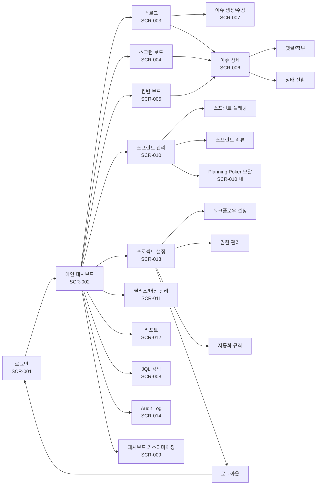
```mermaid
flowchart LR
    LOGIN[로그인\nSCR-001] --> MAIN[메인 대시보드\nSCR-002]
    MAIN --> BACKLOG[백로그\nSCR-003]
    MAIN --> SCRUM[스크럼 보드\nSCR-004]
    MAIN --> KANBAN[칸반 보드\nSCR-005]
    MAIN --> SETTINGS[프로젝트 설정\nSCR-013]

    BACKLOG --> ISSUE_CREATE[이슈 생성/수정\nSCR-007]
    BACKLOG --> ISSUE_DETAIL[이슈 상세\nSCR-006]
    SCRUM --> ISSUE_DETAIL
    KANBAN --> ISSUE_DETAIL
    ISSUE_DETAIL --> COMMENT[댓글/첨부]
    ISSUE_DETAIL --> TRANSITION[상태 전환]

    MAIN --> SPRINT_MGMT[스프린트 관리\nSCR-010]
    SPRINT_MGMT --> SPRINT_PLANNING[스프린트 플래닝]
    SPRINT_MGMT --> SPRINT_REVIEW[스프린트 리뷰]
    SPRINT_MGMT --> POKER_MODAL[Planning Poker 모달\nSCR-010 내]

    MAIN --> RELEASE[릴리즈/버전 관리\nSCR-011]
    MAIN --> REPORTS[리포트\nSCR-012]
    MAIN --> SEARCH[JQL 검색\nSCR-008]
    MAIN --> AUDIT[Audit Log\nSCR-014]
    MAIN --> DASHBOARD[대시보드 커스터마이징\nSCR-009]

    SETTINGS --> WORKFLOW[워크플로우 설정]
    SETTINGS --> PERMISSION[권한 관리]
    SETTINGS --> AUTOMATION_SET[자동화 규칙]
    SETTINGS --> LOGOUT[로그아웃]
    LOGOUT --> LOGIN
```

## 2. 주요 시퀀스 다이어그램

### 2.1 로그인 흐름

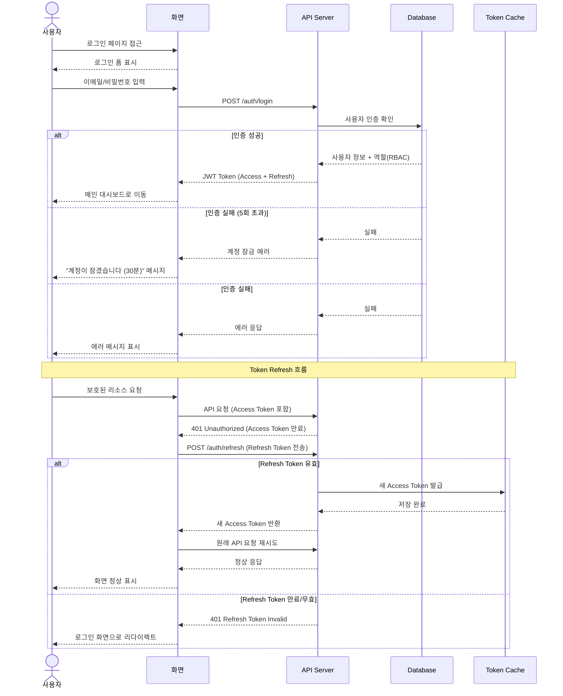
```mermaid
sequenceDiagram
    actor U as 사용자
    participant V as 화면
    participant A as API Server
    participant D as Database
    participant Cache as Token Cache

    U->>V: 로그인 페이지 접근
    V-->>U: 로그인 폼 표시
    U->>V: 이메일/비밀번호 입력
    V->>A: POST /auth/login
    A->>D: 사용자 인증 확인
    alt 인증 성공
        D-->>A: 사용자 정보 + 역할(RBAC)
        A-->>V: JWT Token (Access + Refresh)
        V-->>U: 메인 대시보드로 이동
    else 인증 실패 (5회 초과)
        D-->>A: 실패
        A-->>V: 계정 잠금 에러
        V-->>U: "계정이 잠겼습니다 (30분)" 메시지
    else 인증 실패
        D-->>A: 실패
        A-->>V: 에러 응답
        V-->>U: 에러 메시지 표시
    end

    Note over U,Cache: Token Refresh 흐름
    U->>V: 보호된 리소스 요청
    V->>A: API 요청 (Access Token 포함)
    A-->>V: 401 Unauthorized (Access Token 만료)
    V->>A: POST /auth/refresh (Refresh Token 전송)
    alt Refresh Token 유효
        A->>Cache: 새 Access Token 발급
        Cache-->>A: 저장 완료
        A-->>V: 새 Access Token 반환
        V->>A: 원래 API 요청 재시도
        A-->>V: 정상 응답
        V-->>U: 화면 정상 표시
    else Refresh Token 만료/무효
        A-->>V: 401 Refresh Token Invalid
        V-->>U: 로그인 화면으로 리다이렉트
    end
```

### 2.2 이슈 생성 및 스프린트 배정 흐름

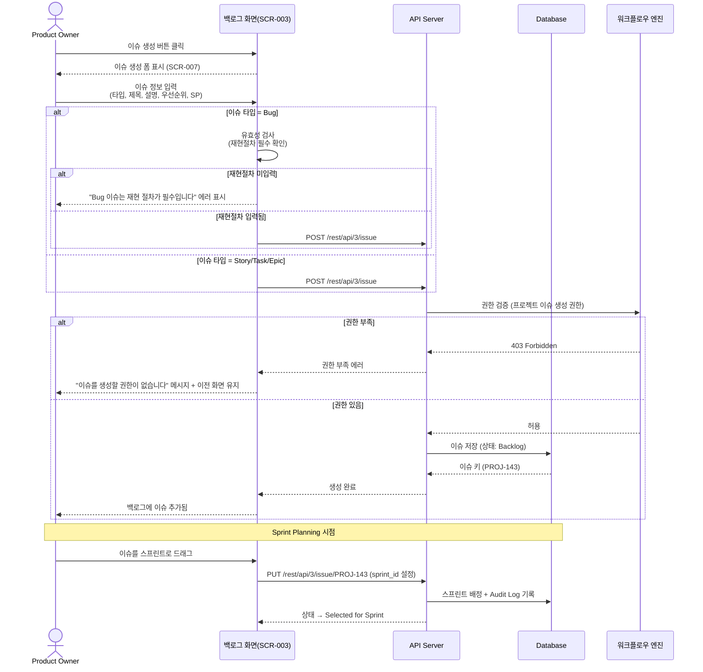
```mermaid
sequenceDiagram
    actor PO as Product Owner
    participant BL as 백로그 화면(SCR-003)
    participant A as API Server
    participant D as Database
    participant WF as 워크플로우 엔진

    PO->>BL: 이슈 생성 버튼 클릭
    BL-->>PO: 이슈 생성 폼 표시 (SCR-007)
    PO->>BL: 이슈 정보 입력<br/>(타입, 제목, 설명, 우선순위, SP)

    alt 이슈 타입 = Bug
        BL->>BL: 유효성 검사<br/>(재현절차 필수 확인)
        alt 재현절차 미입력
            BL-->>PO: "Bug 이슈는 재현 절차가 필수입니다" 에러 표시
        else 재현절차 입력됨
            BL->>A: POST /rest/api/3/issue
        end
    else 이슈 타입 = Story/Task/Epic
        BL->>A: POST /rest/api/3/issue
    end

    A->>WF: 권한 검증 (프로젝트 이슈 생성 권한)
    alt 권한 부족
        WF-->>A: 403 Forbidden
        A-->>BL: 권한 부족 에러
        BL-->>PO: "이슈를 생성할 권한이 없습니다" 메시지 + 이전 화면 유지
    else 권한 있음
        WF-->>A: 허용
        A->>D: 이슈 저장 (상태: Backlog)
        D-->>A: 이슈 키 (PROJ-143)
        A-->>BL: 생성 완료
        BL-->>PO: 백로그에 이슈 추가됨
    end

    Note over PO,D: Sprint Planning 시점
    PO->>BL: 이슈를 스프린트로 드래그
    BL->>A: PUT /rest/api/3/issue/PROJ-143 (sprint_id 설정)
    A->>D: 스프린트 배정 + Audit Log 기록
    A-->>BL: 상태 → Selected for Sprint
```

### 2.3 워크플로우 전환 흐름 (개발 → 코드리뷰 → QA → Done)

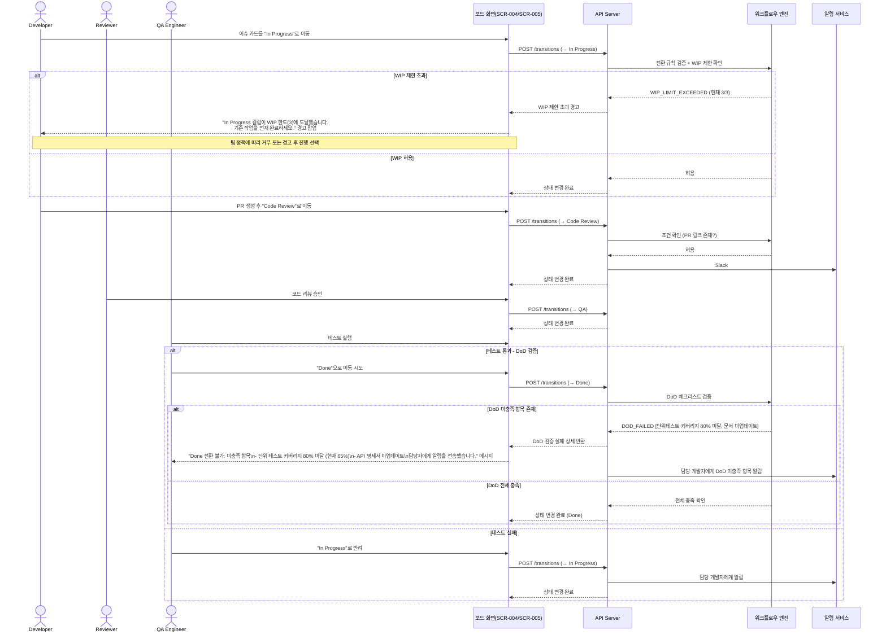
```mermaid
sequenceDiagram
    actor DEV as Developer
    actor REV as Reviewer
    actor QA as QA Engineer
    participant BD as 보드 화면(SCR-004/SCR-005)
    participant A as API Server
    participant WF as 워크플로우 엔진
    participant N as 알림 서비스

    DEV->>BD: 이슈 카드를 "In Progress"로 이동
    BD->>A: POST /transitions (→ In Progress)
    A->>WF: 전환 규칙 검증 + WIP 제한 확인
    alt WIP 제한 초과
        WF-->>A: WIP_LIMIT_EXCEEDED (현재 3/3)
        A-->>BD: WIP 제한 초과 경고
        BD-->>DEV: "In Progress 컬럼이 WIP 한도(3)에 도달했습니다.<br/>기존 작업을 먼저 완료하세요." 경고 팝업
        Note over DEV,BD: 팀 정책에 따라 거부 또는 경고 후 진행 선택
    else WIP 허용
        WF-->>A: 허용
        A-->>BD: 상태 변경 완료
    end

    DEV->>BD: PR 생성 후 "Code Review"로 이동
    BD->>A: POST /transitions (→ Code Review)
    A->>WF: 조건 확인 (PR 링크 존재?)
    WF-->>A: 허용
    A->>N: Slack #code-review 알림 + 리뷰어 자동 지정
    A-->>BD: 상태 변경 완료

    REV->>BD: 코드 리뷰 승인
    BD->>A: POST /transitions (→ QA)
    A-->>BD: 상태 변경 완료

    QA->>BD: 테스트 실행
    alt 테스트 통과 - DoD 검증
        QA->>BD: "Done"으로 이동 시도
        BD->>A: POST /transitions (→ Done)
        A->>WF: DoD 체크리스트 검증
        alt DoD 미충족 항목 존재
            WF-->>A: DOD_FAILED [단위테스트 커버리지 80% 미달, 문서 미업데이트]
            A-->>BD: DoD 검증 실패 상세 반환
            BD-->>QA: "Done 전환 불가: 미충족 항목\n- 단위 테스트 커버리지 80% 미달 (현재 65%)\n- API 명세서 미업데이트\n담당자에게 알림을 전송했습니다." 메시지
            A->>N: 담당 개발자에게 DoD 미충족 항목 알림
        else DoD 전체 충족
            WF-->>A: 전체 충족 확인
            A-->>BD: 상태 변경 완료 (Done)
        end
    else 테스트 실패
        QA->>BD: "In Progress"로 반려
        BD->>A: POST /transitions (→ In Progress)
        A->>N: 담당 개발자에게 알림
        A-->>BD: 상태 변경 완료
    end
```

### 2.4 릴리즈 관리 흐름

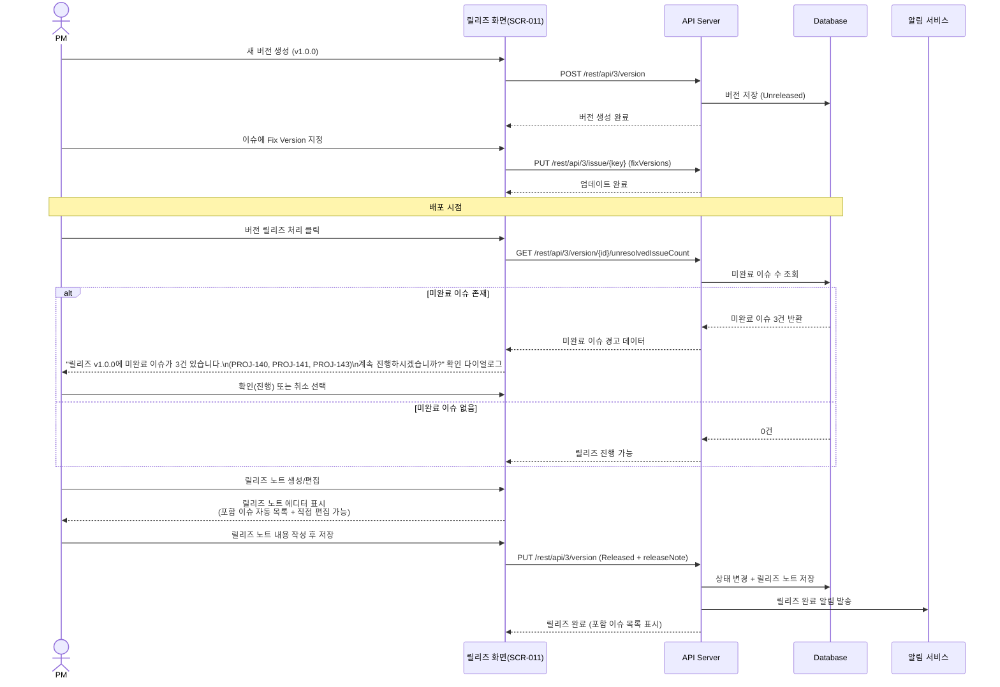
```mermaid
sequenceDiagram
    actor PM as PM
    participant RL as 릴리즈 화면(SCR-011)
    participant A as API Server
    participant D as Database
    participant N as 알림 서비스

    PM->>RL: 새 버전 생성 (v1.0.0)
    RL->>A: POST /rest/api/3/version
    A->>D: 버전 저장 (Unreleased)
    A-->>RL: 버전 생성 완료

    PM->>RL: 이슈에 Fix Version 지정
    RL->>A: PUT /rest/api/3/issue/{key} (fixVersions)
    A-->>RL: 업데이트 완료

    Note over PM,D: 배포 시점
    PM->>RL: 버전 릴리즈 처리 클릭
    RL->>A: GET /rest/api/3/version/{id}/unresolvedIssueCount
    A->>D: 미완료 이슈 수 조회
    alt 미완료 이슈 존재
        D-->>A: 미완료 이슈 3건 반환
        A-->>RL: 미완료 이슈 경고 데이터
        RL-->>PM: "릴리즈 v1.0.0에 미완료 이슈가 3건 있습니다.\n(PROJ-140, PROJ-141, PROJ-143)\n계속 진행하시겠습니까?" 확인 다이얼로그
        PM->>RL: 확인(진행) 또는 취소 선택
    else 미완료 이슈 없음
        D-->>A: 0건
        A-->>RL: 릴리즈 진행 가능
    end

    PM->>RL: 릴리즈 노트 생성/편집
    RL-->>PM: 릴리즈 노트 에디터 표시<br/>(포함 이슈 자동 목록 + 직접 편집 가능)
    PM->>RL: 릴리즈 노트 내용 작성 후 저장
    RL->>A: PUT /rest/api/3/version (Released + releaseNote)
    A->>D: 상태 변경 + 릴리즈 노트 저장
    A->>N: 릴리즈 완료 알림 발송
    A-->>RL: 릴리즈 완료 (포함 이슈 목록 표시)
```

### 2.5 JQL 검색 흐름

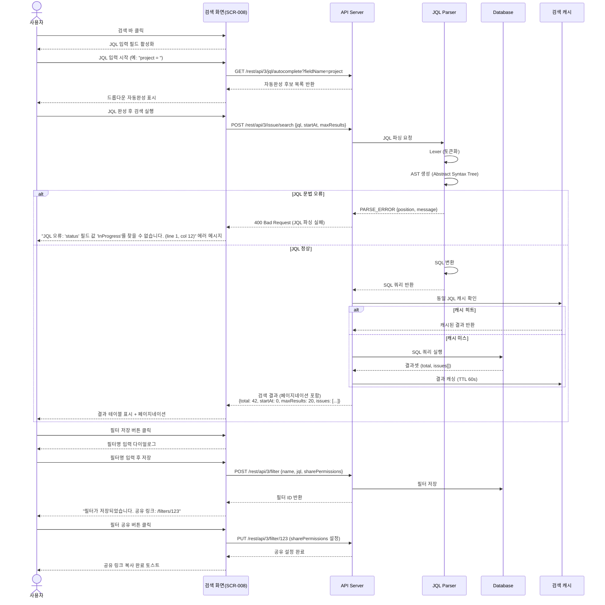
```mermaid
sequenceDiagram
    actor U as 사용자
    participant V as 검색 화면(SCR-008)
    participant A as API Server
    participant P as JQL Parser
    participant D as Database
    participant Cache as 검색 캐시

    U->>V: 검색 바 클릭
    V-->>U: JQL 입력 필드 활성화
    U->>V: JQL 입력 시작 (예: "project = ")
    V->>A: GET /rest/api/3/jql/autocomplete?fieldName=project
    A-->>V: 자동완성 후보 목록 반환
    V-->>U: 드롭다운 자동완성 표시

    U->>V: JQL 완성 후 검색 실행
    V->>A: POST /rest/api/3/issue/search {jql, startAt, maxResults}

    A->>P: JQL 파싱 요청
    P->>P: Lexer (토큰화)
    P->>P: AST 생성 (Abstract Syntax Tree)
    alt JQL 문법 오류
        P-->>A: PARSE_ERROR {position, message}
        A-->>V: 400 Bad Request (JQL 파싱 실패)
        V-->>U: "JQL 오류: 'status' 필드 값 'InProgress'를 찾을 수 없습니다. (line 1, col 12)" 에러 메시지
    else JQL 정상
        P->>P: SQL 변환
        P-->>A: SQL 쿼리 반환
        A->>Cache: 동일 JQL 캐시 확인
        alt 캐시 히트
            Cache-->>A: 캐시된 결과 반환
        else 캐시 미스
            A->>D: SQL 쿼리 실행
            D-->>A: 결과셋 (total, issues[])
            A->>Cache: 결과 캐싱 (TTL 60s)
        end
        A-->>V: 검색 결과 (페이지네이션 포함)<br/>{total: 42, startAt: 0, maxResults: 20, issues: [...]}
        V-->>U: 결과 테이블 표시 + 페이지네이션
    end

    U->>V: 필터 저장 버튼 클릭
    V-->>U: 필터명 입력 다이얼로그
    U->>V: 필터명 입력 후 저장
    V->>A: POST /rest/api/3/filter {name, jql, sharePermissions}
    A->>D: 필터 저장
    A-->>V: 필터 ID 반환
    V-->>U: "필터가 저장되었습니다. 공유 링크: /filters/123"

    U->>V: 필터 공유 버튼 클릭
    V->>A: PUT /rest/api/3/filter/123 (sharePermissions 설정)
    A-->>V: 공유 설정 완료
    V-->>U: 공유 링크 복사 완료 토스트
```

### 2.6 대시보드 가젯 로딩 흐름

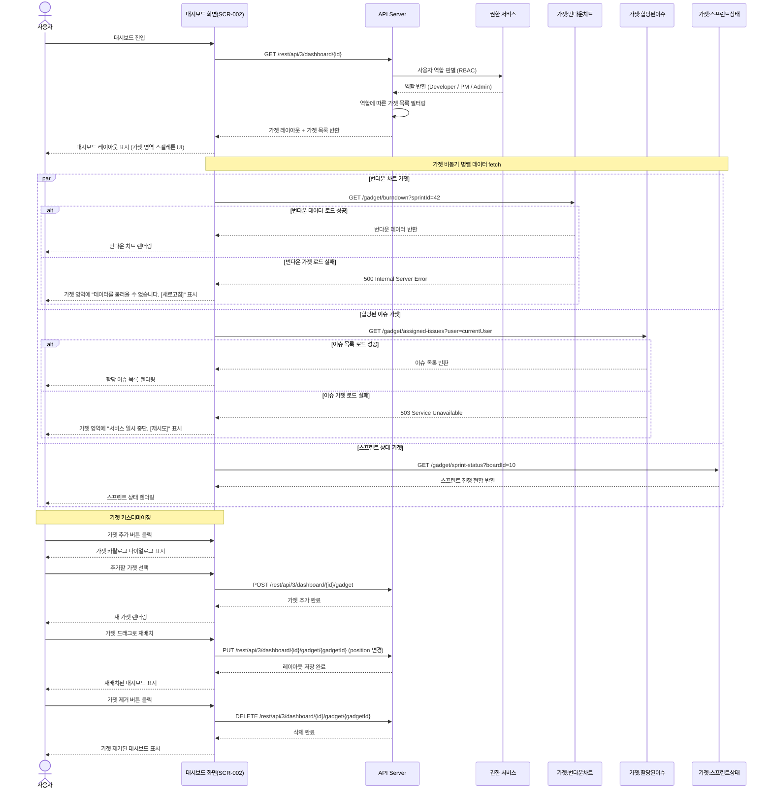
```mermaid
sequenceDiagram
    actor U as 사용자
    participant V as 대시보드 화면(SCR-002)
    participant A as API Server
    participant Auth as 권한 서비스
    participant G1 as 가젯:번다운차트
    participant G2 as 가젯:할당된이슈
    participant G3 as 가젯:스프린트상태

    U->>V: 대시보드 진입
    V->>A: GET /rest/api/3/dashboard/{id}
    A->>Auth: 사용자 역할 판별 (RBAC)
    Auth-->>A: 역할 반환 (Developer / PM / Admin)
    A->>A: 역할에 따른 가젯 목록 필터링
    A-->>V: 가젯 레이아웃 + 가젯 목록 반환

    V-->>U: 대시보드 레이아웃 표시 (가젯 영역 스켈레톤 UI)

    Note over V,G3: 가젯 비동기 병렬 데이터 fetch
    par 번다운 차트 가젯
        V->>G1: GET /gadget/burndown?sprintId=42
        alt 번다운 데이터 로드 성공
            G1-->>V: 번다운 데이터 반환
            V-->>U: 번다운 차트 렌더링
        else 번다운 가젯 로드 실패
            G1-->>V: 500 Internal Server Error
            V-->>U: 가젯 영역에 "데이터를 불러올 수 없습니다. [새로고침]" 표시
        end
    and 할당된 이슈 가젯
        V->>G2: GET /gadget/assigned-issues?user=currentUser
        alt 이슈 목록 로드 성공
            G2-->>V: 이슈 목록 반환
            V-->>U: 할당 이슈 목록 렌더링
        else 이슈 가젯 로드 실패
            G2-->>V: 503 Service Unavailable
            V-->>U: 가젯 영역에 "서비스 일시 중단. [재시도]" 표시
        end
    and 스프린트 상태 가젯
        V->>G3: GET /gadget/sprint-status?boardId=10
        G3-->>V: 스프린트 진행 현황 반환
        V-->>U: 스프린트 상태 렌더링
    end

    Note over U,V: 가젯 커스터마이징
    U->>V: 가젯 추가 버튼 클릭
    V-->>U: 가젯 카탈로그 다이얼로그 표시
    U->>V: 추가할 가젯 선택
    V->>A: POST /rest/api/3/dashboard/{id}/gadget
    A-->>V: 가젯 추가 완료
    V-->>U: 새 가젯 렌더링

    U->>V: 가젯 드래그로 재배치
    V->>A: PUT /rest/api/3/dashboard/{id}/gadget/{gadgetId} (position 변경)
    A-->>V: 레이아웃 저장 완료
    V-->>U: 재배치된 대시보드 표시

    U->>V: 가젯 제거 버튼 클릭
    V->>A: DELETE /rest/api/3/dashboard/{id}/gadget/{gadgetId}
    A-->>V: 삭제 완료
    V-->>U: 가젯 제거된 대시보드 표시
```

### 2.7 자동화 규칙 실행 흐름

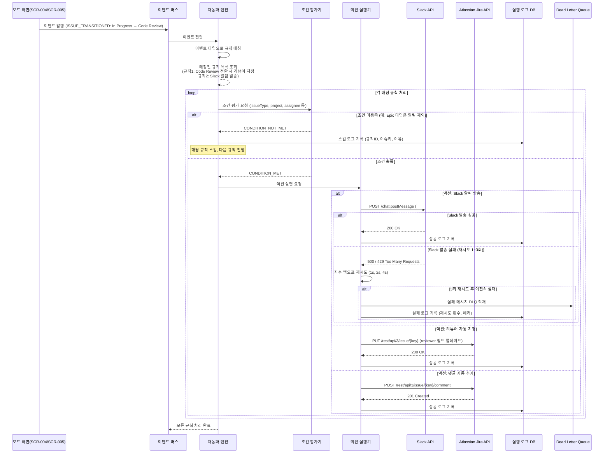
```mermaid
sequenceDiagram
    participant BOARD as 보드 화면(SCR-004/SCR-005)
    participant ES as 이벤트 버스
    participant AE as 자동화 엔진
    participant CE as 조건 평가기
    participant AX as 액션 실행기
    participant SLACK as Slack API
    participant JIRA as Atlassian Jira API
    participant LOG as 실행 로그 DB
    participant DLQ as Dead Letter Queue

    BOARD->>ES: 이벤트 발행 (ISSUE_TRANSITIONED: In Progress → Code Review)
    ES->>AE: 이벤트 전달
    AE->>AE: 이벤트 타입으로 규칙 매칭
    AE-->>AE: 매칭된 규칙 목록 조회<br/>(규칙1: Code Review 전환 시 리뷰어 지정<br/>규칙2: Slack 알림 발송)

    loop 각 매칭 규칙 처리
        AE->>CE: 조건 평가 요청 (issueType, project, assignee 등)
        alt 조건 미충족 (예: Epic 타입은 알림 제외)
            CE-->>AE: CONDITION_NOT_MET
            AE->>LOG: 스킵 로그 기록 (규칙ID, 이슈키, 이유)
            Note over AE: 해당 규칙 스킵, 다음 규칙 진행
        else 조건 충족
            CE-->>AE: CONDITION_MET
            AE->>AX: 액션 실행 요청

            alt 액션: Slack 알림 발송
                AX->>SLACK: POST /chat.postMessage (#code-review 채널)
                alt Slack 발송 성공
                    SLACK-->>AX: 200 OK
                    AX->>LOG: 성공 로그 기록
                else Slack 발송 실패 (재시도 1~3회)
                    SLACK-->>AX: 500 / 429 Too Many Requests
                    AX->>AX: 지수 백오프 재시도 (1s, 2s, 4s)
                    alt 3회 재시도 후 여전히 실패
                        AX->>DLQ: 실패 메시지 DLQ 적재
                        AX->>LOG: 실패 로그 기록 (재시도 횟수, 에러)
                    end
                end
            else 액션: 리뷰어 자동 지정
                AX->>JIRA: PUT /rest/api/3/issue/{key} (reviewer 필드 업데이트)
                JIRA-->>AX: 200 OK
                AX->>LOG: 성공 로그 기록
            else 액션: 댓글 자동 추가
                AX->>JIRA: POST /rest/api/3/issue/{key}/comment
                JIRA-->>AX: 201 Created
                AX->>LOG: 성공 로그 기록
            end
        end
    end

    AE-->>ES: 모든 규칙 처리 완료
```

### 2.8 Planning Poker 흐름 (SCR-010 스프린트 관리 모달)

> Planning Poker는 독립 화면이 아닌 SCR-010 스프린트 관리 화면 내 모달로 진입한다.
> 실시간 통신은 양방향이 필요하므로 WebSocket을 사용한다 (SSE vs WebSocket 선택 기준 참조).

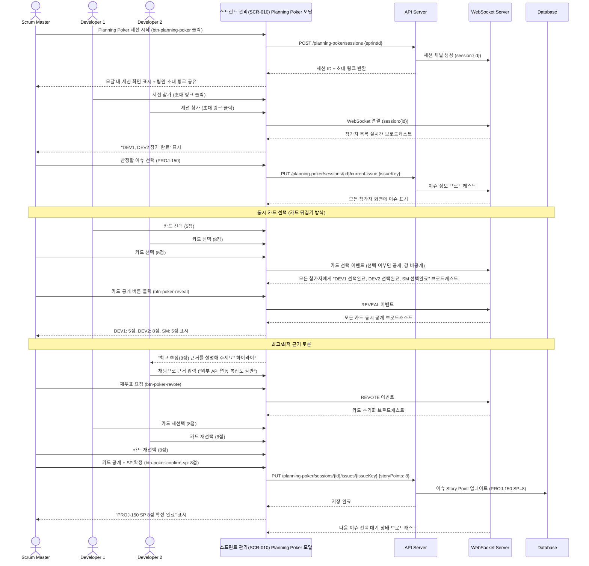
```mermaid
sequenceDiagram
    actor SM as Scrum Master
    actor DEV1 as Developer 1
    actor DEV2 as Developer 2
    participant V as 스프린트 관리(SCR-010) Planning Poker 모달
    participant A as API Server
    participant WS as WebSocket Server
    participant D as Database

    SM->>V: Planning Poker 세션 시작 (btn-planning-poker 클릭)
    V->>A: POST /planning-poker/sessions {sprintId}
    A->>WS: 세션 채널 생성 (session:{id})
    A-->>V: 세션 ID + 초대 링크 반환
    V-->>SM: 모달 내 세션 화면 표시 + 팀원 초대 링크 공유

    DEV1->>V: 세션 참가 (초대 링크 클릭)
    DEV2->>V: 세션 참가 (초대 링크 클릭)
    V->>WS: WebSocket 연결 (session:{id})
    WS-->>V: 참가자 목록 실시간 브로드캐스트
    V-->>SM: "DEV1, DEV2 참가 완료" 표시

    SM->>V: 산정할 이슈 선택 (PROJ-150)
    V->>A: PUT /planning-poker/sessions/{id}/current-issue {issueKey}
    A->>WS: 이슈 정보 브로드캐스트
    WS-->>V: 모든 참가자 화면에 이슈 표시

    Note over SM,D: 동시 카드 선택 (카드 뒤집기 방식)
    DEV1->>V: 카드 선택 (5점)
    DEV2->>V: 카드 선택 (8점)
    SM->>V: 카드 선택 (5점)
    V->>WS: 카드 선택 이벤트 (선택 여부만 공개, 값 비공개)
    WS-->>V: 모든 참가자에게 "DEV1 선택완료, DEV2 선택완료, SM 선택완료" 브로드캐스트

    SM->>V: 카드 공개 버튼 클릭 (btn-poker-reveal)
    V->>WS: REVEAL 이벤트
    WS-->>V: 모든 카드 동시 공개 브로드캐스트
    V-->>SM: DEV1: 5점, DEV2: 8점, SM: 5점 표시

    Note over SM,D: 최고/최저 근거 토론
    V-->>DEV2: "최고 추정(8점) 근거를 설명해 주세요" 하이라이트
    DEV2->>V: 채팅으로 근거 입력 ("외부 API 연동 복잡도 감안")
    SM->>V: 재투표 요청 (btn-poker-revote)
    V->>WS: REVOTE 이벤트
    WS-->>V: 카드 초기화 브로드캐스트

    DEV1->>V: 카드 재선택 (8점)
    DEV2->>V: 카드 재선택 (8점)
    SM->>V: 카드 재선택 (8점)
    SM->>V: 카드 공개 + SP 확정 (btn-poker-confirm-sp: 8점)
    V->>A: PUT /planning-poker/sessions/{id}/issues/{issueKey} {storyPoints: 8}
    A->>D: 이슈 Story Point 업데이트 (PROJ-150 SP=8)
    A-->>V: 저장 완료
    V-->>SM: "PROJ-150 SP 8점 확정 완료" 표시
    WS-->>V: 다음 이슈 선택 대기 상태 브로드캐스트
```

### 2.9 아카이브/복원 흐름

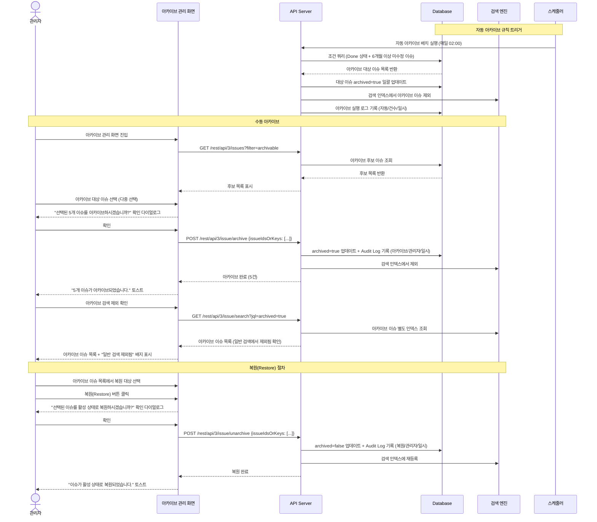
```mermaid
sequenceDiagram
    actor ADMIN as 관리자
    participant V as 아카이브 관리 화면
    participant A as API Server
    participant D as Database
    participant SE as 검색 엔진
    participant SCH as 스케줄러

    Note over SCH,D: 자동 아카이브 규칙 트리거
    SCH->>A: 자동 아카이브 배치 실행 (매일 02:00)
    A->>D: 조건 쿼리 (Done 상태 + 6개월 이상 미수정 이슈)
    D-->>A: 아카이브 대상 이슈 목록 반환
    A->>D: 대상 이슈 archived=true 일괄 업데이트
    A->>SE: 검색 인덱스에서 아카이브 이슈 제외
    A->>D: 아카이브 실행 로그 기록 (자동/건수/일시)

    Note over ADMIN,SE: 수동 아카이브
    ADMIN->>V: 아카이브 관리 화면 진입
    V->>A: GET /rest/api/3/issues?filter=archivable
    A->>D: 아카이브 후보 이슈 조회
    D-->>A: 후보 목록 반환
    A-->>V: 후보 목록 표시

    ADMIN->>V: 아카이브 대상 이슈 선택 (다중 선택)
    V-->>ADMIN: "선택된 5개 이슈를 아카이브하시겠습니까?" 확인 다이얼로그
    ADMIN->>V: 확인
    V->>A: POST /rest/api/3/issue/archive {issueIdsOrKeys: [...]}
    A->>D: archived=true 업데이트 + Audit Log 기록 (아카이브/관리자/일시)
    A->>SE: 검색 인덱스에서 제외
    A-->>V: 아카이브 완료 (5건)
    V-->>ADMIN: "5개 이슈가 아카이브되었습니다." 토스트

    ADMIN->>V: 아카이브 검색 제외 확인
    V->>A: GET /rest/api/3/issue/search?jql=archived=true
    A->>SE: 아카이브 이슈 별도 인덱스 조회
    A-->>V: 아카이브 이슈 목록 (일반 검색에서 제외됨 확인)
    V-->>ADMIN: 아카이브 이슈 목록 + "일반 검색 제외됨" 배지 표시

    Note over ADMIN,SE: 복원(Restore) 절차
    ADMIN->>V: 아카이브 이슈 목록에서 복원 대상 선택
    ADMIN->>V: 복원(Restore) 버튼 클릭
    V-->>ADMIN: "선택된 이슈를 활성 상태로 복원하시겠습니까?" 확인 다이얼로그
    ADMIN->>V: 확인
    V->>A: POST /rest/api/3/issue/unarchive {issueIdsOrKeys: [...]}
    A->>D: archived=false 업데이트 + Audit Log 기록 (복원/관리자/일시)
    A->>SE: 검색 인덱스에 재등록
    A-->>V: 복원 완료
    V-->>ADMIN: "이슈가 활성 상태로 복원되었습니다." 토스트
```

### 2.10 외부 연동 (GitHub PR → Atlassian Jira)

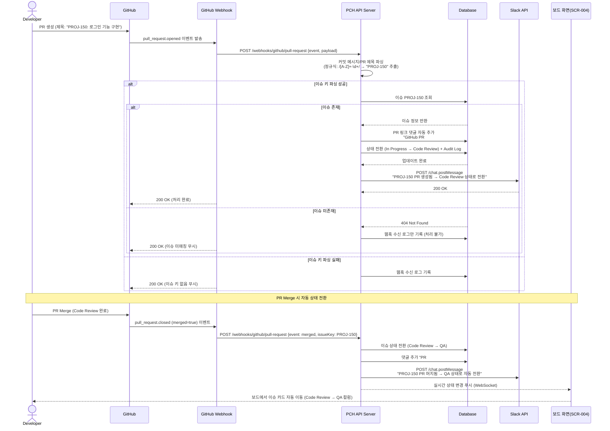
```mermaid
sequenceDiagram
    actor DEV as Developer
    participant GH as GitHub
    participant GH_WH as GitHub Webhook
    participant A as PCH API Server
    participant D as Database
    participant SLACK as Slack API
    participant BOARD as 보드 화면(SCR-004)

    DEV->>GH: PR 생성 (제목: "PROJ-150: 로그인 기능 구현")
    GH->>GH_WH: pull_request.opened 이벤트 발송
    GH_WH->>A: POST /webhooks/github/pull-request {event, payload}

    A->>A: 커밋 메시지/PR 제목 파싱<br/>(정규식: /[A-Z]+-\d+/ → "PROJ-150" 추출)
    alt 이슈 키 파싱 성공
        A->>D: 이슈 PROJ-150 조회
        alt 이슈 존재
            D-->>A: 이슈 정보 반환
            A->>D: PR 링크 댓글 자동 추가<br/>"GitHub PR #42 연결됨: [PR 제목](PR URL)"
            A->>D: 상태 전환 (In Progress → Code Review) + Audit Log
            D-->>A: 업데이트 완료
            A->>SLACK: POST /chat.postMessage<br/>"PROJ-150 PR 생성됨 → Code Review 상태로 전환"
            SLACK-->>A: 200 OK
            GH_WH-->>GH: 200 OK (처리 완료)
        else 이슈 미존재
            D-->>A: 404 Not Found
            A->>D: 웹훅 수신 로그만 기록 (처리 불가)
            GH_WH-->>GH: 200 OK (이슈 미매칭 무시)
        end
    else 이슈 키 파싱 실패
        A->>D: 웹훅 수신 로그 기록
        GH_WH-->>GH: 200 OK (이슈 키 없음 무시)
    end

    Note over DEV,BOARD: PR Merge 시 자동 상태 전환
    DEV->>GH: PR Merge (Code Review 완료)
    GH->>GH_WH: pull_request.closed (merged=true) 이벤트
    GH_WH->>A: POST /webhooks/github/pull-request {event: merged, issueKey: PROJ-150}
    A->>D: 이슈 상태 전환 (Code Review → QA)
    A->>D: 댓글 추가 "PR #42 머지 완료 → QA 단계로 자동 전환"
    A->>SLACK: POST /chat.postMessage<br/>"PROJ-150 PR 머지됨 → QA 상태로 자동 전환"
    A-->>BOARD: 실시간 상태 변경 푸시 (WebSocket)
    BOARD-->>DEV: 보드에서 이슈 카드 자동 이동 (Code Review → QA 컬럼)
```

### 2.11 Audit Log 조회/내보내기

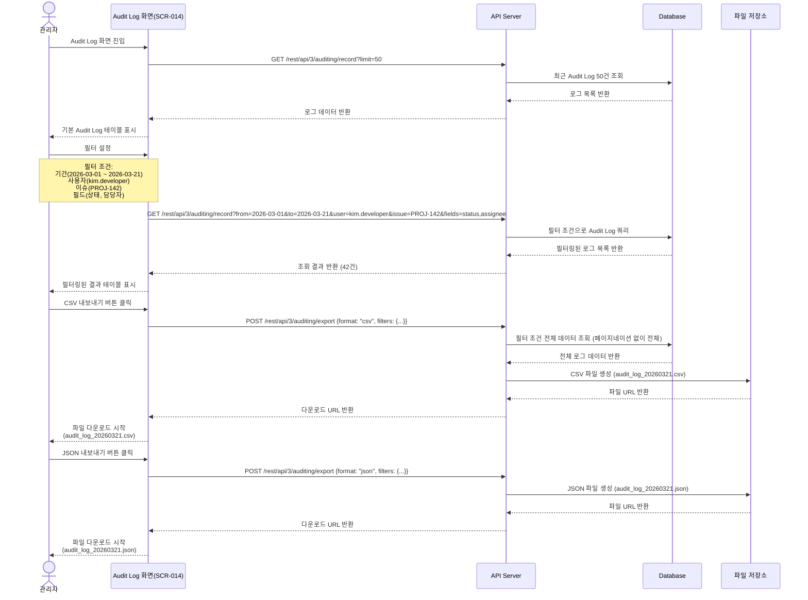
```mermaid
sequenceDiagram
    actor ADMIN as 관리자
    participant V as Audit Log 화면(SCR-014)
    participant A as API Server
    participant D as Database
    participant FS as 파일 저장소

    ADMIN->>V: Audit Log 화면 진입
    V->>A: GET /rest/api/3/auditing/record?limit=50
    A->>D: 최근 Audit Log 50건 조회
    D-->>A: 로그 목록 반환
    A-->>V: 로그 데이터 반환
    V-->>ADMIN: 기본 Audit Log 테이블 표시

    ADMIN->>V: 필터 설정
    Note over ADMIN,V: 필터 조건:<br/>기간(2026-03-01 ~ 2026-03-21)<br/>사용자(kim.developer)<br/>이슈(PROJ-142)<br/>필드(상태, 담당자)
    V->>A: GET /rest/api/3/auditing/record?from=2026-03-01&to=2026-03-21&user=kim.developer&issue=PROJ-142&fields=status,assignee
    A->>D: 필터 조건으로 Audit Log 쿼리
    D-->>A: 필터링된 로그 목록 반환
    A-->>V: 조회 결과 반환 (42건)
    V-->>ADMIN: 필터링된 결과 테이블 표시

    ADMIN->>V: CSV 내보내기 버튼 클릭
    V->>A: POST /rest/api/3/auditing/export {format: "csv", filters: {...}}
    A->>D: 필터 조건 전체 데이터 조회 (페이지네이션 없이 전체)
    D-->>A: 전체 로그 데이터 반환
    A->>FS: CSV 파일 생성 (audit_log_20260321.csv)
    FS-->>A: 파일 URL 반환
    A-->>V: 다운로드 URL 반환
    V-->>ADMIN: 파일 다운로드 시작<br/>(audit_log_20260321.csv)

    ADMIN->>V: JSON 내보내기 버튼 클릭
    V->>A: POST /rest/api/3/auditing/export {format: "json", filters: {...}}
    A->>FS: JSON 파일 생성 (audit_log_20260321.json)
    FS-->>A: 파일 URL 반환
    A-->>V: 다운로드 URL 반환
    V-->>ADMIN: 파일 다운로드 시작<br/>(audit_log_20260321.json)
```

## 3. 에러/예외 통합 시퀀스

### 3.1 공통 에러 처리 흐름

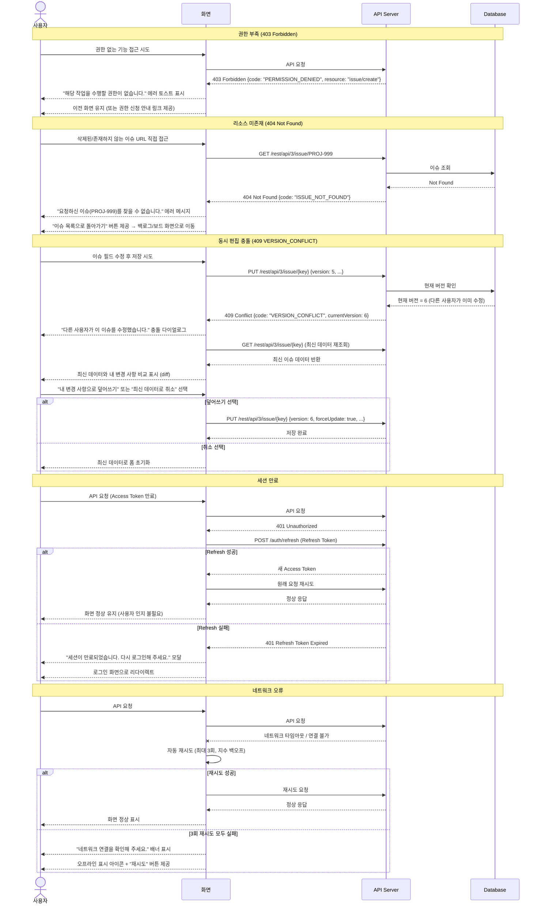
```mermaid
sequenceDiagram
    actor U as 사용자
    participant V as 화면
    participant A as API Server
    participant D as Database

    Note over U,D: 권한 부족 (403 Forbidden)
    U->>V: 권한 없는 기능 접근 시도
    V->>A: API 요청
    A-->>V: 403 Forbidden {code: "PERMISSION_DENIED", resource: "issue/create"}
    V-->>U: "해당 작업을 수행할 권한이 없습니다." 에러 토스트 표시
    V-->>U: 이전 화면 유지 (또는 권한 신청 안내 링크 제공)

    Note over U,D: 리소스 미존재 (404 Not Found)
    U->>V: 삭제된/존재하지 않는 이슈 URL 직접 접근
    V->>A: GET /rest/api/3/issue/PROJ-999
    A->>D: 이슈 조회
    D-->>A: Not Found
    A-->>V: 404 Not Found {code: "ISSUE_NOT_FOUND"}
    V-->>U: "요청하신 이슈(PROJ-999)를 찾을 수 없습니다." 에러 메시지
    V-->>U: "이슈 목록으로 돌아가기" 버튼 제공 → 백로그/보드 화면으로 이동

    Note over U,D: 동시 편집 충돌 (409 VERSION_CONFLICT)
    U->>V: 이슈 필드 수정 후 저장 시도
    V->>A: PUT /rest/api/3/issue/{key} {version: 5, ...}
    A->>D: 현재 버전 확인
    D-->>A: 현재 버전 = 6 (다른 사용자가 이미 수정)
    A-->>V: 409 Conflict {code: "VERSION_CONFLICT", currentVersion: 6}
    V-->>U: "다른 사용자가 이 이슈를 수정했습니다." 충돌 다이얼로그
    V->>A: GET /rest/api/3/issue/{key} (최신 데이터 재조회)
    A-->>V: 최신 이슈 데이터 반환
    V-->>U: 최신 데이터와 내 변경 사항 비교 표시 (diff)
    U->>V: "내 변경 사항으로 덮어쓰기" 또는 "최신 데이터로 취소" 선택
    alt 덮어쓰기 선택
        V->>A: PUT /rest/api/3/issue/{key} {version: 6, forceUpdate: true, ...}
        A-->>V: 저장 완료
    else 취소 선택
        V-->>U: 최신 데이터로 폼 초기화
    end

    Note over U,D: 세션 만료
    U->>V: API 요청 (Access Token 만료)
    V->>A: API 요청
    A-->>V: 401 Unauthorized
    V->>A: POST /auth/refresh (Refresh Token)
    alt Refresh 성공
        A-->>V: 새 Access Token
        V->>A: 원래 요청 재시도
        A-->>V: 정상 응답
        V-->>U: 화면 정상 유지 (사용자 인지 불필요)
    else Refresh 실패
        A-->>V: 401 Refresh Token Expired
        V-->>U: "세션이 만료되었습니다. 다시 로그인해 주세요." 모달
        V-->>U: 로그인 화면으로 리다이렉트
    end

    Note over U,D: 네트워크 오류
    U->>V: API 요청
    V->>A: API 요청
    A--xV: 네트워크 타임아웃 / 연결 불가
    V->>V: 자동 재시도 (최대 3회, 지수 백오프)
    alt 재시도 성공
        V->>A: 재시도 요청
        A-->>V: 정상 응답
        V-->>U: 화면 정상 표시
    else 3회 재시도 모두 실패
        V-->>U: "네트워크 연결을 확인해 주세요." 배너 표시
        V-->>U: 오프라인 표시 아이콘 + "재시도" 버튼 제공
    end
```

## 4. 실시간 업데이트 흐름

### 4.1 WebSocket/SSE 기반 실시간 동기화

> **SSE vs WebSocket 선택 기준**
> - **WebSocket**: 클라이언트-서버 양방향 통신이 필요한 경우. 보드 카드 이동(SCR-004/SCR-005), 이슈 상세 댓글 실시간 추가(SCR-006), Planning Poker 세션(SCR-010)에 적용.
> - **SSE (Server-Sent Events)**: 서버→클라이언트 단방향 푸시로 충분한 경우. 대시보드 가젯 자동 새로고침(SCR-002)처럼 주기적 데이터 갱신에 적용. 연결 유지 비용이 낮고 HTTP/2와 호환성이 좋음.

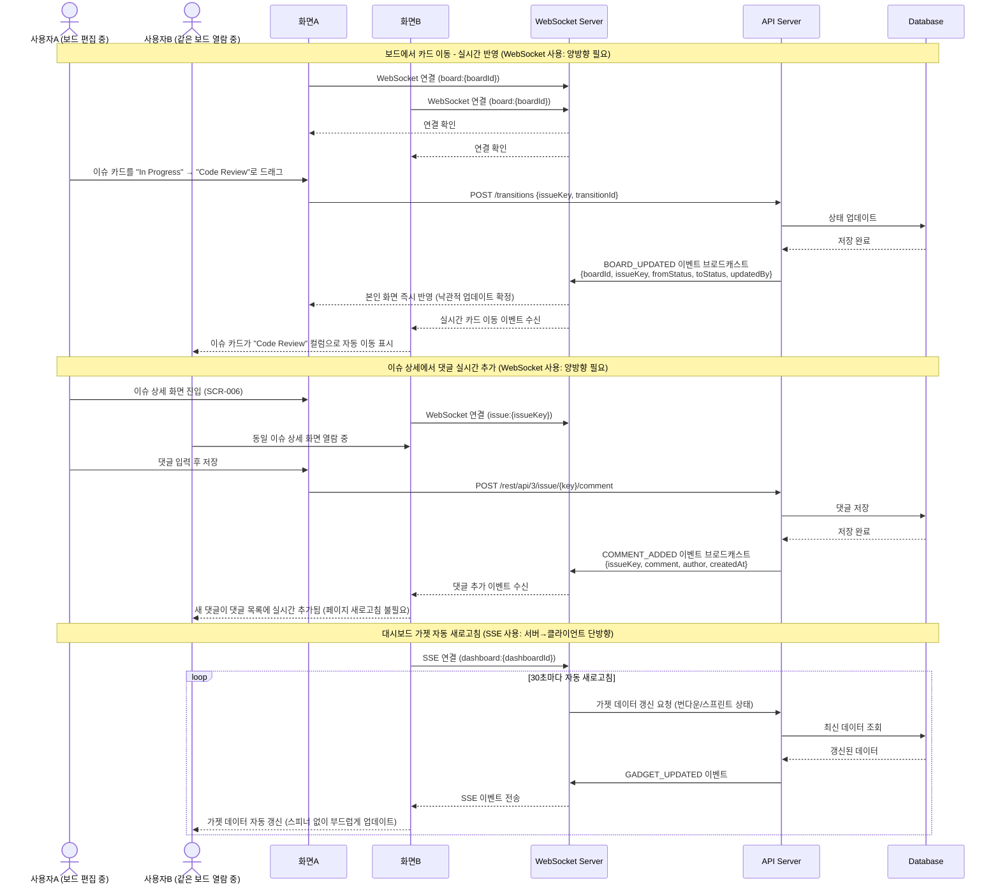
```mermaid
sequenceDiagram
    actor U1 as 사용자A (보드 편집 중)
    actor U2 as 사용자B (같은 보드 열람 중)
    participant V1 as 화면A
    participant V2 as 화면B
    participant WS as WebSocket Server
    participant A as API Server
    participant D as Database

    Note over U1,D: 보드에서 카드 이동 - 실시간 반영 (WebSocket 사용: 양방향 필요)
    V1->>WS: WebSocket 연결 (board:{boardId})
    V2->>WS: WebSocket 연결 (board:{boardId})
    WS-->>V1: 연결 확인
    WS-->>V2: 연결 확인

    U1->>V1: 이슈 카드를 "In Progress" → "Code Review"로 드래그
    V1->>A: POST /transitions {issueKey, transitionId}
    A->>D: 상태 업데이트
    D-->>A: 저장 완료
    A->>WS: BOARD_UPDATED 이벤트 브로드캐스트<br/>{boardId, issueKey, fromStatus, toStatus, updatedBy}
    WS-->>V1: 본인 화면 즉시 반영 (낙관적 업데이트 확정)
    WS-->>V2: 실시간 카드 이동 이벤트 수신
    V2-->>U2: 이슈 카드가 "Code Review" 컬럼으로 자동 이동 표시

    Note over U1,D: 이슈 상세에서 댓글 실시간 추가 (WebSocket 사용: 양방향 필요)
    U1->>V1: 이슈 상세 화면 진입 (SCR-006)
    V2->>WS: WebSocket 연결 (issue:{issueKey})
    U2->>V2: 동일 이슈 상세 화면 열람 중

    U1->>V1: 댓글 입력 후 저장
    V1->>A: POST /rest/api/3/issue/{key}/comment
    A->>D: 댓글 저장
    D-->>A: 저장 완료
    A->>WS: COMMENT_ADDED 이벤트 브로드캐스트<br/>{issueKey, comment, author, createdAt}
    WS-->>V2: 댓글 추가 이벤트 수신
    V2-->>U2: 새 댓글이 댓글 목록에 실시간 추가됨 (페이지 새로고침 불필요)

    Note over U1,D: 대시보드 가젯 자동 새로고침 (SSE 사용: 서버→클라이언트 단방향)
    V2->>WS: SSE 연결 (dashboard:{dashboardId})
    loop 30초마다 자동 새로고침
        WS->>A: 가젯 데이터 갱신 요청 (번다운/스프린트 상태)
        A->>D: 최신 데이터 조회
        D-->>A: 갱신된 데이터
        A->>WS: GADGET_UPDATED 이벤트
        WS-->>V2: SSE 이벤트 전송
        V2-->>U2: 가젯 데이터 자동 갱신 (스피너 없이 부드럽게 업데이트)
    end
```

## 5. 화면 전환 매트릭스

| From \ To | 로그인 | 대시보드 | 백로그 | 스크럼보드 | 칸반보드 | 이슈상세 | 이슈생성/수정 | JQL검색 | 대시보드커스텀 | 스프린트관리 | 릴리즈/버전 | 리포트 | 설정 | Audit Log |
|-----------|:------:|:-------:|:------:|:----------:|:--------:|:-------:|:------------:|:-------:|:--------------:|:-----------:|:-----------:|:------:|:----:|:---------:|
| 로그인 | - | O | - | - | - | - | - | - | - | - | - | - | - | - |
| 대시보드 | - | - | O | O | O | O | O | O | O | O | O | O | O | O |
| 백로그 | - | O | - | O | O | O | O | O | - | O | - | - | - | - |
| 스크럼보드 | - | O | O | - | O | O | - | O | - | O | - | - | - | - |
| 칸반보드 | - | O | O | O | - | O | - | O | - | - | - | - | - | - |
| 이슈상세 | - | O | O | O | O | - | - | - | - | - | O | - | - | - |
| 이슈생성/수정 | - | O | O | - | - | O | - | - | - | - | - | - | - | - |
| JQL검색 | - | O | O | O | O | O | - | - | - | - | - | - | - | - |
| 대시보드커스텀 | - | O | - | - | - | O | - | - | - | - | O | - | - | - |
| 스프린트관리 | - | O | O | O | O | O | - | - | - | - | - | O | - | - |
| 릴리즈/버전 | - | O | - | - | - | O | - | - | - | - | - | - | - | - |
| 리포트 | - | O | - | O | O | O | - | - | - | O | - | - | - | - |
| 설정 | O | O | - | - | - | - | - | - | - | - | - | - | - | - |
| Audit Log | - | O | - | - | - | O | - | - | - | - | - | - | O | - |

> O: 직접 전환 가능 / -: 직접 전환 없음

### 화면 목록 (SCR 코드 기준 — 06-화면기능정의서 정본 기준)

| SCR 코드 | 화면명 | 주요 진입 경로 |
|----------|--------|---------------|
| SCR-001 | 로그인 | 최초 접근 / 세션 만료 |
| SCR-002 | 메인 대시보드 | 로그인 후 / 네비게이션 |
| SCR-003 | 백로그 | 대시보드 → 백로그 |
| SCR-004 | 스크럼 보드 | 대시보드 → 보드 → 스크럼 |
| SCR-005 | 칸반 보드 | 대시보드 → 보드 → 칸반 |
| SCR-006 | 이슈 상세 | 백로그/보드 → 이슈 클릭 |
| SCR-007 | 이슈 생성/수정 | 백로그 → 이슈 생성 버튼 |
| SCR-008 | JQL 검색 | 대시보드 → 검색 / GNB 검색 |
| SCR-009 | 대시보드 커스터마이징 | 대시보드 → 가젯 관리 |
| SCR-010 | 스프린트 관리 (Planning Poker 모달 포함) | 대시보드 → 스프린트 관리 |
| SCR-011 | 릴리즈/버전 관리 | 대시보드 → 릴리즈 |
| SCR-012 | 리포트 (번다운/속도/CFD) | 대시보드 → 리포트 |
| SCR-013 | 프로젝트 설정 | 대시보드 → 설정 |
| SCR-014 | Audit Log | 대시보드 → Audit Log |

## 변경 이력

| 버전 | 날짜 | 작성자 | 변경 내용 |
|------|------|--------|-----------|
| v1.0 | 2026-03-21 | 팀 | 최초 작성 |
| v2.0 | 2026-03-21 | 팀 | 7개 시퀀스 추가(JQL검색/대시보드가젯/자동화규칙/Planning Poker/아카이브복원/GitHub연동/Audit Log), 기존 시퀀스 보강(Token Refresh/이슈타입별 유효성검사/WIP제한/DoD상세/미완료이슈경고/릴리즈노트), 에러/예외 통합 흐름, 실시간 업데이트 흐름, 화면 전환 매트릭스 14개 완성 |
| v3.0 | 2026-03-22 | 팀 | SCR 코드 체계를 06-화면기능정의서 기준으로 통일 (SCR-004=스크럼보드, SCR-005=칸반보드 분리, SCR-006=이슈상세, SCR-007=이슈생성/수정, SCR-008=JQL검색, SCR-009=대시보드커스텀, SCR-010=스프린트관리, SCR-011=릴리즈/버전관리), 1절 전체 흐름도 participant 노드에 SCR 코드 병기, 시퀀스 다이어그램 participant 이름에 SCR 코드 추가, Planning Poker를 POKER 독립 노드에서 SCR-010 내 모달로 변경 (2.8절), SSE vs WebSocket 선택 기준 명시 (4.1절 주석), 화면 전환 매트릭스 스크럼보드/칸반보드 분리 반영 (5절) |
