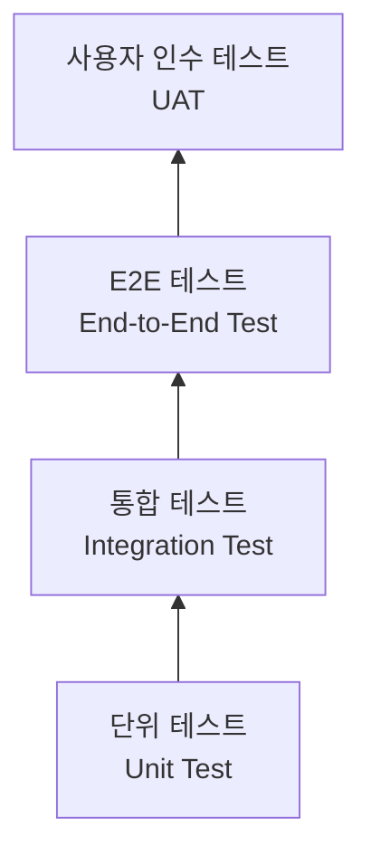
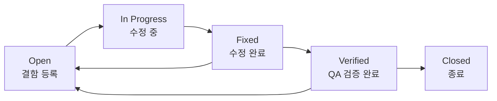

# Project Control Hub 테스트 전략서

## 목차

1. [테스트 개요](#1-테스트-개요)
2. [테스트 범위](#2-테스트-범위)
3. [테스트 케이스](#3-테스트-케이스)
4. [테스트 환경](#4-테스트-환경)
5. [결함 관리](#5-결함-관리)
6. [자동화 전략](#6-자동화-전략)
7. [테스트 피라미드](#7-테스트-피라미드)
8. [DoD 항목별 검증 방법](#8-dod-항목별-검증-방법)
9. [부하 테스트 상세](#9-부하-테스트-상세)
10. [보안 테스트](#10-보안-테스트)
11. [테스트 데이터 관리](#11-테스트-데이터-관리)
12. [CI/CD 테스트 게이트](#12-cicd-테스트-게이트)
13. [접근성 테스트](#13-접근성-테스트)
14. [Chaos Engineering (카오스 엔지니어링)](#14-chaos-engineering-카오스-엔지니어링)
15. [시각적 회귀 테스트 (Visual Regression Testing)](#15-시각적-회귀-테스트-visual-regression-testing)
16. [API 계약 테스트](#16-api-계약-테스트)
17. [모바일(Flutter) 테스트 전략](#17-모바일flutter-테스트-전략)

---

## 1. 테스트 개요

| 항목 | 내용 |
|------|------|
| 프로젝트명 | Project Control Hub |
| 테스트 기간 | 2026-07-01 ~ 2026-07-21 |
| 테스트 환경 | AWS ECS (Staging) |
| 테스트 도구 | JUnit 5, Jest, Playwright, k6, SonarQube, OWASP ZAP, flutter_test, Patrol |

---

## 2. 테스트 범위

### 2.1 테스트 대상

| 구분 | 대상 | 우선순위 |
|------|------|----------|
| 포함 | 이슈 CRUD, 워크플로우 전환, 스프린트 관리, JQL 검색, 보드 UI, 권한(RBAC), REST API, Audit Log | 필수 |
| 포함 | 대시보드, 릴리즈 관리, WIP 제한, 알림, 댓글/첨부파일, 이슈 링크, 백로그, 아카이브 | 선택 |
| 포함 | 외부 연동 (GitHub PR 연결, Smart Commit), 자동화 규칙 | 확장 |
| 포함 | 모바일 앱 (Flutter — 섹션 17 참조) | 모바일 |
| 제외 | Confluence 연동, 서드파티 플러그인 | - |

> v4.0부터 모바일 앱(Flutter)이 테스트 대상에 포함된다. 상세 전략은 [17절](#17-모바일flutter-테스트-전략)을 참조한다.

### 2.2 테스트 유형



| 유형 | 범위 | 도구 | 커버리지 목표 | 실행 빈도 | 시간 예산 | 환경 | 실패 시 |
|------|------|------|--------------|-----------|-----------|------|---------|
| 단위 테스트 | 서비스 로직, JQL 파서, 워크플로우 엔진 | JUnit 5 (BE), Jest (FE) | 80% 이상 | PR마다 | 5분 이내 | Local / CI | PR 블록 |
| 통합 테스트 | REST API 엔드포인트, DB 연동 | Spring Boot Test, Supertest | 주요 API 100% | develop 머지마다 | 15분 이내 | Dev / CI | Slack 알림 |
| E2E 테스트 | 이슈 생성→워크플로우→Done 시나리오 | Playwright | 핵심 시나리오 100% | 야간 / Staging 배포 시 | 45분 이내 | Staging | 배포 중단 |
| 성능 테스트 | API 응답 시간, JQL 검색 성능, 동시 접속 | k6 | SLA 충족 | 주간 / 릴리즈 전 | 30분 이내 | Staging | 배포 중단 |
| 보안 테스트 | RBAC, JWT, OWASP Top 10 | SonarQube, OWASP ZAP | - | PR마다 (SAST), Staging 배포 시 매회 + 주간 1회 (DAST) | 10분(SAST) / 15분(Quick Scan) / 60분(Full Scan) | CI / Staging | PR 블록 / 알림 |
| 접근성 테스트 | WCAG 2.1 AA | axe-core, 수동 검사 | - | 스프린트마다 | 수동 | Staging | 다음 스프린트 수정 |
| 모바일 테스트 | Flutter 단위/위젯/통합/E2E | flutter_test, Patrol | 80% 이상 | PR마다 (단위/위젯), Staging 배포 시 (E2E) | 10분(단위/위젯) / 40분(E2E) | Local / CI / Firebase Test Lab | PR 블록 / 배포 중단 |

---

## 3. 테스트 케이스

### 3.1 테스트 케이스 목록

#### 인증 (TC-001 ~ TC-003)

| TC ID | 기능 | 테스트 시나리오 | 사전 조건 | 기대 결과 | 우선순위 |
|-------|------|----------------|-----------|-----------|----------|
| TC-001 | 로그인 | 정상 로그인 | 등록된 계정 | JWT 토큰 발급, 대시보드 이동 | 높음 |
| TC-002 | 로그인 | 잘못된 비밀번호 | 등록된 계정 | 에러 메시지 표시 | 높음 |
| TC-003 | 로그인 | 5회 실패 후 잠금 | 등록된 계정 | 30분 잠금, 잠금 메시지 표시 | 높음 |

#### 이슈 생성 (TC-010 ~ TC-011)

| TC ID | 기능 | 테스트 시나리오 | 사전 조건 | 기대 결과 | 우선순위 |
|-------|------|----------------|-----------|-----------|----------|
| TC-010 | 이슈 생성 | Story 생성 | 로그인 + DEVELOPER 역할 | 이슈 키 발급, Backlog에 표시 | 높음 |
| TC-011 | 이슈 생성 | Bug 등록 (필수 양식) | 로그인 | 재현절차/기대/실제 결과 포함 | 높음 |

#### 워크플로우 (TC-020 ~ TC-023)

| TC ID | 기능 | 테스트 시나리오 | 사전 조건 | 기대 결과 | 우선순위 |
|-------|------|----------------|-----------|-----------|----------|
| TC-020 | 워크플로우 | In Progress → Code Review | PR 생성 완료 | 상태 변경, Slack 알림 발송 | 높음 |
| TC-021 | 워크플로우 | Code Review → QA | 리뷰어 승인 | 상태 변경 | 높음 |
| TC-022 | 워크플로우 | QA → Done (DoD 충족) | 모든 DoD 항목 완료 | 상태 변경 완료 | 높음 |
| TC-023 | 워크플로우 | QA → Done (DoD 미충족) | DoD 일부 미완료 | 전환 거부 | 높음 |

#### JQL 검색 (TC-030 ~ TC-031)

| TC ID | 기능 | 테스트 시나리오 | 사전 조건 | 기대 결과 | 우선순위 |
|-------|------|----------------|-----------|-----------|----------|
| TC-030 | JQL | 기본 검색 | 이슈 존재 | 올바른 결과 반환 | 높음 |
| TC-031 | JQL | 복합 조건 검색 | 다양한 이슈 | 조건에 맞는 이슈만 반환 | 중간 |

#### 권한 (TC-040 ~ TC-042)

| TC ID | 기능 | 테스트 시나리오 | 사전 조건 | 기대 결과 | 우선순위 |
|-------|------|----------------|-----------|-----------|----------|
| TC-040 | 권한 | Viewer 이슈 수정 시도 | Viewer 로그인 | 403 Forbidden | 높음 |
| TC-041 | 권한 | Reporter 타인 이슈 수정 | Reporter 로그인 | 403 Forbidden | 높음 |
| TC-042 | 권한 | Confidential 이슈 접근 | Developer 로그인 | 404 Not Found | 중간 |

#### WIP 제한 (TC-050)

| TC ID | 기능 | 테스트 시나리오 | 사전 조건 | 기대 결과 | 우선순위 |
|-------|------|----------------|-----------|-----------|----------|
| TC-050 | WIP 제한 | WIP 초과 이슈 이동 | WIP=3, 3개 이슈 존재 | 경고 표시 | 중간 |

#### 보드 (TC-060)

| TC ID | 기능 | 테스트 시나리오 | 사전 조건 | 기대 결과 | 우선순위 |
|-------|------|----------------|-----------|-----------|----------|
| TC-060 | 보드 | 드래그 앤 드롭 | 보드 화면 진입 | 상태 전환 + Audit Log 기록 | 높음 |

#### Audit Log (TC-070)

| TC ID | 기능 | 테스트 시나리오 | 사전 조건 | 기대 결과 | 우선순위 |
|-------|------|----------------|-----------|-----------|----------|
| TC-070 | Audit Log | 필드 변경 추적 | 이슈 존재 | 변경 필드, 이전값, 새값 기록 | 높음 |

#### Sprint 관리 (TC-080 ~ TC-085)

| TC ID | 기능 | 테스트 시나리오 | 사전 조건 | 기대 결과 | 우선순위 |
|-------|------|----------------|-----------|-----------|----------|
| TC-080 | Sprint 관리 | Sprint 생성 | Project Admin 또는 Developer 로그인 | Sprint가 백로그 화면에 표시, 상태 = 준비중 | 높음 |
| TC-081 | Sprint 관리 | Sprint 시작 | Sprint에 이슈 1개 이상 배정 | Sprint 상태 = Active, 보드에 이슈 표시 | 높음 |
| TC-082 | Sprint 관리 | Sprint 정상 완료 (모든 이슈 Done) | Sprint 내 전체 이슈 Done 상태 | Sprint 완료, 번다운 차트 100% 달성 표시 | 높음 |
| TC-083 | Sprint 관리 | Sprint 완료 시 미완료 이슈 존재 | Sprint 내 Done 아닌 이슈 존재 | 미완료 이슈를 다음 Sprint 또는 백로그로 이동 선택 다이얼로그 표시 | 높음 |
| TC-084 | Sprint 관리 | 미완료 이슈 다음 Sprint 이동 | TC-083 이후 다음 Sprint 선택 | 이슈가 다음 Sprint로 이동, 히스토리 기록 | 중간 |
| TC-085 | Sprint 관리 | Viewer 역할 Sprint 관리 시도 | Viewer 로그인 | 403 Forbidden, Sprint 생성/시작 버튼 비활성화 | 높음 |

---

## 4. 테스트 환경

| 환경 | 용도 | URL | DB |
|------|------|-----|-----|
| Local | 개발자 테스트 | localhost:3000 | 로컬 PostgreSQL |
| Dev | 통합 테스트 | dev.jira-pm.example.com | RDS (dev) |
| Staging | QA/UAT, E2E, 성능, 보안 | staging.jira-pm.example.com | RDS (staging) |
| Production | 운영, 스모크 테스트 | jira-pm.example.com | RDS (prod) |

---

## 5. 결함 관리

### 5.1 결함 심각도

| 등급 | 설명 | 대응 시간 |
|------|------|-----------|
| Critical | 워크플로우 전환 불가, 데이터 손실, 인증 우회 | 즉시 |
| Major | 보드 렌더링 오류, JQL 검색 실패, 권한 체크 오류 | 24시간 내 |
| Minor | UI 깨짐, 알림 미발송, Audit Log 누락 | 다음 스프린트 |
| Trivial | 오타, 색상 미세 차이, 가젯 정렬 | 백로그 |

### 5.2 결함 라이프사이클



### 5.3 결함 메트릭

| 메트릭 | 산식 | 목표치 |
|--------|------|--------|
| 결함 밀도 (Defect Density) | 발견 결함 수 / 기능 포인트(또는 TC 수) | 스프린트당 0.5 이하 |
| 탈출 결함율 (Escaped Defect Rate) | Production 발견 결함 / 전체 발견 결함 × 100 | 5% 이하 |
| 평균 해결 시간 (MTTR) | 결함 Open~Closed 총 시간 / 결함 수 | Critical 4h 이내, Major 48h 이내 |

---

## 6. 자동화 전략

- [ ] CI 파이프라인에 JUnit/Jest 단위 테스트 통합
- [ ] PR 머지 전 통합 테스트 자동 실행
- [ ] 야간 Playwright E2E 테스트 자동 실행
- [ ] 주간 k6 성능 테스트 자동 실행
- [ ] 테스트 커버리지 리포트 자동 생성 (80% 미만 시 빌드 실패)
- [ ] SonarQube SAST 분석 PR 코멘트 자동 게시
- [ ] OWASP ZAP DAST: Staging 배포 시 매회 Quick Scan (15분), 주간 1회 Full Scan (60분) 자동화
- [ ] 결함 메트릭 주간 자동 집계 및 Slack 리포트
- [ ] Flutter 단위/위젯 테스트 CI 통합 (PR마다)
- [ ] Flutter E2E (Patrol) Staging 배포 시 자동 실행

---

## 7. 테스트 피라미드

```
          /\
         /  \
        / E2E \       10% (약 50개 TC)
       /--------\
      / 통합 테스트 \   20% (약 100개 TC)
     /-------------\
    /  단위 테스트   \   70% (약 350개 TC)
   /-----------------\
```

| 계층 | 비율 목표 | TC 수 목표 | 실행 속도 | 유지보수 비용 |
|------|-----------|------------|-----------|---------------|
| 단위 테스트 | 70% | 350개 이상 | 빠름 (ms 단위) | 낮음 |
| 통합 테스트 | 20% | 100개 이상 | 중간 (초 단위) | 중간 |
| E2E 테스트 | 10% | 50개 이상 | 느림 (분 단위) | 높음 |

**운영 원칙**

- 비즈니스 로직은 단위 테스트로 우선 검증, E2E에 의존하지 않는다.
- 통합 테스트는 API 계약 및 DB 연동 검증에 집중한다.
- E2E 테스트는 핵심 사용자 시나리오(이슈 생성→워크플로우→Done 등)에만 작성한다.
- 테스트 피라미드 역전(E2E 과다) 발생 시 단위/통합 테스트로 분해한다.

---

## 8. DoD 항목별 검증 방법

기능정의서 섹션 10.2 Definition of Done 7개 항목 각각의 검증 방법입니다.

| DoD 항목 | 검증 방법 | 자동화 여부 | 도구 | 실패 조치 |
|----------|-----------|------------|------|-----------|
| 코드 구현 완료 (Acceptance Criteria 전체 충족) | QA Engineer가 TC 시나리오 전체 실행, Pass 확인 | 부분 자동화 (E2E) | Playwright | PR 블록, 개발자에게 반환 |
| 코드 리뷰 완료 (최소 1인 승인) | GitHub Pull Request Required Review 설정, Approve 상태 확인 | 자동 | GitHub Branch Protection | Approve 없으면 Merge 불가 |
| 단위 테스트 통과 (커버리지 80% 이상) | JaCoCo (BE) / Istanbul (FE) 리포트 자동 생성, PR 코멘트 게시 | 자동 | JaCoCo, Istanbul, GitHub Actions | 80% 미만 시 CI 빌드 실패, PR 블록 |
| QA 테스트 통과 (기능 테스트 시나리오 전체 Pass) | Playwright E2E 스위트 실행 결과 확인 | 자동 (야간/Staging 배포 시) | Playwright, CI/CD 파이프라인 | 실패 시 배포 중단, QA 알림 |
| 문서 업데이트 (API 명세서, README 등) | PR 체크리스트 수동 확인, 작성자 체크 후 리뷰어 승인 | 수동 | GitHub PR 체크리스트 | 체크 미완료 시 PR 병합 보류 |
| 배포 가능 상태 (main/develop 머지, 빌드 성공) | CI 파이프라인 빌드 상태 확인, Green 여부 자동 판별 | 자동 | GitHub Actions, AWS CodePipeline | 빌드 실패 시 머지 블록 |
| 회귀 테스트 확인 (기존 기능 영향 없음) | 기존 Playwright E2E 스위트 전체 실행, 기존 단위/통합 테스트 전체 실행 | 자동 | Playwright, JUnit 5, Jest | 실패 TC 발생 시 배포 중단, 담당자 알림 |

---

## 9. 부하 테스트 상세

### 9.1 SLA 기준

| 지표 | SLA 기준 |
|------|---------|
| P95 응답 시간 (이슈 조회) | 200ms 이하 |
| P95 응답 시간 (JQL 검색) | 500ms 이하 |
| P95 응답 시간 (보드 드래그앤드롭) | 300ms 이하 |
| 대량 백로그 로딩 (10,000건) | 2초 이하 |
| 대시보드 가젯 동시 로딩 | 1초 이하 |
| 에러율 | 1% 이하 |

### 9.2 k6 시나리오별 상세

| 시나리오 | VUs | Duration | Ramp-up | SLA | 측정 지표 | 실패 기준 |
|---------|-----|----------|---------|-----|-----------|----------|
| 동시 500명 이슈 조회 | 500 | 5분 | 1분 | P95 < 200ms | http_req_duration, http_req_failed | P95 초과 또는 에러율 1% 초과 |
| JQL 복합 검색 100명 동시 | 100 | 3분 | 30초 | P95 < 500ms | http_req_duration, iterations | P95 초과 |
| 보드 드래그앤드롭 50명 동시 | 50 | 3분 | 30초 | P95 < 300ms | http_req_duration, http_req_failed | P95 초과 또는 에러율 1% 초과 |
| 대량 이슈(10,000건) 백로그 로딩 | 10 | 2분 | 10초 | P95 < 2000ms | http_req_duration | P95 초과 |
| 대시보드 가젯 동시 로딩 | 100 | 3분 | 30초 | P95 < 1000ms | http_req_duration, 가젯별 응답 시간 | P95 초과 |

### 9.3 k6 스크립트 구조 예시

```javascript
import http from 'k6/http';
import { check, sleep } from 'k6';

export const options = {
  stages: [
    { duration: '1m', target: 500 },  // Ramp-up
    { duration: '5m', target: 500 },  // Sustained load
    { duration: '1m', target: 0 },    // Ramp-down
  ],
  thresholds: {
    http_req_duration: ['p(95)<200'],
    http_req_failed: ['rate<0.01'],
  },
};

export default function () {
  const res = http.get('https://staging.jira-pm.example.com/rest/api/3/issue/PROJ-1', {
    headers: { Authorization: `Bearer ${__ENV.API_TOKEN}` },
  });
  check(res, { 'status 200': (r) => r.status === 200 });
  sleep(1);
}
```

---

## 10. 보안 테스트

### 10.1 RBAC 전체 매트릭스 (7권한 x 5역할 = 35조합)

| 권한 항목 | Project Admin | Developer | QA Engineer | Reporter | Viewer | 검증 방법 |
|-----------|:------------:|:---------:|:-----------:|:--------:|:------:|-----------|
| 이슈 생성 | 허용 | 허용 | 허용 | 허용 | 거부(403) | 자동화 (Playwright + API) |
| 이슈 수정 (본인) | 허용 | 허용 | 허용 | 허용 | 거부(403) | 자동화 |
| 이슈 수정 (타인) | 허용 | 허용 | 허용 | 거부(403) | 거부(403) | 자동화 |
| 이슈 삭제 | 허용 | 허용 | 거부(403) | 거부(403) | 거부(403) | 자동화 |
| 상태 전환 | 허용 | 허용 | 허용 | 거부(403) | 거부(403) | 자동화 |
| Sprint 관리 | 허용 | 허용 | 거부(403) | 거부(403) | 거부(403) | 자동화 |
| 프로젝트 설정 | 허용 | 거부(403) | 거부(403) | 거부(403) | 거부(403) | 자동화 |
| Audit Log 조회 | 허용 | 거부(403) | 거부(403) | 거부(403) | 거부(403) | 자동화 |

### 10.2 OWASP Top 10 테스트

| 취약점 | 테스트 방법 | 도구 | 기대 결과 |
|--------|------------|------|-----------|
| SQL Injection | JQL 파라미터에 SQL 페이로드 삽입 | OWASP ZAP, 수동 | 쿼리 실행 안 됨, 에러 메시지 노출 없음 |
| XSS (Stored) | 이슈 제목/댓글에 `<script>alert(1)</script>` 입력 | OWASP ZAP | 스크립트 실행 안 됨, 이스케이프 처리 확인 |
| XSS (Reflected) | URL 파라미터에 XSS 페이로드 삽입 | OWASP ZAP | 스크립트 실행 안 됨 |
| CSRF | 외부 도메인에서 인증된 API 요청 위조 | 수동 / ZAP | CSRF 토큰 검증 실패, 요청 거부 |

### 10.3 정적/동적 분석 (DAST 실행 시점 통일)

| 분류 | 도구 | 실행 시점 | 분석 대상 | 실패 기준 |
|------|------|-----------|-----------|-----------|
| SAST (정적 분석) | SonarQube | PR 생성 시 자동 실행 | BE (Java), FE (TypeScript) | Critical/Blocker 이슈 1개 이상 발견 시 PR 블록 |
| DAST Quick Scan (동적 분석) | OWASP ZAP | **Staging 배포 시 매회 실행 (약 15분)** | 전체 API 엔드포인트 | High 이상 취약점 발견 시 배포 중단 + 보안팀 즉시 알림 |
| DAST Full Scan (동적 분석) | OWASP ZAP | **주간 1회 자동 실행 (약 60분)** | 전체 API 엔드포인트 + 딥 스캔 | High 이상 취약점 발견 시 보안팀 즉시 알림 |
| 의존성 취약점 | OWASP Dependency-Check | PR 생성 시 | npm, Maven 의존성 | Critical CVE 발견 시 PR 블록 |

> DAST 실행 시점 정책: Staging 배포 시 Quick Scan(15분)을 필수 게이트로 실행하고, 매주 월요일 02:00 KST에 Full Scan(60분)을 자동 실행한다. Quick Scan 실패 시 배포 파이프라인이 중단된다.

---

## 11. 테스트 데이터 관리

### 11.1 테스트 데이터 시딩

| 데이터 종류 | 수량 | 생성 방법 | 도구 |
|-------------|------|-----------|------|
| 사용자 계정 (역할별) | 50명 (역할별 10명씩) | Faker 기반 스크립트 자동 생성 | Faker.js (FE), JavaFaker (BE) |
| 이슈 (타입/상태 다양) | 1,000건 | 무작위 타입·상태·우선순위 조합 생성 | Faker + REST API Bulk Create |
| 프로젝트 | 5개 | 수동 생성 + 스크립트 설정 | 시딩 스크립트 |
| Sprint | 프로젝트당 3개 | 스크립트 자동 생성 | 시딩 스크립트 |
| 댓글 | 이슈당 평균 3건 | Faker 기반 자동 생성 | Faker |
| 첨부파일 | 이슈당 평균 1건 | 더미 파일 업로드 스크립트 | 시딩 스크립트 |

### 11.2 테스트 격리

| 격리 전략 | 적용 계층 | 방법 |
|-----------|---------|------|
| 트랜잭션 롤백 | 단위 테스트, 통합 테스트 | `@Transactional` + `@Rollback` 어노테이션, 각 TC 후 DB 원상복구 |
| 독립 DB 스키마 | 통합 테스트 | 테스트 전용 스키마 분리, Testcontainers 활용 |
| 테스트 전용 계정 | E2E 테스트 | 테스트 전용 사용자 계정 사용, 운영 계정 사용 금지 |
| 환경 분리 | 전체 | Staging 환경을 운영과 완전 분리 |

---

## 12. CI/CD 테스트 게이트

### 12.1 파이프라인 단계별 테스트 매핑

| 단계 | 트리거 | 실행 테스트 | 소요 시간 | 실패 시 조치 |
|------|--------|------------|-----------|-------------|
| PR 생성/업데이트 | GitHub PR event | 단위 테스트 + lint + SAST (SonarQube) + 의존성 취약점 검사 | 10분 이내 | PR 블록 (Merge 불가) |
| develop 브랜치 머지 | merge event | 통합 테스트 + 단위 테스트 전체 | 20분 이내 | Slack #dev-alerts 알림 발송 |
| Staging 배포 | 수동 승인 (팀장) | E2E 테스트 (Playwright) + 성능 테스트 (k6) + DAST Quick Scan (OWASP ZAP 15분) | 90분 이내 | 배포 파이프라인 중단, 담당자 알림 |
| Production 배포 | 수동 승인 (PM + 팀장) | 스모크 테스트 (핵심 API 상태 확인) | 5분 이내 | 자동 롤백 (이전 버전으로 복구) |

---

## 13. 접근성 테스트

### 13.1 기준

| 기준 | 레벨 | 설명 |
|------|------|------|
| WCAG 2.1 | AA | 웹 콘텐츠 접근성 지침 2.1 AA 수준 준수 |

### 13.2 테스트 항목

| 항목 | 검증 방법 | 도구 | 기준 |
|------|---------|------|------|
| 키보드 네비게이션 | Tab/Shift+Tab으로 전체 UI 요소 이동 가능 여부 수동 확인 | 수동 테스트 | 마우스 없이 모든 기능 접근 가능 |
| 색상 대비 | 텍스트와 배경색 대비율 | axe-core, Colour Contrast Analyser | 일반 텍스트 4.5:1 이상, 큰 텍스트 3:1 이상 |
| ARIA 레이블 | 버튼, 아이콘, 폼 요소 ARIA 속성 유무 | axe-core 자동화 | aria-label / aria-describedby 누락 없음 |

---

## 14. Chaos Engineering (카오스 엔지니어링)

### 14.1 장애 주입 시나리오

| 시나리오 | 대상 | 주입 방법 | 기대 동작 | 실행 환경 |
|---------|------|----------|----------|----------|
| DB 연결 실패 | RDS Primary | Security Group 차단 | Multi-AZ Failover, 30초 내 복구 | Staging |
| Redis 타임아웃 | ElastiCache | tc netem delay 추가 | 캐시 미스 → DB 직접 조회 Fallback | Staging |
| 외부 API 장애 | GitHub/Slack Webhook | Mock 서버 500 응답 | Circuit Breaker Open, 자동화 재시도 큐 | Staging |
| ECS 태스크 종료 | API Server | aws ecs stop-task | Auto Scaling 신규 태스크 기동, ALB 헬스체크 | Staging |

### 14.2 실행 계획

| 주기 | 범위 | 참여자 |
|------|------|--------|
| 월 1회 | 단일 컴포넌트 장애 (DB, Redis, 단일 태스크) | 개발팀 |
| 분기 1회 | 복합 장애 (다중 컴포넌트, DNS) | 개발팀 + SRE |
| 연 1회 | DR 전체 훈련 (리전 장애 시뮬레이션) | 전체 |

---

## 15. 시각적 회귀 테스트 (Visual Regression Testing)

### 15.1 도구

| 도구 | 용도 | 통합 |
|------|------|------|
| Playwright + pixelmatch | 스크린샷 비교 | CI 파이프라인 |
| Chromatic (Storybook) | 컴포넌트 단위 | PR 체크 |

### 15.2 대상 화면

| 화면 | 뷰포트 | 상태 | 우선순위 |
|------|--------|------|----------|
| 스크럼 보드 | 1440px, 768px | 이슈 5+개, WIP 경고 | 높음 |
| 칸반 보드 | 1440px, 768px | WIP 초과 상태 | 높음 |
| 대시보드 | 1440px | Developer 역할, PM 역할 | 높음 |
| 이슈 상세 | 1440px, 768px | 댓글 3+개, 첨부파일 | 중간 |

---

## 16. API 계약 테스트

### 16.1 도구

- Pact (Consumer-Driven Contract Testing)
- OpenAPI Spec 자동 검증 (openapi-diff)

### 16.2 전략

| 계약 유형 | 검증 내용 | 실행 시점 |
|----------|----------|----------|
| Consumer-Driven | FE가 기대하는 API 응답 구조 | PR 생성 시 |
| Provider Verification | BE API가 계약을 준수하는지 | BE PR 생성 시 |
| OpenAPI Diff | API 스펙 변경 감지 (Breaking Change) | PR 생성 시 |

### 16.3 Breaking Change 정책

- Response 필드 제거: MAJOR 버전 업 필수
- Request 필수 필드 추가: MAJOR 버전 업 필수
- 선택 필드 추가: 허용 (MINOR)
- Deprecation: 최소 6개월 유지 후 제거

---

## 17. 모바일(Flutter) 테스트 전략

Flutter 모바일 앱의 테스트 계층, 도구, 범위를 정의한다.

### 17.1 테스트 계층 구조

```
          /\
         /  \
        / E2E \          Patrol (통합 E2E)
       /--------\
      /  통합 테스트 \    integration_test 패키지
     /-------------\
    /  위젯 테스트   \    flutter_test (WidgetTester)
   /-----------------\
  /    단위 테스트     \  flutter_test, mockito
 /---------------------\
```

| 계층 | 도구 | 커버리지 목표 | 실행 빈도 | 실행 환경 |
|------|------|--------------|-----------|----------|
| 단위 테스트 | flutter_test, mockito | 80% 이상 | PR마다 | Local / CI |
| 위젯 테스트 | flutter_test (WidgetTester) | 주요 위젯 100% | PR마다 | Local / CI |
| 통합 테스트 | integration_test 패키지 | 핵심 플로우 100% | develop 머지마다 | Local / CI |
| E2E 테스트 | Patrol | 핵심 시나리오 | Staging 배포 시 | Firebase Test Lab / Xcode Cloud |

### 17.2 단위 테스트 (flutter_test + mockito)

UseCase, Repository 구현체, 유틸리티 함수 등 비즈니스 로직을 단위 테스트로 검증한다.

```dart
// 예시: IssueRepository 단위 테스트
import 'package:flutter_test/flutter_test.dart';
import 'package:mockito/mockito.dart';
import 'package:mockito/annotations.dart';

@GenerateMocks([IssueRemoteDataSource, IssueLocalDataSource])
void main() {
  late IssueRepositoryImpl repository;
  late MockIssueRemoteDataSource mockRemote;
  late MockIssueLocalDataSource mockLocal;

  setUp(() {
    mockRemote = MockIssueRemoteDataSource();
    mockLocal = MockIssueLocalDataSource();
    repository = IssueRepositoryImpl(
      remoteDataSource: mockRemote,
      localDataSource: mockLocal,
    );
  });

  test('getIssue: 원격 조회 성공 시 로컬 캐시에 저장', () async {
    final issue = Issue(id: 'PROJ-1', title: '테스트 이슈');
    when(mockRemote.getIssue('PROJ-1')).thenAnswer((_) async => issue);

    final result = await repository.getIssue('PROJ-1');

    expect(result, issue);
    verify(mockLocal.cacheIssue(issue)).called(1);
  });

  test('getIssue: 오프라인 상태 시 로컬 캐시 반환', () async {
    when(mockRemote.getIssue('PROJ-1')).thenThrow(NetworkException());
    when(mockLocal.getCachedIssue('PROJ-1'))
        .thenAnswer((_) async => Issue(id: 'PROJ-1', title: '캐시된 이슈'));

    final result = await repository.getIssue('PROJ-1');

    expect(result.id, 'PROJ-1');
  });
}
```

### 17.3 위젯 테스트 (flutter_test WidgetTester)

UI 컴포넌트의 렌더링, 사용자 인터랙션, 상태 변화를 위젯 테스트로 검증한다.

```dart
// 예시: IssueCard 위젯 테스트
void main() {
  testWidgets('IssueCard: 이슈 정보 정상 렌더링', (WidgetTester tester) async {
    await tester.pumpWidget(
      MaterialApp(
        home: IssueCard(
          issue: Issue(id: 'PROJ-1', title: '로그인 버그', priority: Priority.high),
        ),
      ),
    );

    expect(find.text('PROJ-1'), findsOneWidget);
    expect(find.text('로그인 버그'), findsOneWidget);
    expect(find.byIcon(Icons.priority_high), findsOneWidget);
  });

  testWidgets('IssueCard: 탭 시 상세 화면 이동', (WidgetTester tester) async {
    bool tapped = false;
    await tester.pumpWidget(
      MaterialApp(
        home: IssueCard(
          issue: Issue(id: 'PROJ-1', title: '테스트'),
          onTap: () => tapped = true,
        ),
      ),
    );

    await tester.tap(find.byType(IssueCard));
    expect(tapped, isTrue);
  });
}
```

### 17.4 통합 테스트 (integration_test 패키지)

실제 디바이스 또는 에뮬레이터에서 앱 전체 플로우를 통합 테스트로 검증한다.

```dart
// integration_test/app_test.dart
import 'package:integration_test/integration_test.dart';
import 'package:flutter_test/flutter_test.dart';

void main() {
  IntegrationTestWidgetsFlutterBinding.ensureInitialized();

  testWidgets('이슈 생성 플로우 통합 테스트', (WidgetTester tester) async {
    app.main();
    await tester.pumpAndSettle();

    // 로그인
    await tester.enterText(find.byKey(Key('email_field')), 'dev@example.com');
    await tester.enterText(find.byKey(Key('password_field')), 'password');
    await tester.tap(find.byKey(Key('login_button')));
    await tester.pumpAndSettle();

    // 이슈 생성 화면 이동
    await tester.tap(find.byKey(Key('create_issue_fab')));
    await tester.pumpAndSettle();

    // 이슈 정보 입력
    await tester.enterText(find.byKey(Key('issue_title_field')), '테스트 이슈');
    await tester.tap(find.byKey(Key('submit_button')));
    await tester.pumpAndSettle();

    // 결과 검증
    expect(find.text('테스트 이슈'), findsOneWidget);
  });
}
```

### 17.5 E2E 테스트 (Patrol)

Patrol을 사용하여 플랫폼 네이티브 기능(푸시 알림, 권한 요청 등)을 포함한 E2E 테스트를 실행한다.

```dart
// patrol_test/notification_test.dart
import 'package:patrol/patrol.dart';

void main() {
  patrolTest('푸시 알림 수신 후 앱 진입 테스트', ($) async {
    await $.pumpWidgetAndSettle(app.main());

    // 알림 권한 허용
    await $.native.grantPermissionWhenInUse();

    // 백그라운드 전환 후 알림 수신 시뮬레이션
    await $.native.pressHome();
    await $.native.openNotifications();

    expect($.native.isVisible(Selector(text: '새 이슈가 할당되었습니다')),
        isTrue);

    // 알림 탭 → 앱 복귀 → 이슈 상세 화면 이동 확인
    await $.native.tapOnNotification(by: Selector(text: '새 이슈가 할당되었습니다'));
    await $.pumpAndSettle();

    expect(find.byType(IssueDetailScreen), findsOneWidget);
  });
}
```

### 17.6 플랫폼별 E2E 실행 환경

| 플랫폼 | 실행 환경 | 도구 | 트리거 |
|--------|----------|------|--------|
| Android | Firebase Test Lab (실제 디바이스 + 에뮬레이터) | Patrol + Firebase Test Lab CLI | Staging 배포 시 |
| iOS | Xcode Cloud (실제 디바이스) | Patrol + Xcode Cloud Workflow | Staging 배포 시 |

```yaml
# GitHub Actions: Flutter E2E (Android) 실행 예시
- name: Run Flutter E2E on Firebase Test Lab
  run: |
    flutter build apk --debug
    flutter build apk --debug --target=integration_test/app_test.dart \
      --flavor staging
    gcloud firebase test android run \
      --type instrumentation \
      --app build/app/outputs/apk/debug/app-debug.apk \
      --test build/app/outputs/apk/debug/app-debug-test.apk \
      --device model=Pixel6,version=33,locale=ko,orientation=portrait \
      --timeout 10m
```

### 17.7 모바일 특화 테스트 범위

| 테스트 항목 | 검증 내용 | 우선순위 |
|-------------|---------|----------|
| 오프라인 동기화 | 네트워크 차단 후 이슈 목록 로컬 캐시 표시, 네트워크 복구 후 동기화 큐 처리 | 높음 |
| 푸시 알림 수신 | FCM 알림 수신 → 알림 채널별 표시 → 탭 시 정확한 화면 이동 | 높음 |
| 바이오 인증 | 지문/Face ID 인증 성공/실패 시나리오, flutter_secure_storage 토큰 접근 | 높음 |
| 토큰 자동 갱신 | Access Token 만료 시 Refresh Token으로 자동 갱신, API 재시도 | 높음 |
| 딥링크 | 알림 탭 → 이슈 상세 딥링크 라우팅 정확성 | 중간 |
| 화면 회전 | Portrait/Landscape 전환 시 UI 레이아웃 유지 | 중간 |
| 접근성 (모바일) | 스크린 리더(TalkBack/VoiceOver) 지원, 큰 텍스트 크기 설정 대응 | 중간 |

---

## 변경 이력

| 버전 | 날짜 | 작성자 | 변경 내용 |
|------|------|--------|-----------|
| v1.0 | 2026-03-21 | 팀 | 최초 작성 |
| v2.0 | 2026-03-21 | 팀 | TC 50개+ 확장, DoD 항목별 검증, 부하 테스트, 보안 테스트, 테스트 데이터 관리, CI/CD 게이트, 테스트 피라미드, 접근성 테스트 추가 |
| v3.0 | 2026-03-21 | 팀 | Chaos Engineering, 시각적 회귀 테스트, API 계약 테스트 추가 |
| v4.0 | 2026-03-22 | 팀 | 모바일(Flutter) 테스트 전략 17절 신규 추가 (단위/위젯/통합/E2E, Patrol, Firebase Test Lab, Xcode Cloud, 오프라인 동기화/푸시 알림/바이오 인증 범위), 2.1절 테스트 대상에 모바일 포함, DAST 실행 시점 통일 (Staging 배포 시 매회 Quick Scan 15분 + 주간 1회 Full Scan 60분), CI/CD 게이트 12.1절 DAST 반영 |
