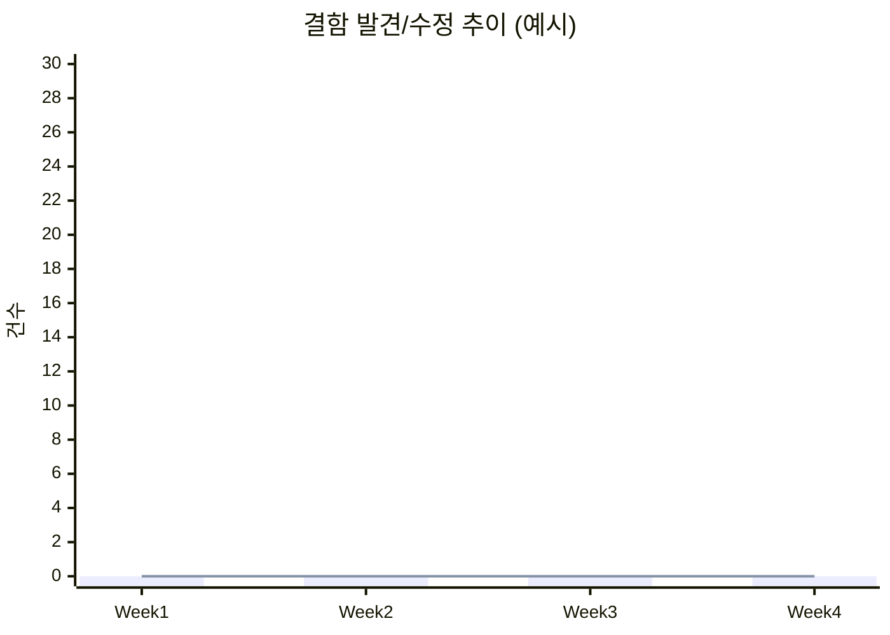

# Project Control Hub 테스트 보고서

> 본 보고서는 [테스트 전략서 v4.0](../10-테스트전략서/10-테스트전략서_v4.0.md)의 범위·도구·게이트를 준거로 한다. 실행 결과 수치는 **릴리즈 검증 시점에 갱신**한다.

## 목차

1. [개요](#1-개요)
2. [테스트 범위](#2-테스트-범위)
3. [테스트 결과 요약](#3-테스트-결과-요약)
4. [결함 현황](#4-결함-현황)
5. [성능 테스트 결과](#5-성능-테스트-결과)
6. [테스트 환경](#6-테스트-환경)
7. [리스크 및 권고사항](#7-리스크-및-권고사항)
8. [결론 및 릴리스 판정](#8-결론-및-릴리스-판정)
9. [변경 이력](#9-변경-이력)

---

## 1. 개요

| 항목 | 내용 |
|------|------|
| 프로젝트명 | Project Control Hub |
| 테스트 기간 | 2026-07-01 ~ 2026-07-21 (전략서 기준, 실제 일정으로 대체) |
| 테스트 환경 | AWS ECS Fargate (Staging) |
| 테스트 도구 | JUnit 5, Jest, Playwright, k6, SonarQube, OWASP ZAP, flutter_test, Patrol |
| 작성자 | 팀 |

---

## 2. 테스트 범위

### 2.1 대상 기능

| 기능 ID | 기능명 | 우선순위 | 테스트 여부 |
|---------|--------|----------|------------|
| FR-001 ~ FR-007 | 이슈 관리(CRUD, 타입, 상태, 우선순위, 담당, 링크) | 필수 | ✅ |
| FR-008 ~ FR-012 | 프로젝트·보드·백로그·스프린트·로드맵 | 필수 | ✅ |
| FR-013 ~ FR-015 | 워크플로우·전환·자동화 | 필수 | 선택 영역 ⬜ |
| FR-016 | JQL 검색 | 필수 | ✅ |
| FR-017 ~ FR-018 | 스토리 포인트·Planning Poker | 필수 | ✅ |
| FR-019 ~ FR-020 | 릴리즈·릴리즈 노트 | 필수 | 선택 ⬜ |
| FR-021 ~ FR-022 | 대시보드·차트 | 필수 | ✅ |
| FR-023 ~ FR-025 | 댓글·알림·워치 | 필수 | ✅ |
| FR-026 ~ FR-029 | 아카이브·Audit Log | 필수 / 선택 | ✅ / ⬜ |
| FR-030 ~ FR-033 | 권한·API·연동 | 필수 | ✅ |

> 상세 우선순위·제외는 [요구사항 정의서 v2.2](../07-요구사항정의서/07-요구사항정의서_v2.2.md) 및 테스트 전략서 §2를 따른다.

### 2.2 제외 항목

| 항목 | 제외 사유 |
|------|----------|
| Confluence 연동 | Out of Scope (테스트 전략서 §2.1) |
| 서드파티 플러그인 마켓 | 미구현 |

---

## 3. 테스트 결과 요약

### 3.1 전체 현황

| 구분 | 계획 | 실행 | 성공 | 실패 | 블로커 | 성공률 |
|------|------|------|------|------|--------|--------|
| 단위 테스트 | TBD | TBD | TBD | TBD | TBD | TBD% |
| 통합 테스트 | TBD | TBD | TBD | TBD | TBD | TBD% |
| E2E 테스트 | TBD | TBD | TBD | TBD | TBD | TBD% |
| 성능 테스트(k) | TBD | TBD | TBD | TBD | N/A | TBD% |
| 모바일(Flutter) | TBD | TBD | TBD | TBD | TBD | TBD% |
| **합계** | **TBD** | **TBD** | **TBD** | **TBD** | **TBD** | **TBD%** |

### 3.2 코드 커버리지

| 모듈 | Line | Branch | Function | 목표 | 달성 여부 |
|------|------|--------|----------|------|----------|
| Backend (Domain) | TBD% | TBD% | TBD% | 80% | ⬜ |
| Frontend (React) | TBD% | TBD% | TBD% | 80% | ⬜ |
| Mobile (Flutter) | TBD% | TBD% | TBD% | 80% | ⬜ |
| **전체** | **TBD%** | **TBD%** | **TBD%** | **80%** | ⬜ |

---

## 4. 결함 현황

### 4.1 결함 요약

| 심각도 | 발견 | 수정 완료 | 미해결 | 보류 |
|--------|------|----------|--------|------|
| Critical | TBD | TBD | TBD | TBD |
| Major | TBD | TBD | TBD | TBD |
| Minor | TBD | TBD | TBD | TBD |
| Trivial | TBD | TBD | TBD | TBD |

### 4.2 주요 결함 상세

| 결함 ID | 심각도 | 제목 | 재현 경로 | 상태 | 담당자 |
|---------|--------|------|----------|------|--------|
| — | — | (없음) | — | — | — |

### 4.3 결함 추이

> 실제 스프린트별 수치로 교체한다.

---

## 5. 성능 테스트 결과

| 시나리오 | 동시 사용자 | 평균 응답시간 | P95 | P99 | TPS | 목표 충족 |
|---------|------------|-------------|-----|-----|-----|----------|
| 이슈 검색(JQL) | TBD | TBD ms | TBD ms | TBD ms | TBD | ⬜ |
| 보드 로드 | TBD | TBD ms | TBD ms | TBD ms | TBD | ⬜ |
| API 핵심 경로 | TBD | TBD ms | TBD ms | TBD ms | TBD | ⬜ |

목표는 [테스트 전략서 §9](../10-테스트전략서/10-테스트전략서_v4.0.md) 및 [아키텍처 정의서 §14](../03-아키텍처정의서/03-아키텍처정의서_v4.0.md)의 성능 목표를 따른다.

---

## 6. 테스트 환경

| 항목 | 상세 |
|------|------|
| 인프라 | AWS ECS Fargate, ALB |
| Backend Runtime | JDK 21 (전략서 기준에 맞춰 확정) |
| DB | PostgreSQL (RDS) |
| Cache | Redis |
| Frontend | Chrome 최신, Firefox 최신, Safari 최신 |
| Mobile | iOS 시뮬레이터 / Android 에뮬레이터, Firebase Test Lab (선택) |

---

## 7. 리스크 및 권고사항

### 7.1 잔존 리스크

| 리스크 | 영향도 | 발생 가능성 | 대응 방안 |
|--------|--------|------------|----------|
| Staging·Prod 설정 편차 | 상 | 중 | [배포 가이드](../12-배포가이드/12-배포가이드_v4.0.md) 체크리스트 준수 |
| 외부 연동(GitHub 등) 장애 시나리오 | 중 | 저 | Circuit Breaker·재시도 정책 검증 |

### 7.2 권고사항

1. 릴리즈 전 DAST Full Scan 1회 및 결과 아카이브.
2. E2E 실패 시 배포 게이트 중단 규칙(전략서 §12) 준수.

---

## 8. 결론 및 릴리스 판정

| 항목 | 기준 | 결과 | 판정 |
|------|------|------|------|
| 테스트 성공률 | ≥ 95% | TBD% | ⬜ |
| Critical 결함 | 0건 | TBD건 | ⬜ |
| Major 결함 미해결 | 0건 | TBD건 | ⬜ |
| 코드 커버리지 | ≥ 80% | TBD% | ⬜ |
| 성능 목표 달성 | 100% | TBD% | ⬜ |

**릴리스 판정**: ⬜ 승인 / ⬜ 조건부 승인 / ⬜ 보류

**판정 사유**: (실행 완료 후 작성)

---

## 9. 변경 이력

| 버전 | 날짜 | 작성자 | 변경 내용 |
|------|------|--------|-----------|
| v1.0 | 2026-04-09 | 팀 | 최초 작성 (13-테스트보고서 폴더 신설) |
