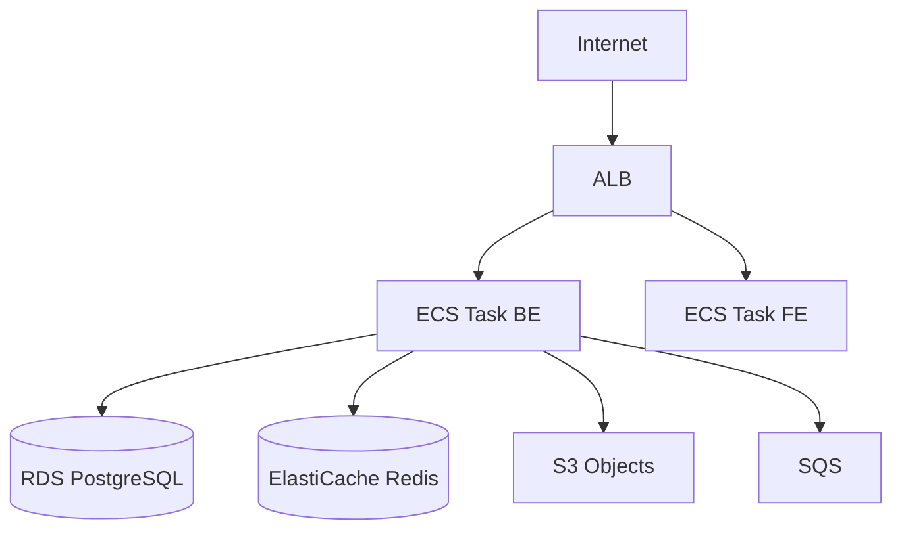
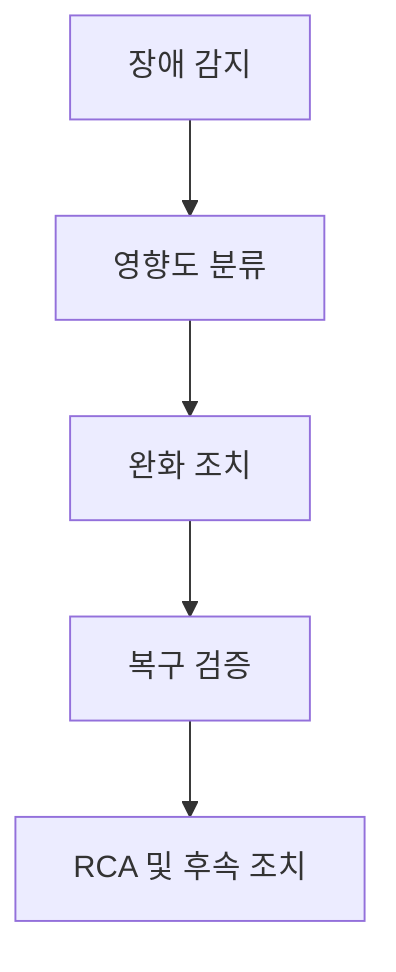

# Project Control Hub 운영 매뉴얼

> 배포·릴리즈 절차의 정본은 [배포 가이드 v4.0](../12-배포가이드/12-배포가이드_v4.0.md), 아키텍처·스택은 [아키텍처 정의서 v4.0](../03-아키텍처정의서/03-아키텍처정의서_v4.0.md)를 따른다.

## 목차

1. [개요](#1-개요)
2. [인프라 구성](#2-인프라-구성)
3. [일상 운영](#3-일상-운영)
4. [백업 및 복구](#4-백업-및-복구)
5. [장애 대응](#5-장애-대응)
6. [모니터링](#6-모니터링)
7. [보안 운영](#7-보안-운영)
8. [성능 관리](#8-성능-관리)
9. [로그 관리](#9-로그-관리)
10. [변경 관리](#10-변경-관리)
11. [변경 이력](#11-변경-이력)

---

## 1. 개요

### 1.1 문서 목적

PCH(Project Control Hub) **운영·유지보수 담당자**가 서비스 가용성, 장애 대응, 백업·보안·성능을 일관되게 수행할 수 있도록 절차와 기준을 정리한다.

### 1.2 대상 독자

| 대상 | 역할 |
|------|------|
| 시스템 운영자 | ECS/ALB, 컨테이너, 헬스체크, 배포 파이프라인 감시 |
| DBA | PostgreSQL 백업·복구, 슬로우 쿼리, 연결 풀 |
| 보안 담당자 | 시크릿·IAM, 취약점 스캔, 감사 로그 정책 |

### 1.3 시스템 구성 요약

> 상세 토폴로지·포트는 아키텍처 정의서 및 실제 Terraform/CloudFormation 값으로 대체한다.

---

## 2. 인프라 구성

### 2.1 논리 구성 요소

| 구분 | AWS 리소스(예시) | 용도 |
|------|-----------------|------|
| 컴퓨트 | ECS Fargate 서비스 | API, Worker, 필요 시 FE 정적 호스팅 |
| 로드밸런서 | ALB | TLS 종료, 타깃 그룹 헬스체크 |
| 데이터 | RDS PostgreSQL | 트랜잭션 데이터 |
| 캐시 | ElastiCache Redis | 세션·캐시·Rate limit 보조 |
| 객체 | S3 | 첨부·아티팩트 |
| 메시지 | SQS | 비동기 작업(설계 반영 시) |

### 2.2 네트워크

| 구간 | 방화벽·보안 그룹 | 비고 |
|------|-----------------|------|
| 인터넷 → ALB | 443 허용 | TLS 1.2+ |
| ALB → ECS Task | 앱 포트만 허용 | 최소 권한 |
| ECS → RDS | 5432, 서브넷 제한 | 퍼블릭 DB 접속 금지 |

### 2.3 외부 연동

| 서비스 | 용도 | 비고 |
|--------|------|------|
| GitHub / GitLab | 커밋·PR 링크 | OAuth 앱·Webhook 시크릿 관리 |
| Slack / 이메일 | 알림 | Bot 토큰은 시크릿 저장소 |
| OIDC IdP | SSO | 클라이언트 시크릿 순환 정책 |

---

## 3. 일상 운영

### 3.1 일일 점검 체크리스트

| 시간 | 점검 항목 | 확인 방법 | 정상 기준 |
|------|----------|----------|----------|
| 오전 | 서비스 가용성 | `/health` 또는 ALB 타깃 상태 | Healthy |
| 오전 | ECS Task 수·CPU/메모리 | CloudWatch | 임계치 미만 |
| 오전 | RDS CPU·연결 수 | RDS 모니터링 | 한계 대비 여유 |
| 오전 | 에러 로그 건수 | 로그 그룹 필터 | Critical 누적 없음 |

### 3.2 주간·월간

| 주기 | 항목 |
|------|------|
| 주간 | 디스크·로그 볼륨, 인증서 만료, 의존성 CVE 하이라이트 |
| 월간 | 백업 복구 리허설, IAM·DB 계정 리뷰, 비용·용량 추이 |

---

## 4. 백업 및 복구

### 4.1 백업 정책

| 대상 | 방식 | 주기 | 보관 |
|------|------|------|------|
| RDS | 자동 스냅샷 + 수동 스냅샷(릴리즈 전) | 일/주 정책 | 조직 RPO에 맞춤 |
| S3 | 버저닝·수명 주기 | 지속 | 규정 준수 |
| 설정·시크릿 메타 | GitOps 저장소 | 변경 시 | 감사 추적 |

### 4.2 복구

**RTO / RPO**는 [프로젝트 계획서 NFR](../01-프로젝트계획서/01-프로젝트계획서_v3.0.md) 및 [배포 가이드 DR](../12-배포가이드/12-배포가이드_v4.0.md)를 따른다.

1. 장애 범위·RPO 시점 확정  
2. 스냅샷 또는 PITR로 RDS 복구  
3. 애플리케이션 환경 변수·마이그레이션 버전 정합성 확인  
4. 스모크 테스트 후 트래픽 전환  

---

## 5. 장애 대응

### 5.1 등급

| 등급 | 정의 | 응답 |
|------|------|------|
| P1 | 서비스 전면 불능 | 즉시 대응·에스컬레이션 |
| P2 | 핵심 기능(로그인·이슈 CRUD) 장애 | 30분 내 가동 목표 |
| P3 | 부분 기능 | 업무시간 내 |
| P4 | 경미한 이슈 | 계획된 수정 |

### 5.2 프로세스

### 5.3 자주 나오는 시나리오

| 시나리오 | 즉시 조치 | 비고 |
|----------|----------|------|
| RDS 커넥션 고갈 | 앱 태스크 재시작·풀 크기 점검 | 슬로우 쿼리·커넥션 누수 |
| Redis 장애 | 캐시 무시 경로 확인·페일오버 | TTL·키 폭주 점검 |
| 배포 후 5xx 급증 | [배포 가이드 롤백](../12-배포가이드/12-배포가이드_v4.0.md) | 이전 이미지 SHA |

---

## 6. 모니터링

| 영역 | 도구(예시) | 알림 |
|------|------------|------|
| 인프라 | CloudWatch | SNS → Slack |
| 애플리케이션 | APM·구조화 로그 | 에러율·지연 P95 |
| 보안 | GuardDuty·Config | 이상 API 호출 |

알림 임계치는 스테이징에서 튜닝 후 프로덕션에 적용한다.

---

## 7. 보안 운영

### 7.1 접근 제어

- SSH 대신 **SSM Session Manager** 권장.
- DB는 **애플리케이션 서브넷에서만** 접근.
- 관리용 URL은 VPN 또는 IP 제한.

### 7.2 점검

| 항목 | 주기 |
|------|------|
| 의존성·컨테이너 이미지 스캔 | PR마다·릴리즈마다 |
| OWASP ZAP DAST | [테스트 전략서](../10-테스트전략서/10-테스트전략서_v4.0.md) 기준 |

---

## 8. 성능 관리

| 지표 | 목표 참조 |
|------|----------|
| API P95 지연 | 아키텍처 정의서 §14 |
| 가용성 | 배포 가이드 SLA/SLO |

스케일링: ECS 서비스 Auto Scaling 정책(CPU/RPM)을 배포 파이프라인과 함께 버전 관리한다.

---

## 9. 로그 관리

| 로그 유형 | 보관 | 비고 |
|----------|------|------|
| 접근·애플리케이션 | 30~90일 | PII 마스킹 정책 |
| Audit Log(PCH) | 제품 정책·규정 | Export 권한은 Admin |

운영자는 프로덕션에서 **DEBUG** 로그 레벨 상시 활성화를 지양한다.

---

## 10. 변경 관리

| 유형 | 절차 |
|------|------|
| 표준 배포 | PR → Staging 검증 → 승인 → Production |
| 긴급 변경 | Hotfix 브랜치·사후 문서화 ([Git 규칙](../08-Git규칙정의서/08-Git규칙정의서_v3.0.md)) |
| 인프라 변경 | 변경 요청·영향 분석·롤백 플랜 필수 |

---

## 11. 변경 이력

| 버전 | 날짜 | 작성자 | 변경 내용 |
|------|------|--------|-----------|
| v1.0 | 2026-04-09 | 팀 | 최초 작성 (15-운영매뉴얼 폴더 신설) |
