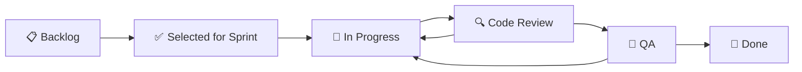
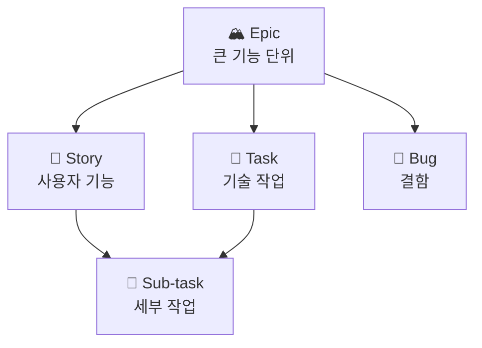
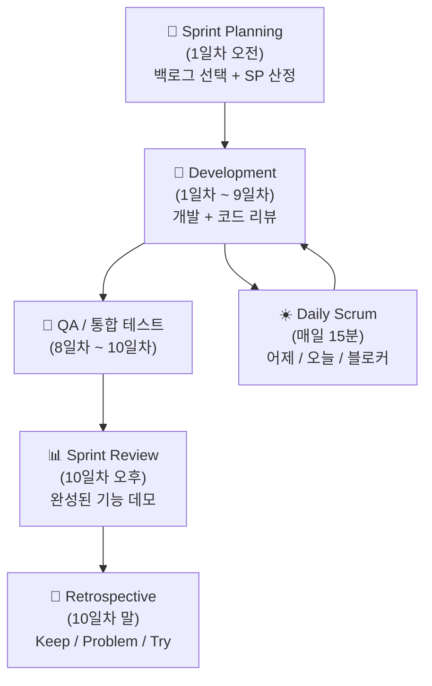
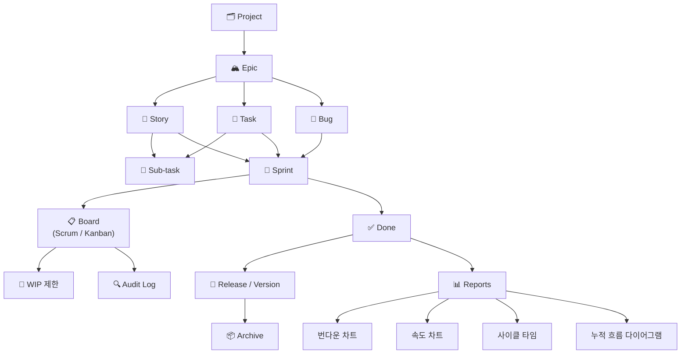

# Project Control Hub 제품 기능 정의서

> **범위**: 본 문서는 **Project Control Hub(PCH)** 의 제품 기능·운영 규칙을 정의한다. 도메인 모델·UX 패턴은 **Jira Software Cloud**와 유사하게 설계한다.  
> **API**: REST 예시 경로는 Jira Cloud REST API v3와 **개념 정렬**을 위한 참조이며, PCH 구현의 정본은 [`04-API정의서`](./04-API정의서/04-API정의서_v4.0.md)이다.

---

## 목차

- [문서 역할 및 문서 체계](#문서-역할-및-문서-체계)
1. [개요](#1-개요)
2. [핵심 기능 영역](#2-핵심-기능-영역)
3. [WIP 제한 설정](#3-wip-제한-설정)
4. [스토리 포인트 및 산정](#4-스토리-포인트-및-산정)
5. [아카이브 정책](#5-아카이브-정책)
6. [히스토리 Audit-Log 강화](#6-히스토리-audit-log-강화)
7. [운영 정책](#7-운영-정책)
8. [표준 Workflow 정의](#8-표준-workflow-정의)
9. [Issue Type 계층 정의](#9-issue-type-계층-정의)
10. [Definition of Ready / Done](#10-definition-of-ready--done)
11. [Sprint 운영 프로세스](#11-sprint-운영-프로세스)
12. [Release / Version 관리](#12-release--version-관리)
13. [표준 Dashboard 구성](#13-표준-dashboard-구성)
14. [권한 구조](#14-권한-구조)
15. [REST API 활용](#15-rest-api-활용)
16. [전체 개념 관계도](#16-전체-개념-관계도)
17. [기능 비교 및 시나리오](#17-기능-비교-및-시나리오)
18. [변경 이력](#18-변경-이력)

---

## 문서 역할 및 문서 체계

| 구분 | 문서 | 관계 |
|------|------|------|
| 정본(본 문서) | `Project_Control_Hub.md` | 기능 영역·운영 정책·워크플로우의 서술적 정본 |
| 요구사항 추적 | [`07-요구사항정의서`](./07-요구사항정의서/07-요구사항정의서_v2.3.md) | FR/NFR ID 및 추적 매트릭스 |
| 화면·UI 상세 | [`06-화면기능정의서`](./06-화면기능정의서/06-화면기능정의서_v3.0.1.md) | 화면 단위 동작·검증 |
| API 명세 | [`04-API정의서`](./04-API정의서/04-API정의서_v4.0.md) | 엔드포인트·스키마 |
| 테스트 실행 결과 | [`13-테스트보고서`](./13-테스트보고서/13-테스트보고서_v1.0.md) | 스프린트·릴리즈별 통과율·결함·판정 |
| 사용자 안내 | [`14-사용자매뉴얼`](./14-사용자매뉴얼/14-사용자매뉴얼_v1.0.md) | 최종 사용자 기능 사용법·FAQ |
| 운영 절차 | [`15-운영매뉴얼`](./15-운영매뉴얼/15-운영매뉴얼_v1.0.md) | 인프라·백업·장애·보안 운영 |
| 인덱스 | [`README.md`](./README.md) | 저장소 문서 목록 및 최신 버전 링크 |
| 갱신 리서치·작업 절차 | [`etc/PCH_기능_갱신_리서치_결과`](./etc/PCH_기능_갱신_리서치_결과.md), [`etc/Task-Workflows_PCH-문서갱신`](./etc/Task-Workflows_PCH-문서갱신.md) | FR/API/화면 정합 분석 산출물 및 문서 일괄 개선 워크플로 |

**추적 방향**: 본 문서의 기능 블록은 `07`의 FR 항목으로 매핑하고, UI가 있는 영역은 `06`의 화면 정의와 교차 참조한다.

---

## 1. 개요

**Project Control Hub(PCH)**는 이슈 트래킹, 애자일 보드, 워크플로우·릴리즈 관리, JQL 검색, 알림·연동까지 통합한 **협업 플랫폼**이다. 소프트웨어 개발팀의 스크럼·칸반 운영을 전제로 하며, 단순 티켓 관리를 넘어 팀 표준(워크플로·DoR/DoD·감사 로그)을 제품 기능으로 제공한다.

Jira Software와의 **기능 패리티**를 목표로 도메인 용어(Epic, Sprint, Fix Version 등)를 맞추되, 구축·운영 대상은 PCH 자체의 요구사항으로 관리한다.

---

## 2. 핵심 기능 영역

### 📋 이슈(Issue) 관리

| 기능 | 설명 |
|------|------|
| 이슈 생성 | Epic / Story / Task / Bug / Sub-task 등 타입별 이슈 등록 |
| 이슈 상태 관리 | To Do → In Progress → Done 등 워크플로우 상태 전환 |
| 우선순위 설정 | Highest / High / Medium / Low / Lowest |
| 담당자 지정 | 팀원 단위 또는 그룹 단위 할당 |
| 레이블 & 컴포넌트 | 태그 기반 분류 및 모듈별 컴포넌트 연결 |
| 링크 & 관계 | 이슈 간 Blocks / Duplicates / Relates to 등 관계 정의 |

> **참고 (이슈 상태)**: 위 표의「To Do → In Progress → Done」은 흔한 3단계를 **개념적으로 요약**한 것이다. PCH 제품의 **표준 상태·전환 규칙 정본**은 [§8 표준 Workflow 정의](#8-표준-workflow-정의)(6단계: Backlog … Done)이며, 상세 요구는 [`07-요구사항정의서`](./07-요구사항정의서/07-요구사항정의서_v2.3.md) FR-003·FR-014를 따른다.

### 🗂 프로젝트(Project) 관리

| 기능 | 설명 |
|------|------|
| 스크럼 보드 | 스프린트 단위 작업 관리, 번다운 차트 제공 |
| 칸반 보드 | 지속적 흐름(Continuous Flow) 기반 작업 시각화 |
| 백로그 | 우선순위 기반 이슈 누적 목록 관리 |
| 스프린트 관리 | 스프린트 생성 / 시작 / 완료 사이클 관리 |
| 로드맵(Roadmap) | Epic 단위 타임라인 기반 일정 시각화 |

보드·백로그 등 주요 화면의 **반응형·접근성(WCAG 2.1 AA)** 기준은 [`반응형/접근성 가이드`](./etc/반응형_접근성_가이드.md) 및 [`06-화면기능정의서`](./06-화면기능정의서/06-화면기능정의서_v3.0.1.md)를 함께 본다.

### 🔄 워크플로우(Workflow) 기본 개념

- **커스텀 워크플로우**: 팀별 상태(Status)와 전환(Transition) 규칙 정의
- **자동화(Automation)**: 트리거 → 조건 → 액션 기반 자동 처리
- **화면(Screen) 설정**: 이슈 생성/수정/전환 시 노출 필드 커스터마이징

> 표준 Workflow 상세 정의는 [섹션 8](#8-표준-workflow-정의) 참조

### 🔍 검색 & 필터 (JQL)

```sql
-- 내 담당 진행 중 이슈 (최근 수정 기준 정렬)
project = "MY_PROJECT"
AND status = "In Progress"
AND assignee = currentUser()
AND updated >= -7d
ORDER BY priority DESC

-- 아카이브 이슈 포함 검색
project = "OLD_PROJECT" AND archived = true AND status = Done
```

### 🔔 알림 & 협업

| 기능 | 설명 |
|------|------|
| 이메일 알림 | 이슈 변경 이벤트별 구독 설정 |
| @멘션 | 댓글 내 팀원 태그로 즉시 알림 |
| 댓글 & 첨부파일 | 이슈 단위 커뮤니케이션 및 파일 첨부 |
| 워치(Watch) | 특정 이슈 변경 사항 구독 |

### 🔗 외부 연동

| 연동 대상 | 기능 |
|-----------|------|
| **Confluence** | 문서와 이슈 양방향 연결 |
| **GitHub / GitLab / Bitbucket** | 커밋 / PR / 브랜치를 이슈에 연결 |
| **Slack** | 이슈 변경 알림을 채널로 전송 |
| **CI/CD 도구** | Jenkins, GitHub Actions 빌드 상태 연동 |
| **REST API** | 외부 시스템과 이슈 CRUD 자동화 (섹션 15 참조) |

> **연동 범위(문서 정본)**: **Git 호스팅**(커밋·PR·브랜치) 연동은 [`07`](./07-요구사항정의서/07-요구사항정의서_v2.3.md) **FR-033** 및 [`04-API정의서`](./04-API정의서/04-API정의서_v4.0.md)가 우선한다. **GitHub·GitLab**을 1차 지원으로 두고, **Bitbucket** 등은 동일 패턴의 확장으로 문서화할 수 있다. **Confluence** 문서 링크·**Jenkins / GitHub Actions** 등 CI/CD 빌드 상태 UI 연동은 **로드맵(후속 마일스톤)** 으로 분류하며, 초기 릴리즈의 필수·선택 범위는 `07` §1.0·§1.1 및 [`00-스케줄`](./00-스케줄/00-스케줄_v3.1.md)이 정본이다.

### 📱 모바일 앱 기술 스택

iOS / Android 크로스플랫폼 모바일 앱을 Flutter 단일 코드베이스로 제공합니다.

| 항목 | 기술 | 버전 | 비고 |
|------|------|------|------|
| Framework | Flutter | 3.41.x | 크로스플랫폼, 단일 코드베이스 iOS/Android |
| 언어 | Dart | 3.11.x | Null Safety, 패턴 매칭 지원 |
| 상태 관리 | Riverpod | 최신 | 선언적 상태 관리 |
| HTTP 클라이언트 | Dio | 최신 | REST API 통신, Interceptor 지원 |
| 주요 기능 | 이슈 조회/생성, 보드 확인, 알림 수신 | - | REST API 연동 |
| 오프라인·동기화 | FR-MOBILE-004 | - | 로컬 캐싱·재연결 시 동기화; 상세는 [`03` §17 모바일(Flutter)](./03-아키텍처정의서/03-아키텍처정의서_v4.0.md) |

---

## 3. WIP 제한 설정

칸반 보드에서 **컬럼(상태)별 WIP**가 핵심이며, 스크럼 보드(SCR-004)에서도 컬럼별 WIP 표시·경고를 지원할 수 있다. UI·API는 [`06` SCR-004·SCR-005](./06-화면기능정의서/06-화면기능정의서_v3.0.1.md), [`04` §3.20 WIP Limit](./04-API정의서/04-API정의서_v4.0.md)을 참조한다.

칸반 운영 시, 특정 상태(예: In Progress)에 머물 수 있는 이슈의 **최대 개수를 제한**하는 기능입니다.

| 항목 | 설명 |
|------|------|
| WIP 상한 설정 | 각 컬럼(상태)별로 최대 이슈 수 지정 |
| 시각적 경고 | WIP 초과 시 컬럼 헤더 색상 변경으로 즉시 인지 |
| 병목 감지 | 특정 상태에 이슈가 집중될 경우 팀에 경고 |
| 흐름 최적화 | 작업 집중 방지 → 완료 속도(Throughput) 개선 |

> **활용 예시**: `In Progress` 컬럼에 WIP=3 설정 시, 4번째 이슈 추가 시도 시 경고 표시 → 기존 작업을 먼저 완료하도록 유도

---

## 4. 스토리 포인트 및 산정

단순 시간(Hours) 단위가 아닌 **상대적 난이도와 복잡도** 기반 작업량 측정 체계입니다.

| 산정 방식 | 설명 |
|-----------|------|
| 스토리 포인트 | 피보나치 수열(1, 2, 3, 5, 8, 13...) 기반 상대적 난이도 |
| 시간 기반 추정 | Hours 단위의 전통적 산정 방식 |
| T-Shirt 사이즈 | XS / S / M / L / XL 단위의 직관적 표기 |

### 🃏 Planning Poker

```
[진행 방식]
1. Moderator가 이슈 설명
2. 각 팀원이 카드(1, 2, 3, 5, 8, 13, ?, ☕)를 동시에 공개
3. 최고/최저 추정자가 근거 설명
4. 재투표 → 합의 도출
5. 확정된 Point를 이슈에 기록
```

| 카드 값 | 의미 |
|---------|------|
| 1, 2, 3 | 단순하고 명확한 작업 |
| 5, 8 | 보통 복잡도, 일부 불확실성 존재 |
| 13, 21 | 매우 복잡, 이슈 분리 권장 |
| ? | 정보 부족, 추가 논의 필요 |
| ☕ | 휴식 요청 |

---

## 5. 아카이브 정책

오래된 이슈나 종료된 프로젝트가 **운영 리소스를 소모하지 않도록** 별도 관리합니다.

| 기능 | 설명 |
|------|------|
| 이슈 아카이브 | 해결 후 장기간 변경 없는 이슈를 비활성 상태로 전환 |
| 프로젝트 아카이브 | 종료된 프로젝트를 읽기 전용으로 보존 |
| 검색 제외 설정 | 기본 검색 결과에서 아카이브 이슈 숨김 |
| 복원(Restore) | 필요 시 아카이브 이슈/프로젝트를 활성 상태로 되돌림 |
| 자동 아카이브 규칙 | 조건(예: 6개월 이상 미수정) 충족 시 자동 아카이브 |

---

## 6. 히스토리 Audit Log 강화

이슈 및 프로젝트 변경에 대한 **상세 이력 추적**으로 협업 오해를 최소화합니다.

| 추적 항목 | 설명 |
|-----------|------|
| 필드 변경 이력 | 어떤 필드가 어떤 값에서 어떤 값으로 바뀌었는지 기록 |
| 변경자 & 시각 | 누가(Who), 언제(When) 변경했는지 타임스탬프 포함 |
| 상태 전환 이력 | 워크플로우 상태 변경 전체 경로 추적 |
| 댓글 수정/삭제 이력 | 편집 또는 삭제된 댓글의 원본 내용 보존 |
| 권한 변경 로그 | 역할/접근 권한 변경 이력 (관리자 전용) |
| 내보내기(Export) | Audit Log를 CSV / JSON으로 추출 |

```
[Audit Log 출력 예시]
━━━━━━━━━━━━━━━━━━━━━━━━━━━━━━━━━━━━━━━━━
이슈: PROJ-142
변경자: kim.developer@company.com
시각: 2026-03-05 14:32:07 (KST)

  [필드: 담당자]    홍길동     → 이순신
  [필드: 우선순위]  Medium    → High
  [필드: 상태]      In Progress → Code Review
━━━━━━━━━━━━━━━━━━━━━━━━━━━━━━━━━━━━━━━━━
```

---

## 7. 운영 정책

> **목적**: 팀 전체가 일관된 방식으로 Project Control Hub를 사용하도록 기준을 제시합니다.

### 7.1 이슈 제목 작성 규칙

```
[모듈] 기능 요약 (동사+목적어 형태 권장)

✅ 올바른 예시
  [회원]  로그인 실패 메시지 개선
  [예약]  진료 예약 캘린더 API 구현
  [결제]  카드 결제 실패 시 롤백 처리

❌ 잘못된 예시
  수정 필요       (모듈 없음, 내용 불명확)
  회원 관련 작업  (기능 요약 없음)
```

### 7.2 이슈 타입별 생성 기준

| 이슈 타입 | 생성 기준 | 필수 포함 정보 |
|-----------|-----------|----------------|
| **Epic** | 2주 이상 소요되는 큰 기능 단위, 또는 하나의 비즈니스 목표 | 목표, 완료 기준, 연관 Story 목록 |
| **Story** | 사용자 관점에서 의미 있는 기능 1개 (1 Sprint 내 완료 가능) | As-a/I want/So that 형식 권장, SP 산정 |
| **Task** | 사용자 기능이 아닌 기술적 작업 (환경 설정, 리팩토링 등) | 작업 목표, 예상 소요 시간 |
| **Bug** | 정상 동작이 아닌 결함 발생 시 | 재현 절차, 기대 결과, 실제 결과, 환경 정보 |
| **Sub-task** | 하나의 Story/Task가 2인 이상 병렬 작업이 필요할 때 | 담당자, 예상 소요 시간 |

### 7.3 Story 크기 기준

```
Story 1개 권장 기준
  ├── Story Point: 최대 8 이하 (13 이상이면 분리 검토)
  ├── 기간: 1 Sprint(2주) 이내 완료 가능
  └── 담당자: 1명 원칙 (병렬 시 Sub-task 분리)

Story 분리 신호
  - "그리고(AND)"로 기능이 두 가지 이상 연결될 때
  - 예상 SP가 13 이상으로 산정될 때
  - 완료 조건(Acceptance Criteria)이 5개를 초과할 때
```

### 7.4 Bug 등록 필수 양식

```markdown
## 버그 요약
[모듈] 증상 한 줄 요약

## 재현 절차
1. ...
2. ...
3. ...

## 기대 결과
정상적으로 ...해야 함

## 실제 결과
...오류 발생 / ...동작하지 않음

## 환경 정보
- OS: Windows 11 / macOS 14
- 브라우저: Chrome 120
- API 버전: v1.2.3
- 재현율: 항상 / 간헐적
```

---

## 8. 표준 Workflow 정의

> 팀마다 Workflow가 달라지면 보드 관리와 리포트 신뢰성이 저하됩니다. 아래 표준을 기준으로 운영하고, 변경 시 팀 합의를 거칩니다.

### 8.1 표준 상태 정의

| 상태 | 설명 | 담당자 |
|------|------|--------|
| **Backlog** | 작업 후보 목록, 아직 Sprint 미배정 | Product Owner |
| **Selected for Sprint** | Sprint Planning에서 해당 Sprint에 포함 확정 | Scrum Master |
| **In Progress** | 개발 진행 중 | Developer |
| **Code Review** | Pull Request 생성 후 리뷰 대기/진행 | Reviewer |
| **QA** | 기능 테스트 진행 중 | QA Engineer |
| **Done** | 테스트 통과, 배포 가능 상태 확인 완료 | 팀 전체 합의 |

### 8.2 Workflow 흐름도



### 8.3 전환(Transition) 규칙

| 전환 경로 | 조건 |
|-----------|------|
| In Progress → Code Review | PR 생성 완료 |
| Code Review → In Progress | 리뷰어 변경 요청(Request Changes) |
| Code Review → QA | 리뷰어 승인(Approve) 완료 |
| QA → In Progress | 테스트 실패, 결함 발견 |
| QA → Done | DoD(Definition of Done) 체크리스트 전체 충족 |

---

## 9. Issue Type 계층 정의

### 9.1 계층 구조

| Level | 타입 | 설명 | 예시 |
|-------|------|------|------|
| Level 1 | **Epic** | 큰 기능 단위, 비즈니스 목표 | 회원 관리 시스템 구축 |
| Level 2 | **Story** | 사용자 기능 단위 | 로그인 기능 구현 |
| Level 2 | **Task** | 기술적 작업 단위 | DB 인덱스 최적화 |
| Level 2 | **Bug** | 결함 처리 | 로그인 실패 시 500 에러 |
| Level 3 | **Sub-task** | 세부 병렬 작업 | FE 로그인 폼 구현 |

### 9.2 계층 관계도



### 9.3 타입 선택 가이드

```
이슈 등록 전 판단 흐름

이슈가 사용자에게 가치를 주는 기능인가?
  YES → Story
  NO  →
        기술적 작업(리팩토링, 환경설정 등)인가?
          YES → Task
          NO  →
                결함(버그)인가?
                  YES → Bug
                        상위 이슈의 세부 작업인가?
                          YES → Sub-task
```

---

## 10. Definition of Ready / Done

### 10.1 Definition of Ready (DoR)

> Sprint Planning에서 이슈를 Sprint에 포함하기 위한 **최소 준비 조건**입니다.

| 항목 | 확인 내용 |
|------|-----------|
| ✅ 요구사항 명확 | Acceptance Criteria(완료 조건)가 명문화되어 있음 |
| ✅ UI/UX 산출물 | 관련 화면 설계 또는 와이어프레임이 존재 |
| ✅ API 스펙 정의 | 연관 API 엔드포인트 및 요청/응답 형식 확정 |
| ✅ Story Point 산정 | Planning Poker 등을 통해 SP가 합의됨 |
| ✅ 의존성 파악 | 선행 이슈(Blocked by)가 완료되었거나 계획 확정 |
| ✅ 이슈 크기 적정 | 단일 Sprint 내 완료 가능한 규모 (SP ≤ 8 권장) |

### 10.2 Definition of Done (DoD)

> 이슈를 **Done 상태로 전환하기 위한 필수 완료 조건**입니다.

| 항목 | 확인 내용 |
|------|-----------|
| ✅ 코드 구현 완료 | Acceptance Criteria 전체 충족 |
| ✅ 코드 리뷰 완료 | 최소 1인 이상 Reviewer 승인(Approve) |
| ✅ 단위 테스트 통과 | 신규 코드 커버리지 80% 이상 |
| ✅ QA 테스트 통과 | 기능 테스트 시나리오 전체 Pass |
| ✅ 문서 업데이트 | API 명세서, README 등 관련 문서 반영 |
| ✅ 배포 가능 상태 | main/develop 브랜치 머지 완료, 빌드 성공 |
| ✅ 회귀 테스트 확인 | 기존 기능에 영향 없음 확인 |

---

## 11. Sprint 운영 프로세스

### 11.1 Sprint 사이클 (2주 기준)



### 11.2 각 이벤트 정의

| 이벤트 | 시점 | 소요 시간 | 목적 |
|--------|------|-----------|------|
| **Sprint Planning** | Sprint 1일차 오전 | 2~4시간 | 목표 설정, 백로그 선택, SP 산정 |
| **Daily Scrum** | 매일 고정 시간 | 15분 이내 | 진행 상황 공유, 블로커 식별 |
| **Sprint Review** | Sprint 마지막 날 오후 | 1~2시간 | 완성 기능 데모, 이해관계자 피드백 |
| **Retrospective** | Sprint 마지막 날 말 | 1시간 | Keep / Problem / Try 도출 |

### 11.3 Daily Scrum 형식

```
각 팀원 발언 (3가지)

1. 어제 한 일  : PROJ-142 로그인 API 구현 완료
2. 오늘 할 일  : PROJ-143 토큰 갱신 로직 작성 시작
3. 블로커      : 없음 / DB 스키마 확정 대기 중
```

---

## 12. Release / Version 관리

### 12.1 개요

PCH는 **Fix Version**(릴리즈 버전)으로 이슈를 배포 단위에 묶어 관리한다. 개념은 Jira Software의 Fix Version과 동일한 역할을 한다.

| 기능 | 설명 |
|------|------|
| **Fix Version 지정** | 이슈에 배포 예정 버전 태깅 |
| **Release Hub** | 버전별 진행률, 완료/미완료 이슈 현황 |
| **버전 진행률** | 완료 이슈 수 / 전체 이슈 수 기준 자동 계산 |
| **릴리즈 노트 생성** | Fix Version에 포함된 이슈 목록 자동 추출 |
| **버전 상태 관리** | Unreleased → Released 상태 전환 |

### 12.2 릴리즈 구조 예시

```
Release v1.0.0  (2026-04-01 배포 예정)
 ├── [Story]  PROJ-23  회원 로그인 기능 구현
 ├── [Story]  PROJ-24  진료 예약 캘린더 API 구현
 ├── [Bug]    PROJ-31  예약 완료 후 이메일 미발송 수정
 └── [Task]   PROJ-35  운영 DB 인덱스 최적화

Release v1.1.0  (2026-05-01 배포 예정)
 ├── [Story]  PROJ-40  의사 스케줄 관리 기능
 └── [Story]  PROJ-41  환자 진료 이력 조회
```

### 12.3 버전 명명 규칙

```
형식: MAJOR.MINOR.PATCH

MAJOR : 하위 호환 불가 변경 (대규모 리팩토링, API Breaking Change)
MINOR : 하위 호환 신규 기능 추가
PATCH : 버그 수정, 마이너 개선

예시
  v1.0.0  → 최초 릴리즈
  v1.1.0  → 신규 기능 추가
  v1.1.1  → 긴급 버그 수정
```

---

## 13. 표준 Dashboard 구성

대시보드·가젯·차트 화면의 **반응형·접근성** 적용 기준은 [`반응형/접근성 가이드`](./etc/반응형_접근성_가이드.md)와 [`06-화면기능정의서`](./06-화면기능정의서/06-화면기능정의서_v3.0.1.md)(SCR-002·012 등)를 함께 본다.

### 13.1 역할별 권장 대시보드

| 대상 | 가젯(Gadget) | 목적 |
|------|-------------|------|
| **개발자** | Filter Result (내 담당 이슈) | 오늘 할 일 파악 |
| **개발자** | Sprint Burndown | 스프린트 잔여 작업량 |
| **팀 리더** | Velocity Chart | 팀 생산성 추이 |
| **팀 리더** | Sprint Report | 완료/미완료 이슈 분석 |
| **PM / PO** | Roadmap (Epic 진행률) | 전체 일정 현황 |
| **PM / PO** | Pie Chart (이슈 타입별) | 작업 구성 비율 |
| **QA** | Filter Result (QA 상태 이슈) | 테스트 대기 목록 |
| **QA** | Created vs Resolved | 버그 투입/해결 추이 |

### 13.2 팀 공통 대시보드 구성 예시

```
┌─────────────────────────┬─────────────────────────┐
│   Sprint Burndown        │   Velocity Chart         │
│   (현 스프린트 진행률)    │   (최근 6 스프린트)       │
├─────────────────────────┼─────────────────────────┤
│   내 담당 이슈 목록       │   Pie Chart              │
│   (Filter Result)        │   (상태별 이슈 분포)      │
├─────────────────────────┴─────────────────────────┤
│   Cumulative Flow Diagram (누적 흐름 다이어그램)     │
└───────────────────────────────────────────────────┘
```

---

## 14. 권한 구조

### 14.1 프로젝트 역할 정의

| 역할 | 주요 권한 | 대상 |
|------|-----------|------|
| **Project Admin** | 프로젝트 설정, 워크플로우 수정, 권한 관리 | 팀 리더, PM |
| **Developer** | 이슈 생성/수정/삭제, 상태 전환, 댓글 | 개발자 |
| **QA Engineer** | 이슈 상태 변경 (QA → Done), Bug 등록 | QA 담당자 |
| **Reporter** | 이슈 등록 및 본인 이슈 수정 | 비개발 이해관계자 |
| **Viewer** | 이슈 조회 전용 (수정 불가) | 외부 관계자 |

### 14.2 권한 매트릭스

| 권한 항목 | Admin | Developer | QA | Reporter | Viewer |
|-----------|:-----:|:---------:|:--:|:--------:|:------:|
| 이슈 생성 | ✅ | ✅ | ✅ | ✅ | ❌ |
| 이슈 수정 | ✅ | ✅ | ✅ | 본인만 | ❌ |
| 이슈 삭제 | ✅ | ✅ | ❌ | ❌ | ❌ |
| 상태 전환 | ✅ | ✅ | ✅ | ❌ | ❌ |
| Sprint 관리 | ✅ | ✅ | ❌ | ❌ | ❌ |
| 프로젝트 설정 | ✅ | ❌ | ❌ | ❌ | ❌ |
| Audit Log 조회 | ✅ | ❌ | ❌ | ❌ | ❌ |

### 14.3 이슈 보안 레벨

```
이슈 보안 레벨 (필요 시 설정)

Public     → 모든 프로젝트 멤버 조회 가능 (기본)
Internal   → Developer 이상 조회 가능
Confidential → Project Admin만 조회 가능

활용 예시
  - 보안 취약점 Bug → Confidential
  - 인사 관련 Task → Internal
```

---

## 15. REST API 활용

PCH REST API의 상세 명세(경로·요청 스키마)는 [`04-API정의서_v4.0`](./04-API정의서/04-API정의서_v4.0.md)을 따른다. 아래 표와 요청 예시는 **Jira Software Cloud REST API v3와 개념을 맞추기 위한 참조**이며, 운영 환경의 실제 URL·PATH는 API 정의서 및 배포 가이드를 기준으로 한다.

### 15.1 주요 API 엔드포인트 (Jira Cloud v3 스타일, 참조)

| API | 메서드 | 엔드포인트 (참조) | 용도 |
|-----|--------|------------------|------|
| **Issue API** | POST | `/rest/api/3/issue` | 이슈 생성 |
| **Issue API** | GET | `/rest/api/3/issue/{issueKey}` | 이슈 단건 조회 |
| **Issue API** | PUT | `/rest/api/3/issue/{issueKey}` | 이슈 수정 |
| **Issue API** | DELETE | `/rest/api/3/issue/{issueKey}` | 이슈 삭제 |
| **Search API** | POST | `/rest/api/3/search` | JQL 기반 이슈 검색 |
| **Transition API** | POST | `/rest/api/3/issue/{issueKey}/transitions` | 상태 전환 |
| **User API** | GET | `/rest/api/3/user` | 사용자 정보 조회 |
| **Sprint API** | POST | `/rest/agile/1.0/sprint` | 스프린트 생성 |
| **Version API** | POST | `/rest/api/3/version` | 릴리즈 버전 생성 |
| *(기타)* | — | — | Planning Poker·WIP·Watch·Bulk·Notification 등 **전 그룹**은 [`04` API 목차](./04-API정의서/04-API정의서_v4.0.md) §3.1~3.24 참조 |

### 15.1.1 실제 API와 본 절 예시의 관계

- **Base URL·응답 형식**: 운영 호스트, `success`/`data` 공통 래핑 등은 [`04` §1·§2](./04-API정의서/04-API정의서_v4.0.md)가 정본이다.
- **엔드포인트 범위**: §15.1 표는 대표 예시이며, 추가 리소스·에러 코드는 API 정의서를 따른다.
- **Transition ID**: 아래 예시의 `transition.id`(예: `"31"`)는 **설명용**이며, 구현·CI 파이프라인에서는 [`11-코드리뷰규칙`](./11-코드리뷰규칙/11-코드리뷰규칙_v3.0.md)·[`08-Git규칙정의서`](./08-Git규칙정의서/08-Git규칙정의서_v3.0.md)에 맞게 **동적 조회**한다.

### 15.2 API 사용 예시

```bash
# 이슈 생성
POST /rest/api/3/issue
Authorization: Bearer {API_TOKEN}
Content-Type: application/json

{
  "fields": {
    "project": { "key": "PROJ" },
    "summary": "[회원] 로그인 실패 메시지 개선",
    "issuetype": { "name": "Story" },
    "assignee": { "accountId": "user-account-id" },
    "priority": { "name": "High" },
    "story_points": 3,
    "fixVersions": [{ "name": "v1.0.0" }]
  }
}
```

```bash
# JQL 기반 이슈 검색
POST /rest/api/3/search

{
  "jql": "project = PROJ AND status = 'In Progress' AND assignee = currentUser()",
  "maxResults": 50,
  "fields": ["summary", "status", "assignee", "priority"]
}
```

```bash
# 상태 전환 (In Progress → Code Review)
POST /rest/api/3/issue/PROJ-142/transitions

{
  "transition": { "id": "31" }
}
```

### 15.3 자동화 활용 예시

```
[Automation 규칙 예시]

트리거: 이슈 상태 → Code Review 전환 시
조건: 이슈 타입 = Story 또는 Bug
액션:
  1. PR 링크 댓글 자동 추가
  2. Slack #code-review 채널 알림 전송
  3. Reviewer 자동 지정 (라운드로빈)
```

---

## 16. 전체 개념 관계도



---

## 17. 기능 비교 및 시나리오

본 절의 스크럼·칸반 비교 및 팀 유형별 시나리오는 **운영·교육용 예시**이다. 릴리즈에 **필수로 포함되는 기능 범위**(필수/선택 FR)와 스프린트 배치의 정본은 [`07` §1.0·§1.1](./07-요구사항정의서/07-요구사항정의서_v2.3.md) 및 [`00-스케줄`](./00-스케줄/00-스케줄_v3.1.md)이다.

### 17.1 스크럼 vs 칸반 비교

| 항목 | 스크럼(Scrum) | 칸반(Kanban) |
|------|--------------|-------------|
| 주기 | 고정 스프린트 (1~4주) | 연속 흐름 |
| WIP 제한 | 선택적 | **필수 권장** |
| 산정 방식 | 스토리 포인트 + Planning Poker | 주로 사이클 타임 |
| 주요 이벤트 | Planning / Review / Retro | 없음 (지속 흐름) |
| 주요 차트 | 번다운, 속도 | 누적 흐름, 사이클 타임 |
| 적합 팀 | 정기 릴리즈 개발팀 | 운영/지원/유지보수팀 |

### 17.2 팀 유형별 활용 시나리오

| 팀 유형 | 권장 보드 | 핵심 기능 |
|---------|-----------|-----------|
| 개발팀 (Scrum) | 스크럼 보드 | 스프린트, 번다운 차트, Planning Poker, DoR/DoD |
| 운영팀 (Kanban) | 칸반 보드 | WIP 제한, 사이클 타임, 누적 흐름 다이어그램 |
| 관리자 / PM | 로드맵 | Epic 타임라인, Release 관리, 포트폴리오 뷰 |
| QA팀 | 백로그 + Filter | Bug 이슈 타입, 상태별 필터, Created vs Resolved |
| 컴플라이언스 | Audit Log | 변경 이력 CSV 추출, 권한 변경 로그 |
| 외부 연동팀 | REST API | Issue CRUD, JQL Search, Transition API |

---

## 18. 변경 이력

| 버전 | 일자 | 변경 내용 |
|------|------|-----------|
| v1.0 | 2026-03-08 | 초기 기능 정의 작성 |
| v2.0 | 2026-03-08 | WIP 제한, Story Point/Planning Poker, 아카이브 정책, Audit Log 강화, Mermaid 관계도 추가 |
| v3.0 | 2026-03-08 | 운영 정책(7), 표준 Workflow(8), Issue 계층 정의(9), DoR/DoD(10), Sprint 운영 프로세스(11), Release 관리(12), 표준 Dashboard(13), 권한 매트릭스(14), REST API 확장(15), 전체 관계도 재설계(16) |
| v3.1 | 2026-03-21 | 모바일 앱 기술 스택 섹션 추가 (Flutter 3.41 / Dart 3.11 / Riverpod / Dio) |
| v3.2 | 2026-04-09 | 문서명·파일명을 PCH 제품 기능 정의서로 통일, 문서 역할·체계 섹션 추가, 본문을 PCH 중심으로 정리, REST API 절 참조·04-API정의서 연계 명시 |
| v3.3 | 2026-04-09 | 문서 체계 표에 13~15(테스트 보고서·사용자/운영 매뉴얼) 참조 행 추가 |
| v3.4 | 2026-04-09 | 문서 체계: 07-요구사항정의서 최신본 v2.2 링크로 갱신 |
| v3.4.1 | 2026-04-09 | 문서 체계 표에 `etc/` 갱신 리서치 결과·Task-Workflows(문서 일괄 개선 절차) 행 추가 |
| v3.5.0 | 2026-04-09 | Task-Workflows 반영: §2 이슈 상태↔§8 정본 안내, 모바일 오프라인(FR-MOBILE-004)·03 링크, §3 스크럼 WIP·04/06 교차, 외부 연동 범위(FR-033·로드맵), §13·§2 반응형 가이드 링크, §17·§15.1.1 보강, 07 v2.3·06 v3.0.1 링크 |
