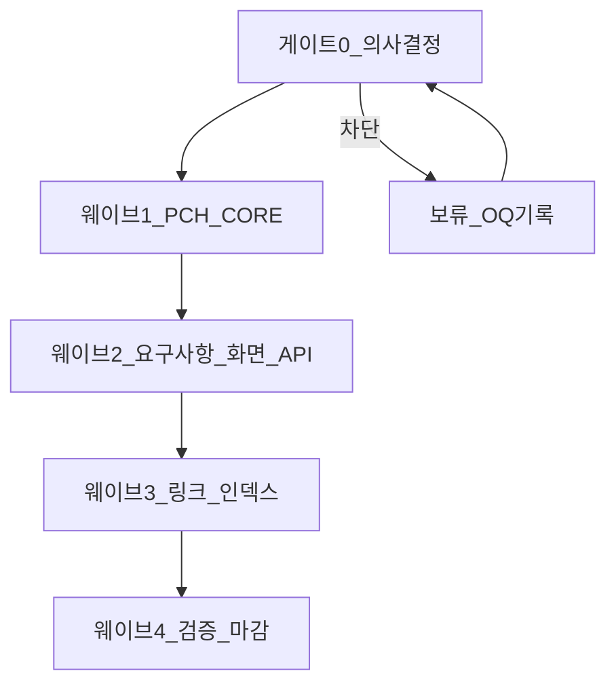

# Task-Workflows: PCH·연계 문서 전반 갱신

## 1. 목적

[`PCH_기능_갱신_리서치_결과.md`](./PCH_기능_갱신_리서치_결과.md)에서 식별한 **갱신 후보(GAP-01~09)** 및 **§18 변경 이력 초안**을 실제 문서에 반영할 때, 의사결정·편집 순서·검증을 빠짐없이 수행하기 위한 **작업 워크플로**이다.

## 2. 범위

| 포함 | 제외 |
|------|------|
| `Project_Control_Hub.md`, `07`~`06`~`04` 등 리서치에서 언급된 정합 수정 | 애플리케이션 소스 코드 변경 |
| `README.md`, `14`·`06` 등 교차 링크(`etc/` 경로 포함) | 인프라 실값(15의 URL 등) 기입 — OQ P2-01 별도 |
| Open Questions(P1~P3) 중 본 워크플로에 명시된 게이트 | 스킬 저장소(`project-doc-manager`) 자체 번호표 변경 |

## 3. 산출물·정본 위치

| 산출물 | 경로 |
|--------|------|
| 리서치·GAP·우선순위 | [`etc/PCH_기능_갱신_리서치_결과.md`](./PCH_기능_갱신_리서치_결과.md) |
| 의사결정 대기 항목 | [`etc/문서_Open_Questions_Phase1-3.md`](./문서_Open_Questions_Phase1-3.md) |
| 로드맵·완성도 | [`문서_전체점검_레포트_2026-04-09.md`](./문서_전체점검_레포트_2026-04-09.md) |
| 문서 인덱스 | [`README.md`](../README.md) |
| 제품 기능 서술 정본 | [`Project_Control_Hub.md`](../Project_Control_Hub.md) |

## 4. 역할 (요약)

| 역할 | 책임 |
|------|------|
| **Product Owner / PM** | GAP-03·§17 면책 문구 등 **제품 범위** 승인, P1-06(선택 FR 릴리즈 포함) 결정 |
| **문서 오너** | PCH·07·06·04 패치, 버전·변경 이력 표 갱신, 링크 검증 |
| **아키텍트** | PCH §15 vs 04, 모바일·연동 범위(03) 정합 검토 |
| **QA 리드** | FR-022·SCR 표기 등 **07↔06** 교차 검증, TC·10과의 불일치 알림 |

## 5. 단계별 워크플로

### 게이트 0 — 의사결정 (시작 전)

다음이 **결정되거나** “현 상태 유지”가 명시되어야 웨이브 1을 시작한다.

| ID | 출처 | 결정 사항 |
|----|------|-----------|
| G0-A | P1-03 | 알림 구독·아카이브·외부연동 저장 등 **공개 API/화면 범위** (A/B/C) |
| G0-B | P1-06 | v1.0 Production에 포함할 **선택 FR** 목록 |
| G0-C | P2-05 | 스킬 12↔13 vs 저장소 폴더 **온보딩 경고** 문구 넣을 위치(README만 / PCH도 / 별도 문서) |
| G0-D | 리서치 GAP-03 | Confluence·CI/CD·Bitbucket — **In Scope / Out-of-Scope / 로드맵** 중 택일 |

결정 내용은 [`문서_Open_Questions_Phase1-3.md`](./문서_Open_Questions_Phase1-3.md) 해당 항목 **결정 기록란**에 남긴다.

### 웨이브 1 — PCH 핵심 (정본 서술)

리서치 **부록 F** 및 **부록 E P0~P1**을 우선 반영한다.

| Task ID | 작업 | 대상 파일 | 완료 조건 |
|---------|------|-----------|-----------|
| W1-01 | §2 이슈 상태 요약과 §8 6단계 관계 명시 | `Project_Control_Hub.md` | §2 표 직후 또는 각주에 “상세 상태는 §8” 등 **단일 해석** 문장 |
| W1-02 | 모바일: 오프라인(FR-MOBILE-004)·03 링크 | `Project_Control_Hub.md` | §2 모바일 표에 행 또는 링크 추가 |
| W1-03 | 외부 연동 범위 문구 (G0-D 반영) | `Project_Control_Hub.md` | Confluence/CI/CD/Bitbucket이 정책과 일치 |
| W1-04 | §17 상단: 시나리오 vs 07·00 필수 범위 면책 | `Project_Control_Hub.md` | 1문장 이상, G0-B와 모순 없음 |
| W1-05 | 스킬↔12·13 경고 (G0-C 반영) | `README.md` 및/또는 `Project_Control_Hub.md` | 합의된 위치에 고정 문구 |
| W1-06 | §15 보조 설명 (04 응답 래핑·API 그룹·Transition ID) | `Project_Control_Hub.md` | 04 §1·§2·`11` 동적 ID와 충돌 없음 |
| W1-07 | §18 변경 이력 | `Project_Control_Hub.md` | v3.5(또는 합의 버전)·일자·부록 F bullet 반영 |

**DoD 웨이브 1**: `Project_Control_Hub.md` 프론트매터 `버전`·`최종수정일` 갱신.

### 웨이브 2 — 요구사항·화면·API

PCH 변경에 맞춰 **추적 정본**을 수정한다.

| Task ID | 작업 | 대상 파일 | 트리거 |
|---------|------|-----------|--------|
| W2-01 | FR-022 관련 화면 코드 정정 | `07-요구사항정의서` 최신본 | 리서치 GAP-09: SCR-001 → **SCR-002** 등 06과 일치 |
| W2-02 | SCR-009 화면명·로드맵 병기 정리 | `06-화면기능정의서` 최신본 | 리서치 INV-12, 반응형 가이드와 동일어 |
| W2-03 | 스크럼 보드(SCR-004) WIP 표시와 PCH §2·§3 정합 | `06` + 필요 시 `PCH` | 06 FN·PCH 서술 모순 제거 |
| W2-04 | 공개 범위가 바뀐 API·화면 설명 | `04`·`06`·`02` | 게이트 G0-A 결과 |
| W2-05 | 선택 FR 포함 범위 | `01`·`00`·`07` §1.0 | 게이트 G0-B 결과 |

**DoD 웨이브 2**: 변경된 각 파일 **변경 이력** 표에 행 추가.

### 웨이브 3 — 링크·인덱스

| Task ID | 작업 | 대상 |
|---------|------|------|
| W3-01 | `etc/` 문서 링크 | [`README.md`](../README.md), 본 저장소 내 모든 `.md` |
| W3-02 | PCH 문서 체계 표 | [`Project_Control_Hub.md`](../Project_Control_Hub.md) | 리서치·Task-Workflows 행 유지 |
| W3-03 | (선택) GAP-08 | `Project_Control_Hub.md` §2·§13 | [`반응형_접근성_가이드.md`](./반응형_접근성_가이드.md) 교차 링크 1문장 |

**DoD 웨이브 3**: 루트·`NN-` 폴더에서 `./etc/...` 또는 `../etc/...` 깨짐 없음(수동 또는 `markdown-link-check`).

### 웨이브 4 — 검증·마감

| Task ID | 작업 | 방법 |
|---------|------|------|
| W4-01 | FR ↔ PCH 요약 일치 | `07` §1.1과 PCH §2 표 스팟 대조 |
| W4-02 | PCH §15 예시 ↔ 04 경로 | 표·예시 ID 하드코딩에 각주 |
| W4-03 | RTM 샘플 | `07` RTM에서 FR-008~011, FR-022 3행 이상 스팟 |
| W4-04 | 스토리보드 정합 | `09` 최신본 vs `06` SCR |

**DoD 웨이브 4**: PR 설명에 **영향 문서 목록** + 리서치 GAP ID 나열.

## 6. GAP → Task 매핑 (빠른 참조)

| GAP | 우선순위 | 주 Task |
|-----|----------|---------|
| GAP-01 | P0 | W1-01 |
| GAP-02 | P0 | W1-02 |
| GAP-03 | P1 | G0-D, W1-03 |
| GAP-04 | P1 | W1-04 |
| GAP-05 | P1 | G0-C, W1-05 |
| GAP-06 | P2 | W1-06 |
| GAP-07 | P2 | W1-01 + §3 정리(선택) |
| GAP-08 | P2 | W3-03 |
| GAP-09 | P3 | W2-01 (`07` 중심) |

## 7. 권장 일정(예시)

| 일차 | 활동 |
|------|------|
| 1 | 게이트 0 미팅, OQ 기록 |
| 2 | 웨이브 1 PR |
| 3~4 | 웨이브 2 (병렬: 07/06/04) |
| 5 | 웨이브 3~4, PR 머지 전 링크 검사 |

일정은 팀 스프린트 용량에 맞게 조정한다.

## 8. 변경 이력

| 버전 | 일자 | 변경 내용 |
|------|------|-----------|
| v1.0 | 2026-04-09 | 최초 작성 — 리서치 부록 E·F·OQ·전체점검 레포트와 정렬 |
| v1.1 | 2026-04-09 | 저장소에 웨이브 1~3 반영 완료(PCH v3.5, 07 v2.3, 06 v3.0.1, README). 게이트 0은 `문서_Open_Questions` 부록 B 기록. |
